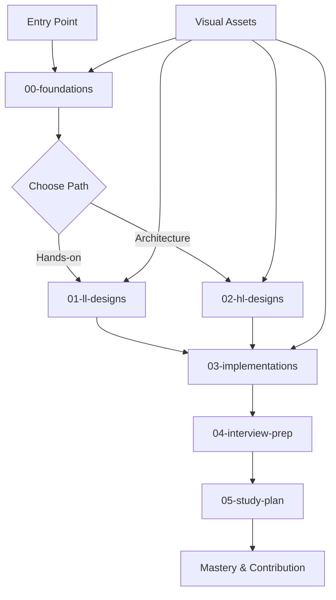

# System Design Learning Guide - Design Document

## Overview

The design transforms the existing systemdesign-docs repository into a comprehensive, progressive learning platform that guides users from system design fundamentals to expert-level architecture skills. The platform will feature a human-crafted feel with rich visual content, multi-language implementations, and structured learning paths.

## Architecture

### Repository Structure

```
systemdesign-docs/
├── 00-foundations/           # Core concepts and theory
├── 01-ll-designs/           # Low-level design implementations  
├── 02-hl-designs/           # High-level system architectures
├── 03-implementations/      # Runnable microservice prototypes
├── 04-interview-prep/       # Interview preparation materials
├── 05-study-plan/          # Structured learning roadmap
├── assets/                 # Visual assets and diagrams
├── docs/                   # Additional documentation
└── [root files]            # README, CONTRIBUTING, LICENSE, etc.
```

### Learning Flow Architecture



## Components and Interfaces

### 1. Foundations Module (00-foundations/)

**Purpose**: Establish core mental models and vocabulary

**Components**:
- `concepts.md` - Core system design principles with analogies
- `scalability.md` - Horizontal vs vertical scaling strategies  
- `load-balancing.md` - Load balancer types and algorithms
- `caching-strategies.md` - Cache patterns and invalidation
- `database-basics.md` - SQL vs NoSQL, ACID vs BASE
- `consistency-vs-availability.md` - CAP theorem deep dive
- `cap-theorem.md` - Practical CAP theorem applications
- `design-patterns.md` - Common architectural patterns
- `glossary.md` - Comprehensive term definitions
- `faqs.md` - Common student questions and answers

**Interface**: Each file follows standard format with introduction, detailed explanation, real-world examples, key takeaways, and further reading.

### 2. Low-Level Designs Module (01-ll-designs/)

**Purpose**: Hands-on implementation of core system components

**Structure per design**:
```
design_name/
├── README.md              # Problem definition and overview
├── design.puml           # Architecture diagram
├── explanation.md        # Design discussion and trade-offs
└── solutions/
    ├── python/           # Python implementation
    ├── java/             # Java implementation  
    ├── cpp/              # C++ implementation
    └── go/               # Go implementation
```

**Designs to include**:
- LRU Cache (existing, enhance)
- Rate Limiter (existing, enhance)
- Consistent Hashing
- Message Queue
- Bloom Filter
- Distributed Lock
- Circuit Breaker

### 3. High-Level Designs Module (02-hl-designs/)

**Purpose**: Full-scale distributed system architectures

**Structure per system**:
```
system_name/
├── README.md             # System overview
├── requirements.md       # Functional & non-functional requirements
├── architecture.puml     # System architecture diagram
├── api-design.md        # API specifications
├── database-schema.md   # Data model design
├── scaling-strategy.md  # Horizontal scaling approach
├── tradeoffs.md         # Design decisions and alternatives
└── solution.md          # Complete solution walkthrough
```

**Systems to include**:
- URL Shortener (existing, enhance)
- Twitter Clone (existing, enhance)
- Uber System
- Dropbox Clone  
- Netflix Streaming
- YouTube
- LLM Serving Platform
- Chat System (WhatsApp-like)
- E-commerce Platform

### 4. Implementations Module (03-implementations/)

**Purpose**: Runnable microservice prototypes demonstrating concepts

**Components**:
- `cache-server/` - REST API cache service
- `rate-limiter-service/` - Standalone rate limiting service
- `simple-message-broker/` - Basic pub/sub message broker
- `distributed-lock/` - Distributed locking service
- `load-balancer/` - Simple load balancer implementation

Each implementation includes:
- Dockerfile and docker-compose setup
- API documentation
- Performance benchmarks
- Connection to design concepts

### 5. Interview Preparation Module (04-interview-prep/)

**Purpose**: Structured interview readiness

**Components**:
- `most_asked_questions.md` - Top 50 system design questions
- `frameworks.md` - Step-by-step interview frameworks
- `checklists.md` - What to cover in every interview
- `flashcards.json` - Quick revision Q&A pairs
- `solutions/sample-answers.md` - Detailed answer examples
- `mock-interviews/` - Practice scenarios with timing

### 6. Study Plan Module (05-study-plan/)

**Purpose**: Guided learning progression

**Components**:
- `roadmap.md` - Visual learning journey with milestones
- `weekly-plan.md` - 6-week structured curriculum
- `milestones.md` - Measurable learning outcomes
- `references.md` - Curated books, blogs, videos
- `progress-tracker.md` - Self-assessment checklist

## Data Models

### Content Structure Model

```typescript
interface LearningContent {
  title: string;
  difficulty: 'beginner' | 'intermediate' | 'advanced';
  estimatedTime: number; // minutes
  prerequisites: string[];
  learningObjectives: string[];
  keyTakeaways: string[];
  furtherReading: Reference[];
}

interface CodeImplementation {
  language: 'python' | 'java' | 'cpp' | 'go';
  complexity: {
    time: string;
    space: string;
  };
  testCases: TestCase[];
  benchmarks?: PerformanceMetric[];
}

interface SystemDesign {
  functionalRequirements: string[];
  nonFunctionalRequirements: NFR[];
  components: Component[];
  dataFlow: DataFlowStep[];
  tradeoffs: Tradeoff[];
}
```

### Progress Tracking Model

```typescript
interface LearnerProgress {
  completedSections: string[];
  currentMilestone: number;
  weeklyGoals: Goal[];
  practiceProblems: ProblemAttempt[];
  flashcardProgress: FlashcardStats;
}
```

## Error Handling

### Content Quality Assurance

1. **Consistency Checks**: Automated validation of markdown formatting, link integrity, and cross-references
2. **Technical Accuracy**: Peer review process for all technical content
3. **Code Validation**: All code examples must compile and run successfully
4. **Diagram Validation**: All PlantUML and Mermaid diagrams must render correctly

### User Experience Safeguards

1. **Progressive Disclosure**: Complex topics broken into digestible chunks
2. **Multiple Learning Paths**: Alternative routes for different learning styles
3. **Prerequisite Validation**: Clear dependency chains between topics
4. **Feedback Mechanisms**: Easy ways for learners to report issues or suggest improvements

## Testing Strategy

### Content Testing

1. **Automated Tests**:
   - Link checker for all internal and external references
   - Markdown linting for consistent formatting
   - Code compilation tests for all language implementations
   - Diagram rendering validation

2. **Manual Testing**:
   - Learning path walkthrough by beta users
   - Technical accuracy review by domain experts
   - Accessibility testing for visual content
   - Mobile responsiveness for GitHub rendering

### User Journey Testing

1. **Beginner Path**: Complete walkthrough from foundations to first system design
2. **Interview Prep Path**: Focused preparation for job seekers
3. **Advanced Path**: Deep dive into complex distributed systems
4. **Contributor Path**: Experience of adding new content

### Performance Testing

1. **Repository Size**: Monitor total size and loading times
2. **Search Performance**: GitHub search functionality across content
3. **Diagram Rendering**: Performance of visual elements
4. **Code Execution**: Runtime performance of all implementations

## Visual Design System

### Diagram Standards

1. **PlantUML**: For detailed architecture and sequence diagrams
2. **Mermaid**: For flow charts and simple system overviews
3. **Color Scheme**: Consistent color palette across all diagrams
4. **Icon Library**: Standardized icons for common components (DB, Cache, LB, etc.)

### Content Formatting

1. **Typography**: Consistent heading hierarchy and text formatting
2. **Code Blocks**: Syntax highlighting and consistent indentation
3. **Callouts**: Standardized info, warning, and tip boxes
4. **Tables**: Consistent formatting for comparison tables

## Integration Points

### External Resources

1. **Tech Company Blogs**: Curated links to Netflix, Uber, Meta engineering blogs
2. **Academic Papers**: References to foundational distributed systems papers
3. **Video Content**: Links to relevant conference talks and tutorials
4. **Books**: Integration with classic system design literature

### Community Integration

1. **GitHub Features**: Issues, discussions, and pull request templates
2. **Social Proof**: Star count, fork metrics, and contributor recognition
3. **External Platforms**: Integration with learning platforms and communities
4. **Feedback Loops**: Regular community surveys and content updates

## Scalability Considerations

### Content Scalability

1. **Modular Structure**: Easy addition of new topics and systems
2. **Template System**: Standardized templates for consistent content creation
3. **Contributor Onboarding**: Clear guidelines for community contributions
4. **Version Control**: Systematic approach to content updates and improvements

### Technical Scalability

1. **Repository Organization**: Efficient file structure for large content volume
2. **Asset Management**: Optimized storage and delivery of visual assets
3. **Search Optimization**: Structured content for effective GitHub search
4. **Mobile Experience**: Responsive design considerations for mobile learners

This design provides a comprehensive blueprint for transforming the existing repository into a world-class system design learning platform that balances theoretical depth with practical application, visual learning with hands-on coding, and individual study with community contribution.