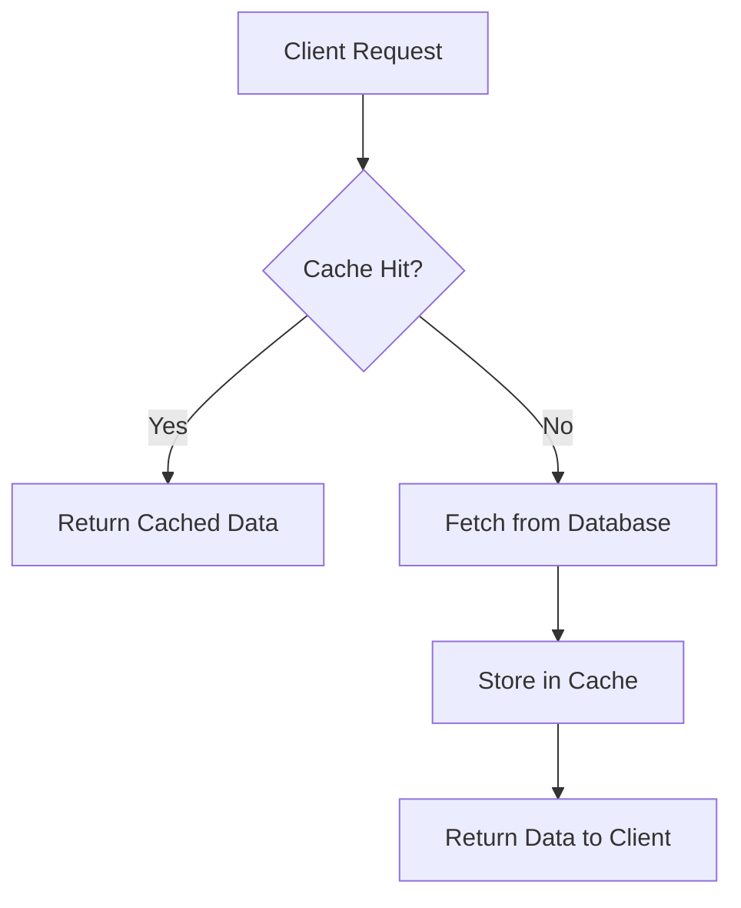
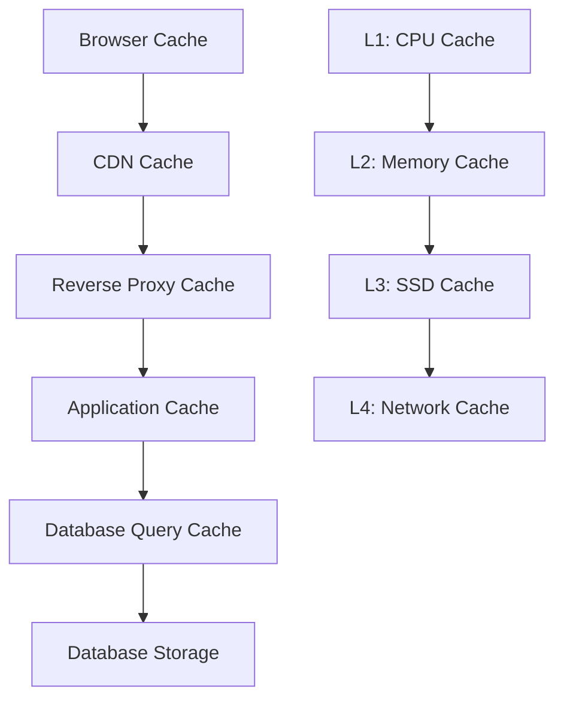

# Caching Strategies — Cache Patterns and Invalidation Techniques

Caching is one of the most effective ways to improve system performance by storing frequently accessed data in fast storage layers. Understanding different caching patterns and invalidation strategies is crucial for building high-performance systems.

## What is Caching?

**Definition**: Caching is the practice of storing copies of frequently accessed data in high-speed storage layers to reduce access time and computational overhead.

**Real-world analogy**: Think of your kitchen. You keep frequently used items (salt, pepper, cooking oil) on the counter for quick access, while less frequently used items stay in cabinets or pantry. The counter is your "cache" - smaller, faster to access, but limited in capacity.



## Why Caching Matters

### Performance Benefits
- **Reduced Latency**: Memory access (nanoseconds) vs disk access (milliseconds)
- **Higher Throughput**: Serve more requests with same infrastructure
- **Lower CPU Usage**: Avoid expensive computations and database queries
- **Better User Experience**: Faster page loads and API responses

### Cost Benefits
- **Reduced Database Load**: Fewer expensive database operations
- **Lower Infrastructure Costs**: Serve more users with fewer servers
- **Bandwidth Savings**: Reduce data transfer costs
- **Energy Efficiency**: Less computational work required

### Scalability Benefits
- **Handle Traffic Spikes**: Cache absorbs sudden load increases
- **Geographic Distribution**: CDNs bring content closer to users
- **Database Protection**: Prevent database overload during peak times

## Cache Hierarchy and Levels

### Multi-Level Cache Architecture


### Cache Levels by Distance

**Level 1: Browser/Client Cache**
- **Location**: User's device
- **Speed**: Fastest (local access)
- **Capacity**: Limited (few MB to GB)
- **Control**: Limited server control
- **Best for**: Static assets, API responses with long TTL

**Level 2: CDN (Content Delivery Network)**
- **Location**: Edge servers worldwide
- **Speed**: Very fast (geographic proximity)
- **Capacity**: Large (TB scale)
- **Control**: Configurable via headers
- **Best for**: Static content, images, videos, CSS, JavaScript

**Level 3: Reverse Proxy Cache**
- **Location**: In front of application servers
- **Speed**: Fast (same datacenter)
- **Capacity**: Medium (GB to TB)
- **Control**: Full control
- **Best for**: Dynamic content, API responses, page fragments

**Level 4: Application Cache**
- **Location**: Application server memory
- **Speed**: Very fast (in-process or local network)
- **Capacity**: Medium (GB scale)
- **Control**: Full programmatic control
- **Best for**: Database query results, computed values, session data

**Level 5: Database Cache**
- **Location**: Database server memory
- **Speed**: Fast (local to database)
- **Capacity**: Large (database dependent)
- **Control**: Database configuration
- **Best for**: Query results, index pages, frequently accessed rows

## Caching Patterns

### Cache-Aside (Lazy Loading)

**How it works**: Application manages cache explicitly. On cache miss, application loads data from database and updates cache.

```python
def get_user(user_id):
    # Try cache first
    user = cache.get(f"user:{user_id}")
    if user is not None:
        return user
    
    # Cache miss - fetch from database
    user = database.get_user(user_id)
    if user:
        # Store in cache for future requests
        cache.set(f"user:{user_id}", user, ttl=3600)
    
    return user

def update_user(user_id, user_data):
    # Update database
    database.update_user(user_id, user_data)
    
    # Invalidate cache
    cache.delete(f"user:{user_id}")
```

**Pros**:
- Simple to implement and understand
- Cache only contains requested data (no waste)
- Resilient to cache failures (degrades gracefully)
- Application has full control over caching logic

**Cons**:
- Cache miss penalty (2x latency: cache check + database fetch)
- Potential for stale data if cache isn't invalidated properly
- Code complexity increases with cache management

**Best for**: Read-heavy workloads with unpredictable access patterns.

### Write-Through Cache

**How it works**: Data is written to cache and database simultaneously. Cache is always consistent with database.

```python
def update_user(user_id, user_data):
    # Write to database first
    database.update_user(user_id, user_data)
    
    # Write to cache
    cache.set(f"user:{user_id}", user_data, ttl=3600)
    
    return user_data

def get_user(user_id):
    # Try cache first
    user = cache.get(f"user:{user_id}")
    if user is not None:
        return user
    
    # Cache miss - this should be rare with write-through
    user = database.get_user(user_id)
    if user:
        cache.set(f"user:{user_id}", user, ttl=3600)
    
    return user
```

**Pros**:
- Cache is always consistent with database
- No cache invalidation complexity
- Good read performance for recently written data

**Cons**:
- Write latency increases (must write to both cache and database)
- Wasted cache space (stores data that might never be read)
- Cache failure can impact write operations

**Best for**: Applications requiring strong consistency and frequent reads of recently written data.

### Write-Behind (Write-Back) Cache

**How it works**: Data is written to cache immediately and to database asynchronously. Provides fastest write performance but risks data loss.

```python
import asyncio
from collections import deque

class WriteBehindCache:
    def __init__(self):
        self.cache = {}
        self.write_queue = deque()
        self.dirty_keys = set()
        
    async def set(self, key, value):
        # Write to cache immediately
        self.cache[key] = value
        self.dirty_keys.add(key)
        
        # Queue for async database write
        self.write_queue.append((key, value))
        
        return value
    
    def get(self, key):
        if key in self.cache:
            return self.cache[key]
        
        # Cache miss - load from database
        value = database.get(key)
        if value:
            self.cache[key] = value
        return value
    
    async def flush_writes(self):
        """Background process to write dirty data to database"""
        while self.write_queue:
            key, value = self.write_queue.popleft()
            try:
                await database.async_update(key, value)
                self.dirty_keys.discard(key)
            except Exception as e:
                # Re-queue failed writes
                self.write_queue.append((key, value))
                await asyncio.sleep(1)  # Backoff
```

**Pros**:
- Fastest write performance (no database write latency)
- Can batch database writes for efficiency
- Good for write-heavy workloads

**Cons**:
- Risk of data loss if cache fails before database write
- Complex implementation and error handling
- Potential for data inconsistency

**Best for**: Write-heavy applications where some data loss is acceptable (analytics, logging).

### Read-Through Cache

**How it works**: Cache sits between application and database. On cache miss, cache itself loads data from database.

```python
class ReadThroughCache:
    def __init__(self, database, ttl=3600):
        self.cache = {}
        self.database = database
        self.ttl = ttl
    
    def get(self, key):
        # Check cache first
        if key in self.cache:
            return self.cache[key]
        
        # Cache miss - cache loads from database
        value = self.database.get(key)
        if value:
            self.cache[key] = value
            # Set expiration timer
            self._set_expiration(key, self.ttl)
        
        return value
    
    def _set_expiration(self, key, ttl):
        # Implementation depends on cache system
        # Could use Redis EXPIRE or in-memory timer
        pass
```

**Pros**:
- Transparent to application (cache handles database interaction)
- Simpler application code
- Consistent caching behavior

**Cons**:
- Cache becomes a critical component (single point of failure)
- Less flexibility in caching logic
- Harder to implement custom caching strategies

**Best for**: Applications wanting transparent caching without application-level cache management.

### Refresh-Ahead Cache

**How it works**: Cache proactively refreshes data before it expires, ensuring fresh data is always available.

```python
import time
import threading
from datetime import datetime, timedelta

class RefreshAheadCache:
    def __init__(self, database, ttl=3600, refresh_threshold=0.8):
        self.cache = {}
        self.database = database
        self.ttl = ttl
        self.refresh_threshold = refresh_threshold
        self.expiry_times = {}
        
    def get(self, key):
        current_time = time.time()
        
        # Check if key exists and is not expired
        if key in self.cache and current_time < self.expiry_times.get(key, 0):
            # Check if refresh is needed
            expiry_time = self.expiry_times[key]
            time_to_expiry = expiry_time - current_time
            if time_to_expiry < (self.ttl * (1 - self.refresh_threshold)):
                # Trigger background refresh
                threading.Thread(target=self._refresh_key, args=(key,)).start()
            
            return self.cache[key]
        
        # Cache miss or expired - fetch immediately
        return self._fetch_and_cache(key)
    
    def _fetch_and_cache(self, key):
        value = self.database.get(key)
        if value:
            self.cache[key] = value
            self.expiry_times[key] = time.time() + self.ttl
        return value
    
    def _refresh_key(self, key):
        """Background refresh to keep cache warm"""
        try:
            value = self.database.get(key)
            if value:
                self.cache[key] = value
                self.expiry_times[key] = time.time() + self.ttl
        except Exception as e:
            # Log error but don't fail - old cached value still available
            print(f"Failed to refresh cache for key {key}: {e}")
```

**Pros**:
- Always serves fresh data
- No cache miss penalty for users
- Proactive cache warming

**Cons**:
- Increased complexity
- Additional background processing overhead
- May refresh data that's no longer needed

**Best for**: High-traffic applications where cache misses are expensive and data freshness is important.

## Cache Invalidation Strategies

### Time-Based Expiration (TTL)

**How it works**: Cache entries automatically expire after a specified time period.

```python
import time

class TTLCache:
    def __init__(self):
        self.cache = {}
        self.expiry_times = {}
    
    def set(self, key, value, ttl):
        self.cache[key] = value
        self.expiry_times[key] = time.time() + ttl
    
    def get(self, key):
        if key not in self.cache:
            return None
        
        if time.time() > self.expiry_times[key]:
            # Expired - remove from cache
            del self.cache[key]
            del self.expiry_times[key]
            return None
        
        return self.cache[key]
```

**TTL Selection Guidelines**:
```python
# Example TTL values based on data characteristics
ttl_strategies = {
    "user_profile": 3600,        # 1 hour - changes infrequently
    "product_catalog": 1800,     # 30 minutes - moderate changes
    "stock_prices": 60,          # 1 minute - changes frequently
    "static_content": 86400,     # 24 hours - rarely changes
    "session_data": 1800,        # 30 minutes - security consideration
    "api_rate_limits": 3600      # 1 hour - policy-based
}
```

**Pros**:
- Simple to implement and understand
- Automatic cleanup of stale data
- Predictable cache behavior

**Cons**:
- May serve stale data before expiration
- Arbitrary expiration times may not match data change patterns
- Cache misses when data expires but hasn't actually changed

### Event-Driven Invalidation

**How it works**: Cache is invalidated when specific events occur (data updates, user actions, etc.).

```python
class EventDrivenCache:
    def __init__(self):
        self.cache = {}
        self.key_dependencies = {}  # Maps cache keys to data dependencies
    
    def set(self, key, value, dependencies=None):
        self.cache[key] = value
        if dependencies:
            for dep in dependencies:
                if dep not in self.key_dependencies:
                    self.key_dependencies[dep] = set()
                self.key_dependencies[dep].add(key)
    
    def invalidate_by_dependency(self, dependency):
        """Invalidate all cache keys that depend on this data"""
        if dependency in self.key_dependencies:
            keys_to_invalidate = self.key_dependencies[dependency].copy()
            for key in keys_to_invalidate:
                self.delete(key)
    
    def delete(self, key):
        if key in self.cache:
            del self.cache[key]
        
        # Remove from dependency tracking
        for dep, keys in self.key_dependencies.items():
            keys.discard(key)

# Usage example
cache = EventDrivenCache()

# Cache user profile with dependency on user data
cache.set("user:123:profile", user_profile, dependencies=["user:123"])

# When user data changes, invalidate related cache entries
def update_user(user_id, new_data):
    database.update_user(user_id, new_data)
    cache.invalidate_by_dependency(f"user:{user_id}")
```

**Pros**:
- Cache is always consistent with underlying data
- No unnecessary cache misses
- Efficient use of cache space

**Cons**:
- Complex implementation and dependency tracking
- Requires tight coupling between data changes and cache invalidation
- Risk of missing invalidation events

### Tag-Based Invalidation

**How it works**: Cache entries are tagged, and entire groups can be invalidated by tag.

```python
class TaggedCache:
    def __init__(self):
        self.cache = {}
        self.tags = {}  # Maps tags to sets of cache keys
        self.key_tags = {}  # Maps cache keys to their tags
    
    def set(self, key, value, tags=None):
        self.cache[key] = value
        
        if tags:
            self.key_tags[key] = set(tags)
            for tag in tags:
                if tag not in self.tags:
                    self.tags[tag] = set()
                self.tags[tag].add(key)
    
    def invalidate_by_tag(self, tag):
        """Invalidate all cache entries with this tag"""
        if tag in self.tags:
            keys_to_invalidate = self.tags[tag].copy()
            for key in keys_to_invalidate:
                self.delete(key)
    
    def delete(self, key):
        if key in self.cache:
            del self.cache[key]
        
        # Remove from tag tracking
        if key in self.key_tags:
            for tag in self.key_tags[key]:
                self.tags[tag].discard(key)
            del self.key_tags[key]

# Usage example
cache = TaggedCache()

# Cache with multiple tags
cache.set("product:123", product_data, tags=["product", "category:electronics", "brand:apple"])
cache.set("product:456", product_data, tags=["product", "category:electronics", "brand:samsung"])

# Invalidate all electronics products
cache.invalidate_by_tag("category:electronics")

# Invalidate all Apple products
cache.invalidate_by_tag("brand:apple")
```

**Best for**: Complex applications with hierarchical data relationships.

### Version-Based Invalidation

**How it works**: Cache keys include version numbers that change when data is updated.

```python
class VersionedCache:
    def __init__(self):
        self.cache = {}
        self.versions = {}
    
    def get_current_version(self, entity_type, entity_id):
        """Get current version from database or version store"""
        return database.get_version(entity_type, entity_id)
    
    def get(self, entity_type, entity_id):
        current_version = self.get_current_version(entity_type, entity_id)
        cache_key = f"{entity_type}:{entity_id}:v{current_version}"
        
        if cache_key in self.cache:
            return self.cache[cache_key]
        
        # Cache miss - fetch and cache with current version
        data = database.get(entity_type, entity_id)
        if data:
            self.cache[cache_key] = data
        
        return data
    
    def update(self, entity_type, entity_id, new_data):
        # Update database and increment version
        new_version = database.update_with_version_increment(entity_type, entity_id, new_data)
        
        # Old cached versions become automatically invalid
        # No explicit invalidation needed
        
        return new_version

# Usage example
cache = VersionedCache()

# First access creates cache entry with version 1
user = cache.get("user", 123)  # Caches as "user:123:v1"

# Update increments version to 2
cache.update("user", 123, new_user_data)

# Next access uses new version, old cache entry ignored
user = cache.get("user", 123)  # Caches as "user:123:v2"
```

**Pros**:
- No explicit invalidation needed
- Multiple versions can coexist safely
- Simple and reliable

**Cons**:
- Requires version tracking in database
- Old cache entries accumulate (need cleanup)
- Additional complexity in key management

## Advanced Caching Techniques

### Cache Warming

**How it works**: Proactively load frequently accessed data into cache before it's requested.

```python
class CacheWarmer:
    def __init__(self, cache, database):
        self.cache = cache
        self.database = database
    
    def warm_popular_products(self):
        """Pre-load popular products into cache"""
        popular_products = self.database.get_popular_products(limit=1000)
        for product in popular_products:
            cache_key = f"product:{product.id}"
            self.cache.set(cache_key, product, ttl=3600)
    
    def warm_user_data(self, user_id):
        """Pre-load user-related data"""
        user = self.database.get_user(user_id)
        user_preferences = self.database.get_user_preferences(user_id)
        user_history = self.database.get_user_history(user_id, limit=50)
        
        self.cache.set(f"user:{user_id}", user, ttl=3600)
        self.cache.set(f"user:{user_id}:preferences", user_preferences, ttl=7200)
        self.cache.set(f"user:{user_id}:history", user_history, ttl=1800)
    
    def scheduled_warming(self):
        """Run cache warming on schedule"""
        import schedule
        
        schedule.every(1).hours.do(self.warm_popular_products)
        schedule.every(30).minutes.do(self.warm_trending_content)
```

### Cache Partitioning

**How it works**: Distribute cache across multiple nodes to increase capacity and performance.

```python
import hashlib

class PartitionedCache:
    def __init__(self, cache_nodes):
        self.cache_nodes = cache_nodes
        self.num_nodes = len(cache_nodes)
    
    def _get_node(self, key):
        """Determine which cache node should handle this key"""
        hash_value = int(hashlib.md5(key.encode()).hexdigest(), 16)
        node_index = hash_value % self.num_nodes
        return self.cache_nodes[node_index]
    
    def get(self, key):
        node = self._get_node(key)
        return node.get(key)
    
    def set(self, key, value, ttl=None):
        node = self._get_node(key)
        return node.set(key, value, ttl)
    
    def delete(self, key):
        node = self._get_node(key)
        return node.delete(key)
```

### Multi-Level Cache Hierarchies

**How it works**: Implement multiple cache levels with different characteristics.

```python
class HierarchicalCache:
    def __init__(self, l1_cache, l2_cache, l3_cache):
        self.l1 = l1_cache  # Fast, small (in-memory)
        self.l2 = l2_cache  # Medium speed, medium size (Redis)
        self.l3 = l3_cache  # Slower, large (database query cache)
    
    def get(self, key):
        # Try L1 cache first
        value = self.l1.get(key)
        if value is not None:
            return value
        
        # Try L2 cache
        value = self.l2.get(key)
        if value is not None:
            # Promote to L1
            self.l1.set(key, value, ttl=300)  # Shorter TTL for L1
            return value
        
        # Try L3 cache
        value = self.l3.get(key)
        if value is not None:
            # Promote to L2 and L1
            self.l2.set(key, value, ttl=1800)
            self.l1.set(key, value, ttl=300)
            return value
        
        return None
    
    def set(self, key, value):
        # Write to all levels
        self.l1.set(key, value, ttl=300)
        self.l2.set(key, value, ttl=1800)
        self.l3.set(key, value, ttl=7200)
```

## Cache Performance Optimization

### Cache Hit Ratio Optimization

**Measuring Cache Performance**:
```python
class CacheMetrics:
    def __init__(self):
        self.hits = 0
        self.misses = 0
        self.total_requests = 0
    
    def record_hit(self):
        self.hits += 1
        self.total_requests += 1
    
    def record_miss(self):
        self.misses += 1
        self.total_requests += 1
    
    def hit_ratio(self):
        if self.total_requests == 0:
            return 0
        return self.hits / self.total_requests
    
    def miss_ratio(self):
        return 1 - self.hit_ratio()

# Target hit ratios by cache type
target_hit_ratios = {
    "database_query_cache": 0.95,  # 95%
    "api_response_cache": 0.85,    # 85%
    "session_cache": 0.90,         # 90%
    "static_content_cache": 0.98   # 98%
}
```

### Cache Size Optimization

**Cache Size Calculation**:
```python
def calculate_optimal_cache_size(working_set_size, hit_ratio_target, memory_budget):
    """
    Calculate optimal cache size based on working set and hit ratio target
    """
    # Rule of thumb: cache size should be 20-30% larger than working set
    # for good hit ratios
    
    if hit_ratio_target >= 0.95:
        recommended_size = working_set_size * 1.5
    elif hit_ratio_target >= 0.90:
        recommended_size = working_set_size * 1.3
    elif hit_ratio_target >= 0.80:
        recommended_size = working_set_size * 1.2
    else:
        recommended_size = working_set_size * 1.1
    
    # Don't exceed memory budget
    return min(recommended_size, memory_budget)

# Example calculation
working_set = 10_000_000  # 10M cache entries
target_hit_ratio = 0.90
memory_budget = 16_000_000  # 16M entries max

optimal_size = calculate_optimal_cache_size(working_set, target_hit_ratio, memory_budget)
print(f"Optimal cache size: {optimal_size:,} entries")
```

### Eviction Policies

**LRU (Least Recently Used)**:
```python
from collections import OrderedDict

class LRUCache:
    def __init__(self, capacity):
        self.capacity = capacity
        self.cache = OrderedDict()
    
    def get(self, key):
        if key in self.cache:
            # Move to end (most recently used)
            self.cache.move_to_end(key)
            return self.cache[key]
        return None
    
    def set(self, key, value):
        if key in self.cache:
            # Update existing key
            self.cache.move_to_end(key)
        elif len(self.cache) >= self.capacity:
            # Remove least recently used item
            self.cache.popitem(last=False)
        
        self.cache[key] = value
```

**LFU (Least Frequently Used)**:
```python
from collections import defaultdict
import heapq

class LFUCache:
    def __init__(self, capacity):
        self.capacity = capacity
        self.cache = {}
        self.frequencies = defaultdict(int)
        self.freq_to_keys = defaultdict(set)
        self.min_freq = 0
    
    def get(self, key):
        if key not in self.cache:
            return None
        
        self._update_frequency(key)
        return self.cache[key]
    
    def set(self, key, value):
        if self.capacity <= 0:
            return
        
        if key in self.cache:
            self.cache[key] = value
            self._update_frequency(key)
            return
        
        if len(self.cache) >= self.capacity:
            self._evict_lfu()
        
        self.cache[key] = value
        self.frequencies[key] = 1
        self.freq_to_keys[1].add(key)
        self.min_freq = 1
    
    def _update_frequency(self, key):
        freq = self.frequencies[key]
        self.freq_to_keys[freq].remove(key)
        
        if not self.freq_to_keys[freq] and freq == self.min_freq:
            self.min_freq += 1
        
        self.frequencies[key] += 1
        self.freq_to_keys[freq + 1].add(key)
    
    def _evict_lfu(self):
        key_to_remove = self.freq_to_keys[self.min_freq].pop()
        del self.cache[key_to_remove]
        del self.frequencies[key_to_remove]
```

## Common Caching Problems and Solutions

### Cache Stampede

**Problem**: Multiple requests simultaneously try to regenerate the same expired cache entry.

**Solution**: Use locking or probabilistic early expiration.

```python
import threading
import random
import time

class StampedeProtectedCache:
    def __init__(self):
        self.cache = {}
        self.locks = {}
        self.expiry_times = {}
    
    def get(self, key, fetch_function, ttl=3600):
        current_time = time.time()
        
        # Check if cached and not expired
        if key in self.cache and current_time < self.expiry_times.get(key, 0):
            # Probabilistic early expiration to prevent stampede
            expiry_time = self.expiry_times[key]
            time_to_expiry = expiry_time - current_time
            
            # 10% chance to refresh when 90% of TTL has passed
            if time_to_expiry < (ttl * 0.1) and random.random() < 0.1:
                # Try to acquire lock for refresh
                if self._try_refresh_lock(key):
                    threading.Thread(target=self._background_refresh, 
                                   args=(key, fetch_function, ttl)).start()
            
            return self.cache[key]
        
        # Cache miss or expired - need to fetch
        return self._fetch_with_lock(key, fetch_function, ttl)
    
    def _try_refresh_lock(self, key):
        lock_key = f"refresh:{key}"
        if lock_key not in self.locks:
            self.locks[lock_key] = threading.Lock()
        return self.locks[lock_key].acquire(blocking=False)
    
    def _fetch_with_lock(self, key, fetch_function, ttl):
        if key not in self.locks:
            self.locks[key] = threading.Lock()
        
        with self.locks[key]:
            # Double-check pattern
            current_time = time.time()
            if key in self.cache and current_time < self.expiry_times.get(key, 0):
                return self.cache[key]
            
            # Fetch and cache
            value = fetch_function()
            self.cache[key] = value
            self.expiry_times[key] = current_time + ttl
            return value
    
    def _background_refresh(self, key, fetch_function, ttl):
        try:
            value = fetch_function()
            self.cache[key] = value
            self.expiry_times[key] = time.time() + ttl
        finally:
            # Release refresh lock
            lock_key = f"refresh:{key}"
            if lock_key in self.locks:
                self.locks[lock_key].release()
```

### Cache Penetration

**Problem**: Requests for non-existent data bypass cache and hit database repeatedly.

**Solution**: Cache null results or use bloom filters.

```python
class PenetrationProtectedCache:
    def __init__(self):
        self.cache = {}
        self.null_cache = {}  # Cache for non-existent keys
        self.null_ttl = 300   # 5 minutes for null results
    
    def get(self, key, fetch_function):
        # Check positive cache
        if key in self.cache:
            return self.cache[key]
        
        # Check null cache
        if key in self.null_cache:
            if time.time() < self.null_cache[key]:
                return None  # Known non-existent key
            else:
                del self.null_cache[key]  # Expired null entry
        
        # Fetch from source
        value = fetch_function()
        
        if value is not None:
            self.cache[key] = value
        else:
            # Cache the fact that this key doesn't exist
            self.null_cache[key] = time.time() + self.null_ttl
        
        return value
```

### Cache Avalanche

**Problem**: Large number of cache entries expire simultaneously, causing database overload.

**Solution**: Add jitter to TTL values and implement circuit breakers.

```python
import random

class AvalancheProtectedCache:
    def __init__(self, base_ttl=3600, jitter_factor=0.1):
        self.cache = {}
        self.base_ttl = base_ttl
        self.jitter_factor = jitter_factor
    
    def set(self, key, value, ttl=None):
        if ttl is None:
            ttl = self.base_ttl
        
        # Add random jitter to prevent synchronized expiration
        jitter = random.uniform(-self.jitter_factor, self.jitter_factor)
        actual_ttl = ttl * (1 + jitter)
        
        expiry_time = time.time() + actual_ttl
        self.cache[key] = (value, expiry_time)
    
    def get(self, key):
        if key not in self.cache:
            return None
        
        value, expiry_time = self.cache[key]
        if time.time() > expiry_time:
            del self.cache[key]
            return None
        
        return value
```

## Monitoring and Metrics

### Key Cache Metrics

```python
class CacheMonitor:
    def __init__(self):
        self.metrics = {
            'hits': 0,
            'misses': 0,
            'evictions': 0,
            'memory_usage': 0,
            'avg_response_time': 0,
            'error_count': 0
        }
        self.response_times = []
    
    def record_hit(self, response_time):
        self.metrics['hits'] += 1
        self._record_response_time(response_time)
    
    def record_miss(self, response_time):
        self.metrics['misses'] += 1
        self._record_response_time(response_time)
    
    def record_eviction(self):
        self.metrics['evictions'] += 1
    
    def _record_response_time(self, response_time):
        self.response_times.append(response_time)
        # Keep only last 1000 measurements
        if len(self.response_times) > 1000:
            self.response_times.pop(0)
        
        self.metrics['avg_response_time'] = sum(self.response_times) / len(self.response_times)
    
    def get_hit_ratio(self):
        total = self.metrics['hits'] + self.metrics['misses']
        return self.metrics['hits'] / total if total > 0 else 0
    
    def get_stats(self):
        return {
            **self.metrics,
            'hit_ratio': self.get_hit_ratio(),
            'total_requests': self.metrics['hits'] + self.metrics['misses']
        }
```

### Alerting Thresholds

```python
cache_alerts = {
    'hit_ratio_low': {
        'threshold': 0.80,
        'message': 'Cache hit ratio below 80%'
    },
    'memory_usage_high': {
        'threshold': 0.90,
        'message': 'Cache memory usage above 90%'
    },
    'eviction_rate_high': {
        'threshold': 100,  # evictions per minute
        'message': 'High cache eviction rate detected'
    },
    'response_time_high': {
        'threshold': 100,  # milliseconds
        'message': 'Cache response time above 100ms'
    }
}
```

## Best Practices

### Design Guidelines

1. **Cache at the right level**: Choose cache location based on data access patterns
2. **Set appropriate TTLs**: Balance freshness with performance
3. **Handle cache failures gracefully**: Always have fallback to original data source
4. **Monitor cache performance**: Track hit ratios, response times, and error rates
5. **Plan for cache warming**: Pre-load critical data during deployment

### Implementation Checklist

```
Performance:
□ Implement appropriate eviction policies
□ Use connection pooling for cache clients
□ Set reasonable timeout values
□ Monitor and optimize cache hit ratios

Reliability:
□ Handle cache failures gracefully
□ Implement circuit breakers for cache operations
□ Use appropriate retry logic
□ Plan for cache cluster failures

Security:
□ Encrypt sensitive cached data
□ Implement proper access controls
□ Audit cache access patterns
□ Secure cache network communications

Operations:
□ Monitor cache performance metrics
□ Set up alerting for cache issues
□ Plan cache capacity and scaling
□ Document cache invalidation procedures
```

### Common Anti-Patterns

```
❌ Caching everything without analysis
❌ Using cache as primary data store
❌ Ignoring cache invalidation complexity
❌ Not monitoring cache performance
❌ Setting arbitrary TTL values
❌ Not handling cache failures
❌ Over-engineering cache solutions
```

## Key Takeaways

1. **Choose the right pattern**: Match caching strategy to your data access patterns
2. **Invalidation is hard**: Plan cache invalidation strategy carefully
3. **Monitor everything**: Track cache performance and optimize based on metrics
4. **Handle failures gracefully**: Cache should improve performance, not create dependencies
5. **Start simple**: Begin with basic caching and evolve based on needs
6. **Consider the hierarchy**: Use multiple cache levels for optimal performance
7. **Plan for scale**: Design cache architecture that can grow with your system

## Further Reading

- **Books**:
  - "High Performance MySQL" by Baron Schwartz
  - "Redis in Action" by Josiah Carlson
- **Papers**:
  - "Memcached: A Distributed Memory Object Caching System"
  - "The Design and Implementation of a Log-Structured File System"
- **Resources**:
  - Redis Documentation and Best Practices
  - Memcached Wiki and Performance Tuning Guide
  - CDN Provider Documentation (CloudFlare, AWS CloudFront)