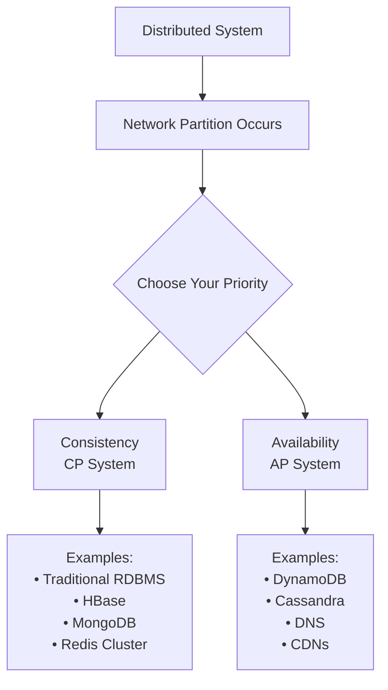
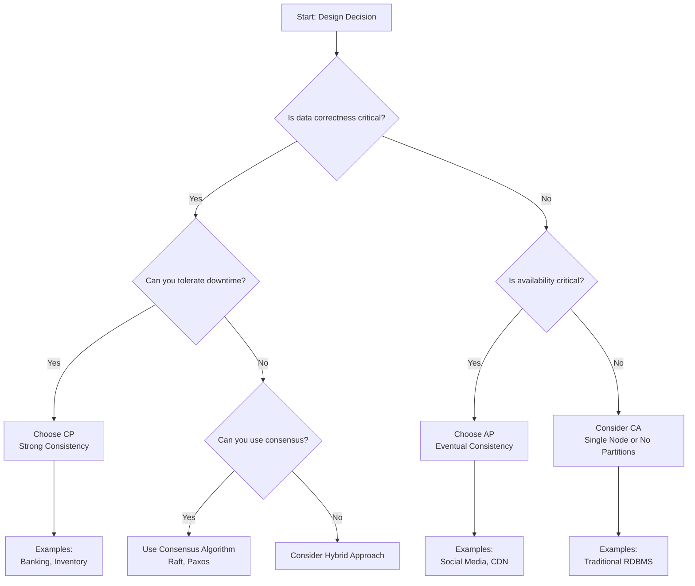

# CAP Theorem — Practical Applications and Real-World Examples

The CAP theorem is one of the most important concepts in distributed systems. It states that in the presence of network partitions, you must choose between consistency and availability. Understanding CAP theorem helps you make informed architectural decisions.

## Understanding CAP Theorem

**Formal Statement**: In a distributed system, you can guarantee at most two of the following three properties:
- **Consistency (C)**: All nodes see the same data simultaneously
- **Availability (A)**: System remains operational and responsive
- **Partition Tolerance (P)**: System continues to operate despite network failures

**Real-world analogy**: Imagine a chain of libraries sharing a catalog system:
- **Consistency**: All libraries show the same book availability
- **Availability**: Every library can always check out books to customers
- **Partition Tolerance**: Libraries can operate even when network connections fail

When the network between libraries fails, you must choose: either stop checking out books (lose availability) or allow libraries to operate with potentially inconsistent catalogs (lose consistency).



## The Three Properties Explained

### Consistency (C)

**Definition**: All nodes in the system return the same, most recent data for any given piece of information.

**Strong Consistency Example**:
```python
class StronglyConsistentBank:
    def __init__(self, replicas):
        self.replicas = replicas
        self.primary = replicas[0]
    
    def transfer_money(self, from_account, to_account, amount):
        # All replicas must agree before transaction completes
        transaction_id = self.generate_transaction_id()
        
        # Phase 1: Prepare all replicas
        prepared_replicas = []
        for replica in self.replicas:
            try:
                if replica.prepare_transfer(transaction_id, from_account, to_account, amount):
                    prepared_replicas.append(replica)
                else:
                    # If any replica can't prepare, abort
                    self.abort_transaction(transaction_id, prepared_replicas)
                    raise TransactionAbortedError("Insufficient funds or replica unavailable")
            except NetworkError:
                # Network partition - choose consistency over availability
                self.abort_transaction(transaction_id, prepared_replicas)
                raise SystemUnavailableError("Cannot guarantee consistency during network partition")
        
        # Phase 2: Commit on all replicas
        if len(prepared_replicas) == len(self.replicas):
            for replica in prepared_replicas:
                replica.commit_transfer(transaction_id)
            return "Transfer successful"
        else:
            self.abort_transaction(transaction_id, prepared_replicas)
            raise TransactionAbortedError("Not all replicas available")
    
    def get_balance(self, account_id):
        # Always read from primary to ensure consistency
        try:
            return self.primary.get_balance(account_id)
        except NetworkError:
            # Cannot guarantee consistency - system becomes unavailable
            raise SystemUnavailableError("Primary replica unavailable")
```

**Characteristics of Strong Consistency**:
- All reads return the most recent write
- Higher latency due to coordination overhead
- System may become unavailable during network partitions
- Suitable for financial systems, inventory management

### Availability (A)

**Definition**: The system remains operational and responsive to requests, even if some nodes are down.

**High Availability Example**:
```python
class HighlyAvailableWebService:
    def __init__(self, replicas):
        self.replicas = replicas
        self.healthy_replicas = set(replicas)
        self.start_health_monitoring()
    
    def write_user_profile(self, user_id, profile_data):
        # Write to any available replica
        successful_writes = 0
        timestamp = time.time()
        
        for replica in self.healthy_replicas:
            try:
                replica.write(user_id, profile_data, timestamp)
                successful_writes += 1
            except NetworkError:
                self.mark_unhealthy(replica)
                continue
        
        if successful_writes > 0:
            # Asynchronously propagate to other replicas
            self.async_propagate(user_id, profile_data, timestamp)
            return "Write accepted"
        else:
            # Even if all replicas are down, queue the write
            self.queue_write(user_id, profile_data, timestamp)
            return "Write queued"
    
    def read_user_profile(self, user_id):
        # Try to read from any available replica
        for replica in self.healthy_replicas:
            try:
                profile = replica.read(user_id)
                if profile:
                    return profile
            except NetworkError:
                self.mark_unhealthy(replica)
                continue
        
        # If no replicas available, return cached data
        cached_profile = self.get_cached_profile(user_id)
        if cached_profile:
            return cached_profile
        
        # Last resort: return default profile
        return self.get_default_profile(user_id)
    
    def start_health_monitoring(self):
        def monitor():
            while True:
                for replica in self.replicas:
                    try:
                        if replica.health_check():
                            self.healthy_replicas.add(replica)
                        else:
                            self.healthy_replicas.discard(replica)
                    except:
                        self.healthy_replicas.discard(replica)
                time.sleep(10)  # Check every 10 seconds
        
        threading.Thread(target=monitor, daemon=True).start()
```

**Characteristics of High Availability**:
- System continues to serve requests even during failures
- May return stale or inconsistent data
- Lower latency for individual operations
- Suitable for web services, content delivery, social media

### Partition Tolerance (P)

**Definition**: The system continues to operate despite arbitrary message loss or failure of part of the system.

**Network Partition Handling**:
```python
class PartitionTolerantSystem:
    def __init__(self, nodes):
        self.nodes = nodes
        self.node_groups = [nodes]  # Initially all nodes in one group
        self.monitor_network_partitions()
    
    def detect_partition(self):
        """Detect network partitions using heartbeat mechanism"""
        reachable_nodes = set()
        
        for node in self.nodes:
            if self.can_reach_node(node):
                reachable_nodes.add(node)
        
        unreachable_nodes = set(self.nodes) - reachable_nodes
        
        if unreachable_nodes:
            # Network partition detected
            self.handle_partition(reachable_nodes, unreachable_nodes)
    
    def handle_partition(self, reachable_nodes, unreachable_nodes):
        """Handle network partition based on system design"""
        majority_size = len(self.nodes) // 2 + 1
        
        if len(reachable_nodes) >= majority_size:
            # We have majority - continue operating (CP approach)
            self.active_nodes = reachable_nodes
            self.partition_mode = "majority_active"
        else:
            # No majority - decide based on system requirements
            if self.system_type == "CP":
                # Choose consistency - stop serving writes
                self.partition_mode = "read_only"
                self.active_nodes = reachable_nodes
            elif self.system_type == "AP":
                # Choose availability - continue serving all requests
                self.partition_mode = "available"
                self.active_nodes = reachable_nodes
    
    def write(self, key, value):
        if self.partition_mode == "read_only":
            raise SystemUnavailableError("System in read-only mode due to partition")
        
        # Continue with write operation
        return self.perform_write(key, value)
    
    def read(self, key):
        # Reads can continue in most partition scenarios
        for node in self.active_nodes:
            try:
                return node.read(key)
            except NetworkError:
                continue
        
        raise SystemUnavailableError("No nodes available for read")
```

## CAP Theorem in Practice

### CP Systems (Consistency + Partition Tolerance)

**When to choose CP**: When data correctness is more important than availability.

**Real-world examples**:
- Banking systems
- Inventory management
- Configuration management
- Traditional RDBMS with synchronous replication

**Implementation Pattern**:
```python
class CPSystem:
    def __init__(self, nodes):
        self.nodes = nodes
        self.leader = None
        self.followers = []
        self.elect_leader()
    
    def elect_leader(self):
        """Elect leader using consensus algorithm (simplified Raft)"""
        majority = len(self.nodes) // 2 + 1
        votes = 0
        
        for node in self.nodes:
            if node.is_reachable() and node.vote_for_leader(self.nodes[0]):
                votes += 1
        
        if votes >= majority:
            self.leader = self.nodes[0]
            self.followers = self.nodes[1:]
        else:
            # No leader elected - system becomes unavailable
            self.leader = None
            self.followers = []
    
    def write(self, key, value):
        if not self.leader:
            raise SystemUnavailableError("No leader available")
        
        # Write to leader first
        self.leader.write(key, value)
        
        # Replicate to majority of followers
        successful_replications = 0
        required_replications = len(self.followers) // 2
        
        for follower in self.followers:
            try:
                follower.replicate(key, value)
                successful_replications += 1
            except NetworkError:
                continue
        
        if successful_replications >= required_replications:
            return "Write successful"
        else:
            # Cannot maintain consistency - rollback and fail
            self.leader.rollback(key)
            raise ConsistencyError("Cannot replicate to majority")
    
    def read(self, key):
        if not self.leader:
            raise SystemUnavailableError("No leader available")
        
        # Always read from leader for consistency
        return self.leader.read(key)
```

**MongoDB Example** (CP with configurable consistency):
```javascript
// MongoDB with majority write concern (CP behavior)
db.users.insertOne(
    { name: "John", email: "john@example.com" },
    { writeConcern: { w: "majority", j: true, wtimeout: 5000 } }
);

// Read from primary for consistency
db.users.findOne(
    { email: "john@example.com" },
    { readPreference: "primary" }
);
```

### AP Systems (Availability + Partition Tolerance)

**When to choose AP**: When system availability is more important than immediate consistency.

**Real-world examples**:
- Social media platforms
- Content delivery networks
- Shopping carts
- DNS systems

**Implementation Pattern**:
```python
class APSystem:
    def __init__(self, nodes):
        self.nodes = nodes
        self.replication_factor = 3
        self.read_repair_enabled = True
    
    def write(self, key, value):
        """Write to multiple nodes, succeed if any write succeeds"""
        target_nodes = self.get_nodes_for_key(key)
        successful_writes = 0
        timestamp = time.time()
        
        write_data = {
            'value': value,
            'timestamp': timestamp,
            'node_id': self.get_node_id()
        }
        
        for node in target_nodes:
            try:
                node.write(key, write_data)
                successful_writes += 1
            except NetworkError:
                # Continue trying other nodes
                continue
        
        if successful_writes > 0:
            # Asynchronously repair other nodes
            self.async_repair(key, write_data, target_nodes)
            return "Write successful"
        else:
            # Queue write for later if all nodes are down
            self.queue_write(key, write_data)
            return "Write queued"
    
    def read(self, key):
        """Read from multiple nodes and resolve conflicts"""
        target_nodes = self.get_nodes_for_key(key)
        responses = []
        
        for node in target_nodes:
            try:
                response = node.read(key)
                if response:
                    responses.append(response)
            except NetworkError:
                continue
        
        if not responses:
            # Return cached or default value
            return self.get_fallback_value(key)
        
        # Resolve conflicts using timestamps (Last Write Wins)
        latest_response = max(responses, key=lambda x: x['timestamp'])
        
        # Perform read repair if inconsistencies detected
        if self.read_repair_enabled and len(set(r['timestamp'] for r in responses)) > 1:
            self.async_read_repair(key, latest_response, target_nodes)
        
        return latest_response['value']
    
    def async_read_repair(self, key, correct_value, nodes):
        """Repair inconsistent replicas in background"""
        def repair():
            for node in nodes:
                try:
                    current_value = node.read(key)
                    if not current_value or current_value['timestamp'] < correct_value['timestamp']:
                        node.write(key, correct_value)
                except NetworkError:
                    continue
        
        threading.Thread(target=repair, daemon=True).start()
```

**Amazon DynamoDB Example** (AP system):
```python
import boto3

# DynamoDB - eventually consistent reads by default (AP behavior)
dynamodb = boto3.resource('dynamodb')
table = dynamodb.Table('users')

# Write with eventual consistency
table.put_item(Item={
    'user_id': '123',
    'name': 'John Doe',
    'email': 'john@example.com'
})

# Eventually consistent read (default)
response = table.get_item(Key={'user_id': '123'})

# Strongly consistent read (when needed)
response = table.get_item(
    Key={'user_id': '123'},
    ConsistentRead=True  # May fail during partitions
)
```

## Real-World CAP Theorem Examples

### Example 1: E-commerce Platform

**Scenario**: Building an e-commerce platform with global users.

**Different Components, Different Choices**:

```python
class EcommercePlatform:
    def __init__(self):
        # CP System for inventory (consistency critical)
        self.inventory_system = CPInventorySystem()
        
        # AP System for product catalog (availability critical)
        self.catalog_system = APCatalogSystem()
        
        # CP System for payments (consistency critical)
        self.payment_system = CPPaymentSystem()
        
        # AP System for recommendations (availability critical)
        self.recommendation_system = APRecommendationSystem()
    
    def place_order(self, user_id, items):
        """Order placement requires different consistency levels"""
        
        # Check inventory with strong consistency (CP)
        try:
            inventory_check = self.inventory_system.reserve_items(items)
            if not inventory_check.success:
                return {"error": "Insufficient inventory"}
        except SystemUnavailableError:
            return {"error": "Inventory system temporarily unavailable"}
        
        # Process payment with strong consistency (CP)
        try:
            payment_result = self.payment_system.charge_customer(
                user_id, inventory_check.total_amount
            )
            if not payment_result.success:
                self.inventory_system.release_reservation(inventory_check.reservation_id)
                return {"error": "Payment failed"}
        except SystemUnavailableError:
            self.inventory_system.release_reservation(inventory_check.reservation_id)
            return {"error": "Payment system temporarily unavailable"}
        
        # Update product catalog with eventual consistency (AP)
        # This can fail without affecting the order
        try:
            self.catalog_system.update_popularity_scores(items)
        except:
            pass  # Non-critical operation
        
        # Update recommendations with eventual consistency (AP)
        # This can also fail without affecting the order
        try:
            self.recommendation_system.update_user_preferences(user_id, items)
        except:
            pass  # Non-critical operation
        
        return {"success": True, "order_id": payment_result.order_id}
```

### Example 2: Social Media Platform

**Scenario**: Building a social media platform like Twitter.

**AP System Design** (Availability over Consistency):

```python
class SocialMediaPlatform:
    def __init__(self, regions):
        self.regions = regions
        self.user_service = APUserService(regions)
        self.timeline_service = APTimelineService(regions)
        self.notification_service = APNotificationService(regions)
    
    def publish_post(self, user_id, content):
        """Publishing posts prioritizes availability"""
        
        # Write to local region immediately (AP)
        local_region = self.get_user_region(user_id)
        post_id = self.generate_post_id()
        
        try:
            # Write to local region
            local_region.posts.write(post_id, {
                'user_id': user_id,
                'content': content,
                'timestamp': time.time(),
                'region': local_region.id
            })
            
            # Add to user's timeline immediately
            local_region.timelines.add_to_user_timeline(user_id, post_id)
            
        except NetworkError:
            # Queue for later processing
            self.queue_post_for_retry(user_id, content, post_id)
        
        # Asynchronously propagate to followers (eventual consistency)
        self.async_propagate_to_followers(user_id, post_id, content)
        
        # Asynchronously replicate to other regions
        self.async_replicate_to_regions(post_id, content, exclude=local_region)
        
        return {"post_id": post_id, "status": "published"}
    
    def get_user_timeline(self, user_id):
        """Reading timeline prioritizes availability over perfect consistency"""
        
        user_region = self.get_user_region(user_id)
        
        try:
            # Try local region first
            timeline = user_region.timelines.get_user_timeline(user_id)
            return timeline
        except NetworkError:
            # Fallback to other regions
            for region in self.regions:
                if region != user_region:
                    try:
                        timeline = region.timelines.get_user_timeline(user_id)
                        # Timeline might be slightly stale, but that's acceptable
                        return timeline
                    except NetworkError:
                        continue
            
            # Last resort: return cached timeline
            return self.get_cached_timeline(user_id)
    
    def async_propagate_to_followers(self, user_id, post_id, content):
        """Eventual consistency for follower feeds"""
        def propagate():
            try:
                followers = self.user_service.get_followers(user_id)
                for follower_id in followers:
                    try:
                        follower_region = self.get_user_region(follower_id)
                        follower_region.timelines.add_to_feed(follower_id, post_id)
                    except NetworkError:
                        # Queue for later retry
                        self.queue_feed_update(follower_id, post_id)
            except:
                # Non-critical operation, log and continue
                pass
        
        threading.Thread(target=propagate, daemon=True).start()
```

### Example 3: Banking System

**Scenario**: Building a core banking system.

**CP System Design** (Consistency over Availability):

```python
class BankingSystem:
    def __init__(self, data_centers):
        self.data_centers = data_centers
        self.primary_dc = data_centers[0]
        self.backup_dcs = data_centers[1:]
        self.consensus_manager = ConsensusManager(data_centers)
    
    def transfer_funds(self, from_account, to_account, amount):
        """Fund transfers require strong consistency (CP)"""
        
        # Ensure we have consensus from majority of data centers
        if not self.consensus_manager.has_majority():
            raise SystemUnavailableError(
                "Cannot process transfer: insufficient data centers available"
            )
        
        transaction_id = self.generate_transaction_id()
        
        try:
            # Phase 1: Prepare transaction on all available data centers
            prepared_dcs = []
            for dc in self.data_centers:
                if dc.is_available():
                    prepare_result = dc.prepare_transfer(
                        transaction_id, from_account, to_account, amount
                    )
                    if prepare_result.success:
                        prepared_dcs.append(dc)
                    else:
                        # Insufficient funds or other business rule violation
                        self.abort_transaction(transaction_id, prepared_dcs)
                        return {"error": prepare_result.error_message}
            
            # Require majority to proceed
            if len(prepared_dcs) < len(self.data_centers) // 2 + 1:
                self.abort_transaction(transaction_id, prepared_dcs)
                raise SystemUnavailableError(
                    "Cannot maintain consistency: insufficient data centers"
                )
            
            # Phase 2: Commit transaction
            committed_dcs = []
            for dc in prepared_dcs:
                commit_result = dc.commit_transfer(transaction_id)
                if commit_result.success:
                    committed_dcs.append(dc)
                else:
                    # This should not happen in a well-designed system
                    # but we need to handle it
                    self.handle_commit_failure(transaction_id, committed_dcs, dc)
            
            if len(committed_dcs) >= len(self.data_centers) // 2 + 1:
                return {
                    "success": True,
                    "transaction_id": transaction_id,
                    "committed_data_centers": len(committed_dcs)
                }
            else:
                # This is a serious error - some DCs committed, others didn't
                self.handle_split_brain_scenario(transaction_id, committed_dcs)
                raise SystemError("Transaction in inconsistent state")
                
        except NetworkPartitionError:
            # Network partition detected - choose consistency over availability
            self.abort_transaction(transaction_id, prepared_dcs)
            raise SystemUnavailableError(
                "System temporarily unavailable due to network partition"
            )
    
    def get_account_balance(self, account_id):
        """Account balance reads require consistency"""
        
        if not self.consensus_manager.has_majority():
            raise SystemUnavailableError(
                "Cannot read balance: insufficient data centers available"
            )
        
        # Read from primary data center for consistency
        try:
            return self.primary_dc.get_account_balance(account_id)
        except NetworkError:
            # Primary unavailable - elect new primary
            new_primary = self.consensus_manager.elect_new_primary()
            if new_primary:
                self.primary_dc = new_primary
                return self.primary_dc.get_account_balance(account_id)
            else:
                raise SystemUnavailableError(
                    "Cannot read balance: no primary data center available"
                )
```

## CAP Theorem Misconceptions

### Misconception 1: "You must choose only two"

**Reality**: CAP theorem only applies during network partitions. When the network is healthy, you can have all three properties.

```python
class AdaptiveSystem:
    def __init__(self, nodes):
        self.nodes = nodes
        self.partition_detected = False
        self.monitor_network_health()
    
    def write(self, key, value):
        if not self.partition_detected:
            # Normal operation - can have C, A, and P
            return self.consistent_and_available_write(key, value)
        else:
            # Partition detected - must choose between C and A
            if self.system_preference == "consistency":
                return self.consistent_write_during_partition(key, value)
            else:
                return self.available_write_during_partition(key, value)
    
    def consistent_and_available_write(self, key, value):
        """During normal operation, achieve both consistency and availability"""
        # Write to all nodes synchronously
        for node in self.nodes:
            node.write(key, value)
        return "Write successful to all nodes"
    
    def consistent_write_during_partition(self, key, value):
        """During partition, choose consistency over availability"""
        majority = len(self.nodes) // 2 + 1
        successful_writes = 0
        
        for node in self.nodes:
            try:
                node.write(key, value)
                successful_writes += 1
            except NetworkError:
                continue
        
        if successful_writes >= majority:
            return "Write successful with consistency"
        else:
            raise SystemUnavailableError("Cannot maintain consistency")
    
    def available_write_during_partition(self, key, value):
        """During partition, choose availability over consistency"""
        successful_writes = 0
        
        for node in self.nodes:
            try:
                node.write(key, value)
                successful_writes += 1
            except NetworkError:
                continue
        
        if successful_writes > 0:
            return "Write successful with availability"
        else:
            # Queue write for later
            self.queue_write(key, value)
            return "Write queued"
```

### Misconception 2: "NoSQL databases are always AP"

**Reality**: Many NoSQL databases offer tunable consistency levels.

```python
# Cassandra - tunable consistency
class CassandraExample:
    def write_with_strong_consistency(self, key, value):
        # CP behavior - require all replicas to acknowledge
        session.execute(
            "INSERT INTO users (id, name) VALUES (?, ?)",
            [key, value],
            consistency_level=ConsistencyLevel.ALL
        )
    
    def write_with_high_availability(self, key, value):
        # AP behavior - require only one replica to acknowledge
        session.execute(
            "INSERT INTO users (id, name) VALUES (?, ?)",
            [key, value],
            consistency_level=ConsistencyLevel.ONE
        )
    
    def write_with_balanced_approach(self, key, value):
        # Balanced approach - require majority
        session.execute(
            "INSERT INTO users (id, name) VALUES (?, ?)",
            [key, value],
            consistency_level=ConsistencyLevel.QUORUM
        )
```

### Misconception 3: "CAP theorem means you can't have a reliable system"

**Reality**: CAP theorem helps you make informed trade-offs, not impossible choices.

```python
class ReliableDistributedSystem:
    def __init__(self):
        # Use different consistency models for different data types
        self.critical_data = CPDataStore()      # Financial transactions
        self.user_data = APDataStore()          # User profiles
        self.analytics_data = APDataStore()     # Event tracking
        
    def process_payment(self, payment_data):
        """Critical operation - use CP system"""
        try:
            return self.critical_data.process_payment(payment_data)
        except SystemUnavailableError:
            # Fail fast for critical operations
            raise PaymentUnavailableError("Payment system temporarily unavailable")
    
    def update_user_profile(self, user_id, profile_data):
        """Non-critical operation - use AP system"""
        try:
            return self.user_data.update_profile(user_id, profile_data)
        except SystemUnavailableError:
            # Graceful degradation for non-critical operations
            self.queue_profile_update(user_id, profile_data)
            return "Profile update queued"
    
    def log_user_activity(self, user_id, activity_data):
        """Analytics operation - use AP system with best effort"""
        try:
            self.analytics_data.log_activity(user_id, activity_data)
        except:
            # Analytics failures shouldn't affect user experience
            pass
```

## Practical Guidelines for CAP Decisions

### Decision Framework



### Implementation Strategies

**Strategy 1: Microservices with Different CAP Choices**
```python
class MicroservicesArchitecture:
    def __init__(self):
        self.services = {
            'user_auth': CPService(),        # Authentication needs consistency
            'user_profile': APService(),     # Profiles can be eventually consistent
            'payment': CPService(),          # Payments need consistency
            'recommendations': APService(),   # Recommendations prioritize availability
            'analytics': APService()         # Analytics can tolerate inconsistency
        }
    
    def route_request(self, service_name, request):
        service = self.services[service_name]
        
        try:
            return service.handle_request(request)
        except SystemUnavailableError:
            if service.type == "CP":
                # CP services fail fast
                raise ServiceUnavailableError(f"{service_name} temporarily unavailable")
            else:
                # AP services provide degraded functionality
                return service.handle_degraded_request(request)
```

**Strategy 2: Adaptive Consistency**
```python
class AdaptiveConsistencySystem:
    def __init__(self):
        self.consistency_levels = {
            'strong': {'read_quorum': 'all', 'write_quorum': 'all'},
            'eventual': {'read_quorum': 1, 'write_quorum': 1},
            'session': {'read_quorum': 1, 'write_quorum': 'majority'}
        }
        self.current_network_health = self.monitor_network_health()
    
    def write(self, key, value, consistency_preference='strong'):
        network_health = self.get_network_health()
        
        if network_health > 0.9:  # Healthy network
            # Can achieve strong consistency
            return self.write_with_consistency(key, value, 'strong')
        elif network_health > 0.7:  # Degraded network
            # Use session consistency as compromise
            return self.write_with_consistency(key, value, 'session')
        else:  # Poor network
            # Fall back to eventual consistency
            return self.write_with_consistency(key, value, 'eventual')
    
    def write_with_consistency(self, key, value, level):
        config = self.consistency_levels[level]
        # Implementation based on consistency level
        pass
```

**Strategy 3: CQRS (Command Query Responsibility Segregation)**
```python
class CQRSSystem:
    def __init__(self):
        self.command_store = CPDataStore()  # Writes need consistency
        self.query_store = APDataStore()    # Reads prioritize availability
        self.event_bus = EventBus()
    
    def handle_command(self, command):
        """Commands (writes) use CP system"""
        try:
            result = self.command_store.execute_command(command)
            
            # Publish event for eventual consistency
            event = self.create_event_from_command(command, result)
            self.event_bus.publish(event)
            
            return result
        except SystemUnavailableError:
            raise CommandFailedError("Command system temporarily unavailable")
    
    def handle_query(self, query):
        """Queries (reads) use AP system"""
        try:
            return self.query_store.execute_query(query)
        except SystemUnavailableError:
            # Fallback to cached data or default response
            return self.get_fallback_response(query)
    
    def handle_event(self, event):
        """Update query store based on events (eventual consistency)"""
        try:
            self.query_store.update_from_event(event)
        except:
            # Queue event for retry
            self.event_bus.retry_later(event)
```

## Monitoring CAP Trade-offs

### Metrics to Track

```python
class CAPMetrics:
    def __init__(self):
        self.consistency_violations = 0
        self.availability_incidents = 0
        self.partition_events = 0
        self.response_times = []
        
    def record_consistency_violation(self, severity='minor'):
        """Track when system serves inconsistent data"""
        self.consistency_violations += 1
        
        # Alert based on severity
        if severity == 'critical':
            self.send_alert("Critical consistency violation detected")
    
    def record_availability_incident(self, duration_seconds):
        """Track system unavailability"""
        self.availability_incidents += 1
        
        # Calculate availability impact
        availability_impact = duration_seconds / (24 * 3600)  # Daily impact
        
        if availability_impact > 0.001:  # More than 0.1% daily downtime
            self.send_alert(f"Availability incident: {duration_seconds}s downtime")
    
    def record_partition_event(self, affected_nodes, duration_seconds):
        """Track network partition events"""
        self.partition_events += 1
        
        partition_severity = len(affected_nodes) / self.total_nodes
        
        self.send_alert(
            f"Network partition detected: {len(affected_nodes)} nodes affected "
            f"for {duration_seconds} seconds"
        )
    
    def get_cap_health_score(self):
        """Calculate overall system health considering CAP trade-offs"""
        
        # Consistency score (lower violations = higher score)
        consistency_score = max(0, 100 - self.consistency_violations * 5)
        
        # Availability score (based on uptime)
        total_time = 24 * 3600  # 24 hours in seconds
        downtime = sum(incident.duration for incident in self.availability_incidents)
        availability_score = ((total_time - downtime) / total_time) * 100
        
        # Partition tolerance score (based on recovery time)
        avg_partition_recovery = sum(p.duration for p in self.partition_events) / max(len(self.partition_events), 1)
        partition_score = max(0, 100 - avg_partition_recovery / 60)  # Penalize long recovery times
        
        return {
            'consistency_score': consistency_score,
            'availability_score': availability_score,
            'partition_tolerance_score': partition_score,
            'overall_score': (consistency_score + availability_score + partition_score) / 3
        }
```

### Alerting Strategies

```python
class CAPAlerting:
    def __init__(self, system_type):
        self.system_type = system_type  # 'CP' or 'AP'
        self.alert_thresholds = self.get_thresholds_for_system_type()
    
    def get_thresholds_for_system_type(self):
        if self.system_type == 'CP':
            return {
                'consistency_violations': 0,      # Zero tolerance for CP systems
                'availability_threshold': 99.0,   # Can tolerate some downtime
                'partition_recovery_time': 300    # 5 minutes max
            }
        else:  # AP system
            return {
                'consistency_violations': 10,     # Some tolerance for AP systems
                'availability_threshold': 99.9,   # High availability required
                'partition_recovery_time': 60     # 1 minute max
            }
    
    def check_and_alert(self, metrics):
        """Check metrics against thresholds and send appropriate alerts"""
        
        # Check consistency violations
        if metrics.consistency_violations > self.alert_thresholds['consistency_violations']:
            severity = 'critical' if self.system_type == 'CP' else 'warning'
            self.send_alert(
                f"Consistency violations exceeded threshold: {metrics.consistency_violations}",
                severity=severity
            )
        
        # Check availability
        availability = metrics.calculate_availability()
        if availability < self.alert_thresholds['availability_threshold']:
            severity = 'critical' if self.system_type == 'AP' else 'warning'
            self.send_alert(
                f"Availability below threshold: {availability}%",
                severity=severity
            )
        
        # Check partition recovery time
        avg_recovery = metrics.calculate_avg_partition_recovery()
        if avg_recovery > self.alert_thresholds['partition_recovery_time']:
            self.send_alert(
                f"Partition recovery time too high: {avg_recovery}s",
                severity='warning'
            )
```

## Key Takeaways

1. **CAP theorem is about trade-offs during partitions**: When the network is healthy, you can have consistency, availability, and partition tolerance
2. **Choose based on business requirements**: Financial systems need consistency, social media needs availability
3. **Different parts of your system can make different choices**: Use CP for critical data, AP for non-critical data
4. **Partitions are temporary**: Design for partition recovery and healing
5. **Monitor your trade-offs**: Track consistency violations and availability metrics
6. **Consider hybrid approaches**: CQRS, microservices, and adaptive consistency can help
7. **Test partition scenarios**: Use chaos engineering to validate your CAP choices

## Further Reading

- **Original Papers**:
  - "Brewer's Conjecture and the Feasibility of Consistent, Available, Partition-Tolerant Web Services" by Gilbert and Lynch
  - "CAP Twelve Years Later: How the 'Rules' Have Changed" by Eric Brewer
- **Books**:
  - "Designing Data-Intensive Applications" by Martin Kleppmann
  - "Distributed Systems: Concepts and Design" by George Coulouris
- **Practical Resources**:
  - Jepsen testing framework for distributed systems
  - Kyle Kingsbury's analyses of distributed databases
  - AWS, Google Cloud, and Azure documentation on consistency models