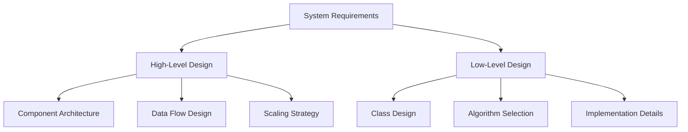
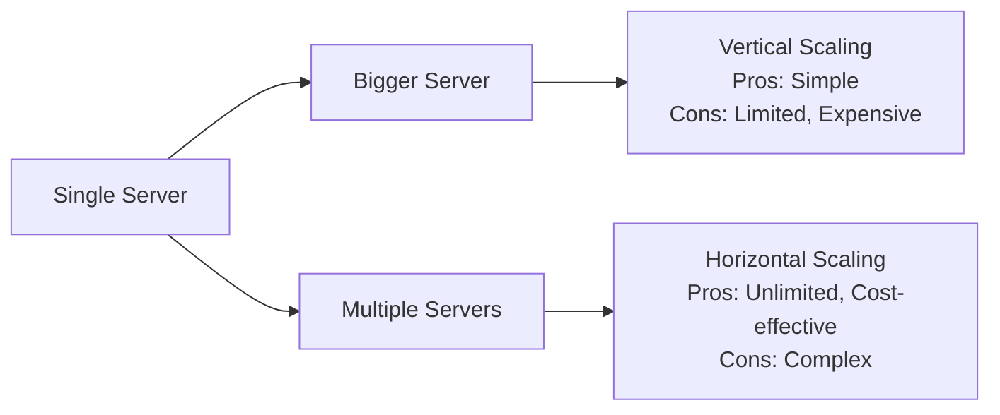
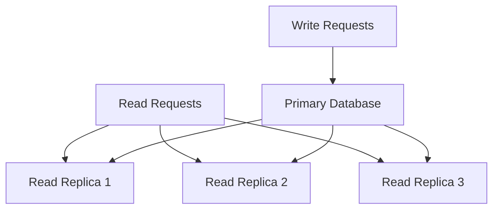
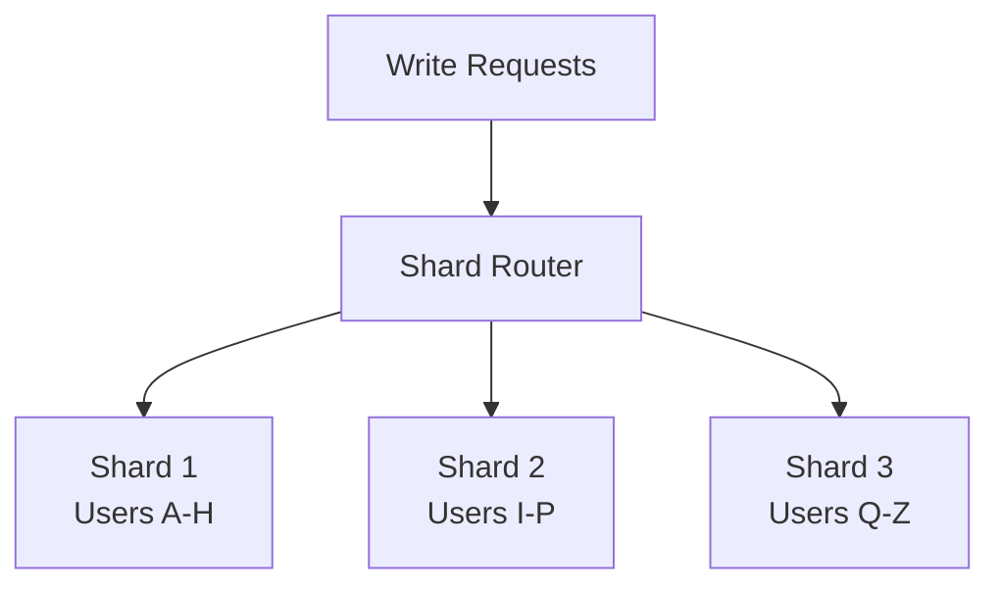
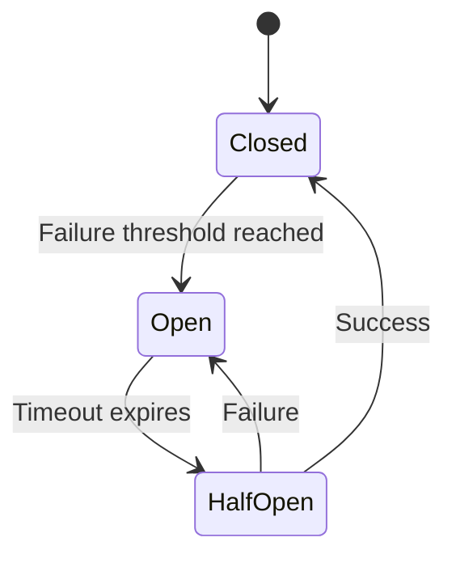

# Core Concepts — Intuitive, Comprehensive and Practical

System design is fundamentally about making informed trade-offs between competing requirements. This guide provides deep, interview-ready explanations with real-world analogies to help you reason through complex architectural decisions.

## High-Level vs Low-Level Design

### High-Level Design (HLD)
Think like a city planner designing infrastructure. You're concerned with:
- **Component architecture**: How major systems connect (API Gateway → Services → Databases → Caches)
- **Data flow**: How information moves through your system
- **System boundaries**: What's inside vs outside your control
- **Scaling strategies**: How to handle growth in users, data, and traffic

**Example**: Designing Twitter's architecture with load balancers, tweet services, user services, timeline generation, and data storage layers.

### Low-Level Design (LLD)
Think like an architect designing a specific building. You focus on:
- **Classes and interfaces**: The building blocks of your code
- **Algorithms and data structures**: How to efficiently solve specific problems
- **Implementation details**: Concrete code that can be tested and deployed
- **Design patterns**: Proven solutions to common programming challenges

**Example**: Implementing an LRU cache with specific methods, data structures (HashMap + Doubly Linked List), and thread safety considerations.



## Key Non-Functional Properties

### Latency
**Definition**: Time to complete a single operation from request to response.

**Real-world analogy**: Like asking a question and waiting for an answer. The time between your question and their response is latency.

**Key insights**:
- Always discuss P95/P99, not averages (tail latency matters more)
- Network calls dominate latency in distributed systems
- Caching dramatically reduces latency for repeated requests
- Geographic distribution affects latency (speed of light limitations)

**Typical values**:
- Memory access: ~100 nanoseconds
- SSD read: ~100 microseconds  
- Network within datacenter: ~500 microseconds
- Cross-continent network: ~100-300 milliseconds

### Throughput
**Definition**: Number of operations the system can handle per unit time (RPS, QPS, TPS).

**Real-world analogy**: Like a highway's capacity - how many cars can pass through per hour, regardless of how fast each individual car is going.

**Key insights**:
- Throughput and latency are related but different
- Horizontal scaling primarily improves throughput
- Bottlenecks limit overall system throughput
- Load balancing distributes throughput across multiple servers

### Availability
**Definition**: Percentage of time the system is operational and accessible.

**Real-world analogy**: Like a store's operating hours - what percentage of the time can customers actually use your service?

**Common targets**:
- 99% = 3.65 days downtime/year
- 99.9% = 8.76 hours downtime/year  
- 99.99% = 52.56 minutes downtime/year
- 99.999% = 5.26 minutes downtime/year

**Achieving high availability**:
- Redundancy (multiple instances)
- Health checks and automatic failover
- Graceful degradation
- Circuit breakers

### Consistency
**Definition**: How up-to-date reads are after writes across distributed nodes.

**Real-world analogy**: Like updating your social media status - how quickly do all your friends see the update?

**Types**:
- **Strong consistency**: All nodes see the same data simultaneously
- **Eventual consistency**: Nodes will eventually converge to the same state
- **Weak consistency**: No guarantees about when all nodes will be consistent

## Powerful Analogies for Complex Concepts

### Cache = Refrigerator + Pantry System
- **L1 Cache (CPU)** = Items in your hand (instant access)
- **L2 Cache (Memory)** = Refrigerator (very fast access to frequently used items)
- **Database** = Grocery store (slower, but has everything)
- **CDN** = Local convenience stores (geographically distributed)

When you need milk, you check the fridge first. If it's not there, you go to the store, buy milk, and stock your fridge for next time.

### Load Balancer = Smart Receptionist
A receptionist at a busy doctor's office who:
- Knows which doctors are available (health checks)
- Distributes patients evenly (round-robin)
- Sends VIP patients to specific doctors (weighted routing)
- Redirects patients when a doctor is sick (failover)

### Message Queue = Post Office System
- **Producers** = People sending letters
- **Queue** = Mailboxes and sorting facilities
- **Consumers** = Mail carriers delivering letters
- **Dead Letter Queue** = Return-to-sender for undeliverable mail

The post office smooths out delivery - even if everyone sends letters on Monday, they get delivered throughout the week.

### Database Sharding = Library System
Instead of one massive library with all books:
- **Shard by topic**: Science library, Literature library, History library
- **Shard by alphabet**: A-M library, N-Z library
- **Consistent hashing**: Smart system that knows which library has which book

## Scaling Patterns (Comprehensive)

### Vertical vs Horizontal Scaling



**Vertical Scaling (Scale Up)**:
- Like upgrading from a bicycle to a motorcycle to a car
- Easier to implement (no code changes)
- Limited by hardware constraints
- Single point of failure

**Horizontal Scaling (Scale Out)**:
- Like adding more lanes to a highway
- Requires stateless application design
- Nearly unlimited scaling potential
- Built-in redundancy

### Data Scaling Strategies

**Read Scaling**: Add read replicas


**Write Scaling**: Implement sharding


## Failure Handling (Battle-Tested Strategies)

### Circuit Breaker Pattern
Like an electrical circuit breaker in your house:
- **Closed**: Normal operation, requests flow through
- **Open**: Service is down, fail fast without trying
- **Half-Open**: Testing if service has recovered



### Retry Strategies
- **Exponential backoff**: Wait 1s, then 2s, then 4s, then 8s...
- **Jitter**: Add randomness to prevent thundering herd
- **Circuit breaker integration**: Stop retrying when service is known to be down

### Graceful Degradation
Like a car with a flat tire - you can still drive, just slower:
- Serve cached data when database is down
- Show simplified UI when recommendation service fails
- Process payments even if analytics service is unavailable

## System Design Interview Framework

### 1. Requirements Clarification (5-10 minutes)
**Functional Requirements**:
- What specific features need to be built?
- What are the core user journeys?
- Any special business logic or constraints?

**Non-Functional Requirements**:
- How many users? (DAU, MAU)
- What's the expected read/write ratio?
- What are the latency requirements?
- What's the availability target?

### 2. Capacity Estimation (5-10 minutes)
**Traffic Estimation**:
- Requests per second (peak and average)
- Data size per request
- Storage requirements
- Bandwidth requirements

**Example calculation**:
```
100M DAU × 10 requests/day = 1B requests/day
1B requests/day ÷ 86,400 seconds = ~12K RPS average
Peak traffic (3x average) = ~36K RPS
```

### 3. High-Level Design (15-20 minutes)
**Core Components**:
- Load balancers
- Application servers
- Databases
- Caches
- Message queues
- CDN (if needed)

**Data Flow**:
- How requests flow through the system
- How data is written and read
- How different components interact

### 4. Deep Dive (10-15 minutes)
**Database Design**:
- Schema design
- Indexing strategy
- Sharding approach

**Caching Strategy**:
- What to cache
- Cache invalidation
- Cache-aside vs write-through

**API Design**:
- Key endpoints
- Request/response formats
- Authentication/authorization

### 5. Scale and Optimize (5-10 minutes)
**Bottleneck Identification**:
- Database becomes the bottleneck first (usually)
- Network bandwidth limitations
- CPU-intensive operations

**Scaling Solutions**:
- Database sharding and replication
- Microservices architecture
- Asynchronous processing
- CDN for static content

## Key Takeaways

1. **Start simple, then scale**: Begin with a monolith, identify bottlenecks, then scale specific components
2. **Measure everything**: You can't optimize what you don't measure
3. **Design for failure**: Assume components will fail and design accordingly
4. **Consistency vs Availability**: Understand the trade-offs and choose based on business requirements
5. **Caching is powerful**: But cache invalidation is one of the hardest problems in computer science

## 🎯 Next Steps

Now that you understand the core concepts, choose your learning path:

### **Hands-On Learners**
- **Try Building**: Start with [LRU Cache implementation](../01-ll-designs/lru_cache/) to see concepts in action
- **Run Examples**: Deploy a [cache server](../03-implementations/cache-server/) to understand caching in practice

### **Architecture Focus**
- **Study Real Systems**: Explore [Twitter Clone design](../02-hl-designs/twitter_clone/) to see concepts applied at scale
- **Learn Patterns**: Review [design patterns](design-patterns.md) for common architectural solutions

### **Interview Preparation**
- **Master Framework**: Learn the [interview approach](../04-interview-prep/frameworks.md) for system design questions
- **Practice Questions**: Try [common interview questions](../04-interview-prep/most_asked_questions.md) using these concepts

### **Structured Learning**
- **Follow Curriculum**: Use the [6-week study plan](../05-study-plan/study_plan.md) for comprehensive coverage
- **Track Progress**: Check [learning milestones](../05-study-plan/milestones.md) to measure your growth

### **Deep Dive Topics**
Continue building your foundation:
- [Scalability Patterns](scalability.md) — Horizontal vs vertical scaling strategies
- [Load Balancing](load-balancing.md) — Distribution algorithms and patterns
- [Caching Strategies](caching-strategies.md) — Cache patterns and invalidation
- [Database Basics](database-basics.md) — SQL vs NoSQL selection criteria
- [CAP Theorem](cap-theorem.md) — Consistency, availability, and partition tolerance

## Further Reading

- **Books**: "Designing Data-Intensive Applications" by Martin Kleppmann
- **Papers**: Google's MapReduce, Amazon's Dynamo, Google's Bigtable
- **Blogs**: High Scalability, AWS Architecture Center, Netflix Tech Blog
- **Practice**: System design interview questions on LeetCode, Pramp, or InterviewBit

---

*💡 **Pro Tip**: These concepts are your foundation. Return to this guide whenever you encounter unfamiliar terms or need to refresh your understanding while working through more advanced topics!*
