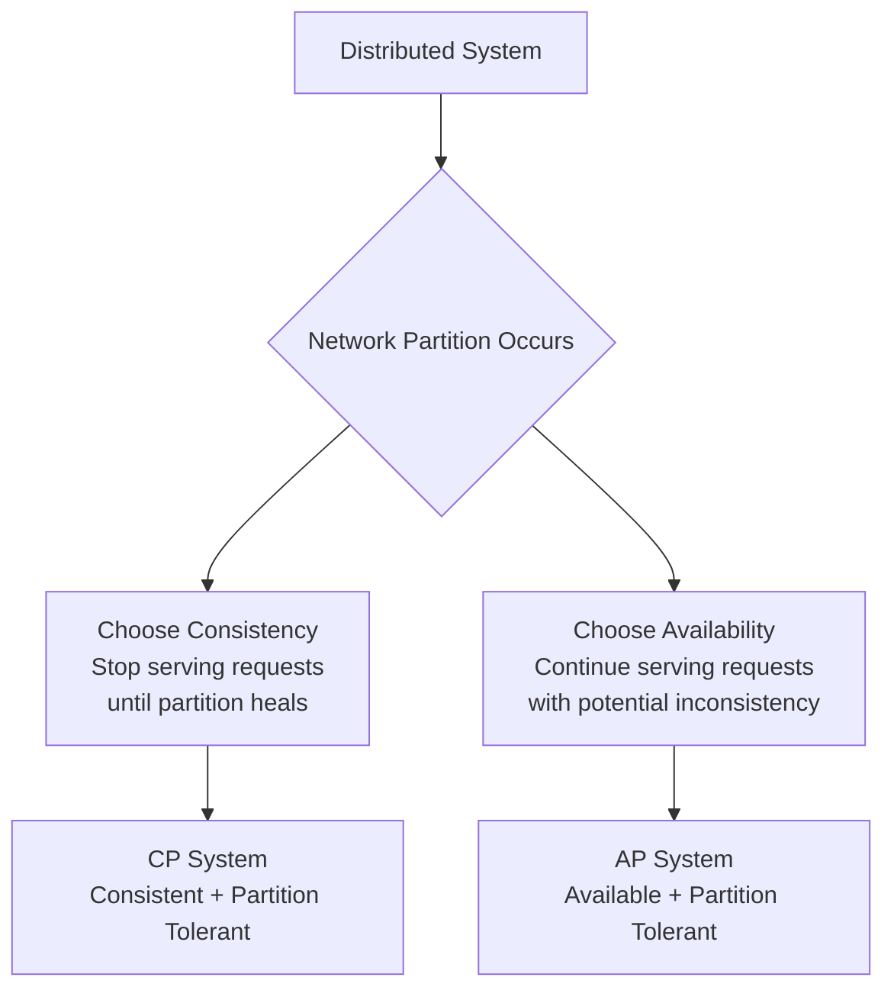
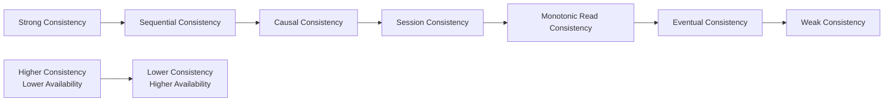

# Consistency vs Availability — Understanding the Trade-offs

In distributed systems, you can't have perfect consistency, availability, and partition tolerance simultaneously. Understanding this fundamental trade-off is crucial for designing systems that meet your business requirements.

## The Fundamental Trade-off

**Real-world analogy**: Imagine a chain of coffee shops that share inventory information:

- **Consistency**: All shops always show the same inventory count
- **Availability**: Every shop can always serve customers and process orders
- **Partition Tolerance**: Shops can operate even when network connections between them fail

When the network between shops fails (partition), you must choose: either stop serving customers (lose availability) or allow shops to operate with potentially inconsistent inventory (lose consistency).



## Understanding Consistency

### Strong Consistency

**Definition**: All nodes see the same data at the same time. Any read receives the most recent write.

**Real-world example**: Bank account balance - you can't have different branches showing different balances for the same account.

```python
class StronglyConsistentDatabase:
    def __init__(self, nodes):
        self.nodes = nodes
        self.leader = nodes[0]  # Single leader for writes

    def write(self, key, value):
        # Write to leader first
        self.leader.write(key, value)

        # Synchronously replicate to all followers
        for follower in self.nodes[1:]:
            try:
                follower.write(key, value)
            except NetworkError:
                # If any follower fails, abort the write
                self.rollback_write(key)
                raise ConsistencyError("Cannot maintain consistency")

        return "Write successful"

    def read(self, key):
        # Always read from leader to ensure consistency
        return self.leader.read(key)
```

**Characteristics**:

- Immediate consistency across all nodes
- Higher latency due to coordination overhead
- May become unavailable during network partitions
- Suitable for financial systems, inventory management

**Implementation Techniques**:

- **Two-Phase Commit (2PC)**: Coordinate writes across multiple nodes
- **Raft/Paxos**: Consensus algorithms for leader election and log replication
- **Synchronous replication**: Wait for all replicas to acknowledge writes

### Eventual Consistency

**Definition**: The system will become consistent over time, but immediate consistency is not guaranteed.

**Real-world example**: Social media posts - it's acceptable if your post appears on friends' feeds with a slight delay.

```python
import time
import threading
from queue import Queue

class EventuallyConsistentDatabase:
    def __init__(self, nodes):
        self.nodes = nodes
        self.replication_queue = Queue()
        self.start_replication_worker()

    def write(self, key, value):
        # Write to local node immediately
        primary_node = self.get_primary_node(key)
        primary_node.write(key, value)

        # Queue replication to other nodes
        for node in self.nodes:
            if node != primary_node:
                self.replication_queue.put({
                    'node': node,
                    'key': key,
                    'value': value,
                    'timestamp': time.time()
                })

        return "Write accepted"

    def read(self, key):
        # Read from any available node
        for node in self.nodes:
            try:
                return node.read(key)
            except NetworkError:
                continue
        raise AvailabilityError("No nodes available")

    def start_replication_worker(self):
        def replicate():
            while True:
                try:
                    replication_task = self.replication_queue.get(timeout=1)
                    node = replication_task['node']
                    key = replication_task['key']
                    value = replication_task['value']

                    # Attempt replication with retry
                    max_retries = 3
                    for attempt in range(max_retries):
                        try:
                            node.write(key, value)
                            break
                        except NetworkError:
                            if attempt == max_retries - 1:
                                # Re-queue for later retry
                                self.replication_queue.put(replication_task)
                            time.sleep(2 ** attempt)  # Exponential backoff

                except:
                    continue

        worker_thread = threading.Thread(target=replicate, daemon=True)
        worker_thread.start()
```

**Characteristics**:

- Lower latency for writes
- Higher availability during network issues
- Temporary inconsistencies are acceptable
- Suitable for social media, content delivery, analytics

### Consistency Models Spectrum



**Sequential Consistency**: Operations appear to execute in some sequential order, but not necessarily real-time order.

**Causal Consistency**: Operations that are causally related are seen in the same order by all nodes.

```python
class CausalConsistency:
    def __init__(self):
        self.vector_clock = {}
        self.causal_dependencies = {}

    def write(self, key, value, dependencies=None):
        # Increment vector clock
        self.vector_clock[key] = self.vector_clock.get(key, 0) + 1

        # Track causal dependencies
        if dependencies:
            self.causal_dependencies[key] = dependencies.copy()

        # Ensure causally dependent writes are applied first
        if key in self.causal_dependencies:
            for dep_key in self.causal_dependencies[key]:
                self.wait_for_dependency(dep_key)

        return self.apply_write(key, value)
```

**Session Consistency**: Guarantees consistency within a single client session.

**Monotonic Read Consistency**: If a client reads a value, subsequent reads will return the same or more recent values.

## Understanding Availability

### High Availability Principles

**Definition**: System remains operational and accessible even when some components fail.

**Availability Metrics**:

```python
# Common availability targets
availability_targets = {
    "99%": {
        "downtime_per_year": "3.65 days",
        "downtime_per_month": "7.31 hours",
        "use_case": "Internal tools"
    },
    "99.9%": {
        "downtime_per_year": "8.77 hours",
        "downtime_per_month": "43.83 minutes",
        "use_case": "Standard web services"
    },
    "99.99%": {
        "downtime_per_year": "52.60 minutes",
        "downtime_per_month": "4.38 minutes",
        "use_case": "Critical business systems"
    },
    "99.999%": {
        "downtime_per_year": "5.26 minutes",
        "downtime_per_month": "26.30 seconds",
        "use_case": "Mission-critical systems"
    }
}
```

### Availability Patterns

**Redundancy and Replication**:

```python
class HighAvailabilitySystem:
    def __init__(self, replicas):
        self.replicas = replicas
        self.healthy_replicas = set(replicas)
        self.start_health_monitoring()

    def read(self, key):
        # Try healthy replicas until one succeeds
        for replica in self.healthy_replicas:
            try:
                return replica.read(key)
            except Exception:
                self.mark_unhealthy(replica)
                continue

        # If all healthy replicas fail, try unhealthy ones
        for replica in self.replicas:
            if replica not in self.healthy_replicas:
                try:
                    result = replica.read(key)
                    self.mark_healthy(replica)  # Recovery detected
                    return result
                except Exception:
                    continue

        raise UnavailableError("No replicas available")

    def write(self, key, value):
        # Write to multiple replicas for durability
        successful_writes = 0
        required_writes = len(self.replicas) // 2 + 1  # Majority

        for replica in self.healthy_replicas:
            try:
                replica.write(key, value)
                successful_writes += 1
                if successful_writes >= required_writes:
                    return "Write successful"
            except Exception:
                self.mark_unhealthy(replica)

        if successful_writes < required_writes:
            raise ConsistencyError("Insufficient replicas for write")
```

**Circuit Breaker Pattern**:

```python
import time
from enum import Enum

class CircuitState(Enum):
    CLOSED = "closed"
    OPEN = "open"
    HALF_OPEN = "half_open"

class CircuitBreaker:
    def __init__(self, failure_threshold=5, timeout=60):
        self.failure_threshold = failure_threshold
        self.timeout = timeout
        self.failure_count = 0
        self.last_failure_time = None
        self.state = CircuitState.CLOSED

    def call(self, func, *args, **kwargs):
        if self.state == CircuitState.OPEN:
            if time.time() - self.last_failure_time > self.timeout:
                self.state = CircuitState.HALF_OPEN
            else:
                raise CircuitOpenError("Circuit breaker is open")

        try:
            result = func(*args, **kwargs)
            self.on_success()
            return result
        except Exception as e:
            self.on_failure()
            raise e

    def on_success(self):
        self.failure_count = 0
        self.state = CircuitState.CLOSED

    def on_failure(self):
        self.failure_count += 1
        self.last_failure_time = time.time()

        if self.failure_count >= self.failure_threshold:
            self.state = CircuitState.OPEN
```

**Graceful Degradation**:

```python
class GracefulDegradationService:
    def __init__(self, primary_service, fallback_service, cache):
        self.primary_service = primary_service
        self.fallback_service = fallback_service
        self.cache = cache

    def get_user_recommendations(self, user_id):
        try:
            # Try primary recommendation service
            recommendations = self.primary_service.get_recommendations(user_id)
            self.cache.set(f"recommendations:{user_id}", recommendations, ttl=3600)
            return recommendations
        except ServiceUnavailableError:
            # Fallback to cached recommendations
            cached = self.cache.get(f"recommendations:{user_id}")
            if cached:
                return cached

            try:
                # Fallback to simple recommendation service
                return self.fallback_service.get_popular_items()
            except ServiceUnavailableError:
                # Final fallback to static recommendations
                return self.get_default_recommendations()

    def get_default_recommendations(self):
        return [
            {"id": 1, "title": "Popular Item 1"},
            {"id": 2, "title": "Popular Item 2"},
            {"id": 3, "title": "Popular Item 3"}
        ]
```

## CAP Theorem in Practice

### CP Systems (Consistency + Partition Tolerance)

**Characteristics**: Prioritize consistency over availability during network partitions.

**Examples**: Traditional RDBMS with synchronous replication, Apache HBase, MongoDB (with strong consistency settings)

```python
class CPSystem:
    def __init__(self, nodes):
        self.nodes = nodes
        self.leader = None
        self.elect_leader()

    def elect_leader(self):
        # Simplified leader election
        majority = len(self.nodes) // 2 + 1
        votes = 0

        for node in self.nodes:
            if node.is_healthy():
                votes += 1

        if votes >= majority:
            self.leader = self.nodes[0]  # Simplified selection
        else:
            self.leader = None

    def write(self, key, value):
        if not self.leader:
            raise UnavailableError("No leader available - system unavailable")

        # Require majority acknowledgment for consistency
        acks = 0
        majority = len(self.nodes) // 2 + 1

        for node in self.nodes:
            try:
                node.write(key, value)
                acks += 1
            except NetworkError:
                continue

        if acks >= majority:
            return "Write successful"
        else:
            # Rollback to maintain consistency
            self.rollback_write(key)
            raise ConsistencyError("Cannot maintain consistency")

    def read(self, key):
        if not self.leader:
            raise UnavailableError("No leader available - system unavailable")

        # Read from leader to ensure consistency
        return self.leader.read(key)
```

**Use Cases**:

- Financial transactions
- Inventory management
- Configuration management
- Systems requiring ACID properties

### AP Systems (Availability + Partition Tolerance)

**Characteristics**: Prioritize availability over consistency during network partitions.

**Examples**: Amazon DynamoDB, Apache Cassandra, DNS, CDNs

```python
class APSystem:
    def __init__(self, nodes):
        self.nodes = nodes
        self.replication_factor = 3
        self.read_quorum = 1  # R=1 for high availability
        self.write_quorum = 1  # W=1 for high availability

    def get_nodes_for_key(self, key):
        # Use consistent hashing to determine nodes
        hash_value = hash(key)
        start_index = hash_value % len(self.nodes)

        selected_nodes = []
        for i in range(self.replication_factor):
            node_index = (start_index + i) % len(self.nodes)
            selected_nodes.append(self.nodes[node_index])

        return selected_nodes

    def write(self, key, value):
        nodes = self.get_nodes_for_key(key)
        successful_writes = 0

        # Write to as many nodes as possible
        for node in nodes:
            try:
                node.write(key, value, timestamp=time.time())
                successful_writes += 1
            except NetworkError:
                continue  # Continue with other nodes

        if successful_writes >= self.write_quorum:
            return "Write successful"
        else:
            raise UnavailableError("Insufficient nodes available")

    def read(self, key):
        nodes = self.get_nodes_for_key(key)
        responses = []

        # Read from multiple nodes
        for node in nodes:
            try:
                response = node.read(key)
                if response:
                    responses.append(response)
                if len(responses) >= self.read_quorum:
                    break
            except NetworkError:
                continue

        if not responses:
            raise UnavailableError("No nodes available for read")

        # Return most recent value (conflict resolution)
        return max(responses, key=lambda x: x.timestamp)
```

**Use Cases**:

- Social media platforms
- Content delivery networks
- Shopping carts
- Session storage
- Analytics and logging

## Consistency Patterns in Real Systems

### Read-Your-Writes Consistency

**Problem**: User writes data but subsequent reads might not see their own writes.

**Solution**: Ensure users can always read their own writes.

```python
class ReadYourWritesConsistency:
    def __init__(self, nodes):
        self.nodes = nodes
        self.user_write_locations = {}  # Track where users wrote

    def write(self, user_id, key, value):
        # Choose a node for this user's writes
        node = self.get_user_node(user_id)
        result = node.write(key, value)

        # Remember where this user wrote
        self.user_write_locations[user_id] = node

        # Asynchronously replicate to other nodes
        self.async_replicate(key, value, exclude_node=node)

        return result

    def read(self, user_id, key):
        # First try the node where user wrote
        if user_id in self.user_write_locations:
            try:
                return self.user_write_locations[user_id].read(key)
            except NetworkError:
                pass

        # Fallback to any available node
        for node in self.nodes:
            try:
                return node.read(key)
            except NetworkError:
                continue

        raise UnavailableError("No nodes available")
```

### Monotonic Read Consistency

**Problem**: User might see data "go backwards" when reading from different replicas.

**Solution**: Ensure reads are monotonic within a session.

```python
class MonotonicReadConsistency:
    def __init__(self, nodes):
        self.nodes = nodes
        self.user_sessions = {}  # Track user session state

    def read(self, user_id, key):
        session = self.get_or_create_session(user_id)

        # Try to read from the same node as last read
        if session.last_read_node:
            try:
                result = session.last_read_node.read(key)
                session.update_read_timestamp(result.timestamp)
                return result
            except NetworkError:
                pass

        # Try other nodes, but ensure monotonic reads
        for node in self.nodes:
            try:
                result = node.read(key)
                if result.timestamp >= session.last_read_timestamp:
                    session.last_read_node = node
                    session.update_read_timestamp(result.timestamp)
                    return result
            except NetworkError:
                continue

        raise UnavailableError("No suitable nodes available")
```

### Causal Consistency

**Problem**: Related operations might be seen in different orders on different nodes.

**Solution**: Ensure causally related operations are seen in the same order.

```python
class CausalConsistency:
    def __init__(self, nodes):
        self.nodes = nodes
        self.vector_clocks = {}
        self.causal_dependencies = {}

    def write(self, user_id, key, value, depends_on=None):
        # Update vector clock
        if user_id not in self.vector_clocks:
            self.vector_clocks[user_id] = {}

        self.vector_clocks[user_id][key] = self.vector_clocks[user_id].get(key, 0) + 1

        # Track causal dependencies
        if depends_on:
            self.causal_dependencies[key] = depends_on

        # Create write operation with vector clock
        write_op = {
            'key': key,
            'value': value,
            'vector_clock': self.vector_clocks[user_id].copy(),
            'dependencies': depends_on or []
        }

        # Write to nodes
        for node in self.nodes:
            try:
                node.causal_write(write_op)
            except NetworkError:
                continue

        return "Write successful"

    def read(self, user_id, key):
        for node in self.nodes:
            try:
                result = node.causal_read(key, self.vector_clocks.get(user_id, {}))
                if result:
                    return result
            except NetworkError:
                continue

        raise UnavailableError("No nodes available")
```

## Conflict Resolution Strategies

### Last-Write-Wins (LWW)

**How it works**: Use timestamps to determine which write is most recent.

```python
class LastWriteWins:
    def __init__(self):
        self.data = {}

    def write(self, key, value, timestamp=None):
        if timestamp is None:
            timestamp = time.time()

        if key not in self.data or timestamp > self.data[key]['timestamp']:
            self.data[key] = {
                'value': value,
                'timestamp': timestamp
            }

    def read(self, key):
        return self.data.get(key, {}).get('value')

    def merge(self, other_data):
        """Merge data from another replica"""
        for key, entry in other_data.items():
            self.write(key, entry['value'], entry['timestamp'])
```

**Pros**: Simple and deterministic
**Cons**: Can lose concurrent writes, requires synchronized clocks

### Vector Clocks

**How it works**: Track causality using vector clocks to detect concurrent writes.

```python
class VectorClock:
    def __init__(self, node_id):
        self.node_id = node_id
        self.clock = {}

    def increment(self):
        self.clock[self.node_id] = self.clock.get(self.node_id, 0) + 1

    def update(self, other_clock):
        for node, timestamp in other_clock.items():
            self.clock[node] = max(self.clock.get(node, 0), timestamp)
        self.increment()

    def compare(self, other_clock):
        """Compare two vector clocks"""
        self_greater = False
        other_greater = False

        all_nodes = set(self.clock.keys()) | set(other_clock.keys())

        for node in all_nodes:
            self_time = self.clock.get(node, 0)
            other_time = other_clock.get(node, 0)

            if self_time > other_time:
                self_greater = True
            elif self_time < other_time:
                other_greater = True

        if self_greater and not other_greater:
            return "after"  # self happened after other
        elif other_greater and not self_greater:
            return "before"  # self happened before other
        elif not self_greater and not other_greater:
            return "equal"  # same event
        else:
            return "concurrent"  # concurrent events

class VectorClockDatabase:
    def __init__(self, node_id):
        self.node_id = node_id
        self.clock = VectorClock(node_id)
        self.data = {}

    def write(self, key, value):
        self.clock.increment()

        self.data[key] = {
            'value': value,
            'vector_clock': self.clock.clock.copy()
        }

    def read(self, key):
        entry = self.data.get(key)
        if entry:
            return entry['value'], entry['vector_clock']
        return None, None

    def resolve_conflict(self, key, local_entry, remote_entry):
        """Resolve conflicts using vector clocks"""
        local_clock = local_entry['vector_clock']
        remote_clock = remote_entry['vector_clock']

        comparison = VectorClock.compare_clocks(local_clock, remote_clock)

        if comparison == "after":
            return local_entry  # Local is newer
        elif comparison == "before":
            return remote_entry  # Remote is newer
        else:
            # Concurrent writes - need application-specific resolution
            return self.application_resolve(local_entry, remote_entry)
```

### Application-Specific Resolution

**How it works**: Use business logic to resolve conflicts.

```python
class ShoppingCartConflictResolver:
    def resolve_cart_conflict(self, local_cart, remote_cart):
        """Merge shopping carts by taking union of items"""
        merged_items = {}

        # Add items from local cart
        for item_id, quantity in local_cart['items'].items():
            merged_items[item_id] = quantity

        # Add items from remote cart, taking max quantity
        for item_id, quantity in remote_cart['items'].items():
            if item_id in merged_items:
                merged_items[item_id] = max(merged_items[item_id], quantity)
            else:
                merged_items[item_id] = quantity

        return {
            'items': merged_items,
            'last_modified': max(local_cart['last_modified'],
                               remote_cart['last_modified'])
        }

class CounterConflictResolver:
    def resolve_counter_conflict(self, local_counter, remote_counter):
        """Merge counters by taking sum"""
        return {
            'value': local_counter['value'] + remote_counter['value'],
            'last_modified': max(local_counter['last_modified'],
                               remote_counter['last_modified'])
        }
```

## Practical Implementation Strategies

### Quorum-Based Systems

**How it works**: Use quorum reads and writes to balance consistency and availability.

```python
class QuorumSystem:
    def __init__(self, nodes, replication_factor=3):
        self.nodes = nodes
        self.replication_factor = replication_factor
        self.read_quorum = 2   # R
        self.write_quorum = 2  # W
        # R + W > N ensures strong consistency

    def write(self, key, value):
        target_nodes = self.get_nodes_for_key(key)
        successful_writes = 0

        for node in target_nodes:
            try:
                node.write(key, value, timestamp=time.time())
                successful_writes += 1

                if successful_writes >= self.write_quorum:
                    # Asynchronously write to remaining nodes
                    self.async_write_remaining(key, value, target_nodes[successful_writes:])
                    return "Write successful"
            except NetworkError:
                continue

        raise ConsistencyError("Write quorum not achieved")

    def read(self, key):
        target_nodes = self.get_nodes_for_key(key)
        responses = []

        for node in target_nodes:
            try:
                response = node.read(key)
                if response:
                    responses.append(response)

                if len(responses) >= self.read_quorum:
                    # Resolve conflicts and return result
                    return self.resolve_read_conflicts(responses)
            except NetworkError:
                continue

        raise UnavailableError("Read quorum not achieved")

    def resolve_read_conflicts(self, responses):
        """Return the most recent value based on timestamp"""
        return max(responses, key=lambda x: x.timestamp)
```

### Eventual Consistency with Convergence

**How it works**: Ensure all replicas eventually converge to the same state.

```python
class EventuallyConsistentSystem:
    def __init__(self, node_id, peers):
        self.node_id = node_id
        self.peers = peers
        self.data = {}
        self.version_vector = {}
        self.start_anti_entropy()

    def write(self, key, value):
        # Increment version for this node
        if key not in self.version_vector:
            self.version_vector[key] = {}

        self.version_vector[key][self.node_id] = \
            self.version_vector[key].get(self.node_id, 0) + 1

        self.data[key] = {
            'value': value,
            'version_vector': self.version_vector[key].copy(),
            'timestamp': time.time()
        }

        # Asynchronously propagate to peers
        self.async_propagate(key, self.data[key])

    def start_anti_entropy(self):
        """Periodically sync with peers to ensure convergence"""
        def anti_entropy_process():
            while True:
                for peer in self.peers:
                    try:
                        self.sync_with_peer(peer)
                    except NetworkError:
                        continue
                time.sleep(30)  # Sync every 30 seconds

        threading.Thread(target=anti_entropy_process, daemon=True).start()

    def sync_with_peer(self, peer):
        """Exchange data with peer to resolve inconsistencies"""
        # Get peer's data
        peer_data = peer.get_all_data()

        # Merge with local data
        for key, peer_entry in peer_data.items():
            if key not in self.data:
                self.data[key] = peer_entry
            else:
                # Resolve using version vectors
                merged_entry = self.merge_entries(self.data[key], peer_entry)
                self.data[key] = merged_entry
```

## Monitoring Consistency and Availability

### Consistency Metrics

```python
class ConsistencyMonitor:
    def __init__(self):
        self.read_inconsistencies = 0
        self.total_reads = 0
        self.write_conflicts = 0
        self.total_writes = 0

    def record_read_inconsistency(self):
        self.read_inconsistencies += 1
        self.total_reads += 1

    def record_consistent_read(self):
        self.total_reads += 1

    def record_write_conflict(self):
        self.write_conflicts += 1
        self.total_writes += 1

    def record_successful_write(self):
        self.total_writes += 1

    def get_consistency_metrics(self):
        return {
            'read_consistency_ratio': 1 - (self.read_inconsistencies / max(self.total_reads, 1)),
            'write_conflict_ratio': self.write_conflicts / max(self.total_writes, 1),
            'total_reads': self.total_reads,
            'total_writes': self.total_writes
        }
```

### Availability Metrics

```python
class AvailabilityMonitor:
    def __init__(self):
        self.successful_requests = 0
        self.failed_requests = 0
        self.downtime_periods = []
        self.current_downtime_start = None

    def record_successful_request(self):
        self.successful_requests += 1
        if self.current_downtime_start:
            # System recovered
            downtime_duration = time.time() - self.current_downtime_start
            self.downtime_periods.append(downtime_duration)
            self.current_downtime_start = None

    def record_failed_request(self):
        self.failed_requests += 1
        if not self.current_downtime_start:
            self.current_downtime_start = time.time()

    def get_availability_metrics(self):
        total_requests = self.successful_requests + self.failed_requests
        availability = self.successful_requests / max(total_requests, 1)

        total_downtime = sum(self.downtime_periods)
        if self.current_downtime_start:
            total_downtime += time.time() - self.current_downtime_start

        return {
            'availability_percentage': availability * 100,
            'total_downtime_seconds': total_downtime,
            'mean_time_to_recovery': sum(self.downtime_periods) / max(len(self.downtime_periods), 1),
            'number_of_outages': len(self.downtime_periods)
        }
```

## Best Practices and Guidelines

### Choosing the Right Trade-off

**Financial Systems** (Choose Consistency):

```python
# Bank transfer - must be consistent
class BankTransferSystem:
    def transfer(self, from_account, to_account, amount):
        with self.database.transaction():
            # Both operations must succeed or both fail
            self.debit_account(from_account, amount)
            self.credit_account(to_account, amount)

            # Verify consistency
            if self.get_balance(from_account) < 0:
                raise InsufficientFundsError()
```

**Social Media** (Choose Availability):

```python
# Social media post - eventual consistency is acceptable
class SocialMediaSystem:
    def publish_post(self, user_id, content):
        # Write to user's timeline immediately
        self.user_timeline.add_post(user_id, content)

        # Asynchronously propagate to followers
        followers = self.get_followers(user_id)
        for follower in followers:
            self.async_queue.put({
                'action': 'add_to_feed',
                'follower_id': follower,
                'post': content
            })
```

### Implementation Guidelines

**Design for Your Requirements**:

```python
# Configuration for different consistency requirements
consistency_configs = {
    'financial_transactions': {
        'consistency_level': 'strong',
        'read_quorum': 'all',
        'write_quorum': 'all',
        'timeout': 5000  # 5 seconds
    },
    'user_profiles': {
        'consistency_level': 'session',
        'read_quorum': 1,
        'write_quorum': 2,
        'timeout': 1000  # 1 second
    },
    'analytics_data': {
        'consistency_level': 'eventual',
        'read_quorum': 1,
        'write_quorum': 1,
        'timeout': 500  # 500ms
    }
}
```

**Monitor and Alert**:

```python
# Set up monitoring for consistency and availability
monitoring_thresholds = {
    'availability': {
        'warning': 99.5,  # Below 99.5%
        'critical': 99.0  # Below 99%
    },
    'consistency': {
        'read_inconsistency_rate': 0.01,  # Above 1%
        'write_conflict_rate': 0.05       # Above 5%
    },
    'latency': {
        'p95_read_latency': 100,   # Above 100ms
        'p95_write_latency': 500   # Above 500ms
    }
}
```

## Key Takeaways

1. **CAP theorem is fundamental**: You cannot have perfect consistency, availability, and partition tolerance simultaneously
2. **Choose based on business requirements**: Financial systems need consistency, social media needs availability
3. **Consistency is a spectrum**: From strong to eventual, choose the right level for each use case
4. **Availability requires redundancy**: Multiple replicas, graceful degradation, and circuit breakers
5. **Monitor both aspects**: Track consistency violations and availability metrics
6. **Design for failure**: Network partitions will happen, plan for them
7. **Consider hybrid approaches**: Different parts of your system may have different requirements

## Further Reading

- **Papers**:
  - "Brewer's Conjecture and the Feasibility of Consistent, Available, Partition-Tolerant Web Services" by Gilbert and Lynch
  - "Harvest, Yield, and Scalable Tolerant Systems" by Armando Fox and Eric Brewer
  - "Eventually Consistent" by Werner Vogels
- **Books**:
  - "Designing Data-Intensive Applications" by Martin Kleppmann
  - "Distributed Systems: Concepts and Design" by George Coulouris
- **Resources**:
  - Jepsen testing framework for distributed systems
  - AWS documentation on DynamoDB consistency models
  - Google Cloud Spanner architecture papers
