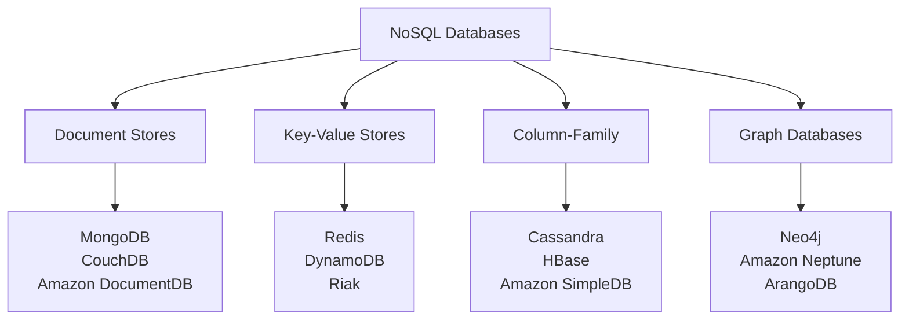
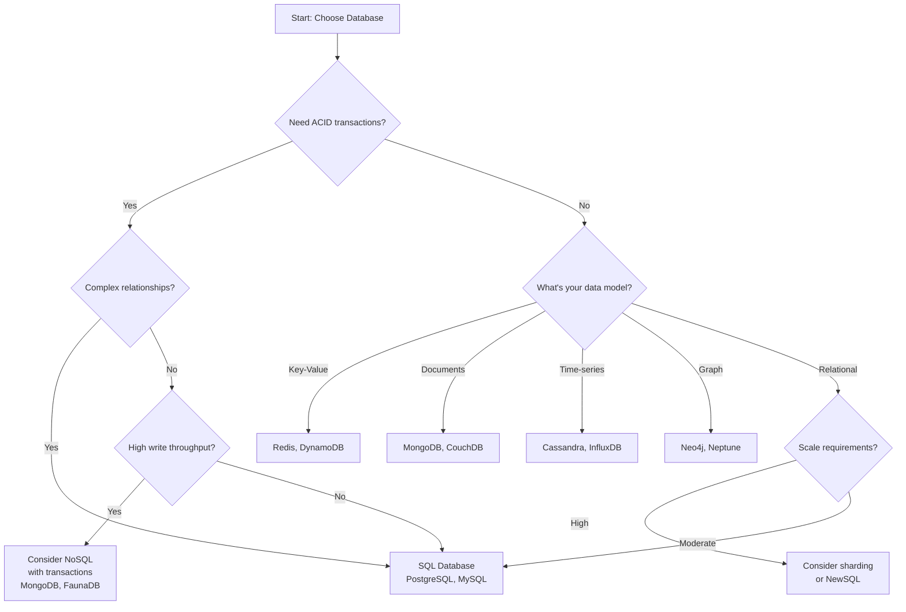

# Database Basics — SQL vs NoSQL Fundamentals

Understanding different database types and their trade-offs is crucial for system design. This guide covers the fundamental differences between SQL and NoSQL databases, when to use each, and how they fit into modern architectures.

## Database Fundamentals

**What is a Database?**: A structured collection of data that can be easily accessed, managed, and updated. Databases provide mechanisms for storing, retrieving, and organizing information efficiently.

**Real-world analogy**: Think of databases like different types of filing systems:
- **SQL databases** = Traditional filing cabinets with strict folder structures and cross-references
- **NoSQL databases** = Flexible storage systems like boxes, shelves, or digital folders that can adapt to different content types

## SQL Databases (Relational)

### Core Concepts

**Relational Model**: Data is organized into tables (relations) with rows (records) and columns (attributes). Tables can be linked through relationships using foreign keys.

```sql
-- Example: E-commerce database schema
CREATE TABLE users (
    user_id INT PRIMARY KEY,
    email VARCHAR(255) UNIQUE NOT NULL,
    name VARCHAR(100),
    created_at TIMESTAMP DEFAULT CURRENT_TIMESTAMP
);

CREATE TABLE orders (
    order_id INT PRIMARY KEY,
    user_id INT,
    total_amount DECIMAL(10,2),
    order_date TIMESTAMP,
    FOREIGN KEY (user_id) REFERENCES users(user_id)
);

CREATE TABLE order_items (
    item_id INT PRIMARY KEY,
    order_id INT,
    product_id INT,
    quantity INT,
    price DECIMAL(10,2),
    FOREIGN KEY (order_id) REFERENCES orders(order_id)
);
```

### ACID Properties

**Atomicity**: All operations in a transaction succeed or all fail.
```sql
-- Example: Transfer money between accounts
BEGIN TRANSACTION;
UPDATE accounts SET balance = balance - 100 WHERE account_id = 1;
UPDATE accounts SET balance = balance + 100 WHERE account_id = 2;
COMMIT; -- Both updates succeed or both fail
```

**Consistency**: Database remains in a valid state after transactions.
```sql
-- Constraint ensures data consistency
ALTER TABLE accounts ADD CONSTRAINT positive_balance 
CHECK (balance >= 0);
```

**Isolation**: Concurrent transactions don't interfere with each other.
```sql
-- Different isolation levels
SET TRANSACTION ISOLATION LEVEL READ COMMITTED;
SET TRANSACTION ISOLATION LEVEL SERIALIZABLE;
```

**Durability**: Committed transactions survive system failures.

### SQL Strengths

**Complex Queries and Joins**:
```sql
-- Complex analytical query
SELECT 
    u.name,
    COUNT(o.order_id) as total_orders,
    SUM(o.total_amount) as total_spent,
    AVG(o.total_amount) as avg_order_value
FROM users u
LEFT JOIN orders o ON u.user_id = o.user_id
WHERE u.created_at >= '2023-01-01'
GROUP BY u.user_id, u.name
HAVING COUNT(o.order_id) > 5
ORDER BY total_spent DESC;
```

**Data Integrity**:
```sql
-- Referential integrity constraints
ALTER TABLE orders 
ADD CONSTRAINT fk_user 
FOREIGN KEY (user_id) REFERENCES users(user_id)
ON DELETE CASCADE;

-- Check constraints
ALTER TABLE products 
ADD CONSTRAINT positive_price 
CHECK (price > 0);
```

**Transactions**:
```sql
-- Multi-step transaction with rollback capability
BEGIN TRANSACTION;
    INSERT INTO orders (user_id, total_amount) VALUES (123, 99.99);
    UPDATE inventory SET quantity = quantity - 1 WHERE product_id = 456;
    
    -- Check if inventory went negative
    IF (SELECT quantity FROM inventory WHERE product_id = 456) < 0
        ROLLBACK;
    ELSE
        COMMIT;
```

### SQL Limitations

**Scaling Challenges**:
- Vertical scaling has physical limits
- Horizontal scaling (sharding) is complex
- Cross-shard queries become difficult
- Maintaining ACID across distributed nodes is challenging

**Schema Rigidity**:
- Schema changes can be expensive and disruptive
- Adding columns to large tables may require downtime
- Difficult to handle varying data structures

**Performance at Scale**:
- Complex joins become expensive with large datasets
- Index maintenance overhead increases with data size
- Lock contention in high-concurrency scenarios

### Popular SQL Databases

**PostgreSQL**:
- Advanced features (JSON, arrays, custom types)
- Strong consistency and ACID compliance
- Excellent for complex applications
- Good performance for read-heavy workloads

**MySQL**:
- High performance and reliability
- Wide ecosystem and community support
- Good for web applications
- Multiple storage engines (InnoDB, MyISAM)

**Oracle**:
- Enterprise-grade features
- Advanced optimization and partitioning
- Expensive but powerful
- Strong for large enterprise applications

**SQL Server**:
- Microsoft ecosystem integration
- Good tooling and management features
- Strong for .NET applications
- Enterprise and cloud versions available

## NoSQL Databases

### Types of NoSQL Databases



### Document Stores

**How they work**: Store data as documents (usually JSON-like) with flexible schemas.

```javascript
// MongoDB example - User document
{
  "_id": ObjectId("507f1f77bcf86cd799439011"),
  "email": "john@example.com",
  "name": "John Doe",
  "profile": {
    "age": 30,
    "address": {
      "street": "123 Main St",
      "city": "New York",
      "zipcode": "10001"
    },
    "preferences": ["electronics", "books"],
    "social_media": {
      "twitter": "@johndoe",
      "linkedin": "john-doe-123"
    }
  },
  "orders": [
    {
      "order_id": "ORD-001",
      "date": "2023-01-15",
      "items": [
        {"product": "Laptop", "price": 999.99, "quantity": 1},
        {"product": "Mouse", "price": 29.99, "quantity": 2}
      ],
      "total": 1059.97
    }
  ],
  "created_at": "2023-01-01T00:00:00Z"
}
```

**Querying Documents**:
```javascript
// Find users in New York who bought electronics
db.users.find({
  "profile.address.city": "New York",
  "profile.preferences": "electronics",
  "orders.items.product": /laptop|computer|phone/i
});

// Aggregate total spending by city
db.users.aggregate([
  { $unwind: "$orders" },
  { $group: {
    _id: "$profile.address.city",
    total_spent: { $sum: "$orders.total" },
    user_count: { $addToSet: "$_id" }
  }},
  { $sort: { total_spent: -1 } }
]);
```

**Best for**:
- Content management systems
- Product catalogs with varying attributes
- User profiles with flexible schemas
- Real-time analytics and logging

### Key-Value Stores

**How they work**: Simple key-value pairs with fast lookups by key.

```python
# Redis examples
import redis
r = redis.Redis()

# Simple key-value operations
r.set("user:123:session", "abc123xyz", ex=3600)  # Expires in 1 hour
session = r.get("user:123:session")

# Complex data structures
r.hset("user:123:profile", mapping={
    "name": "John Doe",
    "email": "john@example.com",
    "last_login": "2023-01-15T10:30:00Z"
})

# Lists for activity feeds
r.lpush("user:123:activity", "logged_in", "viewed_product:456", "added_to_cart:789")
recent_activity = r.lrange("user:123:activity", 0, 9)  # Last 10 activities

# Sets for tags or categories
r.sadd("product:456:tags", "electronics", "laptop", "gaming")
r.sadd("product:789:tags", "electronics", "phone", "mobile")

# Find common tags
common_tags = r.sinter("product:456:tags", "product:789:tags")
```

**Use Cases**:
- Session storage
- Caching layer
- Real-time recommendations
- Shopping carts
- Rate limiting counters

### Column-Family (Wide Column)

**How they work**: Data stored in column families with flexible columns per row.

```cql
-- Cassandra example - Time series data
CREATE TABLE user_activity (
    user_id UUID,
    activity_date DATE,
    activity_time TIMESTAMP,
    activity_type TEXT,
    details MAP<TEXT, TEXT>,
    PRIMARY KEY ((user_id, activity_date), activity_time)
) WITH CLUSTERING ORDER BY (activity_time DESC);

-- Insert activity data
INSERT INTO user_activity (user_id, activity_date, activity_time, activity_type, details)
VALUES (123e4567-e89b-12d3-a456-426614174000, '2023-01-15', '2023-01-15 10:30:00', 'page_view', 
        {'page': '/products/laptop', 'referrer': 'google.com', 'duration': '45'});

-- Query recent activity for a user
SELECT * FROM user_activity 
WHERE user_id = 123e4567-e89b-12d3-a456-426614174000 
  AND activity_date = '2023-01-15'
ORDER BY activity_time DESC
LIMIT 10;
```

**Best for**:
- Time-series data
- IoT sensor data
- Event logging
- Analytics and reporting
- High write throughput applications

### Graph Databases

**How they work**: Store data as nodes and relationships, optimized for traversing connections.

```cypher
// Neo4j example - Social network
CREATE (john:Person {name: 'John Doe', age: 30})
CREATE (jane:Person {name: 'Jane Smith', age: 28})
CREATE (company:Company {name: 'Tech Corp'})
CREATE (skill:Skill {name: 'JavaScript'})

CREATE (john)-[:FRIENDS_WITH {since: '2020-01-01'}]->(jane)
CREATE (john)-[:WORKS_FOR {position: 'Developer', since: '2021-06-01'}]->(company)
CREATE (john)-[:HAS_SKILL {level: 'Expert'}]->(skill)

// Find friends of friends who work at the same company
MATCH (person:Person)-[:FRIENDS_WITH]-(friend:Person)-[:FRIENDS_WITH]-(fof:Person)
WHERE person.name = 'John Doe' 
  AND fof <> person
  AND EXISTS((person)-[:WORKS_FOR]->(company)<-[:WORKS_FOR]-(fof))
RETURN fof.name, company.name

// Find shortest path between two people
MATCH path = shortestPath((john:Person {name: 'John Doe'})-[*]-(target:Person {name: 'Target Person'}))
RETURN path
```

**Best for**:
- Social networks
- Recommendation engines
- Fraud detection
- Network analysis
- Knowledge graphs

## BASE vs ACID

### BASE Properties (NoSQL)

**Basically Available**: System remains available despite failures
```python
# Example: Eventual consistency in distributed cache
class DistributedCache:
    def __init__(self, nodes):
        self.nodes = nodes
    
    def set(self, key, value):
        # Write to majority of nodes, continue even if some fail
        successful_writes = 0
        for node in self.nodes:
            try:
                node.set(key, value)
                successful_writes += 1
            except:
                continue  # Continue despite individual node failures
        
        return successful_writes > len(self.nodes) // 2
```

**Soft State**: Data may change over time due to eventual consistency
```python
# Example: User profile that may be temporarily inconsistent
def update_user_profile(user_id, updates):
    # Update primary database
    primary_db.update_user(user_id, updates)
    
    # Asynchronously update read replicas
    for replica in read_replicas:
        async_update_queue.put({
            'replica': replica,
            'user_id': user_id,
            'updates': updates
        })
    
    # Replicas will eventually be consistent
```

**Eventual Consistency**: System will become consistent over time
```python
# Example: Social media post propagation
def publish_post(user_id, content):
    post_id = generate_id()
    
    # Write to user's timeline immediately
    user_timeline.add_post(user_id, post_id, content)
    
    # Propagate to followers' feeds asynchronously
    followers = get_followers(user_id)
    for follower_id in followers:
        async_queue.put({
            'action': 'add_to_feed',
            'follower_id': follower_id,
            'post_id': post_id,
            'content': content
        })
    
    return post_id
```

## Choosing Between SQL and NoSQL

### Decision Framework



### Use Case Guidelines

**Choose SQL when you need**:
```
✅ ACID transactions (financial systems, inventory)
✅ Complex queries with joins (reporting, analytics)
✅ Strong consistency (banking, accounting)
✅ Mature ecosystem and tooling
✅ Well-defined, stable schema
✅ Regulatory compliance requirements

Examples:
- Banking and financial systems
- E-commerce order processing
- ERP and CRM systems
- Traditional web applications
- Data warehousing and BI
```

**Choose NoSQL when you need**:
```
✅ Horizontal scaling (millions of users)
✅ Flexible, evolving schema (rapid development)
✅ High write throughput (logging, analytics)
✅ Geographic distribution (global applications)
✅ Specific data models (documents, graphs, time-series)
✅ Eventual consistency is acceptable

Examples:
- Social media platforms
- IoT and sensor data
- Content management systems
- Real-time analytics
- Gaming leaderboards
- Product catalogs
```

### Hybrid Approaches

**Polyglot Persistence**: Using multiple database types in the same application.

```python
class ECommerceSystem:
    def __init__(self):
        self.user_db = PostgreSQL()        # User accounts, orders (ACID)
        self.product_catalog = MongoDB()   # Product info (flexible schema)
        self.session_store = Redis()       # Session data (fast access)
        self.analytics_db = Cassandra()    # Event tracking (high writes)
        self.recommendation_db = Neo4j()   # User relationships (graph)
    
    def create_order(self, user_id, items):
        # Use SQL for transactional order processing
        with self.user_db.transaction():
            order = self.user_db.create_order(user_id, items)
            self.user_db.update_inventory(items)
            
        # Log event for analytics (NoSQL)
        self.analytics_db.log_event('order_created', {
            'user_id': user_id,
            'order_id': order.id,
            'items': items,
            'timestamp': datetime.now()
        })
        
        return order
    
    def get_product_recommendations(self, user_id):
        # Use graph database for recommendations
        similar_users = self.recommendation_db.find_similar_users(user_id)
        recommended_products = []
        
        for similar_user in similar_users:
            # Get product details from document store
            user_purchases = self.product_catalog.get_user_purchases(similar_user)
            recommended_products.extend(user_purchases)
        
        return recommended_products
```

## Database Scaling Strategies

### SQL Database Scaling

**Read Replicas**:
```python
class DatabaseRouter:
    def __init__(self, primary, replicas):
        self.primary = primary
        self.replicas = replicas
        self.replica_index = 0
    
    def execute_read(self, query):
        # Route reads to replicas
        replica = self.replicas[self.replica_index]
        self.replica_index = (self.replica_index + 1) % len(self.replicas)
        return replica.execute(query)
    
    def execute_write(self, query):
        # Route writes to primary
        return self.primary.execute(query)
```

**Sharding**:
```python
class ShardedDatabase:
    def __init__(self, shards):
        self.shards = shards
    
    def get_shard(self, user_id):
        # Hash-based sharding
        shard_index = hash(user_id) % len(self.shards)
        return self.shards[shard_index]
    
    def get_user(self, user_id):
        shard = self.get_shard(user_id)
        return shard.get_user(user_id)
    
    def create_user(self, user_data):
        user_id = user_data['user_id']
        shard = self.get_shard(user_id)
        return shard.create_user(user_data)
```

### NoSQL Database Scaling

**Horizontal Partitioning**:
```javascript
// MongoDB sharding configuration
sh.enableSharding("ecommerce")

// Shard collection by user_id
sh.shardCollection("ecommerce.users", {"user_id": 1})

// Shard collection by date for time-series data
sh.shardCollection("ecommerce.events", {"date": 1, "user_id": 1})
```

**Consistent Hashing**:
```python
import hashlib

class ConsistentHashRing:
    def __init__(self, nodes, virtual_nodes=150):
        self.nodes = nodes
        self.virtual_nodes = virtual_nodes
        self.ring = {}
        self._build_ring()
    
    def _build_ring(self):
        for node in self.nodes:
            for i in range(self.virtual_nodes):
                key = hashlib.md5(f"{node}:{i}".encode()).hexdigest()
                self.ring[key] = node
    
    def get_node(self, key):
        if not self.ring:
            return None
        
        hash_key = hashlib.md5(key.encode()).hexdigest()
        
        # Find the first node clockwise from the hash
        for ring_key in sorted(self.ring.keys()):
            if hash_key <= ring_key:
                return self.ring[ring_key]
        
        # Wrap around to the first node
        return self.ring[min(self.ring.keys())]
```

## Performance Optimization

### SQL Optimization

**Indexing Strategies**:
```sql
-- Primary key index (automatic)
CREATE TABLE users (
    user_id INT PRIMARY KEY,
    email VARCHAR(255),
    name VARCHAR(100),
    created_at TIMESTAMP
);

-- Single column index
CREATE INDEX idx_users_email ON users(email);

-- Composite index for common query patterns
CREATE INDEX idx_users_name_created ON users(name, created_at);

-- Partial index for specific conditions
CREATE INDEX idx_active_users ON users(user_id) 
WHERE status = 'active';

-- Covering index (includes all needed columns)
CREATE INDEX idx_user_summary ON users(user_id) 
INCLUDE (name, email, created_at);
```

**Query Optimization**:
```sql
-- Use EXPLAIN to analyze query performance
EXPLAIN ANALYZE 
SELECT u.name, COUNT(o.order_id) as order_count
FROM users u
LEFT JOIN orders o ON u.user_id = o.user_id
WHERE u.created_at >= '2023-01-01'
GROUP BY u.user_id, u.name;

-- Optimize with proper indexing and query structure
-- Add index on users.created_at and orders.user_id
CREATE INDEX idx_users_created_at ON users(created_at);
CREATE INDEX idx_orders_user_id ON orders(user_id);
```

### NoSQL Optimization

**MongoDB Optimization**:
```javascript
// Create indexes for common queries
db.users.createIndex({"email": 1}, {unique: true})
db.users.createIndex({"profile.address.city": 1})
db.users.createIndex({"created_at": 1, "status": 1})

// Compound index for complex queries
db.orders.createIndex({
    "user_id": 1,
    "order_date": -1,
    "status": 1
})

// Use aggregation pipeline efficiently
db.orders.aggregate([
    {$match: {"order_date": {$gte: new Date("2023-01-01")}}},
    {$group: {
        _id: "$user_id",
        total_orders: {$sum: 1},
        total_amount: {$sum: "$total"}
    }},
    {$sort: {"total_amount": -1}},
    {$limit: 100}
])
```

**Cassandra Optimization**:
```cql
-- Design tables for query patterns
CREATE TABLE user_activity_by_date (
    user_id UUID,
    activity_date DATE,
    activity_time TIMESTAMP,
    activity_type TEXT,
    details TEXT,
    PRIMARY KEY ((user_id, activity_date), activity_time)
) WITH CLUSTERING ORDER BY (activity_time DESC);

-- Efficient query using partition key
SELECT * FROM user_activity_by_date 
WHERE user_id = ? AND activity_date = ?
ORDER BY activity_time DESC
LIMIT 10;
```

## Data Modeling Best Practices

### SQL Data Modeling

**Normalization**:
```sql
-- Third Normal Form (3NF) example
-- Separate entities to eliminate redundancy

-- Users table
CREATE TABLE users (
    user_id INT PRIMARY KEY,
    email VARCHAR(255) UNIQUE,
    name VARCHAR(100)
);

-- Addresses table (separate to avoid repetition)
CREATE TABLE addresses (
    address_id INT PRIMARY KEY,
    user_id INT,
    street VARCHAR(255),
    city VARCHAR(100),
    state VARCHAR(50),
    zipcode VARCHAR(10),
    FOREIGN KEY (user_id) REFERENCES users(user_id)
);

-- Orders table
CREATE TABLE orders (
    order_id INT PRIMARY KEY,
    user_id INT,
    shipping_address_id INT,
    order_date TIMESTAMP,
    FOREIGN KEY (user_id) REFERENCES users(user_id),
    FOREIGN KEY (shipping_address_id) REFERENCES addresses(address_id)
);
```

### NoSQL Data Modeling

**Denormalization for Performance**:
```javascript
// MongoDB - Embed related data for read performance
{
  "_id": ObjectId("..."),
  "user_id": 123,
  "email": "john@example.com",
  "name": "John Doe",
  "shipping_addresses": [
    {
      "address_id": 1,
      "street": "123 Main St",
      "city": "New York",
      "state": "NY",
      "zipcode": "10001",
      "is_default": true
    }
  ],
  "recent_orders": [
    {
      "order_id": "ORD-001",
      "date": "2023-01-15",
      "total": 99.99,
      "status": "delivered"
    }
  ]
}
```

**Data Access Patterns**:
```javascript
// Design collections based on how data will be queried

// For user dashboard - embed recent activity
{
  "user_id": 123,
  "dashboard_data": {
    "recent_orders": [...],
    "favorite_products": [...],
    "recommendations": [...],
    "last_updated": "2023-01-15T10:30:00Z"
  }
}

// For order processing - separate collection with references
{
  "order_id": "ORD-001",
  "user_id": 123,
  "items": [
    {"product_id": 456, "quantity": 2, "price": 29.99}
  ],
  "shipping": {
    "address_id": 1,
    "method": "standard",
    "tracking_number": "1Z999AA1234567890"
  }
}
```

## Migration Strategies

### SQL to NoSQL Migration

```python
class DatabaseMigration:
    def __init__(self, sql_db, nosql_db):
        self.sql_db = sql_db
        self.nosql_db = nosql_db
    
    def migrate_users(self):
        # Extract from SQL
        users = self.sql_db.execute("""
            SELECT u.user_id, u.email, u.name, u.created_at,
                   a.street, a.city, a.state, a.zipcode
            FROM users u
            LEFT JOIN addresses a ON u.user_id = a.user_id
        """)
        
        # Transform and load into NoSQL
        for user_data in users:
            document = {
                "user_id": user_data['user_id'],
                "email": user_data['email'],
                "name": user_data['name'],
                "created_at": user_data['created_at'],
                "address": {
                    "street": user_data['street'],
                    "city": user_data['city'],
                    "state": user_data['state'],
                    "zipcode": user_data['zipcode']
                } if user_data['street'] else None
            }
            
            self.nosql_db.users.insert_one(document)
    
    def dual_write_phase(self, user_data):
        # Write to both databases during transition
        try:
            # Write to SQL (existing system)
            sql_result = self.sql_db.create_user(user_data)
            
            # Write to NoSQL (new system)
            nosql_result = self.nosql_db.users.insert_one(user_data)
            
            return sql_result
        except Exception as e:
            # Handle inconsistencies
            self.handle_dual_write_error(user_data, e)
```

## Monitoring and Maintenance

### SQL Database Monitoring

```sql
-- Monitor query performance
SELECT 
    query,
    calls,
    total_time,
    mean_time,
    rows
FROM pg_stat_statements
ORDER BY total_time DESC
LIMIT 10;

-- Monitor index usage
SELECT 
    schemaname,
    tablename,
    indexname,
    idx_scan,
    idx_tup_read,
    idx_tup_fetch
FROM pg_stat_user_indexes
ORDER BY idx_scan DESC;

-- Monitor database size and growth
SELECT 
    datname,
    pg_size_pretty(pg_database_size(datname)) as size
FROM pg_database
ORDER BY pg_database_size(datname) DESC;
```

### NoSQL Database Monitoring

```javascript
// MongoDB monitoring
db.runCommand({serverStatus: 1})

// Check collection statistics
db.users.stats()

// Monitor slow queries
db.setProfilingLevel(2, {slowms: 100})
db.system.profile.find().sort({ts: -1}).limit(5)

// Index usage statistics
db.users.aggregate([{$indexStats: {}}])
```

## Key Takeaways

1. **Understand your requirements**: Choose based on consistency, scalability, and query needs
2. **ACID vs BASE**: Understand the trade-offs between strong consistency and availability
3. **Data modeling matters**: Design your schema/documents based on access patterns
4. **Scaling strategies differ**: SQL scales vertically first, NoSQL scales horizontally
5. **Polyglot persistence**: Use the right database for each use case
6. **Monitor and optimize**: Track performance metrics and optimize based on usage patterns
7. **Plan for migration**: Consider how your database choice will evolve with your application

## Further Reading

- **Books**:
  - "Designing Data-Intensive Applications" by Martin Kleppmann
  - "NoSQL Distilled" by Pramod Sadalage and Martin Fowler
  - "High Performance MySQL" by Baron Schwartz
- **Papers**:
  - "A Relational Model of Data for Large Shared Data Banks" by E.F. Codd
  - "Dynamo: Amazon's Highly Available Key-value Store"
  - "Bigtable: A Distributed Storage System for Structured Data"
- **Resources**:
  - Database vendor documentation and best practices guides
  - CAP theorem and consistency models research
  - Database benchmarking tools and methodologies