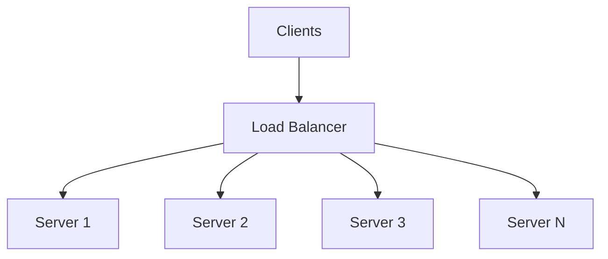
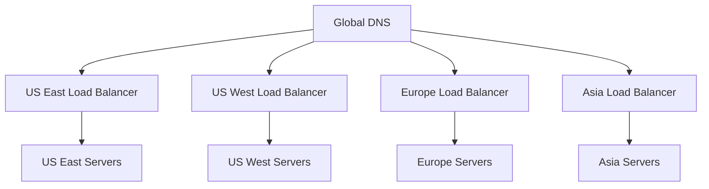
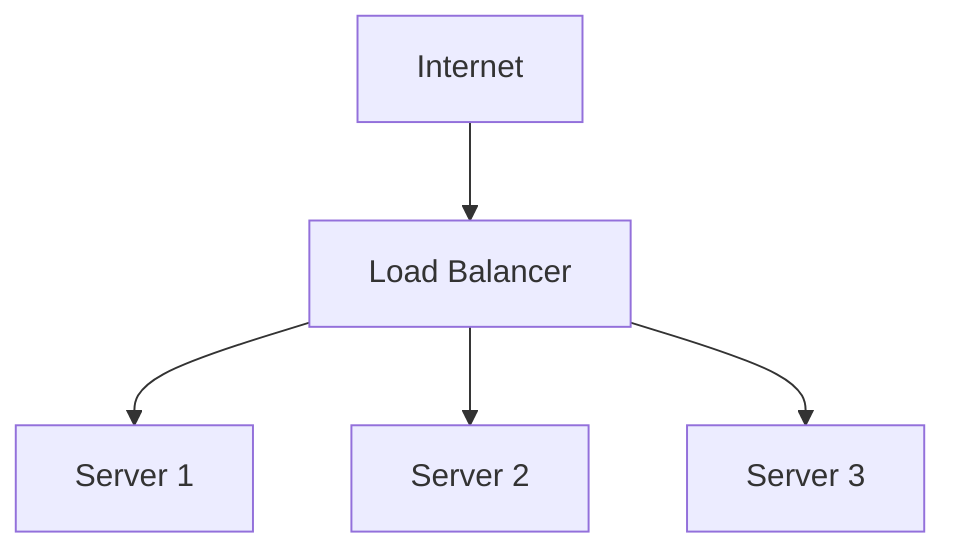
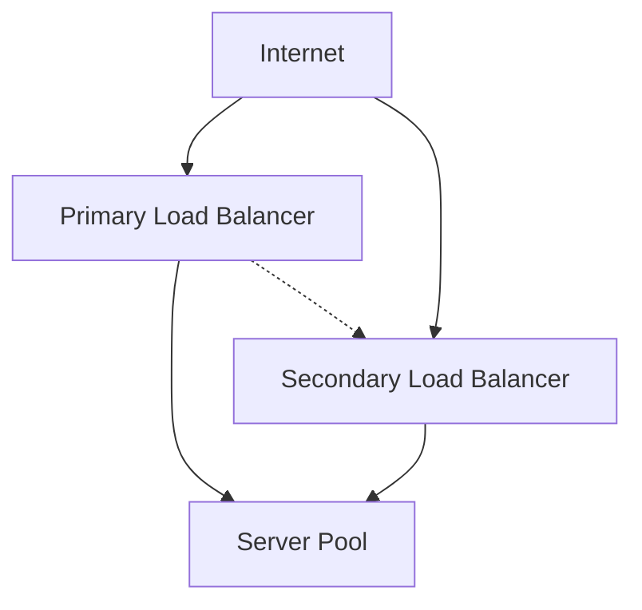
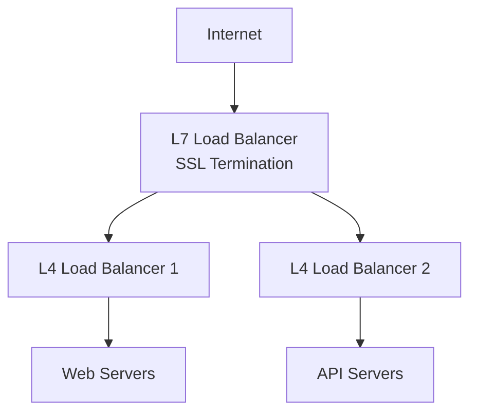

# Load Balancing — Algorithms and Patterns for Traffic Distribution

Load balancing is the practice of distributing incoming network traffic across multiple servers to ensure no single server becomes overwhelmed, improving both performance and reliability.

## What is Load Balancing?

**Definition**: A load balancer acts as a reverse proxy, distributing client requests across multiple backend servers and returning responses from servers back to clients.

**Real-world analogy**: Think of a busy bank with multiple tellers. The queue manager (load balancer) directs customers to available tellers, ensuring no single teller is overwhelmed while others sit idle.



## Why Load Balancing Matters

### Benefits
- **High Availability**: If one server fails, traffic routes to healthy servers
- **Scalability**: Add more servers to handle increased load
- **Performance**: Distribute load to prevent server overload
- **Flexibility**: Perform maintenance without downtime
- **Geographic Distribution**: Route users to nearest servers

### Without Load Balancing
```
Single Server Problems:
❌ Single point of failure
❌ Limited by one server's capacity
❌ No graceful handling of traffic spikes
❌ Difficult maintenance and updates
❌ Poor user experience during outages
```

## Types of Load Balancers

### Layer 4 (Transport Layer) Load Balancing

**How it works**: Makes routing decisions based on IP address and port information without inspecting packet content.

**Characteristics**:
- Fast and efficient (no deep packet inspection)
- Protocol agnostic (works with any TCP/UDP traffic)
- Lower latency and higher throughput
- Cannot make content-based routing decisions

**Use cases**:
- High-performance applications requiring low latency
- Non-HTTP protocols (databases, gaming, IoT)
- Simple load distribution without content awareness

```python
# Example: Layer 4 routing decision
def route_request(client_ip, client_port, destination_port):
    server_pool = get_servers_for_port(destination_port)
    return select_server_round_robin(server_pool)
```

### Layer 7 (Application Layer) Load Balancing

**How it works**: Makes routing decisions based on application-level content (HTTP headers, URLs, cookies).

**Characteristics**:
- Content-aware routing capabilities
- Can modify requests and responses
- SSL termination and compression
- Higher latency due to content inspection
- More CPU intensive

**Use cases**:
- Web applications requiring intelligent routing
- Microservices with different endpoints
- A/B testing and canary deployments
- API gateways and content-based routing

```python
# Example: Layer 7 routing decision
def route_http_request(request):
    if request.path.startswith('/api/v1/'):
        return api_v1_servers
    elif request.path.startswith('/api/v2/'):
        return api_v2_servers
    elif request.headers.get('User-Agent').contains('mobile'):
        return mobile_optimized_servers
    else:
        return default_servers
```

## Load Balancing Algorithms

### Round Robin

**How it works**: Requests are distributed sequentially across all available servers.

```python
class RoundRobinBalancer:
    def __init__(self, servers):
        self.servers = servers
        self.current = 0
    
    def get_server(self):
        server = self.servers[self.current]
        self.current = (self.current + 1) % len(self.servers)
        return server
```

**Pros**:
- Simple to implement and understand
- Equal distribution when requests have similar processing time
- No server state tracking required

**Cons**:
- Doesn't account for server capacity differences
- Poor performance if request processing times vary significantly
- No consideration for current server load

**Best for**: Homogeneous servers with similar request processing patterns.

### Weighted Round Robin

**How it works**: Assigns weights to servers based on their capacity, distributing more requests to higher-capacity servers.

```python
class WeightedRoundRobinBalancer:
    def __init__(self, servers_with_weights):
        self.servers = []
        for server, weight in servers_with_weights:
            self.servers.extend([server] * weight)
        self.current = 0
    
    def get_server(self):
        server = self.servers[self.current]
        self.current = (self.current + 1) % len(self.servers)
        return server
```

**Configuration example**:
```yaml
servers:
  - server: web-1, weight: 3  # High-capacity server
  - server: web-2, weight: 2  # Medium-capacity server  
  - server: web-3, weight: 1  # Lower-capacity server
```

**Best for**: Heterogeneous server environments with different capacities.

### Least Connections

**How it works**: Routes new requests to the server with the fewest active connections.

```python
class LeastConnectionsBalancer:
    def __init__(self, servers):
        self.servers = servers
        self.connections = {server: 0 for server in servers}
    
    def get_server(self):
        return min(self.connections, key=self.connections.get)
    
    def on_request_start(self, server):
        self.connections[server] += 1
    
    def on_request_end(self, server):
        self.connections[server] -= 1
```

**Pros**:
- Adapts to varying request processing times
- Better distribution for long-lived connections
- Considers current server load

**Cons**:
- Requires connection state tracking
- More complex implementation
- May not account for connection processing complexity

**Best for**: Applications with varying request processing times or long-lived connections.

### Weighted Least Connections

**How it works**: Combines least connections with server weights, considering both current load and server capacity.

```python
class WeightedLeastConnectionsBalancer:
    def __init__(self, servers_with_weights):
        self.servers = dict(servers_with_weights)
        self.connections = {server: 0 for server in self.servers}
    
    def get_server(self):
        def connection_ratio(server):
            weight = self.servers[server]
            connections = self.connections[server]
            return connections / weight if weight > 0 else float('inf')
        
        return min(self.servers, key=connection_ratio)
```

**Best for**: Heterogeneous environments with varying request complexities.

### IP Hash

**How it works**: Uses a hash of the client's IP address to determine which server receives the request.

```python
import hashlib

class IPHashBalancer:
    def __init__(self, servers):
        self.servers = servers
    
    def get_server(self, client_ip):
        hash_value = int(hashlib.md5(client_ip.encode()).hexdigest(), 16)
        return self.servers[hash_value % len(self.servers)]
```

**Pros**:
- Session affinity (same client always goes to same server)
- Simple and deterministic
- No state tracking required

**Cons**:
- Uneven distribution if client IPs are not uniformly distributed
- Difficult to handle server failures gracefully
- Not suitable for applications requiring session sharing

**Best for**: Applications requiring session affinity without shared session storage.

### Least Response Time

**How it works**: Routes requests to the server with the lowest average response time and fewest active connections.

```python
class LeastResponseTimeBalancer:
    def __init__(self, servers):
        self.servers = servers
        self.response_times = {server: [] for server in servers}
        self.connections = {server: 0 for server in servers}
    
    def get_server(self):
        def score(server):
            avg_response_time = sum(self.response_times[server]) / len(self.response_times[server]) if self.response_times[server] else 0
            return avg_response_time + self.connections[server]
        
        return min(self.servers, key=score)
    
    def record_response_time(self, server, response_time):
        # Keep only last 100 response times
        self.response_times[server].append(response_time)
        if len(self.response_times[server]) > 100:
            self.response_times[server].pop(0)
```

**Best for**: Performance-critical applications where response time is crucial.

## Advanced Load Balancing Patterns

### Consistent Hashing

**How it works**: Maps both servers and requests to points on a hash ring, providing better distribution and handling of server changes.

```python
import hashlib
import bisect

class ConsistentHashBalancer:
    def __init__(self, servers, virtual_nodes=150):
        self.virtual_nodes = virtual_nodes
        self.ring = {}
        self.sorted_keys = []
        
        for server in servers:
            self.add_server(server)
    
    def _hash(self, key):
        return int(hashlib.md5(key.encode()).hexdigest(), 16)
    
    def add_server(self, server):
        for i in range(self.virtual_nodes):
            virtual_key = f"{server}:{i}"
            hash_value = self._hash(virtual_key)
            self.ring[hash_value] = server
            bisect.insort(self.sorted_keys, hash_value)
    
    def remove_server(self, server):
        for i in range(self.virtual_nodes):
            virtual_key = f"{server}:{i}"
            hash_value = self._hash(virtual_key)
            del self.ring[hash_value]
            self.sorted_keys.remove(hash_value)
    
    def get_server(self, key):
        if not self.ring:
            return None
        
        hash_value = self._hash(key)
        idx = bisect.bisect_right(self.sorted_keys, hash_value)
        if idx == len(self.sorted_keys):
            idx = 0
        
        return self.ring[self.sorted_keys[idx]]
```

**Benefits**:
- Minimal redistribution when servers are added/removed
- Better load distribution than simple hashing
- Handles server failures gracefully

**Use cases**:
- Distributed caching systems
- Database sharding
- CDN content distribution

### Geographic Load Balancing

**How it works**: Routes users to the nearest geographic location based on latency or geographic proximity.



**Implementation strategies**:
- DNS-based routing (GeoDNS)
- Anycast routing
- Latency-based routing
- Active health checks across regions

### Health Checks and Failover

**Active Health Checks**:
```python
import requests
import time
from threading import Thread

class HealthChecker:
    def __init__(self, servers, check_interval=30):
        self.servers = servers
        self.healthy_servers = set(servers)
        self.check_interval = check_interval
        self.start_health_checks()
    
    def check_server_health(self, server):
        try:
            response = requests.get(f"http://{server}/health", timeout=5)
            return response.status_code == 200
        except:
            return False
    
    def health_check_loop(self):
        while True:
            for server in self.servers:
                if self.check_server_health(server):
                    self.healthy_servers.add(server)
                else:
                    self.healthy_servers.discard(server)
            time.sleep(self.check_interval)
    
    def start_health_checks(self):
        thread = Thread(target=self.health_check_loop, daemon=True)
        thread.start()
    
    def get_healthy_servers(self):
        return list(self.healthy_servers)
```

**Passive Health Checks**:
- Monitor response times and error rates
- Remove servers that consistently fail requests
- Implement circuit breaker patterns

### Session Affinity (Sticky Sessions)

**Cookie-based Affinity**:
```python
class StickySessionBalancer:
    def __init__(self, servers):
        self.servers = servers
        self.session_map = {}
    
    def get_server(self, session_id=None):
        if session_id and session_id in self.session_map:
            return self.session_map[session_id]
        
        # New session - assign to least loaded server
        server = self.select_least_loaded_server()
        if session_id:
            self.session_map[session_id] = server
        return server
    
    def remove_session(self, session_id):
        self.session_map.pop(session_id, None)
```

**Considerations**:
- Can lead to uneven load distribution
- Complicates scaling and failover
- Better to use shared session storage when possible

## Load Balancer Deployment Patterns

### Single Load Balancer


**Pros**: Simple, cost-effective
**Cons**: Single point of failure

### High Availability Load Balancers


**Implementation**:
- Active-passive configuration with heartbeat
- Virtual IP (VIP) failover
- Health monitoring between load balancers

### Multi-Tier Load Balancing


**Benefits**:
- Separation of concerns
- Specialized optimization at each layer
- Better scalability and fault isolation

## Cloud Load Balancing Services

### AWS Load Balancers

**Application Load Balancer (ALB)**:
- Layer 7 HTTP/HTTPS load balancing
- Content-based routing
- WebSocket and HTTP/2 support
- Integration with AWS services

**Network Load Balancer (NLB)**:
- Layer 4 TCP/UDP load balancing
- Ultra-high performance and low latency
- Static IP addresses
- Preserves source IP

**Classic Load Balancer (CLB)**:
- Legacy option supporting both Layer 4 and 7
- Basic load balancing features
- Being phased out in favor of ALB/NLB

### Google Cloud Load Balancing

**HTTP(S) Load Balancer**:
- Global load balancing
- Content-based routing
- SSL termination
- CDN integration

**Network Load Balancer**:
- Regional Layer 4 load balancing
- High performance for TCP/UDP traffic
- Preserves source IP

### Azure Load Balancer

**Application Gateway**:
- Layer 7 load balancing
- Web Application Firewall (WAF)
- SSL termination
- URL-based routing

**Load Balancer**:
- Layer 4 load balancing
- High availability and scalability
- Internal and external load balancing

## Performance Optimization

### Connection Pooling
```python
class ConnectionPool:
    def __init__(self, servers, pool_size=10):
        self.servers = servers
        self.pools = {server: [] for server in servers}
        self.pool_size = pool_size
        self.initialize_pools()
    
    def initialize_pools(self):
        for server in self.servers:
            for _ in range(self.pool_size):
                connection = create_connection(server)
                self.pools[server].append(connection)
    
    def get_connection(self, server):
        if self.pools[server]:
            return self.pools[server].pop()
        else:
            return create_connection(server)
    
    def return_connection(self, server, connection):
        if len(self.pools[server]) < self.pool_size:
            self.pools[server].append(connection)
        else:
            connection.close()
```

### Keep-Alive Connections
- Reuse TCP connections for multiple requests
- Reduce connection establishment overhead
- Configure appropriate timeout values

### SSL Termination
```
Benefits of SSL termination at load balancer:
✅ Offload SSL processing from backend servers
✅ Centralized certificate management
✅ Better performance and resource utilization
✅ Simplified backend server configuration
```

## Monitoring and Metrics

### Key Metrics to Track
```
Load Balancer Metrics:
- Request rate and distribution
- Response times (P50, P95, P99)
- Error rates by server
- Active connections per server
- Health check success rates

Server Metrics:
- CPU and memory utilization
- Response times
- Error rates
- Connection counts
- Queue depths
```

### Alerting Strategies
```python
# Example monitoring configuration
monitoring_config = {
    "response_time_threshold": {
        "p95": 500,  # milliseconds
        "p99": 1000
    },
    "error_rate_threshold": 0.01,  # 1%
    "health_check_failures": 3,    # consecutive failures
    "connection_threshold": 0.8    # 80% of max connections
}
```

## Best Practices

### Design Principles
1. **Health checks are critical**: Implement comprehensive health monitoring
2. **Plan for failures**: Design for graceful degradation
3. **Monitor everything**: Track performance and health metrics
4. **Test failover scenarios**: Regularly test failure handling
5. **Optimize for your use case**: Choose algorithms based on traffic patterns

### Configuration Guidelines
```
Performance:
□ Use connection pooling and keep-alive
□ Implement appropriate timeout values
□ Configure SSL termination at load balancer
□ Use compression for text-based content

Reliability:
□ Implement active and passive health checks
□ Configure appropriate retry policies
□ Set up monitoring and alerting
□ Plan for load balancer redundancy

Security:
□ Use SSL/TLS for encrypted communication
□ Implement rate limiting and DDoS protection
□ Configure proper access controls
□ Regular security updates and patches
```

### Common Pitfalls to Avoid
```
❌ Single point of failure with one load balancer
❌ Inadequate health check configuration
❌ Ignoring session affinity implications
❌ Not monitoring backend server health
❌ Misconfigured timeout values
❌ Inadequate capacity planning
```

## Key Takeaways

1. **Choose the right algorithm**: Match load balancing strategy to your traffic patterns
2. **Layer 4 vs Layer 7**: Understand the trade-offs between performance and features
3. **Health checks matter**: Proper health monitoring is crucial for reliability
4. **Plan for scale**: Design load balancing architecture that can grow
5. **Monitor and measure**: Track performance metrics and optimize based on data
6. **Test failure scenarios**: Regularly validate failover and recovery procedures

## Further Reading

- **Books**:
  - "High Performance Load Balancing" by Willy Tarreau
  - "Building Microservices" by Sam Newman
- **Documentation**:
  - HAProxy Configuration Manual
  - NGINX Load Balancing Guide
  - AWS Elastic Load Balancing User Guide
- **Papers**:
  - "The Power of Two Choices in Randomized Load Balancing"
  - "Consistent Hashing and Random Trees"