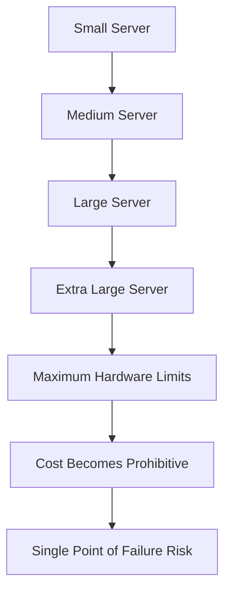
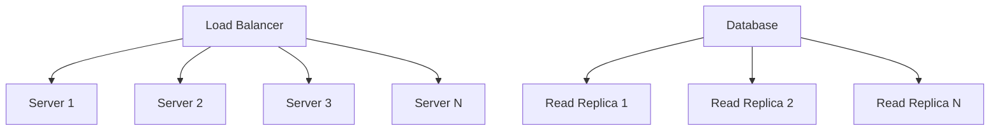
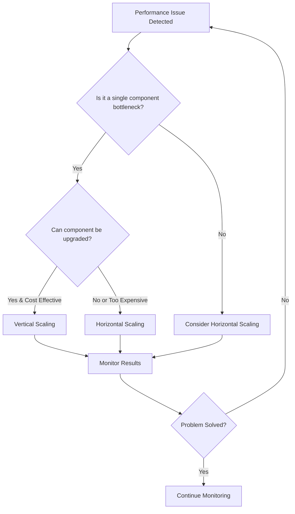
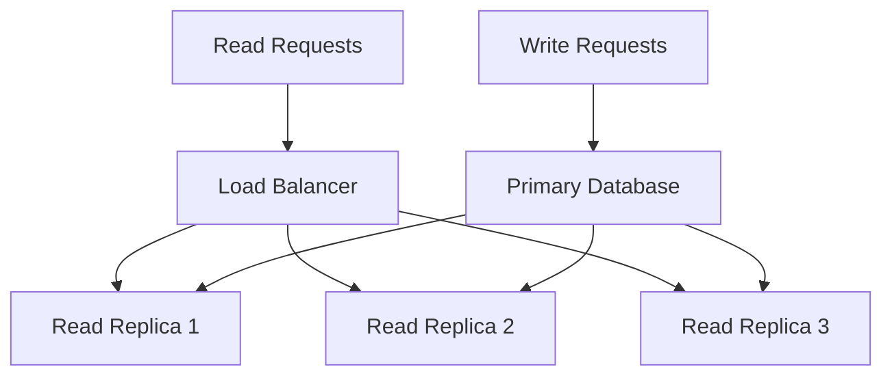
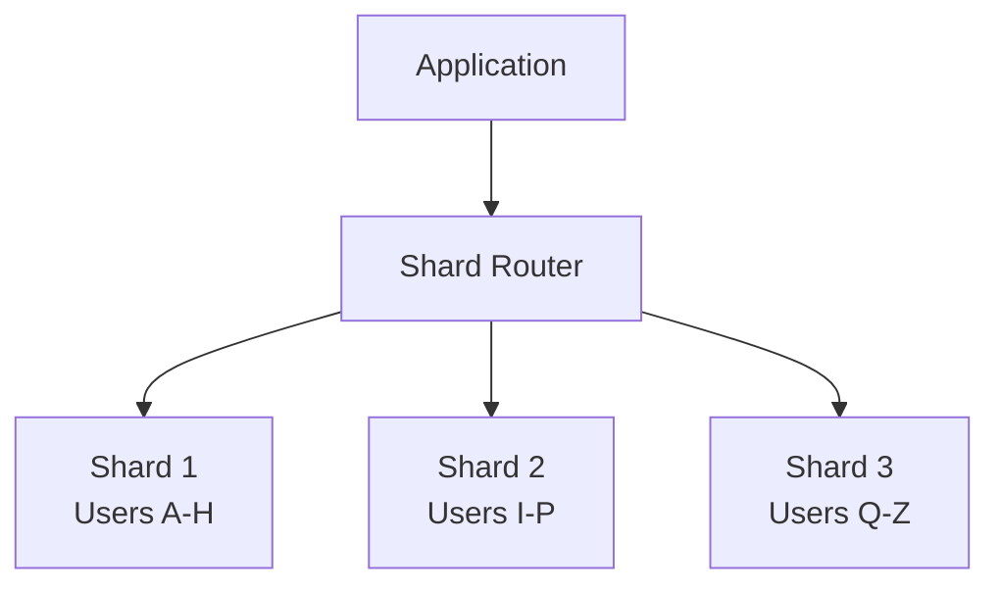
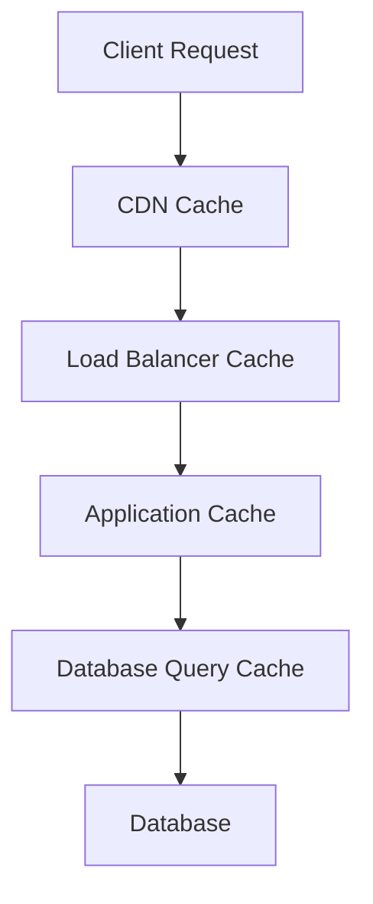

# Scalability — Horizontal vs Vertical Scaling Strategies

Scalability is your system's ability to handle increased load gracefully. Understanding when and how to scale is crucial for building systems that grow with your business.

## What is Scalability?

**Definition**: The capability of a system to handle a growing amount of work by adding resources to the system.

**Real-world analogy**: Think of a restaurant during rush hour. You can either:
- **Vertical scaling**: Get a faster chef (upgrade equipment)
- **Horizontal scaling**: Hire more chefs (add more servers)

## Vertical Scaling (Scale Up)

### What It Means
Adding more power to existing machines - more CPU, RAM, storage, or faster components.

### When to Use Vertical Scaling
```
✅ Good for:
- Early-stage applications with predictable growth
- Applications with tight coupling between components
- Databases that require strong consistency
- When operational simplicity is priority
- Legacy applications not designed for distribution

❌ Avoid when:
- You need unlimited scaling potential
- Cost becomes prohibitive at high scales
- Single point of failure is unacceptable
- You have unpredictable traffic spikes
```

### Vertical Scaling Strategies

**CPU Scaling**:
- Upgrade to faster processors
- Add more CPU cores
- Optimize for single-threaded performance

**Memory Scaling**:
- Add more RAM for larger datasets
- Use faster memory (DDR4 → DDR5)
- Implement better memory management

**Storage Scaling**:
- Upgrade to faster SSDs
- Add more storage capacity
- Use NVMe drives for ultra-low latency

**Network Scaling**:
- Upgrade network interfaces (1Gbps → 10Gbps → 100Gbps)
- Optimize network stack configuration
- Use specialized network hardware

### Vertical Scaling Limits



**Physical Limits**:
- CPU: Limited by semiconductor technology
- Memory: Limited by motherboard slots and cost
- Storage: Limited by physical space and interfaces
- Network: Limited by hardware capabilities

**Economic Limits**:
- Cost increases exponentially with performance
- High-end hardware has premium pricing
- Diminishing returns on investment

**Reliability Limits**:
- Single point of failure
- Longer recovery times during failures
- All eggs in one basket problem

## Horizontal Scaling (Scale Out)

### What It Means
Adding more machines to your pool of resources instead of upgrading existing machines.

### When to Use Horizontal Scaling
```
✅ Good for:
- Web applications with stateless design
- Systems requiring high availability
- Unpredictable or rapidly growing traffic
- Cost-sensitive applications
- Microservices architectures

❌ Challenges with:
- Applications requiring shared state
- Complex distributed system management
- Strong consistency requirements
- Legacy monolithic applications
```

### Horizontal Scaling Strategies

**Load Distribution**:


**Stateless Application Design**:
- Store session data in external stores (Redis, database)
- Use JWT tokens for authentication state
- Implement idempotent operations
- Avoid server-side state storage

**Database Horizontal Scaling**:
- **Read Replicas**: Scale read operations
- **Sharding**: Distribute data across multiple databases
- **Federation**: Split databases by function
- **Denormalization**: Optimize for read performance

### Horizontal Scaling Patterns

**Auto Scaling**:
```python
# Example auto-scaling configuration
auto_scaling_policy = {
    "min_instances": 2,
    "max_instances": 20,
    "target_cpu_utilization": 70,
    "scale_up_cooldown": 300,    # 5 minutes
    "scale_down_cooldown": 600   # 10 minutes
}
```

**Geographic Distribution**:
- Deploy servers in multiple regions
- Use CDN for static content
- Implement regional failover
- Consider data sovereignty laws

**Microservices Scaling**:
- Scale individual services independently
- Use container orchestration (Kubernetes)
- Implement service mesh for communication
- Monitor and scale based on service-specific metrics

## Scaling Decision Framework

### Step 1: Identify Bottlenecks
```
Performance Monitoring Checklist:
□ CPU utilization > 80% consistently
□ Memory usage > 85% consistently  
□ Disk I/O wait times increasing
□ Network bandwidth saturation
□ Database query response times degrading
□ Application response times increasing
```

### Step 2: Choose Scaling Strategy


### Step 3: Implementation Strategy

**For Vertical Scaling**:
1. **Plan maintenance window**: Coordinate with stakeholders
2. **Backup everything**: Ensure data safety
3. **Test in staging**: Validate performance improvements
4. **Monitor closely**: Watch for unexpected issues
5. **Have rollback plan**: Be ready to revert if needed

**For Horizontal Scaling**:
1. **Design for statelessness**: Refactor if necessary
2. **Implement load balancing**: Choose appropriate algorithm
3. **Set up monitoring**: Track distributed system health
4. **Test failure scenarios**: Ensure graceful degradation
5. **Automate scaling**: Implement auto-scaling policies

## Database Scaling Strategies

### Read Scaling with Replicas


**Benefits**:
- Distribute read load across multiple servers
- Improve read performance and availability
- Geographic distribution for lower latency

**Considerations**:
- Eventual consistency between primary and replicas
- Replication lag during high write loads
- Complexity in handling read-after-write scenarios

### Write Scaling with Sharding


**Sharding Strategies**:

**Range-based Sharding**:
```sql
-- Example: Shard by user ID ranges
Shard 1: user_id 1-1000000
Shard 2: user_id 1000001-2000000
Shard 3: user_id 2000001-3000000
```

**Hash-based Sharding**:
```python
def get_shard(user_id, num_shards):
    return hash(user_id) % num_shards
```

**Directory-based Sharding**:
```python
# Lookup table maps keys to shards
shard_directory = {
    "user_123": "shard_1",
    "user_456": "shard_2",
    "user_789": "shard_1"
}
```

## Caching for Scalability

### Multi-Level Caching Strategy


**Cache Levels**:
1. **Browser Cache**: Static assets, API responses
2. **CDN Cache**: Global content distribution
3. **Reverse Proxy Cache**: Nginx, Varnish
4. **Application Cache**: Redis, Memcached
5. **Database Cache**: Query result caching

### Cache Scaling Patterns

**Cache Cluster**:
```python
# Redis Cluster configuration
redis_cluster = {
    "nodes": [
        {"host": "cache-1", "port": 6379},
        {"host": "cache-2", "port": 6379},
        {"host": "cache-3", "port": 6379}
    ],
    "max_connections": 100,
    "retry_on_timeout": True
}
```

**Consistent Hashing**:
- Distribute cache keys evenly across nodes
- Minimize cache invalidation during node changes
- Handle node failures gracefully

## Scaling Challenges and Solutions

### Common Scaling Challenges

**State Management**:
```
Problem: Shared state between application instances
Solutions:
- External session stores (Redis, database)
- Stateless authentication (JWT tokens)
- Event sourcing for state reconstruction
```

**Data Consistency**:
```
Problem: Maintaining consistency across distributed components
Solutions:
- Eventual consistency models
- Distributed transactions (2PC, Saga pattern)
- CQRS (Command Query Responsibility Segregation)
```

**Network Latency**:
```
Problem: Increased latency in distributed systems
Solutions:
- Geographic distribution
- Caching strategies
- Asynchronous processing
- Connection pooling
```

**Operational Complexity**:
```
Problem: Managing distributed systems is complex
Solutions:
- Container orchestration (Kubernetes)
- Service mesh (Istio, Linkerd)
- Comprehensive monitoring and logging
- Infrastructure as Code (Terraform, CloudFormation)
```

### Monitoring Distributed Systems

**Key Metrics to Track**:
```
Application Metrics:
- Request rate and latency
- Error rates and types
- Business-specific KPIs

Infrastructure Metrics:
- CPU, memory, disk, network utilization
- Load balancer health and distribution
- Database performance and replication lag

Distributed System Metrics:
- Service-to-service latency
- Circuit breaker states
- Queue depths and processing times
```

**Distributed Tracing**:
```python
# Example: Tracing a request across services
@trace_request
def process_order(order_id):
    user = user_service.get_user(order.user_id)      # Span 1
    inventory = inventory_service.check(order.items)  # Span 2
    payment = payment_service.charge(order.total)     # Span 3
    return create_order(order_id, user, inventory, payment)
```

## Best Practices for Scalable Systems

### Design Principles
1. **Design for failure**: Assume components will fail
2. **Loose coupling**: Minimize dependencies between components
3. **Idempotency**: Make operations safe to retry
4. **Graceful degradation**: Maintain core functionality during failures
5. **Monitoring first**: Instrument before you need it

### Implementation Guidelines
```
Performance:
□ Use connection pooling for databases
□ Implement caching at multiple levels
□ Optimize database queries and indexes
□ Use asynchronous processing for non-critical operations

Reliability:
□ Implement circuit breakers for external services
□ Use retry logic with exponential backoff
□ Set appropriate timeouts for all operations
□ Plan for graceful shutdown and startup

Scalability:
□ Design stateless applications
□ Use load balancers with health checks
□ Implement auto-scaling policies
□ Monitor and alert on key metrics
```

### Common Anti-Patterns to Avoid
```
❌ Premature optimization without measuring
❌ Ignoring the CAP theorem in distributed systems
❌ Not planning for failure scenarios
❌ Scaling without understanding bottlenecks
❌ Over-engineering for theoretical scale
❌ Neglecting operational complexity
```

## Key Takeaways

1. **Start simple**: Begin with vertical scaling for simplicity
2. **Measure first**: Identify actual bottlenecks before scaling
3. **Plan for horizontal**: Design applications to be stateless from the start
4. **Monitor everything**: Comprehensive observability is crucial
5. **Embrace failure**: Design systems that handle component failures gracefully
6. **Consider costs**: Balance performance needs with economic constraints
7. **Operational readiness**: Ensure your team can manage the complexity

## Further Reading

- **Books**: 
  - "Designing Data-Intensive Applications" by Martin Kleppmann
  - "Building Microservices" by Sam Newman
  - "Site Reliability Engineering" by Google
- **Papers**: 
  - "The Google File System" (GFS)
  - "MapReduce: Simplified Data Processing on Large Clusters"
  - "Dynamo: Amazon's Highly Available Key-value Store"
- **Resources**:
  - AWS Well-Architected Framework
  - Google Cloud Architecture Center
  - Netflix Technology Blog