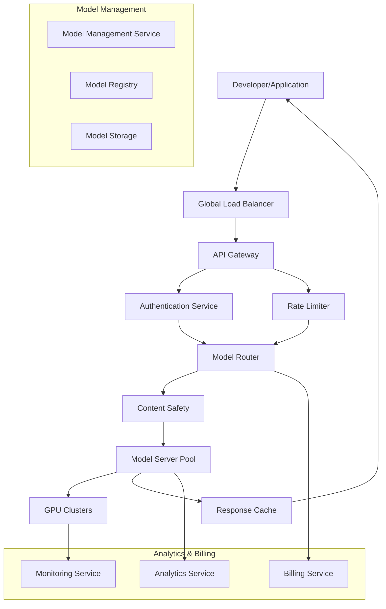

# LLM Serving Platform - Complete Solution

## System Overview

This document provides a comprehensive walkthrough of the LLM serving platform design, explaining how all components work together to deliver a scalable, reliable, and cost-effective AI inference service capable of handling 100+ million API requests daily across 50+ model variants while managing 10,000+ GPUs globally.

## Architecture Walkthrough

### High-Level System Flow



## Core System Flows

### 1. API Request Processing Flow

The complete flow from API request to response involves multiple stages of processing, optimization, and monitoring:

```python
class APIRequestProcessor:
    def __init__(self):
        self.auth_service = AuthenticationService()
        self.rate_limiter = RateLimiter()
        self.content_safety = ContentSafetyService()
        self.model_router = ModelRouter()
        self.response_cache = ResponseCache()
        self.analytics = AnalyticsService()
        self.billing = BillingService()
    
    async def process_request(self, request):
        """Complete API request processing pipeline"""
        
        # Step 1: Authentication and authorization
        auth_result = await self.auth_service.authenticate(request.headers.get('Authorization'))
        if not auth_result.valid:
            return self.create_error_response(401, "Invalid API key")
        
        # Step 2: Rate limiting check
        rate_limit_result = await self.rate_limiter.check_limits(
            auth_result.api_key_id, 
            request.model_id,
            request.estimated_tokens
        )
        if rate_limit_result.exceeded:
            return self.create_error_response(429, "Rate limit exceeded", rate_limit_result.headers)
        
        # Step 3: Content safety screening
        safety_result = await self.content_safety.screen_content(
            request.prompt or request.messages,
            auth_result.organization_id
        )
        if safety_result.blocked:
            await self.analytics.log_blocked_request(request, safety_result.reason)
            return self.create_error_response(400, "Content policy violation")
        
        # Step 4: Check response cache
        cache_key = self.generate_cache_key(request)
        cached_response = await self.response_cache.get(cache_key)
        if cached_response and request.stream is False:
            await self.billing.record_cached_request(auth_result.organization_id, request)
            return cached_response
        
        # Step 5: Route to optimal model server
        routing_result = await self.model_router.route_request(
            request, auth_result.organization_id
        )
        if not routing_result.success:
            return self.create_error_response(503, "Service temporarily unavailable")
        
        # Step 6: Execute inference
        inference_start_time = time.time()
        try:
            inference_result = await self.execute_inference(
                request, routing_result.server_endpoint
            )
            
            processing_time_ms = (time.time() - inference_start_time) * 1000
            
            # Step 7: Cache response if appropriate
            if not request.stream and inference_result.cacheable:
                await self.response_cache.set(
                    cache_key, inference_result.response, ttl=3600
                )
            
            # Step 8: Record usage and billing
            await self.billing.record_usage(
                auth_result.organization_id,
                request.model_id,
                inference_result.usage.prompt_tokens,
                inference_result.usage.completion_tokens,
                processing_time_ms
            )
            
            # Step 9: Log analytics
            await self.analytics.log_successful_request(
                request, inference_result, processing_time_ms
            )
            
            return inference_result.response
            
        except Exception as e:
            await self.analytics.log_failed_request(request, str(e))
            return self.create_error_response(500, "Internal server error")
```

### 2. Model Deployment and Management Flow

The platform manages multiple model variants with dynamic loading and optimization:

```python
class ModelDeploymentManager:
    def __init__(self):
        self.gpu_cluster_manager = GPUClusterManager()
        self.model_optimizer = ModelOptimizer()
        self.deployment_orchestrator = DeploymentOrchestrator()
        self.health_monitor = ModelHealthMonitor()
    
    async def deploy_model(self, model_config):
        """Deploy a new model or model version"""
        
        # Step 1: Validate model configuration
        validation_result = await self.validate_model_config(model_config)
        if not validation_result.valid:
            raise ValueError(f"Invalid model config: {validation_result.errors}")
        
        # Step 2: Optimize model for deployment
        optimization_result = await self.model_optimizer.optimize_model(
            model_config.model_id,
            model_config.target_latency_ms,
            model_config.target_throughput
        )
        
        # Step 3: Allocate GPU resources
        gpu_allocation = await self.gpu_cluster_manager.allocate_resources(
            model_config.model_id,
            optimization_result.gpu_requirements,
            model_config.target_regions
        )
        
        if not gpu_allocation.success:
            raise ResourceError("Insufficient GPU resources available")
        
        # Step 4: Deploy model to allocated GPUs
        deployment_tasks = []
        for region, gpu_allocation in gpu_allocation.regional_allocations.items():
            task = self.deployment_orchestrator.deploy_to_region(
                model_config,
                optimization_result,
                region,
                gpu_allocation
            )
            deployment_tasks.append(task)
        
        deployment_results = await asyncio.gather(*deployment_tasks)
        
        # Step 5: Health check and validation
        health_checks = []
        for result in deployment_results:
            if result.success:
                health_check = self.health_monitor.validate_deployment(
                    result.deployment_id,
                    model_config.validation_prompts
                )
                health_checks.append(health_check)
        
        health_results = await asyncio.gather(*health_checks)
        
        # Step 6: Update model registry and routing
        if all(result.healthy for result in health_results):
            await self.update_model_registry(model_config, deployment_results)
            await self.update_routing_table(model_config, deployment_results)
            
            return {
                'status': 'deployed',
                'model_id': model_config.model_id,
                'version': model_config.version,
                'deployments': deployment_results,
                'estimated_capacity': sum(r.capacity for r in deployment_results)
            }
        else:
            # Rollback failed deployments
            await self.rollback_deployments(deployment_results)
            raise DeploymentError("Model deployment failed health checks")
```

### 3. GPU Resource Management Flow

Efficient GPU resource management is critical for cost optimization and performance:

```python
class GPUResourceManager:
    def __init__(self):
        self.cluster_monitor = GPUClusterMonitor()
        self.workload_scheduler = WorkloadScheduler()
        self.cost_optimizer = CostOptimizer()
        self.auto_scaler = AutoScaler()
    
    async def manage_gpu_resources(self):
        """Continuous GPU resource management loop"""
        
        while True:
            try:
                # Step 1: Collect current resource metrics
                resource_metrics = await self.cluster_monitor.collect_metrics()
                
                # Step 2: Analyze workload patterns
                workload_analysis = await self.workload_scheduler.analyze_workloads(
                    resource_metrics
                )
                
                # Step 3: Optimize resource allocation
                optimization_plan = await self.cost_optimizer.generate_optimization_plan(
                    resource_metrics, workload_analysis
                )
                
                # Step 4: Execute optimization actions
                if optimization_plan.actions:
                    await self.execute_optimization_actions(optimization_plan.actions)
                
                # Step 5: Auto-scaling decisions
                scaling_decisions = await self.auto_scaler.evaluate_scaling_needs(
                    resource_metrics, workload_analysis
                )
                
                if scaling_decisions:
                    await self.execute_scaling_actions(scaling_decisions)
                
                # Step 6: Update resource allocation
                await self.update_resource_allocation(resource_metrics)
                
                # Wait before next iteration
                await asyncio.sleep(60)  # Run every minute
                
            except Exception as e:
                logger.error(f"Error in GPU resource management: {e}")
                await asyncio.sleep(30)  # Shorter wait on error
    
    async def execute_optimization_actions(self, actions):
        """Execute GPU optimization actions"""
        
        for action in actions:
            if action.type == 'migrate_workload':
                await self.migrate_workload(
                    action.workload_id,
                    action.source_gpu,
                    action.target_gpu
                )
            
            elif action.type == 'consolidate_models':
                await self.consolidate_models(
                    action.model_ids,
                    action.target_gpus
                )
            
            elif action.type == 'switch_to_spot':
                await self.switch_to_spot_instances(
                    action.gpu_ids,
                    action.spot_configuration
                )
            
            elif action.type == 'resize_allocation':
                await self.resize_gpu_allocation(
                    action.model_id,
                    action.new_gpu_count
                )
```

### 4. Intelligent Request Batching

Batching optimization significantly improves throughput and reduces costs:

```python
class IntelligentBatcher:
    def __init__(self):
        self.batch_optimizer = BatchOptimizer()
        self.request_queue = RequestQueue()
        self.batch_executor = BatchExecutor()
        self.latency_predictor = LatencyPredictor()
    
    async def process_request_batches(self, model_id):
        """Continuously process request batches for a specific model"""
        
        while True:
            try:
                # Step 1: Collect pending requests
                pending_requests = await self.request_queue.get_pending_requests(
                    model_id, max_age_ms=100
                )
                
                if not pending_requests:
                    await asyncio.sleep(0.01)  # 10ms wait
                    continue
                
                # Step 2: Create optimal batches
                batches = await self.batch_optimizer.create_batches(
                    pending_requests, model_id
                )
                
                # Step 3: Execute batches in parallel
                batch_tasks = []
                for batch in batches:
                    # Predict batch execution time
                    predicted_latency = await self.latency_predictor.predict_batch_latency(
                        batch, model_id
                    )
                    
                    # Execute batch
                    task = self.batch_executor.execute_batch(
                        batch, model_id, predicted_latency
                    )
                    batch_tasks.append(task)
                
                # Step 4: Wait for batch completion
                batch_results = await asyncio.gather(*batch_tasks)
                
                # Step 5: Distribute results to individual requests
                await self.distribute_batch_results(batch_results)
                
            except Exception as e:
                logger.error(f"Error in batch processing for {model_id}: {e}")
                await asyncio.sleep(0.1)
    
    async def create_dynamic_batch(self, requests, model_constraints):
        """Create dynamically sized batch based on model constraints"""
        
        # Sort requests by priority and arrival time
        sorted_requests = sorted(
            requests, 
            key=lambda r: (r.priority, r.arrival_time)
        )
        
        batch = []
        total_tokens = 0
        max_sequence_length = 0
        
        for request in sorted_requests:
            request_tokens = request.estimated_input_tokens + request.max_output_tokens
            request_seq_length = request.estimated_input_tokens
            
            # Check if adding this request exceeds constraints
            new_total_tokens = total_tokens + request_tokens
            new_max_seq_length = max(max_sequence_length, request_seq_length)
            
            if (len(batch) >= model_constraints.max_batch_size or
                new_total_tokens > model_constraints.max_tokens_per_batch or
                new_max_seq_length > model_constraints.max_sequence_length):
                break
            
            batch.append(request)
            total_tokens = new_total_tokens
            max_sequence_length = new_max_seq_length
        
        return {
            'requests': batch,
            'total_tokens': total_tokens,
            'max_sequence_length': max_sequence_length,
            'estimated_memory_gb': self.estimate_memory_usage(
                len(batch), max_sequence_length, model_constraints.model_size
            )
        }
```

### 5. Cost Optimization and Billing

Comprehensive cost tracking and optimization across the entire platform:

```python
class CostOptimizationEngine:
    def __init__(self):
        self.usage_tracker = UsageTracker()
        self.cost_calculator = CostCalculator()
        self.billing_engine = BillingEngine()
        self.optimization_analyzer = OptimizationAnalyzer()
    
    async def optimize_platform_costs(self):
        """Comprehensive cost optimization across the platform"""
        
        # Step 1: Analyze current costs
        cost_analysis = await self.analyze_current_costs()
        
        # Step 2: Identify optimization opportunities
        optimization_opportunities = await self.identify_optimization_opportunities(
            cost_analysis
        )
        
        # Step 3: Prioritize optimizations by impact
        prioritized_optimizations = self.prioritize_optimizations(
            optimization_opportunities
        )
        
        # Step 4: Execute high-impact optimizations
        optimization_results = []
        for optimization in prioritized_optimizations[:10]:  # Top 10
            if optimization.estimated_savings > 1000:  # $1000+ monthly savings
                result = await self.execute_optimization(optimization)
                optimization_results.append(result)
        
        # Step 5: Update billing and pricing
        await self.update_customer_billing(optimization_results)
        
        return {
            'total_monthly_savings': sum(r.actual_savings for r in optimization_results),
            'optimizations_executed': len(optimization_results),
            'next_review_date': datetime.utcnow() + timedelta(days=7)
        }
    
    async def calculate_request_cost(self, request, inference_result):
        """Calculate the true cost of serving a request"""
        
        # GPU compute cost
        gpu_cost = self.calculate_gpu_cost(
            inference_result.gpu_type,
            inference_result.processing_time_ms,
            inference_result.gpu_utilization
        )
        
        # Infrastructure overhead cost
        infrastructure_cost = self.calculate_infrastructure_cost(
            request.region,
            inference_result.data_transfer_bytes
        )
        
        # Model loading cost (amortized)
        model_loading_cost = self.calculate_model_loading_cost(
            request.model_id,
            inference_result.model_cache_hit
        )
        
        # Safety and moderation cost
        safety_cost = self.calculate_safety_cost(
            request.input_tokens,
            inference_result.safety_checks_performed
        )
        
        total_cost = (
            gpu_cost + 
            infrastructure_cost + 
            model_loading_cost + 
            safety_cost
        )
        
        return {
            'total_cost_usd': total_cost,
            'breakdown': {
                'gpu_compute': gpu_cost,
                'infrastructure': infrastructure_cost,
                'model_loading': model_loading_cost,
                'safety_moderation': safety_cost
            },
            'cost_per_input_token': total_cost / request.input_tokens,
            'cost_per_output_token': total_cost / inference_result.output_tokens
        }
```

## Advanced Features Implementation

### 1. Multi-Model Serving Optimization

The platform optimizes serving multiple models simultaneously:

```python
class MultiModelOptimizer:
    def __init__(self):
        self.model_scheduler = ModelScheduler()
        self.memory_manager = GPUMemoryManager()
        self.load_balancer = ModelLoadBalancer()
    
    async def optimize_multi_model_serving(self, active_models):
        """Optimize serving multiple models on shared GPU infrastructure"""
        
        # Step 1: Analyze model compatibility
        compatibility_matrix = await self.analyze_model_compatibility(active_models)
        
        # Step 2: Create optimal model groups
        model_groups = await self.create_optimal_model_groups(
            active_models, compatibility_matrix
        )
        
        # Step 3: Allocate GPU resources to groups
        resource_allocation = await self.allocate_resources_to_groups(model_groups)
        
        # Step 4: Implement dynamic model swapping
        swapping_strategy = await self.create_model_swapping_strategy(
            model_groups, resource_allocation
        )
        
        return {
            'model_groups': model_groups,
            'resource_allocation': resource_allocation,
            'swapping_strategy': swapping_strategy,
            'estimated_efficiency_gain': self.calculate_efficiency_gain(
                active_models, model_groups
            )
        }
```

### 2. Predictive Scaling

Advanced demand prediction and proactive scaling:

```python
class PredictiveScalingEngine:
    def __init__(self):
        self.demand_predictor = DemandPredictor()
        self.capacity_planner = CapacityPlanner()
        self.scaling_executor = ScalingExecutor()
    
    async def predict_and_scale(self, time_horizon_hours=4):
        """Predict demand and proactively scale infrastructure"""
        
        # Step 1: Predict demand for each model
        demand_predictions = {}
        for model_id in self.get_active_models():
            prediction = await self.demand_predictor.predict_demand(
                model_id, time_horizon_hours
            )
            demand_predictions[model_id] = prediction
        
        # Step 2: Calculate required capacity
        capacity_requirements = await self.capacity_planner.calculate_requirements(
            demand_predictions
        )
        
        # Step 3: Compare with current capacity
        current_capacity = await self.get_current_capacity()
        capacity_gap = self.calculate_capacity_gap(
            capacity_requirements, current_capacity
        )
        
        # Step 4: Execute scaling actions
        if capacity_gap.requires_scaling:
            scaling_plan = await self.create_scaling_plan(capacity_gap)
            scaling_results = await self.scaling_executor.execute_plan(scaling_plan)
            
            return {
                'scaling_executed': True,
                'scaling_results': scaling_results,
                'predicted_demand': demand_predictions,
                'capacity_added': scaling_plan.total_capacity_added
            }
        
        return {
            'scaling_executed': False,
            'predicted_demand': demand_predictions,
            'current_capacity_sufficient': True
        }
```

## Performance Optimizations

### 1. Response Caching Strategy

Intelligent caching to reduce compute costs and improve latency:

```python
class IntelligentCacheManager:
    def __init__(self):
        self.cache_analyzer = CacheAnalyzer()
        self.cache_storage = DistributedCacheStorage()
        self.cache_policies = CachePolicyManager()
    
    async def manage_response_cache(self):
        """Intelligent response caching management"""
        
        # Step 1: Analyze cache performance
        cache_metrics = await self.cache_analyzer.analyze_performance()
        
        # Step 2: Identify cacheable patterns
        cacheable_patterns = await self.identify_cacheable_patterns(cache_metrics)
        
        # Step 3: Update cache policies
        for pattern in cacheable_patterns:
            if pattern.cache_hit_potential > 0.3:  # 30% hit rate potential
                await self.cache_policies.create_cache_policy(
                    pattern.request_signature,
                    ttl=pattern.optimal_ttl,
                    priority=pattern.priority
                )
        
        # Step 4: Optimize cache storage
        await self.optimize_cache_storage(cache_metrics)
        
        return {
            'cache_hit_rate': cache_metrics.overall_hit_rate,
            'new_policies_created': len(cacheable_patterns),
            'estimated_cost_savings': self.calculate_cache_savings(cache_metrics)
        }
```

### 2. Model Quantization and Optimization

Dynamic model optimization based on usage patterns:

```python
class ModelOptimizationEngine:
    def __init__(self):
        self.quantizer = ModelQuantizer()
        self.pruner = ModelPruner()
        self.distiller = ModelDistiller()
        self.performance_analyzer = ModelPerformanceAnalyzer()
    
    async def optimize_model_for_deployment(self, model_id, optimization_targets):
        """Optimize model based on deployment requirements"""
        
        # Step 1: Analyze current model performance
        baseline_performance = await self.performance_analyzer.analyze_model(model_id)
        
        # Step 2: Apply quantization if memory-constrained
        if optimization_targets.memory_constraint:
            quantized_model = await self.quantizer.quantize_model(
                model_id, 
                target_precision=optimization_targets.precision
            )
            quantized_performance = await self.performance_analyzer.analyze_model(
                quantized_model.model_id
            )
            
            if self.meets_performance_requirements(
                quantized_performance, optimization_targets
            ):
                return quantized_model
        
        # Step 3: Apply pruning if latency-constrained
        if optimization_targets.latency_constraint:
            pruned_model = await self.pruner.prune_model(
                model_id,
                target_sparsity=optimization_targets.sparsity
            )
            pruned_performance = await self.performance_analyzer.analyze_model(
                pruned_model.model_id
            )
            
            if self.meets_performance_requirements(
                pruned_performance, optimization_targets
            ):
                return pruned_model
        
        # Step 4: Knowledge distillation for smaller models
        if optimization_targets.size_constraint:
            distilled_model = await self.distiller.distill_model(
                model_id,
                target_size=optimization_targets.target_size
            )
            return distilled_model
        
        return baseline_performance
```

## Security and Compliance

### Content Safety and Moderation

Comprehensive content safety pipeline:

```python
class ContentSafetyPipeline:
    def __init__(self):
        self.ai_moderator = AIModerationService()
        self.human_reviewer = HumanReviewService()
        self.policy_engine = PolicyEngine()
        self.audit_logger = AuditLogger()
    
    async def screen_content(self, content, organization_id):
        """Comprehensive content safety screening"""
        
        # Step 1: AI-based content analysis
        ai_analysis = await self.ai_moderator.analyze_content(content)
        
        # Step 2: Apply organization-specific policies
        policy_result = await self.policy_engine.evaluate_content(
            content, ai_analysis, organization_id
        )
        
        # Step 3: Human review for uncertain cases
        if policy_result.requires_human_review:
            human_review = await self.human_reviewer.queue_for_review(
                content, ai_analysis, policy_result
            )
            final_decision = human_review.decision
        else:
            final_decision = policy_result.decision
        
        # Step 4: Log audit trail
        await self.audit_logger.log_content_screening(
            content, ai_analysis, policy_result, final_decision
        )
        
        return {
            'allowed': final_decision.allowed,
            'confidence': final_decision.confidence,
            'violations': final_decision.violations,
            'review_id': final_decision.review_id
        }
```

## Conclusion

This LLM serving platform solution demonstrates how to build a comprehensive AI inference service that handles:

1. **Massive Scale**: 100+ million daily requests across 50+ models
2. **Cost Efficiency**: Intelligent GPU resource management and optimization
3. **High Performance**: Sub-2-second response times with intelligent batching
4. **Global Deployment**: Multi-region architecture with optimal routing
5. **Advanced Features**: Predictive scaling, multi-model optimization, intelligent caching
6. **Security & Compliance**: Comprehensive content safety and audit trails
7. **Operational Excellence**: Real-time monitoring, auto-scaling, and cost optimization

The architecture leverages modern cloud infrastructure, advanced ML techniques, and intelligent resource management to deliver a world-class LLM serving platform that can compete with industry leaders while maintaining cost efficiency and reliability at massive scale.