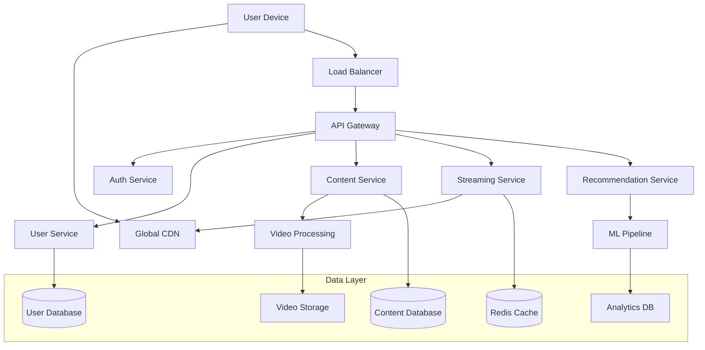

# Netflix Streaming System - Complete Solution

## System Overview

This document provides a comprehensive walkthrough of the Netflix streaming system design, explaining how all components work together to deliver a seamless video streaming experience to 200+ million users globally.

## Architecture Walkthrough

### High-Level Architecture Flow



### Request Flow Analysis

#### 1. User Authentication Flow
```python
# Authentication sequence
def authenticate_user(email, password):
    # 1. User submits credentials
    user_credentials = {
        'email': email,
        'password': password
    }
    
    # 2. Load balancer routes to API Gateway
    # 3. API Gateway forwards to Auth Service
    auth_response = auth_service.validate_credentials(user_credentials)
    
    if auth_response.valid:
        # 4. Generate JWT token
        jwt_token = jwt.encode({
            'user_id': auth_response.user_id,
            'subscription_tier': auth_response.subscription_tier,
            'exp': datetime.utcnow() + timedelta(hours=24)
        }, SECRET_KEY)
        
        # 5. Cache session in Redis
        redis_client.setex(
            f"session:{jwt_token}", 
            86400,  # 24 hours
            json.dumps(auth_response.user_data)
        )
        
        return {
            'access_token': jwt_token,
            'user': auth_response.user_data
        }
    
    return {'error': 'Invalid credentials'}
```

#### 2. Content Discovery Flow
```python
# Content browsing and search
def get_personalized_homepage(user_id, profile_id):
    # 1. Check cache for recommendations
    cache_key = f"homepage:{profile_id}"
    cached_content = redis_client.get(cache_key)
    
    if cached_content:
        return json.loads(cached_content)
    
    # 2. Get user viewing history
    viewing_history = user_service.get_viewing_history(profile_id)
    
    # 3. Get personalized recommendations
    recommendations = recommendation_service.get_recommendations(
        profile_id, 
        viewing_history
    )
    
    # 4. Get trending content
    trending = content_service.get_trending_content(
        user_region=get_user_region(user_id)
    )
    
    # 5. Combine and format response
    homepage_data = {
        'recommendations': recommendations,
        'trending': trending,
        'continue_watching': get_continue_watching(profile_id),
        'new_releases': content_service.get_new_releases()
    }
    
    # 6. Cache for 15 minutes
    redis_client.setex(cache_key, 900, json.dumps(homepage_data))
    
    return homepage_data
```

#### 3. Video Streaming Flow
```python
# Video playback initiation
def start_video_stream(content_id, profile_id, device_type):
    # 1. Validate user access
    if not validate_content_access(profile_id, content_id):
        return {'error': 'Access denied'}
    
    # 2. Get video assets
    video_assets = content_service.get_video_assets(content_id)
    
    # 3. Select appropriate quality based on device
    selected_quality = select_initial_quality(device_type)
    
    # 4. Generate streaming manifest
    manifest = generate_streaming_manifest(
        content_id, 
        video_assets, 
        selected_quality
    )
    
    # 5. Create streaming session
    session_id = str(uuid.uuid4())
    streaming_session = {
        'session_id': session_id,
        'profile_id': profile_id,
        'content_id': content_id,
        'start_time': datetime.utcnow(),
        'device_type': device_type,
        'current_quality': selected_quality
    }
    
    # 6. Cache streaming session
    redis_client.setex(
        f"streaming:{session_id}", 
        14400,  # 4 hours
        json.dumps(streaming_session)
    )
    
    # 7. Log analytics event
    analytics_service.log_event({
        'event_type': 'video_start',
        'profile_id': profile_id,
        'content_id': content_id,
        'session_id': session_id,
        'timestamp': datetime.utcnow()
    })
    
    return {
        'manifest_url': manifest['url'],
        'session_id': session_id,
        'drm_license_url': manifest['drm_url']
    }

def generate_streaming_manifest(content_id, video_assets, initial_quality):
    # HLS manifest generation
    manifest_content = "#EXTM3U\n#EXT-X-VERSION:3\n"
    
    # Add quality variants
    for asset in video_assets:
        if asset['asset_type'] == 'video':
            manifest_content += f"""
#EXT-X-STREAM-INF:BANDWIDTH={asset['bitrate']},RESOLUTION={asset['resolution']}
{asset['cdn_url']}
"""
    
    # Upload manifest to CDN
    manifest_url = cdn_service.upload_manifest(content_id, manifest_content)
    
    return {
        'url': manifest_url,
        'drm_url': f"https://drm.netflix.com/license/{content_id}"
    }
```

## Core Components Deep Dive

### 1. Content Delivery Network (CDN)

#### CDN Architecture
```python
class CDNManager:
    def __init__(self):
        self.edge_locations = [
            {'region': 'us-east', 'capacity': '10TB', 'servers': 50},
            {'region': 'eu-west', 'capacity': '8TB', 'servers': 40},
            {'region': 'ap-southeast', 'capacity': '6TB', 'servers': 30}
        ]
        self.cache_policies = {
            'video': {'ttl': 604800, 'priority': 'high'},  # 7 days
            'thumbnails': {'ttl': 2592000, 'priority': 'medium'},  # 30 days
            'metadata': {'ttl': 3600, 'priority': 'low'}  # 1 hour
        }
    
    def route_request(self, user_location, content_id):
        # Find nearest edge location
        nearest_edge = self.find_nearest_edge(user_location)
        
        # Check if content is cached
        if self.is_cached(nearest_edge, content_id):
            return f"https://{nearest_edge}.cdn.netflix.com/{content_id}"
        
        # Route to origin server
        origin_url = self.get_origin_url(content_id)
        
        # Initiate cache warming
        self.warm_cache(nearest_edge, content_id, origin_url)
        
        return origin_url
    
    def warm_cache(self, edge_location, content_id, origin_url):
        # Asynchronously fetch and cache content
        cache_task = {
            'edge_location': edge_location,
            'content_id': content_id,
            'origin_url': origin_url,
            'priority': self.get_content_priority(content_id)
        }
        
        # Add to cache warming queue
        self.cache_queue.put(cache_task)
```

### 2. Recommendation Engine

#### Machine Learning Pipeline
```python
class RecommendationEngine:
    def __init__(self):
        self.collaborative_filter = CollaborativeFilteringModel()
        self.content_based_filter = ContentBasedModel()
        self.deep_learning_model = DeepLearningModel()
        
    def generate_recommendations(self, profile_id, num_recommendations=20):
        # Get user profile and history
        user_profile = self.get_user_profile(profile_id)
        viewing_history = self.get_viewing_history(profile_id)
        
        # Generate recommendations from different models
        collab_recs = self.collaborative_filter.predict(
            user_profile, 
            viewing_history
        )
        
        content_recs = self.content_based_filter.predict(
            viewing_history
        )
        
        dl_recs = self.deep_learning_model.predict(
            user_profile, 
            viewing_history
        )
        
        # Ensemble predictions
        final_recommendations = self.ensemble_predictions([
            {'predictions': collab_recs, 'weight': 0.4},
            {'predictions': content_recs, 'weight': 0.3},
            {'predictions': dl_recs, 'weight': 0.3}
        ])
        
        # Apply business rules and filters
        filtered_recs = self.apply_business_rules(
            final_recommendations, 
            user_profile
        )
        
        return filtered_recs[:num_recommendations]
    
    def ensemble_predictions(self, model_predictions):
        # Weighted ensemble of different models
        combined_scores = {}
        
        for model in model_predictions:
            weight = model['weight']
            for content_id, score in model['predictions'].items():
                if content_id not in combined_scores:
                    combined_scores[content_id] = 0
                combined_scores[content_id] += score * weight
        
        # Sort by combined score
        sorted_recommendations = sorted(
            combined_scores.items(), 
            key=lambda x: x[1], 
            reverse=True
        )
        
        return [{'content_id': cid, 'score': score} 
                for cid, score in sorted_recommendations]
```

### 3. Video Processing Pipeline

#### Encoding and Transcoding
```python
class VideoProcessingPipeline:
    def __init__(self):
        self.encoding_queue = Queue()
        self.processing_workers = 10
        self.output_formats = [
            {'quality': '480p', 'bitrate': '1000k', 'codec': 'h264'},
            {'quality': '720p', 'bitrate': '2500k', 'codec': 'h264'},
            {'quality': '1080p', 'bitrate': '5000k', 'codec': 'h264'},
            {'quality': '4K', 'bitrate': '15000k', 'codec': 'h265'}
        ]
    
    def process_video(self, video_file, content_id):
        # 1. Validate video file
        if not self.validate_video(video_file):
            raise ValueError("Invalid video file")
        
        # 2. Extract metadata
        metadata = self.extract_metadata(video_file)
        
        # 3. Generate thumbnails
        thumbnails = self.generate_thumbnails(video_file, content_id)
        
        # 4. Encode multiple qualities
        encoded_videos = []
        for format_config in self.output_formats:
            encoded_video = self.encode_video(
                video_file, 
                format_config, 
                content_id
            )
            encoded_videos.append(encoded_video)
        
        # 5. Upload to storage
        storage_urls = self.upload_to_storage(encoded_videos, content_id)
        
        # 6. Update content database
        self.update_content_assets(content_id, storage_urls, metadata)
        
        # 7. Distribute to CDN
        self.distribute_to_cdn(storage_urls)
        
        return {
            'content_id': content_id,
            'status': 'completed',
            'assets': storage_urls
        }
    
    def encode_video(self, input_file, format_config, content_id):
        output_file = f"{content_id}_{format_config['quality']}.mp4"
        
        # FFmpeg encoding command
        cmd = [
            'ffmpeg', '-i', input_file,
            '-c:v', format_config['codec'],
            '-b:v', format_config['bitrate'],
            '-c:a', 'aac', '-b:a', '128k',
            '-f', 'mp4',
            output_file
        ]
        
        # Execute encoding
        result = subprocess.run(cmd, capture_output=True, text=True)
        
        if result.returncode != 0:
            raise Exception(f"Encoding failed: {result.stderr}")
        
        return output_file
```

### 4. Analytics and Monitoring

#### Real-time Analytics
```python
class AnalyticsProcessor:
    def __init__(self):
        self.kafka_consumer = KafkaConsumer(
            'user_events',
            bootstrap_servers=['kafka1:9092', 'kafka2:9092'],
            value_deserializer=lambda x: json.loads(x.decode('utf-8'))
        )
        self.clickhouse_client = ClickHouseClient()
        
    def process_events(self):
        for message in self.kafka_consumer:
            event = message.value
            
            # Process different event types
            if event['event_type'] == 'video_play':
                self.process_video_play_event(event)
            elif event['event_type'] == 'video_pause':
                self.process_video_pause_event(event)
            elif event['event_type'] == 'search':
                self.process_search_event(event)
            elif event['event_type'] == 'recommendation_click':
                self.process_recommendation_event(event)
    
    def process_video_play_event(self, event):
        # Store in ClickHouse for analytics
        self.clickhouse_client.insert('viewing_events', {
            'event_id': event['event_id'],
            'profile_id': event['profile_id'],
            'content_id': event['content_id'],
            'timestamp': event['timestamp'],
            'device_type': event['device_type'],
            'quality': event['quality'],
            'session_id': event['session_id']
        })
        
        # Update real-time metrics in Redis
        redis_client.incr(f"content_views:{event['content_id']}")
        redis_client.incr(f"daily_views:{datetime.now().strftime('%Y-%m-%d')}")
        
        # Update user viewing history
        self.update_viewing_history(event)
    
    def generate_real_time_metrics(self):
        # Current concurrent viewers
        concurrent_viewers = redis_client.get('concurrent_viewers') or 0
        
        # Top trending content
        trending_content = []
        for content_id in redis_client.keys('content_views:*'):
            views = redis_client.get(content_id)
            trending_content.append({
                'content_id': content_id.split(':')[1],
                'views': int(views)
            })
        
        trending_content.sort(key=lambda x: x['views'], reverse=True)
        
        return {
            'concurrent_viewers': int(concurrent_viewers),
            'trending_content': trending_content[:10],
            'timestamp': datetime.utcnow()
        }
```

## Performance Optimizations

### 1. Adaptive Bitrate Streaming (ABR)

```python
class AdaptiveBitrateController:
    def __init__(self):
        self.quality_levels = [
            {'bitrate': 500, 'resolution': '480p'},
            {'bitrate': 1000, 'resolution': '720p'},
            {'bitrate': 2500, 'resolution': '1080p'},
            {'bitrate': 6000, 'resolution': '4K'}
        ]
        
    def select_quality(self, bandwidth, buffer_health, device_capabilities):
        # Estimate available bandwidth (conservative approach)
        available_bandwidth = bandwidth * 0.8
        
        # Adjust based on buffer health
        if buffer_health < 10:  # Low buffer
            available_bandwidth *= 0.7
        elif buffer_health > 30:  # High buffer
            available_bandwidth *= 1.2
        
        # Filter by device capabilities
        suitable_qualities = [
            q for q in self.quality_levels 
            if q['bitrate'] <= available_bandwidth and 
               self.device_supports_quality(device_capabilities, q)
        ]
        
        # Select highest suitable quality
        if suitable_qualities:
            return max(suitable_qualities, key=lambda x: x['bitrate'])
        else:
            return self.quality_levels[0]  # Fallback to lowest quality
```

### 2. Intelligent Caching

```python
class IntelligentCacheManager:
    def __init__(self):
        self.cache_tiers = {
            'hot': {'size': '1TB', 'ttl': 86400},    # 1 day
            'warm': {'size': '5TB', 'ttl': 604800},  # 7 days
            'cold': {'size': '20TB', 'ttl': 2592000} # 30 days
        }
        
    def cache_content(self, content_id, popularity_score, user_demand):
        # Determine cache tier based on popularity and demand
        if popularity_score > 0.8 or user_demand > 1000:
            tier = 'hot'
        elif popularity_score > 0.5 or user_demand > 100:
            tier = 'warm'
        else:
            tier = 'cold'
        
        # Cache content in appropriate tier
        cache_config = self.cache_tiers[tier]
        self.store_in_cache(content_id, tier, cache_config['ttl'])
        
        # Predictive caching for related content
        if tier == 'hot':
            related_content = self.get_related_content(content_id)
            for related_id in related_content[:5]:
                self.store_in_cache(related_id, 'warm', cache_config['ttl'])
```

## Fault Tolerance and Reliability

### 1. Circuit Breaker Pattern

```python
class CircuitBreaker:
    def __init__(self, failure_threshold=5, timeout=60):
        self.failure_threshold = failure_threshold
        self.timeout = timeout
        self.failure_count = 0
        self.last_failure_time = None
        self.state = 'CLOSED'  # CLOSED, OPEN, HALF_OPEN
    
    def call(self, func, *args, **kwargs):
        if self.state == 'OPEN':
            if time.time() - self.last_failure_time > self.timeout:
                self.state = 'HALF_OPEN'
            else:
                raise Exception("Circuit breaker is OPEN")
        
        try:
            result = func(*args, **kwargs)
            self.on_success()
            return result
        except Exception as e:
            self.on_failure()
            raise e
    
    def on_success(self):
        self.failure_count = 0
        self.state = 'CLOSED'
    
    def on_failure(self):
        self.failure_count += 1
        self.last_failure_time = time.time()
        
        if self.failure_count >= self.failure_threshold:
            self.state = 'OPEN'

# Usage in service calls
recommendation_circuit_breaker = CircuitBreaker()

def get_recommendations_with_fallback(profile_id):
    try:
        return recommendation_circuit_breaker.call(
            recommendation_service.get_recommendations, 
            profile_id
        )
    except:
        # Fallback to popular content
        return content_service.get_popular_content()
```

### 2. Graceful Degradation

```python
class GracefulDegradationManager:
    def __init__(self):
        self.service_health = {}
        self.degradation_levels = {
            'full': {'recommendations': True, 'search': True, 'analytics': True},
            'partial': {'recommendations': True, 'search': True, 'analytics': False},
            'minimal': {'recommendations': False, 'search': True, 'analytics': False},
            'emergency': {'recommendations': False, 'search': False, 'analytics': False}
        }
    
    def get_current_degradation_level(self):
        unhealthy_services = [
            service for service, health in self.service_health.items() 
            if not health
        ]
        
        if len(unhealthy_services) == 0:
            return 'full'
        elif len(unhealthy_services) <= 1:
            return 'partial'
        elif len(unhealthy_services) <= 2:
            return 'minimal'
        else:
            return 'emergency'
    
    def handle_request(self, request_type, *args, **kwargs):
        degradation_level = self.get_current_degradation_level()
        features = self.degradation_levels[degradation_level]
        
        if request_type == 'recommendations' and features['recommendations']:
            return self.get_recommendations(*args, **kwargs)
        elif request_type == 'recommendations':
            return self.get_fallback_content(*args, **kwargs)
        
        # Handle other request types similarly
```

## Security Implementation

### 1. Content Protection (DRM)

```python
class DRMManager:
    def __init__(self):
        self.license_server_url = "https://drm.netflix.com/license"
        self.encryption_key_rotation_interval = 3600  # 1 hour
        
    def generate_license(self, content_id, user_id, device_id):
        # Validate user subscription and content access
        if not self.validate_access(user_id, content_id):
            raise Exception("Access denied")
        
        # Generate content encryption key
        content_key = self.generate_content_key(content_id)
        
        # Create license with usage rules
        license_data = {
            'content_id': content_id,
            'user_id': user_id,
            'device_id': device_id,
            'content_key': content_key,
            'usage_rules': {
                'max_concurrent_streams': 4,
                'offline_duration': 2592000,  # 30 days
                'hdcp_required': True
            },
            'expires_at': datetime.utcnow() + timedelta(hours=24)
        }
        
        # Sign license
        signed_license = self.sign_license(license_data)
        
        return signed_license
    
    def encrypt_content(self, video_file, content_id):
        # Generate unique encryption key for content
        encryption_key = self.generate_content_key(content_id)
        
        # Encrypt video using AES-128
        encrypted_video = self.aes_encrypt(video_file, encryption_key)
        
        # Store encryption key securely
        self.store_encryption_key(content_id, encryption_key)
        
        return encrypted_video
```

### 2. API Security

```python
class APISecurityManager:
    def __init__(self):
        self.rate_limiters = {}
        self.jwt_secret = os.environ['JWT_SECRET']
        
    def authenticate_request(self, request):
        # Extract JWT token
        auth_header = request.headers.get('Authorization')
        if not auth_header or not auth_header.startswith('Bearer '):
            raise Exception("Missing or invalid authorization header")
        
        token = auth_header.split(' ')[1]
        
        try:
            # Verify JWT token
            payload = jwt.decode(token, self.jwt_secret, algorithms=['HS256'])
            return payload
        except jwt.ExpiredSignatureError:
            raise Exception("Token has expired")
        except jwt.InvalidTokenError:
            raise Exception("Invalid token")
    
    def rate_limit_check(self, user_id, endpoint):
        # Implement sliding window rate limiting
        current_time = time.time()
        window_size = 3600  # 1 hour
        
        if user_id not in self.rate_limiters:
            self.rate_limiters[user_id] = {}
        
        if endpoint not in self.rate_limiters[user_id]:
            self.rate_limiters[user_id][endpoint] = []
        
        # Clean old requests
        requests = self.rate_limiters[user_id][endpoint]
        requests = [req_time for req_time in requests 
                   if current_time - req_time < window_size]
        
        # Check rate limit
        rate_limits = {
            'streaming': 100,  # 100 requests per hour
            'search': 1000,    # 1000 requests per hour
            'content': 500     # 500 requests per hour
        }
        
        if len(requests) >= rate_limits.get(endpoint, 100):
            raise Exception("Rate limit exceeded")
        
        # Add current request
        requests.append(current_time)
        self.rate_limiters[user_id][endpoint] = requests
```

## Conclusion

This Netflix streaming system design demonstrates how to build a scalable, reliable, and high-performance video streaming platform. The architecture handles massive scale through:

1. **Microservices Architecture**: Enables independent scaling and deployment
2. **Global CDN**: Reduces latency and improves user experience
3. **Intelligent Caching**: Optimizes content delivery and reduces backend load
4. **Machine Learning**: Provides personalized recommendations
5. **Adaptive Streaming**: Optimizes video quality based on network conditions
6. **Fault Tolerance**: Ensures system reliability through circuit breakers and graceful degradation
7. **Security**: Protects content and user data through DRM and API security

The system can handle 200+ million users, 1 billion hours of weekly viewing, and maintain 99.9% availability while delivering an exceptional user experience across all devices and regions.