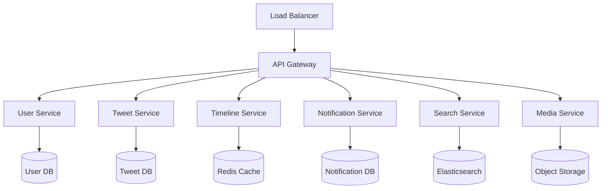
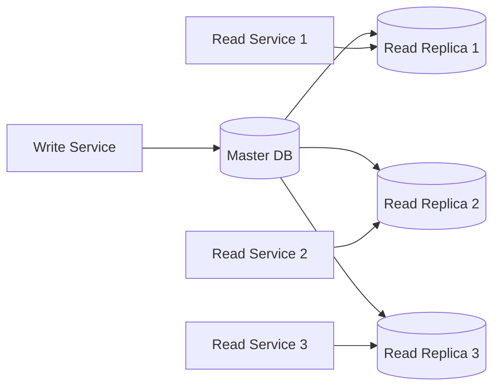
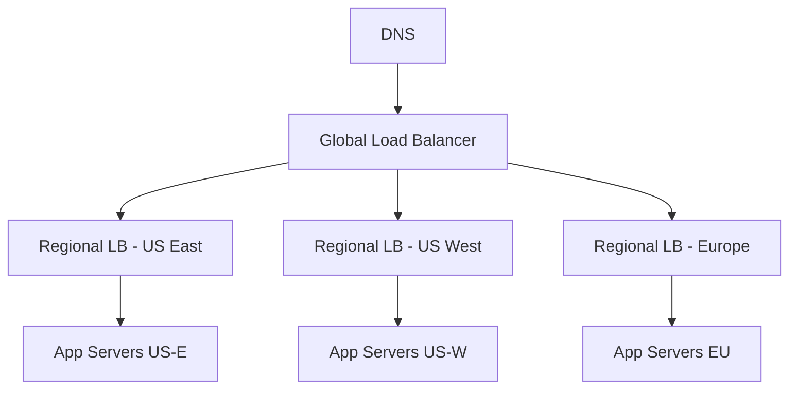
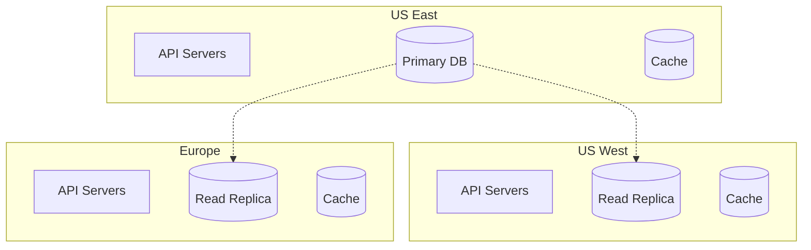

# Twitter Clone - Scaling Strategy

## Scaling Overview

The Twitter clone system is designed to handle massive scale through horizontal scaling, microservices architecture, and strategic use of caching and data partitioning. This document outlines the comprehensive scaling approach from initial deployment to global scale.

## Horizontal Scaling Architecture

### Microservices Decomposition



### Service Responsibilities

1. **User Service**
   - User registration, authentication, profile management
   - Follow/unfollow operations
   - User discovery and recommendations

2. **Tweet Service**
   - Tweet creation, deletion, editing
   - Like/unlike, retweet operations
   - Tweet metadata management

3. **Timeline Service**
   - Home timeline generation
   - User timeline aggregation
   - Timeline caching and optimization

4. **Notification Service**
   - Real-time notification delivery
   - Push notification management
   - Notification preferences

5. **Search Service**
   - Tweet and user search
   - Trending topics calculation
   - Search result ranking

6. **Media Service**
   - Image/video upload and processing
   - CDN integration
   - Media optimization

## Database Scaling Strategy

### Sharding Approach

#### User Data Sharding
```
Shard Key: hash(user_id) % num_shards
Shard 0: Users with hash(user_id) % 16 = 0-3
Shard 1: Users with hash(user_id) % 16 = 4-7
...
Shard 3: Users with hash(user_id) % 16 = 12-15
```

#### Tweet Data Sharding
```
Shard Key: hash(user_id) % num_shards
Co-location: Keep user's tweets on same shard as user data
Benefits: Efficient user timeline queries
```

#### Timeline Data Strategy
```
Approach: Hybrid fan-out strategy
- Fan-out on write for users with < 1M followers
- Fan-out on read for celebrities with > 1M followers
- Mixed approach for medium-tier users (100K-1M followers)
```

### Read Replicas Strategy



**Read Replica Distribution:**
- 1 Master per shard (writes only)
- 3-5 Read replicas per shard (reads only)
- Geographic distribution of read replicas
- Automatic failover to read replica if master fails

## Caching Strategy

### Multi-Level Caching

#### L1 Cache (Application Level)
```
Technology: In-memory cache (Caffeine, Guava)
TTL: 5-10 minutes
Use Cases: User sessions, frequently accessed data
Size: 1-2GB per application instance
```

#### L2 Cache (Distributed Cache)
```
Technology: Redis Cluster
TTL: 30 minutes - 2 hours
Use Cases: Timelines, user profiles, tweet data
Size: 100GB - 1TB per cluster
```

#### L3 Cache (CDN)
```
Technology: CloudFlare, AWS CloudFront
TTL: 1-24 hours
Use Cases: Static content, media files, API responses
Geographic distribution: Global edge locations
```

### Cache Warming Strategy

```python
# Timeline Cache Warming
def warm_timeline_cache(user_id):
    # Pre-compute and cache timeline for active users
    timeline = generate_timeline(user_id, limit=100)
    cache.set(f"timeline:home:{user_id}", timeline, ttl=3600)
    
# Celebrity Timeline Warming
def warm_celebrity_timelines():
    # Pre-compute timelines for users with high follower counts
    celebrities = get_users_with_followers_gt(100000)
    for user in celebrities:
        warm_timeline_cache(user.id)
```

## Load Balancing Strategy

### Application Load Balancing



**Load Balancing Algorithms:**
- **Round Robin**: For stateless services
- **Least Connections**: For long-running operations
- **Consistent Hashing**: For cache-aware routing
- **Geographic Routing**: For latency optimization

### Database Load Balancing

```
Read Operations:
- Route to nearest read replica
- Implement connection pooling (PgBouncer)
- Use read preference based on query type

Write Operations:
- Route to master database only
- Implement write queuing for high throughput
- Use connection multiplexing
```

## Auto-Scaling Configuration

### Horizontal Pod Autoscaling (HPA)

```yaml
apiVersion: autoscaling/v2
kind: HorizontalPodAutoscaler
metadata:
  name: tweet-service-hpa
spec:
  scaleTargetRef:
    apiVersion: apps/v1
    kind: Deployment
    name: tweet-service
  minReplicas: 10
  maxReplicas: 100
  metrics:
  - type: Resource
    resource:
      name: cpu
      target:
        type: Utilization
        averageUtilization: 70
  - type: Resource
    resource:
      name: memory
      target:
        type: Utilization
        averageUtilization: 80
```

### Database Auto-Scaling

```
Read Replicas:
- Scale based on read query volume
- Add replicas when CPU > 70% for 5 minutes
- Remove replicas when CPU < 30% for 15 minutes

Connection Pools:
- Scale pool size based on active connections
- Monitor connection wait times
- Implement circuit breakers for overload protection
```

## Geographic Distribution

### Multi-Region Deployment



**Regional Strategy:**
- **Primary Region**: US East (all writes)
- **Secondary Regions**: US West, Europe (reads + cache)
- **Data Replication**: Async replication to secondary regions
- **Failover**: Automatic promotion of secondary to primary

### CDN Strategy

```
Media Distribution:
- Images/videos served from nearest edge location
- 95% cache hit rate target
- Automatic image optimization and compression
- WebP/AVIF format serving for supported browsers

API Response Caching:
- Cache GET requests at edge locations
- Vary cache by user authentication status
- Implement cache invalidation for real-time updates
```

## Performance Optimization

### Timeline Generation Optimization

```python
class TimelineGenerator:
    def generate_home_timeline(self, user_id, limit=20):
        # Check cache first
        cached_timeline = cache.get(f"timeline:home:{user_id}")
        if cached_timeline:
            return cached_timeline
        
        # Get following list
        following_ids = self.get_following_ids(user_id)
        
        # Batch fetch recent tweets from followed users
        recent_tweets = self.batch_get_recent_tweets(
            following_ids, 
            limit=limit * 2  # Over-fetch for filtering
        )
        
        # Apply ranking algorithm
        ranked_tweets = self.rank_tweets(recent_tweets, user_id)
        
        # Cache result
        cache.set(f"timeline:home:{user_id}", ranked_tweets[:limit], ttl=1800)
        
        return ranked_tweets[:limit]
```

### Database Query Optimization

```sql
-- Optimized timeline query with proper indexing
SELECT t.tweet_id, t.content, t.created_at, u.username, u.display_name
FROM tweets t
JOIN users u ON t.user_id = u.user_id
WHERE t.user_id IN (
    SELECT following_id 
    FROM follows 
    WHERE follower_id = $1
)
AND t.created_at > NOW() - INTERVAL '7 days'
AND t.visibility = 'public'
ORDER BY t.created_at DESC
LIMIT 20;

-- Supporting indexes
CREATE INDEX CONCURRENTLY idx_tweets_timeline_optimized 
ON tweets (user_id, created_at DESC, visibility) 
WHERE visibility = 'public';
```

## Monitoring and Alerting

### Key Metrics to Monitor

```yaml
Application Metrics:
  - Request rate (RPS)
  - Response time (p95, p99)
  - Error rate (4xx, 5xx)
  - Timeline generation time
  - Cache hit rates

Database Metrics:
  - Connection pool utilization
  - Query execution time
  - Replication lag
  - Disk I/O and CPU usage

Infrastructure Metrics:
  - CPU and memory utilization
  - Network throughput
  - Disk space usage
  - Load balancer health
```

### Auto-Scaling Triggers

```
Scale Up Triggers:
- CPU usage > 70% for 5 minutes
- Memory usage > 80% for 5 minutes
- Response time p95 > 500ms for 3 minutes
- Error rate > 1% for 2 minutes

Scale Down Triggers:
- CPU usage < 30% for 15 minutes
- Memory usage < 50% for 15 minutes
- Response time p95 < 200ms for 10 minutes
- Error rate < 0.1% for 10 minutes
```

## Capacity Planning

### Growth Projections

```
Year 1: 10M users, 1M DAU, 10M tweets/day
Year 2: 50M users, 5M DAU, 50M tweets/day
Year 3: 200M users, 20M DAU, 200M tweets/day
Year 5: 500M users, 50M DAU, 500M tweets/day
```

### Infrastructure Requirements

```
Year 1:
- Application servers: 50 instances
- Database shards: 4 shards
- Cache clusters: 2 clusters (100GB each)
- CDN bandwidth: 10TB/month

Year 3:
- Application servers: 500 instances
- Database shards: 16 shards
- Cache clusters: 8 clusters (500GB each)
- CDN bandwidth: 100TB/month

Year 5:
- Application servers: 2000 instances
- Database shards: 64 shards
- Cache clusters: 32 clusters (1TB each)
- CDN bandwidth: 500TB/month
```

## Cost Optimization

### Resource Optimization Strategies

1. **Spot Instances**: Use for non-critical batch processing
2. **Reserved Instances**: 1-3 year commitments for predictable workloads
3. **Auto-Scaling**: Reduce over-provisioning during low traffic
4. **Cache Optimization**: Reduce database load and costs
5. **CDN Optimization**: Reduce bandwidth costs through compression

### Cost Monitoring

```
Monthly Cost Breakdown:
- Compute: 40% ($40K/month at scale)
- Storage: 25% ($25K/month at scale)
- Network: 20% ($20K/month at scale)
- Cache: 10% ($10K/month at scale)
- Other: 5% ($5K/month at scale)

Total: ~$100K/month for 200M users
Cost per user: ~$0.50/month
```

This scaling strategy provides a comprehensive approach to handle growth from thousands to hundreds of millions of users while maintaining performance, reliability, and cost efficiency.