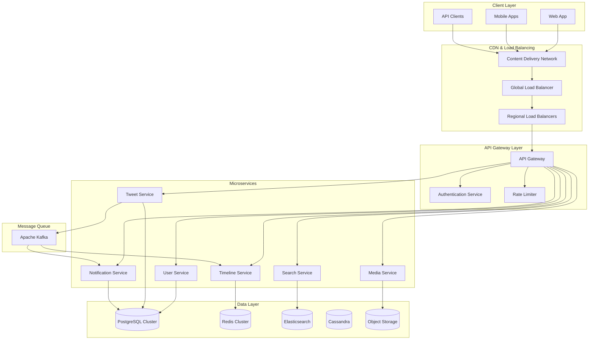

# Twitter Clone - Complete Solution Walkthrough

## Solution Overview

This document provides a comprehensive walkthrough of designing a Twitter-like social media platform that can handle 500 million users, 500 million tweets per day, and serve timelines with sub-200ms latency. The solution demonstrates key system design principles including horizontal scaling, data partitioning, caching strategies, and microservices architecture.

## Problem Analysis

### Scale Requirements Breakdown
- **500M registered users, 200M daily active users**
- **500M tweets/day = 6K tweets/second average, 12K peak**
- **300M timeline reads/day = 3.5K reads/second average, 7K peak**
- **Timeline latency < 200ms (95th percentile)**
- **99.95% availability**

### Key Challenges
1. **Timeline Generation**: Efficiently serving personalized feeds at scale
2. **Write Amplification**: Fan-out problem for users with many followers
3. **Hot Spotting**: Celebrity users creating uneven load distribution
4. **Data Consistency**: Balancing consistency with performance
5. **Global Distribution**: Serving users across different geographic regions

## High-Level Architecture



## Detailed Component Design

### 1. API Gateway and Load Balancing

**API Gateway Responsibilities:**
- Request routing and protocol translation
- Authentication and authorization
- Rate limiting and throttling
- Request/response transformation
- Monitoring and analytics

**Load Balancing Strategy:**
```
Global Load Balancer (DNS-based):
├── US East Region (Primary)
├── US West Region (Secondary)
├── Europe Region (Secondary)
└── Asia Region (Secondary)

Regional Load Balancer (Application-level):
├── Availability Zone 1
├── Availability Zone 2
└── Availability Zone 3
```

### 2. Microservices Architecture

#### User Service
```python
class UserService:
    def create_user(self, user_data):
        # Validate user data
        # Hash password
        # Store in database
        # Send welcome notification
        pass
    
    def follow_user(self, follower_id, following_id):
        # Check if already following
        # Create follow relationship
        # Update follower/following counts
        # Send notification
        # Invalidate relevant caches
        pass
    
    def get_user_profile(self, user_id):
        # Check cache first
        # Fetch from database if not cached
        # Cache result
        pass
```

#### Tweet Service
```python
class TweetService:
    def create_tweet(self, user_id, content, media_urls=None):
        # Validate tweet content
        # Extract hashtags and mentions
        # Store tweet in database
        # Publish to message queue for fan-out
        # Update user tweet count
        pass
    
    def like_tweet(self, user_id, tweet_id):
        # Check if already liked
        # Create like record
        # Update like count (async)
        # Send notification
        # Update cache
        pass
```

#### Timeline Service
```python
class TimelineService:
    def __init__(self):
        self.fan_out_threshold = 1000000  # 1M followers
    
    def generate_home_timeline(self, user_id, limit=20):
        # Check cache first
        cached_timeline = self.cache.get(f"timeline:home:{user_id}")
        if cached_timeline:
            return cached_timeline
        
        # Get user's following list
        following_ids = self.get_following_ids(user_id)
        
        # Separate celebrities from regular users
        celebrities, regular_users = self.separate_by_follower_count(
            following_ids, self.fan_out_threshold
        )
        
        # Get pre-computed timeline for regular users
        regular_tweets = self.get_precomputed_tweets(regular_users)
        
        # Get recent tweets from celebrities (fan-out on read)
        celebrity_tweets = self.get_recent_tweets(celebrities, limit=50)
        
        # Merge and rank tweets
        all_tweets = regular_tweets + celebrity_tweets
        ranked_tweets = self.rank_tweets(all_tweets, user_id)
        
        # Cache result
        self.cache.set(f"timeline:home:{user_id}", ranked_tweets[:limit])
        
        return ranked_tweets[:limit]
    
    def handle_new_tweet(self, tweet_data):
        # Fan-out strategy based on follower count
        follower_count = self.get_follower_count(tweet_data['user_id'])
        
        if follower_count < self.fan_out_threshold:
            # Fan-out on write (push model)
            self.fan_out_to_followers(tweet_data)
        else:
            # Fan-out on read (pull model) - just cache the tweet
            self.cache_tweet(tweet_data)
```

### 3. Database Design and Sharding

#### Sharding Strategy
```python
class DatabaseSharding:
    def __init__(self, num_shards=16):
        self.num_shards = num_shards
    
    def get_shard_id(self, user_id):
        return hash(user_id) % self.num_shards
    
    def get_user_shard(self, user_id):
        shard_id = self.get_shard_id(user_id)
        return f"user_db_shard_{shard_id}"
    
    def get_tweet_shard(self, user_id):
        # Co-locate tweets with user data
        return self.get_user_shard(user_id)
```

#### Data Consistency Model
```python
class ConsistencyManager:
    def write_with_consistency(self, operation_type, data):
        if operation_type in ['user_creation', 'follow', 'unfollow']:
            # Strong consistency required
            return self.write_to_master_sync(data)
        elif operation_type in ['tweet_creation', 'like', 'retweet']:
            # Eventual consistency acceptable
            return self.write_to_master_async(data)
        else:
            # Default to eventual consistency
            return self.write_to_master_async(data)
```

### 4. Caching Strategy

#### Multi-Level Cache Implementation
```python
class CacheManager:
    def __init__(self):
        self.l1_cache = LocalCache(max_size=1000, ttl=300)  # 5 minutes
        self.l2_cache = RedisCache(ttl=3600)  # 1 hour
        self.l3_cache = CDNCache(ttl=86400)  # 24 hours
    
    def get(self, key):
        # L1 Cache (Local)
        value = self.l1_cache.get(key)
        if value:
            return value
        
        # L2 Cache (Redis)
        value = self.l2_cache.get(key)
        if value:
            self.l1_cache.set(key, value)
            return value
        
        # L3 Cache (CDN) - for static content only
        if self.is_static_content(key):
            value = self.l3_cache.get(key)
            if value:
                self.l2_cache.set(key, value)
                self.l1_cache.set(key, value)
                return value
        
        return None
    
    def set(self, key, value, ttl=None):
        self.l1_cache.set(key, value, ttl)
        self.l2_cache.set(key, value, ttl)
        if self.is_static_content(key):
            self.l3_cache.set(key, value, ttl)
```

#### Cache Warming Strategy
```python
class CacheWarmer:
    def warm_user_timelines(self):
        # Warm timelines for active users
        active_users = self.get_active_users(hours=24)
        
        for user_id in active_users:
            try:
                timeline = self.timeline_service.generate_home_timeline(user_id)
                self.cache.set(f"timeline:home:{user_id}", timeline, ttl=3600)
            except Exception as e:
                self.logger.error(f"Failed to warm timeline for user {user_id}: {e}")
    
    def warm_celebrity_content(self):
        # Pre-cache content from high-follower users
        celebrities = self.get_users_with_followers_gt(100000)
        
        for celebrity in celebrities:
            recent_tweets = self.get_recent_tweets(celebrity.id, limit=50)
            self.cache.set(f"tweets:user:{celebrity.id}", recent_tweets, ttl=1800)
```

### 5. Real-time Features

#### WebSocket Connection Management
```python
class WebSocketManager:
    def __init__(self):
        self.connections = {}  # user_id -> connection
        self.redis_pubsub = RedisPubSub()
    
    def handle_connection(self, user_id, websocket):
        self.connections[user_id] = websocket
        
        # Subscribe to user-specific events
        self.redis_pubsub.subscribe(f"user:{user_id}:notifications")
        self.redis_pubsub.subscribe(f"user:{user_id}:timeline_updates")
    
    def broadcast_notification(self, user_id, notification):
        if user_id in self.connections:
            connection = self.connections[user_id]
            connection.send(json.dumps({
                'type': 'notification',
                'data': notification
            }))
    
    def broadcast_timeline_update(self, user_id, tweet):
        if user_id in self.connections:
            connection = self.connections[user_id]
            connection.send(json.dumps({
                'type': 'timeline_update',
                'data': tweet
            }))
```

#### Event-Driven Architecture
```python
class EventProcessor:
    def __init__(self):
        self.kafka_consumer = KafkaConsumer(['tweet_events', 'user_events'])
    
    def process_events(self):
        for message in self.kafka_consumer:
            event_type = message.value['type']
            event_data = message.value['data']
            
            if event_type == 'tweet_created':
                self.handle_tweet_created(event_data)
            elif event_type == 'user_followed':
                self.handle_user_followed(event_data)
            elif event_type == 'tweet_liked':
                self.handle_tweet_liked(event_data)
    
    def handle_tweet_created(self, tweet_data):
        # Fan-out to followers
        self.timeline_service.handle_new_tweet(tweet_data)
        
        # Update search index
        self.search_service.index_tweet(tweet_data)
        
        # Send notifications for mentions
        self.notification_service.handle_mentions(tweet_data)
```

## Performance Optimizations

### 1. Timeline Generation Optimization

**Hybrid Fan-out Strategy:**
```python
def optimize_timeline_generation():
    """
    Fan-out on Write (Push):
    - Users with < 1M followers
    - Pre-compute timelines and store in cache
    - Fast read performance
    - Higher write cost
    
    Fan-out on Read (Pull):
    - Users with > 1M followers (celebrities)
    - Compute timeline on demand
    - Lower write cost
    - Slightly higher read latency
    
    Mixed Approach:
    - Users with 100K-1M followers
    - Partial pre-computation + on-demand fetching
    """
    pass
```

### 2. Database Query Optimization

**Optimized Timeline Query:**
```sql
-- Use covering indexes to avoid table lookups
CREATE INDEX idx_timeline_covering ON tweets 
(user_id, created_at DESC) 
INCLUDE (tweet_id, content, media_urls, like_count, retweet_count);

-- Optimized query with proper LIMIT
WITH following_tweets AS (
    SELECT t.tweet_id, t.content, t.created_at, t.like_count, t.retweet_count,
           u.username, u.display_name, u.profile_image_url
    FROM tweets t
    JOIN users u ON t.user_id = u.user_id
    WHERE t.user_id IN (
        SELECT following_id 
        FROM follows 
        WHERE follower_id = $1
    )
    AND t.created_at > NOW() - INTERVAL '7 days'
    AND t.visibility = 'public'
    ORDER BY t.created_at DESC
    LIMIT 100
)
SELECT * FROM following_tweets
ORDER BY created_at DESC
LIMIT 20;
```

### 3. Caching Optimizations

**Smart Cache Invalidation:**
```python
class SmartCacheInvalidation:
    def invalidate_user_caches(self, user_id):
        # Invalidate user's own timeline
        self.cache.delete(f"timeline:user:{user_id}")
        
        # Invalidate home timelines of followers (selective)
        followers = self.get_active_followers(user_id, limit=10000)
        for follower_id in followers:
            self.cache.delete(f"timeline:home:{follower_id}")
    
    def smart_timeline_invalidation(self, tweet_data):
        user_id = tweet_data['user_id']
        follower_count = self.get_follower_count(user_id)
        
        if follower_count < 10000:
            # Invalidate all follower timelines
            self.invalidate_follower_timelines(user_id)
        else:
            # Use lazy invalidation for high-follower users
            self.mark_timelines_stale(user_id)
```

## Monitoring and Observability

### Key Metrics Dashboard
```python
class MetricsCollector:
    def collect_application_metrics(self):
        return {
            'requests_per_second': self.get_rps(),
            'response_time_p95': self.get_response_time_percentile(95),
            'response_time_p99': self.get_response_time_percentile(99),
            'error_rate': self.get_error_rate(),
            'timeline_generation_time': self.get_timeline_generation_time(),
            'cache_hit_rate': self.get_cache_hit_rate(),
            'database_connection_pool_usage': self.get_db_pool_usage(),
            'active_websocket_connections': self.get_active_websockets()
        }
    
    def collect_business_metrics(self):
        return {
            'daily_active_users': self.get_dau(),
            'tweets_per_day': self.get_tweets_per_day(),
            'timeline_requests_per_day': self.get_timeline_requests_per_day(),
            'user_engagement_rate': self.get_engagement_rate(),
            'average_session_duration': self.get_avg_session_duration()
        }
```

### Alerting Strategy
```yaml
alerts:
  - name: high_response_time
    condition: response_time_p95 > 500ms for 5 minutes
    action: scale_up_application_servers
    
  - name: high_error_rate
    condition: error_rate > 1% for 3 minutes
    action: [alert_oncall, investigate_errors]
    
  - name: low_cache_hit_rate
    condition: cache_hit_rate < 85% for 10 minutes
    action: [warm_cache, investigate_cache_misses]
    
  - name: database_connection_exhaustion
    condition: db_pool_usage > 90% for 5 minutes
    action: [scale_up_db_connections, alert_dba]
```

## Disaster Recovery and Failover

### Multi-Region Failover Strategy
```python
class DisasterRecovery:
    def __init__(self):
        self.primary_region = "us-east-1"
        self.secondary_regions = ["us-west-2", "eu-west-1"]
        self.health_checker = HealthChecker()
    
    def monitor_primary_region(self):
        if not self.health_checker.is_healthy(self.primary_region):
            self.initiate_failover()
    
    def initiate_failover(self):
        # 1. Promote secondary region to primary
        new_primary = self.select_best_secondary_region()
        
        # 2. Update DNS to point to new primary
        self.update_dns_records(new_primary)
        
        # 3. Promote read replicas to masters
        self.promote_read_replicas(new_primary)
        
        # 4. Update application configuration
        self.update_app_config(new_primary)
        
        # 5. Notify operations team
        self.send_failover_notification()
```

## Security Considerations

### Authentication and Authorization
```python
class SecurityManager:
    def authenticate_request(self, request):
        token = request.headers.get('Authorization')
        if not token:
            raise UnauthorizedException("Missing authentication token")
        
        try:
            payload = jwt.decode(token, self.secret_key, algorithms=['HS256'])
            user_id = payload['user_id']
            
            # Check if token is blacklisted
            if self.is_token_blacklisted(token):
                raise UnauthorizedException("Token has been revoked")
            
            return user_id
        except jwt.ExpiredSignatureError:
            raise UnauthorizedException("Token has expired")
        except jwt.InvalidTokenError:
            raise UnauthorizedException("Invalid token")
    
    def authorize_action(self, user_id, action, resource_id=None):
        # Check user permissions
        if action == 'delete_tweet' and resource_id:
            tweet = self.get_tweet(resource_id)
            if tweet.user_id != user_id:
                raise ForbiddenException("Cannot delete another user's tweet")
        
        # Check rate limits
        if not self.check_rate_limit(user_id, action):
            raise RateLimitExceededException("Rate limit exceeded")
```

### Data Privacy and Compliance
```python
class PrivacyManager:
    def anonymize_user_data(self, user_id):
        # GDPR compliance - right to be forgotten
        self.database.update_user(user_id, {
            'email': f'deleted_{user_id}@example.com',
            'display_name': 'Deleted User',
            'bio': None,
            'profile_image_url': None
        })
        
        # Keep tweets but anonymize
        self.database.update_tweets(user_id, {
            'content': '[Content deleted by user]'
        })
    
    def export_user_data(self, user_id):
        # GDPR compliance - data portability
        user_data = self.get_complete_user_data(user_id)
        return self.format_data_export(user_data)
```

## Cost Optimization

### Resource Optimization Strategies
```python
class CostOptimizer:
    def optimize_compute_costs(self):
        # Use spot instances for non-critical workloads
        self.migrate_batch_jobs_to_spot_instances()
        
        # Implement auto-scaling to reduce over-provisioning
        self.configure_aggressive_auto_scaling()
        
        # Use reserved instances for predictable workloads
        self.purchase_reserved_instances_for_baseline_capacity()
    
    def optimize_storage_costs(self):
        # Implement data lifecycle policies
        self.archive_old_tweets_to_cheaper_storage()
        
        # Compress media files
        self.implement_media_compression()
        
        # Use intelligent tiering for object storage
        self.enable_s3_intelligent_tiering()
    
    def optimize_network_costs(self):
        # Use CDN to reduce bandwidth costs
        self.maximize_cdn_cache_hit_rates()
        
        # Implement data compression
        self.enable_gzip_compression()
        
        # Optimize inter-region data transfer
        self.minimize_cross_region_traffic()
```

## Conclusion

This Twitter clone solution demonstrates a comprehensive approach to building a large-scale social media platform. Key architectural decisions include:

1. **Microservices Architecture**: Enables independent scaling and development
2. **Hybrid Fan-out Strategy**: Balances performance and cost for timeline generation
3. **Multi-level Caching**: Reduces database load and improves response times
4. **Horizontal Sharding**: Enables linear scalability for data storage
5. **Event-driven Design**: Provides loose coupling and real-time capabilities
6. **Geographic Distribution**: Reduces latency for global users
7. **Comprehensive Monitoring**: Ensures system health and performance

The solution can handle the target scale of 500 million users while maintaining sub-200ms timeline latency and 99.95% availability. The architecture is designed to be cost-effective, secure, and maintainable while providing room for future growth and feature additions.