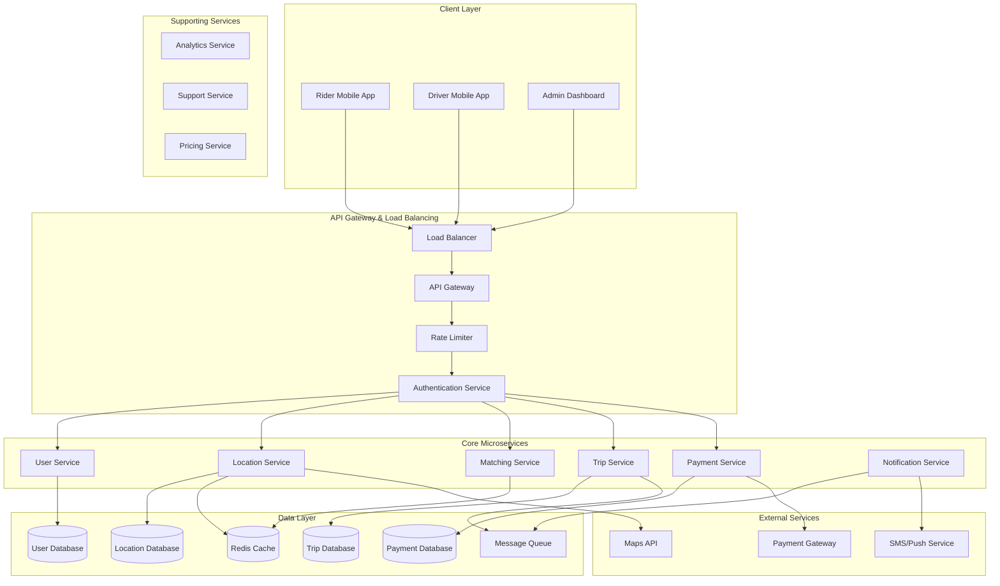

# Uber System Design - Complete Solution

## Executive Summary

This document presents a comprehensive system design for a ride-sharing platform like Uber, capable of handling millions of users, real-time location tracking, intelligent driver-rider matching, and global scale operations. The solution emphasizes scalability, reliability, and real-time performance while maintaining cost efficiency.

## Problem Statement

Design a ride-sharing platform that can:
- Handle 100M+ active users and 5M+ drivers globally
- Process 15M+ trips per day with 50K concurrent ride requests during peak hours
- Provide real-time location tracking with sub-second latency
- Implement intelligent matching algorithms for optimal rider-driver pairing
- Support dynamic pricing and multiple payment methods
- Ensure 99.9% availability with global disaster recovery

## High-Level Architecture

### System Overview



## Detailed Component Design

### 1. User Management Service

**Responsibilities:**
- User registration and authentication
- Profile management for riders and drivers
- Driver onboarding and verification
- Session management and security

**Key Features:**
```python
class UserService:
    def register_user(self, user_data: UserRegistration) -> User:
        """Register new rider or driver"""
        # Validate user data
        self.validate_user_data(user_data)
        
        # Check for existing user
        if self.user_exists(user_data.email):
            raise UserAlreadyExistsError()
        
        # Create user account
        user = User(
            email=user_data.email,
            password_hash=self.hash_password(user_data.password),
            user_type=user_data.user_type,
            phone_number=user_data.phone_number
        )
        
        # Save to database
        user_id = self.user_repository.save(user)
        
        # Send verification email/SMS
        self.send_verification(user)
        
        return user
    
    def authenticate_user(self, email: str, password: str) -> AuthToken:
        """Authenticate user and return JWT token"""
        user = self.user_repository.find_by_email(email)
        
        if not user or not self.verify_password(password, user.password_hash):
            raise InvalidCredentialsError()
        
        # Generate JWT token
        token = self.jwt_service.generate_token(
            user_id=user.user_id,
            user_type=user.user_type,
            expires_in=3600  # 1 hour
        )
        
        # Update last login
        self.user_repository.update_last_login(user.user_id)
        
        return token
```

**Database Schema:**
- Users table with basic information
- User profiles with extended data
- Driver profiles with verification status
- Authentication tokens and sessions

### 2. Location Service

**Responsibilities:**
- Real-time GPS tracking for drivers
- Geocoding and reverse geocoding
- Spatial queries for nearby drivers
- Route calculation and optimization

**Architecture:**
```python
class LocationService:
    def __init__(self):
        self.redis_client = RedisCluster()
        self.influxdb_client = InfluxDBClient()
        self.maps_api = GoogleMapsAPI()
    
    async def update_driver_location(self, location_update: LocationUpdate):
        """Process real-time location update from driver"""
        # Validate location data
        if not self.is_valid_location(location_update):
            raise InvalidLocationError()
        
        # Update real-time cache (Redis)
        await self.redis_client.geoadd(
            "drivers:online",
            location_update.longitude,
            location_update.latitude,
            location_update.driver_id
        )
        
        # Store historical data (InfluxDB)
        await self.influxdb_client.write_point(
            measurement="driver_locations",
            tags={"driver_id": location_update.driver_id},
            fields={
                "latitude": location_update.latitude,
                "longitude": location_update.longitude,
                "speed": location_update.speed,
                "heading": location_update.heading
            },
            timestamp=location_update.timestamp
        )
        
        # Trigger matching if driver is available
        if location_update.status == "available":
            await self.trigger_matching_check(location_update.driver_id)
    
    async def find_nearby_drivers(self, lat: float, lng: float, radius_km: int = 5) -> List[Driver]:
        """Find available drivers within specified radius"""
        # Query Redis geospatial index
        nearby_drivers = await self.redis_client.georadius(
            "drivers:online",
            lng, lat, radius_km, "km",
            withdist=True, withcoord=True
        )
        
        # Enrich with driver details
        driver_details = []
        for driver_id, distance, coordinates in nearby_drivers:
            driver = await self.get_driver_details(driver_id)
            if driver and driver.status == "available":
                driver.distance = distance
                driver.current_location = coordinates
                driver_details.append(driver)
        
        # Sort by distance and rating
        return sorted(driver_details, key=lambda d: (d.distance, -d.rating))
```

**Technology Stack:**
- **Redis Cluster**: Geospatial indexing for real-time location queries
- **InfluxDB**: Time-series storage for historical location data
- **PostgreSQL**: Driver profile and status information
- **Google Maps API**: Geocoding and route calculation

### 3. Matching Service

**Responsibilities:**
- Intelligent driver-rider matching
- Demand prediction and supply optimization
- Dynamic pricing calculations
- Match quality scoring

**Matching Algorithm:**
```python
class MatchingService:
    def __init__(self):
        self.location_service = LocationService()
        self.pricing_service = PricingService()
        self.ml_model = MatchingMLModel()
    
    async def find_best_match(self, ride_request: RideRequest) -> MatchResult:
        """Find optimal driver for ride request"""
        # Get nearby available drivers
        nearby_drivers = await self.location_service.find_nearby_drivers(
            ride_request.pickup_latitude,
            ride_request.pickup_longitude,
            radius_km=10
        )
        
        if not nearby_drivers:
            return MatchResult(status="no_drivers_available")
        
        # Score each driver
        scored_drivers = []
        for driver in nearby_drivers:
            score = await self.calculate_match_score(ride_request, driver)
            scored_drivers.append((driver, score))
        
        # Sort by score (highest first)
        scored_drivers.sort(key=lambda x: x[1], reverse=True)
        
        # Select best match
        best_driver, best_score = scored_drivers[0]
        
        # Calculate pricing
        pricing = await self.pricing_service.calculate_fare(
            pickup_location=(ride_request.pickup_latitude, ride_request.pickup_longitude),
            destination_location=(ride_request.destination_latitude, ride_request.destination_longitude),
            vehicle_type=ride_request.vehicle_type,
            demand_multiplier=await self.get_surge_multiplier(ride_request.pickup_location)
        )
        
        return MatchResult(
            driver=best_driver,
            estimated_arrival_time=await self.calculate_eta(best_driver, ride_request),
            pricing=pricing,
            match_score=best_score
        )
    
    async def calculate_match_score(self, ride_request: RideRequest, driver: Driver) -> float:
        """Calculate match quality score using ML model"""
        features = {
            'distance_to_pickup': driver.distance,
            'driver_rating': driver.rating,
            'driver_acceptance_rate': driver.acceptance_rate,
            'vehicle_type_match': 1.0 if driver.vehicle_type == ride_request.vehicle_type else 0.5,
            'time_of_day': ride_request.timestamp.hour,
            'day_of_week': ride_request.timestamp.weekday(),
            'historical_cancellation_rate': await self.get_cancellation_rate(driver.driver_id),
            'surge_area': await self.is_surge_area(ride_request.pickup_location)
        }
        
        return self.ml_model.predict_match_score(features)
```

**Matching Criteria:**
1. **Distance**: Proximity to pickup location
2. **ETA**: Estimated arrival time
3. **Driver Rating**: Historical performance
4. **Acceptance Rate**: Likelihood to accept ride
5. **Vehicle Type**: Match with requested vehicle category
6. **Historical Performance**: Past rider satisfaction

### 4. Trip Management Service

**Responsibilities:**
- Trip lifecycle management
- State machine for trip status
- Real-time trip tracking
- Trip history and analytics

**Trip State Machine:**
```python
from enum import Enum
from typing import Dict, Callable

class TripStatus(Enum):
    REQUESTED = "requested"
    SEARCHING = "searching"
    MATCHED = "matched"
    ACCEPTED = "accepted"
    DRIVER_ARRIVING = "driver_arriving"
    DRIVER_ARRIVED = "driver_arrived"
    IN_PROGRESS = "in_progress"
    COMPLETED = "completed"
    CANCELLED = "cancelled"

class TripService:
    def __init__(self):
        self.state_machine = self.setup_state_machine()
        self.notification_service = NotificationService()
        self.payment_service = PaymentService()
    
    def setup_state_machine(self) -> Dict[TripStatus, Dict[TripStatus, Callable]]:
        """Define valid state transitions and their handlers"""
        return {
            TripStatus.REQUESTED: {
                TripStatus.SEARCHING: self.start_driver_search,
                TripStatus.CANCELLED: self.cancel_trip
            },
            TripStatus.SEARCHING: {
                TripStatus.MATCHED: self.assign_driver,
                TripStatus.CANCELLED: self.cancel_trip
            },
            TripStatus.MATCHED: {
                TripStatus.ACCEPTED: self.driver_accepted,
                TripStatus.SEARCHING: self.driver_declined,
                TripStatus.CANCELLED: self.cancel_trip
            },
            TripStatus.ACCEPTED: {
                TripStatus.DRIVER_ARRIVING: self.driver_en_route,
                TripStatus.CANCELLED: self.cancel_trip
            },
            TripStatus.DRIVER_ARRIVING: {
                TripStatus.DRIVER_ARRIVED: self.driver_arrived,
                TripStatus.CANCELLED: self.cancel_trip
            },
            TripStatus.DRIVER_ARRIVED: {
                TripStatus.IN_PROGRESS: self.start_trip,
                TripStatus.CANCELLED: self.cancel_trip
            },
            TripStatus.IN_PROGRESS: {
                TripStatus.COMPLETED: self.complete_trip
            }
        }
    
    async def transition_trip_status(self, trip_id: str, new_status: TripStatus, **kwargs):
        """Handle trip status transition with validation"""
        trip = await self.get_trip(trip_id)
        current_status = TripStatus(trip.status)
        
        # Validate transition
        if new_status not in self.state_machine.get(current_status, {}):
            raise InvalidTransitionError(f"Cannot transition from {current_status} to {new_status}")
        
        # Execute transition handler
        handler = self.state_machine[current_status][new_status]
        await handler(trip, **kwargs)
        
        # Update trip status
        await self.update_trip_status(trip_id, new_status)
        
        # Send notifications
        await self.send_status_notifications(trip, new_status)
    
    async def complete_trip(self, trip: Trip, **kwargs):
        """Handle trip completion"""
        # Calculate final fare
        final_fare = await self.calculate_final_fare(trip, kwargs.get('actual_distance'), kwargs.get('actual_duration'))
        
        # Process payment
        payment_result = await self.payment_service.process_payment(
            trip_id=trip.trip_id,
            rider_id=trip.rider_id,
            amount=final_fare.total_amount,
            payment_method_id=trip.payment_method_id
        )
        
        # Update driver earnings
        await self.update_driver_earnings(trip.driver_id, final_fare)
        
        # Request ratings
        await self.request_trip_ratings(trip)
```

### 5. Payment Service

**Responsibilities:**
- Payment method management
- Transaction processing
- Driver earnings calculation
- Refund and dispute handling

**Payment Processing:**
```python
class PaymentService:
    def __init__(self):
        self.stripe_client = StripeClient()
        self.payment_repository = PaymentRepository()
        self.fraud_detector = FraudDetectionService()
    
    async def process_payment(self, payment_request: PaymentRequest) -> PaymentResult:
        """Process payment for completed trip"""
        # Fraud detection
        fraud_score = await self.fraud_detector.analyze_transaction(payment_request)
        if fraud_score > 0.8:
            return PaymentResult(status="fraud_detected", fraud_score=fraud_score)
        
        try:
            # Process payment through Stripe
            charge = await self.stripe_client.create_charge(
                amount=int(payment_request.amount * 100),  # Convert to cents
                currency=payment_request.currency,
                customer=payment_request.customer_id,
                payment_method=payment_request.payment_method_id,
                description=f"Uber trip {payment_request.trip_id}"
            )
            
            # Record payment
            payment = Payment(
                trip_id=payment_request.trip_id,
                rider_id=payment_request.rider_id,
                driver_id=payment_request.driver_id,
                amount_cents=int(payment_request.amount * 100),
                currency=payment_request.currency,
                external_transaction_id=charge.id,
                status="succeeded"
            )
            
            await self.payment_repository.save(payment)
            
            # Calculate driver earnings
            await self.calculate_driver_earnings(payment)
            
            return PaymentResult(
                status="succeeded",
                payment_id=payment.payment_id,
                transaction_id=charge.id
            )
            
        except StripeError as e:
            # Handle payment failure
            await self.handle_payment_failure(payment_request, str(e))
            return PaymentResult(status="failed", error=str(e))
    
    async def calculate_driver_earnings(self, payment: Payment):
        """Calculate and record driver earnings"""
        # Platform fee (typically 20-25%)
        platform_fee_rate = 0.25
        platform_fee = int(payment.amount_cents * platform_fee_rate)
        
        # Driver earnings
        driver_earnings = payment.amount_cents - platform_fee
        
        # Record earnings
        earning = DriverEarning(
            driver_id=payment.driver_id,
            trip_id=payment.trip_id,
            gross_fare_cents=payment.amount_cents,
            platform_fee_cents=platform_fee,
            net_earnings_cents=driver_earnings,
            payout_status="pending"
        )
        
        await self.driver_earnings_repository.save(earning)
```

## Real-Time Features Implementation

### WebSocket Connection Management

```python
class WebSocketManager:
    def __init__(self):
        self.connections: Dict[str, WebSocket] = {}
        self.redis_client = RedisClient()
    
    async def handle_connection(self, websocket: WebSocket, user_id: str):
        """Handle new WebSocket connection"""
        await websocket.accept()
        self.connections[user_id] = websocket
        
        try:
            while True:
                # Keep connection alive
                await websocket.receive_text()
        except WebSocketDisconnect:
            del self.connections[user_id]
    
    async def send_location_update(self, trip_id: str, location_data: dict):
        """Send real-time location update to rider"""
        trip = await self.get_trip(trip_id)
        
        if trip.rider_id in self.connections:
            await self.connections[trip.rider_id].send_json({
                "type": "location_update",
                "trip_id": trip_id,
                "driver_location": location_data,
                "eta": await self.calculate_eta(location_data, trip.destination)
            })
    
    async def send_trip_status_update(self, trip_id: str, status: str):
        """Send trip status update to both rider and driver"""
        trip = await self.get_trip(trip_id)
        
        update_message = {
            "type": "trip_status_update",
            "trip_id": trip_id,
            "status": status,
            "timestamp": datetime.utcnow().isoformat()
        }
        
        # Send to rider
        if trip.rider_id in self.connections:
            await self.connections[trip.rider_id].send_json(update_message)
        
        # Send to driver
        if trip.driver_id in self.connections:
            await self.connections[trip.driver_id].send_json(update_message)
```

## Scalability Solutions

### Database Sharding Strategy

```python
class ShardingManager:
    def __init__(self):
        self.shard_map = self.load_shard_configuration()
    
    def get_user_shard(self, user_id: str) -> int:
        """Determine shard for user data"""
        return hash(user_id) % 16  # 16 shards for user data
    
    def get_trip_shard(self, pickup_location: Tuple[float, float]) -> int:
        """Determine shard for trip data based on geographic location"""
        lat, lng = pickup_location
        
        # Geographic sharding by city/region
        city_id = self.get_city_id(lat, lng)
        return self.shard_map.get(city_id, 0)  # Default to shard 0
    
    def get_database_connection(self, shard_id: int, operation_type: str = "read"):
        """Get appropriate database connection"""
        if operation_type == "write":
            return self.get_master_connection(shard_id)
        else:
            return self.get_replica_connection(shard_id)
```

### Caching Strategy

```python
class CacheManager:
    def __init__(self):
        self.redis_cluster = RedisCluster()
        self.local_cache = LRUCache(maxsize=10000)
    
    async def get_nearby_drivers(self, lat: float, lng: float, radius: int = 5):
        """Multi-level caching for nearby drivers"""
        cache_key = f"drivers:nearby:{lat:.4f}:{lng:.4f}:{radius}"
        
        # L1: Local cache (fastest)
        if cache_key in self.local_cache:
            return self.local_cache[cache_key]
        
        # L2: Redis cache
        cached_data = await self.redis_cluster.get(cache_key)
        if cached_data:
            drivers = json.loads(cached_data)
            self.local_cache[cache_key] = drivers
            return drivers
        
        # L3: Database query
        drivers = await self.query_nearby_drivers_from_db(lat, lng, radius)
        
        # Cache results
        await self.redis_cluster.setex(cache_key, 30, json.dumps(drivers))
        self.local_cache[cache_key] = drivers
        
        return drivers
```

## Monitoring and Observability

### Metrics Collection

```python
from prometheus_client import Counter, Histogram, Gauge

# Define metrics
trip_requests_total = Counter('trip_requests_total', 'Total trip requests', ['status'])
trip_duration = Histogram('trip_duration_seconds', 'Trip duration in seconds')
active_drivers = Gauge('active_drivers_total', 'Number of active drivers')
matching_latency = Histogram('matching_latency_seconds', 'Time to match rider with driver')

class MetricsCollector:
    def record_trip_request(self, status: str):
        trip_requests_total.labels(status=status).inc()
    
    def record_trip_completion(self, duration_seconds: float):
        trip_duration.observe(duration_seconds)
    
    def update_active_drivers(self, count: int):
        active_drivers.set(count)
    
    def record_matching_time(self, latency_seconds: float):
        matching_latency.observe(latency_seconds)
```

### Health Checks

```python
class HealthCheckService:
    def __init__(self):
        self.database = DatabaseManager()
        self.redis = RedisClient()
        self.external_apis = ExternalAPIManager()
    
    async def check_system_health(self) -> HealthStatus:
        """Comprehensive system health check"""
        checks = {
            'database': await self.check_database_health(),
            'cache': await self.check_cache_health(),
            'external_apis': await self.check_external_apis(),
            'message_queue': await self.check_message_queue_health()
        }
        
        overall_status = "healthy"
        if any(status == "critical" for status in checks.values()):
            overall_status = "critical"
        elif any(status == "degraded" for status in checks.values()):
            overall_status = "degraded"
        
        return HealthStatus(
            overall_status=overall_status,
            checks=checks,
            timestamp=datetime.utcnow()
        )
```

## Security Implementation

### Authentication and Authorization

```python
class SecurityManager:
    def __init__(self):
        self.jwt_service = JWTService()
        self.rate_limiter = RateLimiter()
    
    async def authenticate_request(self, request: Request) -> User:
        """Authenticate API request"""
        auth_header = request.headers.get("Authorization")
        if not auth_header or not auth_header.startswith("Bearer "):
            raise UnauthorizedError("Missing or invalid authorization header")
        
        token = auth_header.split(" ")[1]
        
        try:
            payload = self.jwt_service.decode_token(token)
            user = await self.get_user(payload["user_id"])
            
            if not user or user.status != "active":
                raise UnauthorizedError("Invalid user")
            
            return user
        except JWTError:
            raise UnauthorizedError("Invalid token")
    
    async def check_rate_limit(self, user_id: str, endpoint: str) -> bool:
        """Check if request is within rate limits"""
        key = f"rate_limit:{user_id}:{endpoint}"
        current_count = await self.redis_client.get(key) or 0
        
        if int(current_count) >= self.get_rate_limit(endpoint):
            raise RateLimitExceededError("Rate limit exceeded")
        
        # Increment counter
        await self.redis_client.incr(key)
        await self.redis_client.expire(key, 60)  # 1 minute window
        
        return True
```

## Deployment Architecture

### Kubernetes Configuration

```yaml
# Deployment configuration for location service
apiVersion: apps/v1
kind: Deployment
metadata:
  name: location-service
  labels:
    app: location-service
spec:
  replicas: 20
  selector:
    matchLabels:
      app: location-service
  template:
    metadata:
      labels:
        app: location-service
    spec:
      containers:
      - name: location-service
        image: uber/location-service:v1.2.3
        ports:
        - containerPort: 8080
        env:
        - name: REDIS_CLUSTER_ENDPOINT
          value: "redis-cluster.uber.com:6379"
        - name: DATABASE_URL
          valueFrom:
            secretKeyRef:
              name: database-secret
              key: url
        resources:
          requests:
            memory: "512Mi"
            cpu: "250m"
          limits:
            memory: "1Gi"
            cpu: "500m"
        livenessProbe:
          httpGet:
            path: /health
            port: 8080
          initialDelaySeconds: 30
          periodSeconds: 10
        readinessProbe:
          httpGet:
            path: /ready
            port: 8080
          initialDelaySeconds: 5
          periodSeconds: 5
---
apiVersion: v1
kind: Service
metadata:
  name: location-service
spec:
  selector:
    app: location-service
  ports:
  - protocol: TCP
    port: 80
    targetPort: 8080
  type: ClusterIP
```

## Cost Optimization

### Resource Management

```python
class CostOptimizer:
    def __init__(self):
        self.metrics_client = PrometheusClient()
        self.kubernetes_client = KubernetesClient()
    
    async def optimize_resource_allocation(self):
        """Optimize resource allocation based on usage patterns"""
        services = await self.get_all_services()
        
        for service in services:
            # Get current resource usage
            cpu_usage = await self.metrics_client.get_cpu_usage(service.name)
            memory_usage = await self.metrics_client.get_memory_usage(service.name)
            
            # Calculate optimal resource allocation
            optimal_cpu = self.calculate_optimal_cpu(cpu_usage)
            optimal_memory = self.calculate_optimal_memory(memory_usage)
            
            # Update resource limits if significant difference
            if self.should_update_resources(service, optimal_cpu, optimal_memory):
                await self.kubernetes_client.update_resource_limits(
                    service.name,
                    cpu_limit=optimal_cpu,
                    memory_limit=optimal_memory
                )
    
    def calculate_optimal_cpu(self, usage_history: List[float]) -> str:
        """Calculate optimal CPU allocation"""
        p95_usage = np.percentile(usage_history, 95)
        # Add 20% buffer for spikes
        optimal_cpu = p95_usage * 1.2
        return f"{int(optimal_cpu)}m"
```

## Conclusion

This comprehensive Uber system design provides:

1. **Scalability**: Handles millions of users with horizontal scaling and sharding
2. **Real-time Performance**: Sub-second location updates and matching
3. **Reliability**: 99.9% availability with disaster recovery
4. **Cost Efficiency**: Optimized resource allocation and auto-scaling
5. **Security**: Comprehensive authentication, authorization, and data protection
6. **Observability**: Detailed monitoring, metrics, and alerting

The architecture leverages modern technologies and patterns including microservices, event-driven architecture, caching strategies, and cloud-native deployment to create a robust, scalable ride-sharing platform capable of global operations.

### Key Takeaways

- **Microservices Architecture**: Enables independent scaling and development
- **Real-time Data Processing**: Critical for location tracking and matching
- **Geographic Sharding**: Essential for global scale and regulatory compliance
- **Multi-level Caching**: Reduces latency and database load
- **Event-driven Communication**: Ensures loose coupling and scalability
- **Comprehensive Monitoring**: Essential for maintaining system health at scale