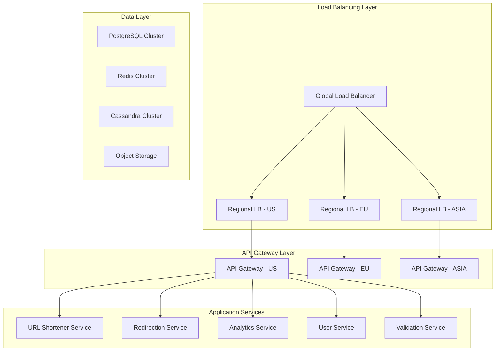
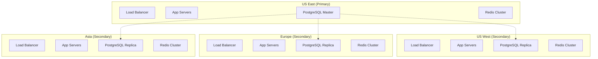

# URL Shortener - Scaling Strategy

## Scaling Overview

The URL shortener system is designed to handle massive scale with 100 million URLs created daily and 1 billion redirections per day. This document outlines the comprehensive scaling approach from initial deployment to global scale, focusing on horizontal scaling, intelligent caching, and geographic distribution.

## Scale Requirements Analysis

### Traffic Patterns

```
URL Creation: 100M URLs/day = 1,200/second average, 2,400/second peak
URL Redirections: 1B redirections/day = 12,000/second average, 24,000/second peak
Read/Write Ratio: 10:1 (heavily read-biased)
Geographic Distribution: Global with concentration in US (40%), Europe (30%), Asia (30%)
```

### Growth Projections

```
Year 1: 10B URLs stored, 100B redirections/year
Year 3: 100B URLs stored, 1T redirections/year
Year 5: 500B URLs stored, 5T redirections/year
```

## Horizontal Scaling Architecture

### Microservices Decomposition



### Service Scaling Strategies

#### URL Shortener Service

```python
class URLShortenerService:
    def __init__(self):
        self.base62_chars = "0123456789abcdefghijklmnopqrstuvwxyzABCDEFGHIJKLMNOPQRSTUVWXYZ"
        self.counter_service = CounterService()
        self.cache = RedisCache()

    def generate_short_code(self):
        # Use distributed counter for unique IDs
        unique_id = self.counter_service.get_next_id()
        return self.base62_encode(unique_id)

    def create_short_url(self, long_url, user_id=None, custom_alias=None):
        # Validate URL asynchronously
        self.validation_queue.publish({
            'url': long_url,
            'type': 'safety_check'
        })

        if custom_alias:
            short_code = custom_alias
            # Check availability in cache first, then database
            if self.cache.exists(f"url:{short_code}"):
                raise AliasAlreadyExistsError()
        else:
            short_code = self.generate_short_code()

        # Store in database
        url_record = self.db.create_url({
            'short_code': short_code,
            'long_url': long_url,
            'user_id': user_id
        })

        # Cache immediately for fast access
        self.cache.set(f"url:{short_code}", {
            'long_url': long_url,
            'status': 'active',
            'click_count': 0
        }, ttl=3600)

        return url_record
```

#### Redirection Service (High Performance)

```python
class RedirectionService:
    def __init__(self):
        self.cache = RedisCache()
        self.db = DatabasePool()
        self.analytics_queue = AnalyticsQueue()

    async def redirect(self, short_code, request_info):
        # L1 Cache: Check Redis first
        cached_url = await self.cache.get(f"url:{short_code}")

        if cached_url:
            # Cache hit - fast path
            long_url = cached_url['long_url']

            # Async analytics tracking (non-blocking)
            self.analytics_queue.publish_async({
                'short_code': short_code,
                'click_data': request_info,
                'timestamp': time.time()
            })

            return long_url

        # Cache miss - check database
        url_record = await self.db.get_url_by_short_code(short_code)

        if not url_record or url_record.status != 'active':
            raise URLNotFoundError()

        # Update cache for future requests
        await self.cache.set(f"url:{short_code}", {
            'long_url': url_record.long_url,
            'status': url_record.status,
            'expires_at': url_record.expires_at
        }, ttl=3600)

        # Track analytics
        self.analytics_queue.publish_async({
            'short_code': short_code,
            'click_data': request_info,
            'timestamp': time.time()
        })

        return url_record.long_url
```

## Database Scaling Strategy

### Sharding Implementation

#### URL Sharding Strategy

```python
class URLShardingManager:
    def __init__(self, num_shards=64):
        self.num_shards = num_shards
        self.shard_map = self._build_shard_map()

    def get_shard_for_short_code(self, short_code):
        """Consistent hashing for URL distribution"""
        hash_value = hashlib.md5(short_code.encode()).hexdigest()
        shard_id = int(hash_value, 16) % self.num_shards
        return f"urls_shard_{shard_id}"

    def get_shard_for_user(self, user_id):
        """User-based sharding for user operations"""
        shard_id = user_id % (self.num_shards // 4)  # Fewer user shards
        return f"users_shard_{shard_id}"

    def _build_shard_map(self):
        """Build mapping of shards to database connections"""
        shard_map = {}
        for i in range(self.num_shards):
            shard_map[f"urls_shard_{i}"] = {
                'master': f"postgres-urls-{i}-master.internal",
                'replicas': [
                    f"postgres-urls-{i}-replica-1.internal",
                    f"postgres-urls-{i}-replica-2.internal"
                ]
            }
        return shard_map
```

#### Read Replica Strategy

```python
class DatabaseLoadBalancer:
    def __init__(self):
        self.master_connections = {}
        self.replica_connections = {}
        self.replica_weights = {}

    def get_connection(self, shard_id, operation_type='read'):
        if operation_type == 'write':
            return self.master_connections[shard_id]

        # Load balance across read replicas
        replicas = self.replica_connections[shard_id]
        weights = self.replica_weights[shard_id]

        # Weighted random selection based on replica health
        return self._weighted_random_choice(replicas, weights)

    def _weighted_random_choice(self, replicas, weights):
        total_weight = sum(weights.values())
        r = random.uniform(0, total_weight)

        cumulative_weight = 0
        for replica, weight in weights.items():
            cumulative_weight += weight
            if r <= cumulative_weight:
                return replicas[replica]
```

### Auto-Scaling Database Infrastructure

```yaml
# PostgreSQL Auto-scaling Configuration
apiVersion: apps/v1
kind: Deployment
metadata:
  name: postgres-shard-replica
spec:
  replicas: 2
  template:
    spec:
      containers:
        - name: postgres
          image: postgres:14
          resources:
            requests:
              cpu: 2
              memory: 8Gi
            limits:
              cpu: 4
              memory: 16Gi
---
apiVersion: autoscaling/v2
kind: HorizontalPodAutoscaler
metadata:
  name: postgres-replica-hpa
spec:
  scaleTargetRef:
    apiVersion: apps/v1
    kind: Deployment
    name: postgres-shard-replica
  minReplicas: 2
  maxReplicas: 8
  metrics:
    - type: Resource
      resource:
        name: cpu
        target:
          type: Utilization
          averageUtilization: 70
    - type: Resource
      resource:
        name: memory
        target:
          type: Utilization
          averageUtilization: 80
```

## Caching Strategy

### Multi-Level Caching Architecture

```python
class MultiLevelCache:
    def __init__(self):
        self.l1_cache = LocalLRUCache(max_size=10000, ttl=300)  # 5 min
        self.l2_cache = RedisCluster(ttl=3600)  # 1 hour
        self.l3_cache = CDNCache(ttl=86400)  # 24 hours

    async def get(self, key):
        # L1: Local cache (fastest)
        value = self.l1_cache.get(key)
        if value:
            return value

        # L2: Redis cluster (fast)
        value = await self.l2_cache.get(key)
        if value:
            self.l1_cache.set(key, value)
            return value

        # L3: CDN cache (for static content)
        if self.is_cacheable_at_cdn(key):
            value = await self.l3_cache.get(key)
            if value:
                await self.l2_cache.set(key, value)
                self.l1_cache.set(key, value)
                return value

        return None

    async def set(self, key, value, ttl=None):
        # Set in all appropriate cache levels
        self.l1_cache.set(key, value, ttl)
        await self.l2_cache.set(key, value, ttl)

        if self.is_cacheable_at_cdn(key):
            await self.l3_cache.set(key, value, ttl)
```

### Intelligent Cache Warming

```python
class CacheWarmingService:
    def __init__(self):
        self.analytics_service = AnalyticsService()
        self.cache = MultiLevelCache()

    async def warm_popular_urls(self):
        """Proactively cache popular URLs"""
        # Get top 10K URLs by click count in last 24h
        popular_urls = await self.analytics_service.get_popular_urls(
            limit=10000,
            period='24h'
        )

        for url_data in popular_urls:
            await self.cache.set(
                f"url:{url_data['short_code']}",
                {
                    'long_url': url_data['long_url'],
                    'status': 'active',
                    'click_count': url_data['click_count']
                },
                ttl=7200  # 2 hours for popular URLs
            )

    async def warm_user_urls(self, user_id):
        """Cache recently created URLs for active users"""
        recent_urls = await self.db.get_user_recent_urls(
            user_id,
            limit=100,
            days=7
        )

        for url in recent_urls:
            await self.cache.set(
                f"url:{url.short_code}",
                {
                    'long_url': url.long_url,
                    'status': url.status
                },
                ttl=1800  # 30 minutes
            )
```

### Cache Invalidation Strategy

```python
class CacheInvalidationService:
    def __init__(self):
        self.cache = MultiLevelCache()
        self.message_queue = MessageQueue()

    async def invalidate_url(self, short_code, reason='update'):
        """Invalidate URL across all cache levels"""

        # Remove from all cache levels
        await self.cache.delete(f"url:{short_code}")

        # Publish invalidation event for distributed systems
        await self.message_queue.publish('cache.invalidation', {
            'key': f"url:{short_code}",
            'reason': reason,
            'timestamp': time.time()
        })

        # If URL was updated (not deleted), warm cache with new data
        if reason == 'update':
            url_data = await self.db.get_url_by_short_code(short_code)
            if url_data:
                await self.cache.set(f"url:{short_code}", {
                    'long_url': url_data.long_url,
                    'status': url_data.status
                })
```

## Geographic Distribution

### Multi-Region Deployment



### CDN Strategy for Global Performance

```python
class CDNManager:
    def __init__(self):
        self.cdn_endpoints = {
            'us': 'https://us.cdn.shorturl.com',
            'eu': 'https://eu.cdn.shorturl.com',
            'asia': 'https://asia.cdn.shorturl.com'
        }

    def get_redirect_url(self, short_code, user_location):
        """Return geographically optimized redirect URL"""

        # Determine best CDN endpoint based on user location
        cdn_endpoint = self._get_nearest_cdn(user_location)

        # For popular URLs, serve directly from CDN
        if self._is_popular_url(short_code):
            return f"{cdn_endpoint}/r/{short_code}"

        # For regular URLs, serve from nearest application server
        app_endpoint = self._get_nearest_app_server(user_location)
        return f"{app_endpoint}/r/{short_code}"

    def _get_nearest_cdn(self, user_location):
        """Select CDN endpoint based on geographic proximity"""
        if user_location.continent == 'NA':
            return self.cdn_endpoints['us']
        elif user_location.continent == 'EU':
            return self.cdn_endpoints['eu']
        elif user_location.continent == 'AS':
            return self.cdn_endpoints['asia']
        else:
            return self.cdn_endpoints['us']  # Default
```

## Auto-Scaling Configuration

### Application Auto-Scaling

```python
class AutoScalingManager:
    def __init__(self):
        self.metrics_collector = MetricsCollector()
        self.kubernetes_client = KubernetesClient()

    async def scale_based_on_metrics(self):
        """Auto-scale based on custom metrics"""

        current_metrics = await self.metrics_collector.get_current_metrics()

        # Scale URL Shortener Service
        if current_metrics['url_creation_rate'] > 2000:  # Peak threshold
            await self.kubernetes_client.scale_deployment(
                'url-shortener-service',
                replicas=20
            )
        elif current_metrics['url_creation_rate'] < 500:  # Low threshold
            await self.kubernetes_client.scale_deployment(
                'url-shortener-service',
                replicas=5
            )

        # Scale Redirection Service (most critical)
        if current_metrics['redirection_rate'] > 20000:  # Peak threshold
            await self.kubernetes_client.scale_deployment(
                'redirection-service',
                replicas=50
            )
        elif current_metrics['redirection_latency_p95'] > 100:  # Latency threshold
            await self.kubernetes_client.scale_deployment(
                'redirection-service',
                replicas=30
            )
```

### Database Connection Pool Scaling

```python
class DatabasePoolManager:
    def __init__(self):
        self.connection_pools = {}
        self.metrics = MetricsCollector()

    async def adjust_pool_sizes(self):
        """Dynamically adjust connection pool sizes"""

        for shard_id, pool in self.connection_pools.items():
            pool_metrics = await self.metrics.get_pool_metrics(shard_id)

            # Scale up if pool utilization is high
            if pool_metrics['utilization'] > 0.8:
                new_size = min(pool.max_size * 1.5, 200)  # Cap at 200
                await pool.resize(new_size)

            # Scale down if utilization is low
            elif pool_metrics['utilization'] < 0.3:
                new_size = max(pool.max_size * 0.7, 10)  # Minimum 10
                await pool.resize(new_size)
```

## Performance Optimization

### Short Code Generation Optimization

```python
class OptimizedShortCodeGenerator:
    def __init__(self):
        self.base62_chars = "0123456789abcdefghijklmnopqrstuvwxyzABCDEFGHIJKLMNOPQRSTUVWXYZ"
        self.counter_service = DistributedCounterService()

    def generate_batch(self, batch_size=1000):
        """Generate short codes in batches for better performance"""

        # Get a range of IDs from distributed counter
        start_id = self.counter_service.get_next_batch(batch_size)

        short_codes = []
        for i in range(batch_size):
            unique_id = start_id + i
            short_code = self.base62_encode(unique_id)
            short_codes.append(short_code)

        return short_codes

    def base62_encode(self, num):
        """Optimized base62 encoding"""
        if num == 0:
            return self.base62_chars[0]

        result = []
        while num:
            num, remainder = divmod(num, 62)
            result.append(self.base62_chars[remainder])

        return ''.join(reversed(result))
```

### Database Query Optimization

```sql
-- Optimized URL lookup query with covering index
CREATE INDEX CONCURRENTLY idx_urls_lookup_covering
ON urls (short_code)
INCLUDE (long_url, status, expires_at, click_count)
WHERE status = 'active';

-- Optimized user URL listing query
CREATE INDEX CONCURRENTLY idx_user_urls_optimized
ON urls (user_id, created_at DESC, status)
INCLUDE (short_code, long_url, click_count)
WHERE user_id IS NOT NULL;

-- Partitioned click events table for better performance
CREATE TABLE click_events_2024_01 PARTITION OF click_events
FOR VALUES FROM ('2024-01-01') TO ('2024-02-01');

-- Optimized analytics query
SELECT
    DATE_TRUNC('day', clicked_at) as date,
    COUNT(*) as clicks,
    COUNT(DISTINCT ip_address) as unique_clicks
FROM click_events
WHERE short_code = $1
    AND clicked_at >= $2
    AND clicked_at <= $3
GROUP BY DATE_TRUNC('day', clicked_at)
ORDER BY date;
```

## Monitoring and Alerting

### Key Performance Indicators

```python
class KPIMonitor:
    def __init__(self):
        self.metrics_client = MetricsClient()

    async def collect_kpis(self):
        """Collect key performance indicators"""

        return {
            # Performance KPIs
            'redirection_latency_p95': await self.get_redirection_latency_p95(),
            'redirection_latency_p99': await self.get_redirection_latency_p99(),
            'url_creation_latency_p95': await self.get_creation_latency_p95(),
            'cache_hit_rate': await self.get_cache_hit_rate(),

            # Throughput KPIs
            'redirections_per_second': await self.get_redirections_per_second(),
            'url_creations_per_second': await self.get_creations_per_second(),
            'api_requests_per_second': await self.get_api_requests_per_second(),

            # Reliability KPIs
            'error_rate': await self.get_error_rate(),
            'availability': await self.get_availability(),
            'database_connection_success_rate': await self.get_db_success_rate(),

            # Business KPIs
            'daily_active_urls': await self.get_daily_active_urls(),
            'click_through_rate': await self.get_click_through_rate(),
            'user_retention_rate': await self.get_user_retention_rate()
        }
```

### Auto-Scaling Triggers

```yaml
scaling_rules:
  redirection_service:
    scale_up:
      - metric: redirection_latency_p95
        threshold: 100ms
        duration: 2m
        action: increase_replicas_by_50_percent

      - metric: cpu_utilization
        threshold: 70%
        duration: 5m
        action: increase_replicas_by_25_percent

    scale_down:
      - metric: cpu_utilization
        threshold: 30%
        duration: 10m
        action: decrease_replicas_by_25_percent
        min_replicas: 5

  database_replicas:
    scale_up:
      - metric: connection_pool_utilization
        threshold: 80%
        duration: 3m
        action: add_read_replica

      - metric: query_queue_length
        threshold: 100
        duration: 2m
        action: add_read_replica
```

## Cost Optimization

### Resource Optimization Strategies

```python
class CostOptimizer:
    def __init__(self):
        self.cost_analyzer = CostAnalyzer()
        self.resource_manager = ResourceManager()

    async def optimize_costs(self):
        """Implement cost optimization strategies"""

        # 1. Use spot instances for non-critical workloads
        await self.migrate_analytics_to_spot_instances()

        # 2. Implement intelligent data tiering
        await self.implement_data_lifecycle_policies()

        # 3. Optimize cache sizes based on hit rates
        await self.optimize_cache_configurations()

        # 4. Use reserved instances for predictable workloads
        await self.purchase_reserved_instances()

    async def implement_data_lifecycle_policies(self):
        """Move old data to cheaper storage tiers"""

        # Move click events older than 90 days to cold storage
        old_events = await self.db.get_old_click_events(days=90)
        await self.archive_to_cold_storage(old_events)

        # Compress and archive old URL records
        inactive_urls = await self.db.get_inactive_urls(days=365)
        await self.compress_and_archive(inactive_urls)
```

### Cost Monitoring

```python
class CostMonitor:
    def __init__(self):
        self.cost_client = CloudCostClient()

    async def generate_cost_report(self):
        """Generate detailed cost breakdown"""

        return {
            'compute_costs': {
                'application_servers': await self.get_app_server_costs(),
                'database_servers': await self.get_database_costs(),
                'cache_servers': await self.get_cache_costs()
            },
            'storage_costs': {
                'database_storage': await self.get_db_storage_costs(),
                'object_storage': await self.get_object_storage_costs(),
                'backup_storage': await self.get_backup_costs()
            },
            'network_costs': {
                'cdn_bandwidth': await self.get_cdn_costs(),
                'inter_region_transfer': await self.get_transfer_costs(),
                'load_balancer': await self.get_lb_costs()
            },
            'total_monthly_cost': await self.get_total_monthly_cost(),
            'cost_per_million_redirections': await self.get_cost_per_million_redirections()
        }
```

This comprehensive scaling strategy ensures the URL shortener can handle massive growth while maintaining performance, reliability, and cost efficiency. The architecture is designed to scale horizontally across all components, with intelligent caching and geographic distribution to provide optimal user experience globally.
