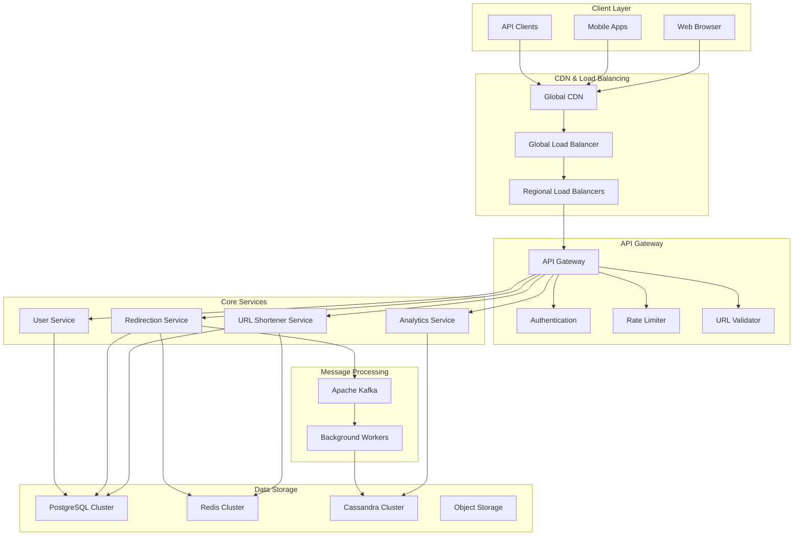

# URL Shortener - Complete Solution Walkthrough

## Solution Overview

This document provides a comprehensive walkthrough of designing a URL shortener service like bit.ly that can handle 100 million URLs created daily and 1 billion redirections per day. The solution demonstrates key system design principles including unique ID generation, horizontal scaling, intelligent caching, and analytics processing.

## Problem Analysis

### Scale Requirements Breakdown
- **URL Creation**: 100M URLs/day = 1,200/second average, 2,400/second peak
- **URL Redirections**: 1B redirections/day = 12,000/second average, 24,000/second peak
- **Read/Write Ratio**: 10:1 (heavily read-biased workload)
- **Storage**: 100B URLs over 5 years = ~50TB of URL data
- **Global Distribution**: Users worldwide requiring low latency

### Key Challenges
1. **Unique ID Generation**: Creating collision-free short codes at scale
2. **High Read Throughput**: Serving billions of redirections with low latency
3. **Data Consistency**: Ensuring URL mappings are always accurate
4. **Analytics Processing**: Real-time click tracking and aggregation
5. **Global Performance**: Low latency redirections worldwide

## High-Level Architecture



## Detailed Component Design

### 1. Unique Short Code Generation

The heart of any URL shortener is generating unique, collision-free short codes efficiently.

#### Base62 Encoding Strategy
```python
class ShortCodeGenerator:
    def __init__(self):
        self.base62_chars = "0123456789abcdefghijklmnopqrstuvwxyzABCDEFGHIJKLMNOPQRSTUVWXYZ"
        self.counter_service = DistributedCounterService()
    
    def generate_short_code(self):
        """Generate unique short code using distributed counter"""
        # Get unique ID from distributed counter
        unique_id = self.counter_service.get_next_id()
        
        # Convert to base62 for compact representation
        return self.base62_encode(unique_id)
    
    def base62_encode(self, num):
        """Convert number to base62 string"""
        if num == 0:
            return self.base62_chars[0]
        
        result = []
        while num:
            num, remainder = divmod(num, 62)
            result.append(self.base62_chars[remainder])
        
        return ''.join(reversed(result))

class DistributedCounterService:
    """Distributed counter using database sequences"""
    
    def __init__(self):
        self.db_shards = self._get_database_shards()
        self.current_shard = 0
    
    def get_next_id(self):
        """Get next unique ID with shard rotation"""
        shard = self.db_shards[self.current_shard % len(self.db_shards)]
        self.current_shard += 1
        
        # Each shard generates IDs with different offsets
        # Shard 0: 0, 4, 8, 12, ...
        # Shard 1: 1, 5, 9, 13, ...
        # Shard 2: 2, 6, 10, 14, ...
        # Shard 3: 3, 7, 11, 15, ...
        
        return shard.get_next_sequence_value()
```

#### Alternative: UUID-based Generation
```python
class UUIDShortCodeGenerator:
    """Alternative approach using UUIDs for better distribution"""
    
    def __init__(self):
        self.base62_chars = "0123456789abcdefghijklmnopqrstuvwxyzABCDEFGHIJKLMNOPQRSTUVWXYZ"
    
    def generate_short_code(self):
        """Generate short code from UUID"""
        # Generate UUID and take first 64 bits
        uuid_int = uuid.uuid4().int >> 64
        
        # Convert to base62 (results in ~11 character string)
        return self.base62_encode(uuid_int)[:7]  # Truncate to 7 chars
    
    def is_collision(self, short_code):
        """Check if short code already exists"""
        # Check cache first (fast)
        if self.cache.exists(f"url:{short_code}"):
            return True
        
        # Check database (slower but authoritative)
        return self.db.url_exists(short_code)
```

### 2. URL Shortening Service

```python
class URLShortenerService:
    def __init__(self):
        self.code_generator = ShortCodeGenerator()
        self.url_validator = URLValidator()
        self.cache = RedisCache()
        self.db = DatabaseService()
        self.analytics_queue = AnalyticsQueue()
    
    async def create_short_url(self, request):
        """Create a new short URL"""
        long_url = request.long_url
        user_id = request.user_id
        custom_alias = request.custom_alias
        
        # 1. Validate the URL
        if not await self.url_validator.is_valid_url(long_url):
            raise InvalidURLError("URL is not accessible or malicious")
        
        # 2. Handle custom alias or generate short code
        if custom_alias:
            if await self.is_alias_taken(custom_alias):
                raise AliasAlreadyExistsError("Custom alias already exists")
            short_code = custom_alias
        else:
            short_code = self.code_generator.generate_short_code()
            
            # Handle rare collision case
            while await self.is_short_code_taken(short_code):
                short_code = self.code_generator.generate_short_code()
        
        # 3. Store URL mapping
        url_record = await self.db.create_url({
            'short_code': short_code,
            'long_url': long_url,
            'user_id': user_id,
            'created_at': datetime.utcnow(),
            'status': 'active'
        })
        
        # 4. Cache for fast access
        await self.cache.set(f"url:{short_code}", {
            'long_url': long_url,
            'status': 'active',
            'created_at': url_record.created_at.isoformat()
        }, ttl=3600)
        
        # 5. Update user statistics (async)
        if user_id:
            self.analytics_queue.publish({
                'event': 'url_created',
                'user_id': user_id,
                'short_code': short_code,
                'timestamp': time.time()
            })
        
        return {
            'short_url': f"https://shorturl.com/{short_code}",
            'short_code': short_code,
            'long_url': long_url,
            'created_at': url_record.created_at.isoformat()
        }
    
    async def is_alias_taken(self, alias):
        """Check if custom alias is already taken"""
        # Check cache first
        if await self.cache.exists(f"url:{alias}"):
            return True
        
        # Check database
        return await self.db.url_exists_by_short_code(alias)
    
    async def is_short_code_taken(self, short_code):
        """Check if generated short code already exists"""
        return await self.is_alias_taken(short_code)
```

### 3. High-Performance Redirection Service

The redirection service is the most critical component as it handles the majority of traffic.

```python
class RedirectionService:
    def __init__(self):
        self.cache = MultiLevelCache()
        self.db = DatabaseService()
        self.analytics_queue = AnalyticsQueue()
        self.metrics = MetricsCollector()
    
    async def redirect(self, short_code, request_info):
        """Handle URL redirection with analytics tracking"""
        start_time = time.time()
        
        try:
            # 1. Get URL from cache (L1: Local, L2: Redis, L3: CDN)
            url_data = await self.cache.get(f"url:{short_code}")
            
            if url_data:
                # Cache hit - fast path
                long_url = url_data['long_url']
                cache_hit = True
            else:
                # Cache miss - check database
                url_record = await self.db.get_url_by_short_code(short_code)
                
                if not url_record:
                    raise URLNotFoundError("Short URL not found")
                
                if url_record.status != 'active':
                    if url_record.status == 'expired':
                        raise URLExpiredError("Short URL has expired")
                    else:
                        raise URLNotFoundError("Short URL is not active")
                
                long_url = url_record.long_url
                cache_hit = False
                
                # Update cache for future requests
                await self.cache.set(f"url:{short_code}", {
                    'long_url': long_url,
                    'status': url_record.status,
                    'expires_at': url_record.expires_at.isoformat() if url_record.expires_at else None
                }, ttl=3600)
            
            # 2. Track analytics (non-blocking)
            self._track_click_async(short_code, request_info, cache_hit)
            
            # 3. Record metrics
            latency = (time.time() - start_time) * 1000  # Convert to ms
            await self.metrics.record_redirection_latency(latency)
            await self.metrics.increment_redirection_count()
            
            return long_url
            
        except Exception as e:
            await self.metrics.increment_error_count(type(e).__name__)
            raise
    
    def _track_click_async(self, short_code, request_info, cache_hit):
        """Asynchronously track click event"""
        click_data = {
            'short_code': short_code,
            'timestamp': time.time(),
            'ip_address': request_info.ip_address,
            'user_agent': request_info.user_agent,
            'referrer': request_info.referrer,
            'country': request_info.country,
            'device_type': request_info.device_type,
            'cache_hit': cache_hit
        }
        
        # Publish to message queue for processing
        self.analytics_queue.publish_async('click_event', click_data)
```

### 4. Multi-Level Caching Strategy

```python
class MultiLevelCache:
    def __init__(self):
        # L1: Local in-memory cache (fastest, smallest)
        self.l1_cache = LRUCache(maxsize=10000, ttl=300)  # 5 minutes
        
        # L2: Distributed Redis cache (fast, larger)
        self.l2_cache = RedisCluster(
            nodes=['redis-1:6379', 'redis-2:6379', 'redis-3:6379'],
            default_ttl=3600  # 1 hour
        )
        
        # L3: CDN cache (global, largest)
        self.l3_cache = CDNCache(default_ttl=86400)  # 24 hours
    
    async def get(self, key):
        """Get value from multi-level cache"""
        # L1: Check local cache first
        value = self.l1_cache.get(key)
        if value:
            await self._record_cache_hit('L1')
            return value
        
        # L2: Check Redis cache
        value = await self.l2_cache.get(key)
        if value:
            # Populate L1 cache
            self.l1_cache.set(key, value)
            await self._record_cache_hit('L2')
            return value
        
        # L3: Check CDN cache (for popular URLs)
        if await self._is_popular_url(key):
            value = await self.l3_cache.get(key)
            if value:
                # Populate L2 and L1 caches
                await self.l2_cache.set(key, value)
                self.l1_cache.set(key, value)
                await self._record_cache_hit('L3')
                return value
        
        await self._record_cache_miss()
        return None
    
    async def set(self, key, value, ttl=None):
        """Set value in appropriate cache levels"""
        # Always set in L1 and L2
        self.l1_cache.set(key, value, ttl)
        await self.l2_cache.set(key, value, ttl)
        
        # Set in L3 (CDN) for popular URLs
        if await self._is_popular_url(key):
            await self.l3_cache.set(key, value, ttl)
    
    async def _is_popular_url(self, key):
        """Determine if URL should be cached at CDN level"""
        short_code = key.split(':')[1]
        
        # Check if URL has high click rate
        click_rate = await self.analytics.get_recent_click_rate(short_code)
        return click_rate > 100  # More than 100 clicks per hour
```

### 5. Analytics and Click Tracking

```python
class AnalyticsService:
    def __init__(self):
        self.kafka_consumer = KafkaConsumer(['click_events'])
        self.cassandra = CassandraClient()
        self.redis = RedisClient()
        self.batch_processor = BatchProcessor(batch_size=1000)
    
    async def process_click_events(self):
        """Process click events from Kafka queue"""
        async for message in self.kafka_consumer:
            click_data = json.loads(message.value)
            
            # Add to batch for processing
            await self.batch_processor.add(click_data)
            
            # Process batch when full
            if self.batch_processor.is_full():
                await self._process_batch()
    
    async def _process_batch(self):
        """Process a batch of click events"""
        batch = await self.batch_processor.get_batch()
        
        # 1. Update real-time counters in Redis
        await self._update_realtime_counters(batch)
        
        # 2. Store detailed events in Cassandra
        await self._store_detailed_events(batch)
        
        # 3. Update aggregated statistics
        await self._update_aggregated_stats(batch)
    
    async def _update_realtime_counters(self, batch):
        """Update real-time click counters in Redis"""
        pipeline = self.redis.pipeline()
        
        for event in batch:
            short_code = event['short_code']
            
            # Increment total click count
            pipeline.incr(f"clicks:total:{short_code}")
            
            # Increment hourly click count
            hour_key = f"clicks:hour:{short_code}:{self._get_current_hour()}"
            pipeline.incr(hour_key)
            pipeline.expire(hour_key, 86400)  # Expire after 24 hours
            
            # Track unique clicks (using HyperLogLog for memory efficiency)
            pipeline.pfadd(f"unique:daily:{short_code}:{self._get_current_date()}", 
                          event['ip_address'])
        
        await pipeline.execute()
    
    async def _store_detailed_events(self, batch):
        """Store detailed click events in Cassandra"""
        statements = []
        
        for event in batch:
            statement = self.cassandra.prepare("""
                INSERT INTO click_events (
                    short_code, clicked_date, clicked_hour, event_id,
                    ip_address, country_code, device_type, browser,
                    referrer, user_agent
                ) VALUES (?, ?, ?, ?, ?, ?, ?, ?, ?, ?)
            """)
            
            statements.append(statement.bind([
                event['short_code'],
                datetime.fromtimestamp(event['timestamp']).date(),
                datetime.fromtimestamp(event['timestamp']).hour,
                uuid.uuid1(),  # Time-based UUID
                event['ip_address'],
                event['country'],
                event['device_type'],
                event.get('browser'),
                event.get('referrer'),
                event['user_agent']
            ]))
        
        # Execute batch insert
        await self.cassandra.execute_batch(statements)
    
    async def get_url_analytics(self, short_code, period='7d'):
        """Get analytics data for a URL"""
        end_date = datetime.utcnow().date()
        
        if period == '7d':
            start_date = end_date - timedelta(days=7)
        elif period == '30d':
            start_date = end_date - timedelta(days=30)
        else:
            start_date = end_date - timedelta(days=1)
        
        # Get time series data
        time_series = await self._get_time_series_data(short_code, start_date, end_date)
        
        # Get geographic data
        geographic_data = await self._get_geographic_data(short_code, start_date, end_date)
        
        # Get referrer data
        referrer_data = await self._get_referrer_data(short_code, start_date, end_date)
        
        # Get device data
        device_data = await self._get_device_data(short_code, start_date, end_date)
        
        return {
            'short_code': short_code,
            'period': period,
            'total_clicks': sum(day['clicks'] for day in time_series),
            'time_series': time_series,
            'geographic_data': geographic_data,
            'referrer_data': referrer_data,
            'device_data': device_data
        }
```

### 6. Database Sharding Implementation

```python
class DatabaseShardingManager:
    def __init__(self):
        self.url_shards = self._initialize_url_shards()
        self.user_shards = self._initialize_user_shards()
        self.consistent_hash = ConsistentHashRing()
    
    def _initialize_url_shards(self):
        """Initialize URL database shards"""
        shards = {}
        for i in range(16):  # 16 URL shards
            shards[i] = DatabaseConnection(
                host=f"postgres-url-shard-{i}.internal",
                database=f"urls_shard_{i}",
                pool_size=20
            )
        return shards
    
    def get_url_shard(self, short_code):
        """Get database shard for URL operations"""
        # Use consistent hashing for even distribution
        shard_id = self.consistent_hash.get_node(short_code)
        return self.url_shards[shard_id]
    
    def get_user_shard(self, user_id):
        """Get database shard for user operations"""
        shard_id = user_id % len(self.user_shards)
        return self.user_shards[shard_id]
    
    async def create_url_with_sharding(self, url_data):
        """Create URL record in appropriate shard"""
        short_code = url_data['short_code']
        shard = self.get_url_shard(short_code)
        
        return await shard.execute("""
            INSERT INTO urls (short_code, long_url, user_id, created_at, status)
            VALUES (%(short_code)s, %(long_url)s, %(user_id)s, %(created_at)s, %(status)s)
            RETURNING *
        """, url_data)
    
    async def get_url_by_short_code(self, short_code):
        """Get URL record from appropriate shard"""
        shard = self.get_url_shard(short_code)
        
        result = await shard.fetch_one("""
            SELECT short_code, long_url, status, expires_at, click_count
            FROM urls 
            WHERE short_code = %(short_code)s
        """, {'short_code': short_code})
        
        return result
```

### 7. Global Load Balancing and CDN

```python
class GlobalLoadBalancer:
    def __init__(self):
        self.regions = {
            'us-east': {'weight': 40, 'endpoint': 'https://us-east.shorturl.com'},
            'us-west': {'weight': 20, 'endpoint': 'https://us-west.shorturl.com'},
            'europe': {'weight': 25, 'endpoint': 'https://eu.shorturl.com'},
            'asia': {'weight': 15, 'endpoint': 'https://asia.shorturl.com'}
        }
        self.health_checker = HealthChecker()
    
    async def route_request(self, request):
        """Route request to optimal region"""
        user_location = await self._get_user_location(request.ip_address)
        
        # Get healthy regions
        healthy_regions = await self._get_healthy_regions()
        
        # Select best region based on proximity and load
        best_region = self._select_best_region(user_location, healthy_regions)
        
        return self.regions[best_region]['endpoint']
    
    def _select_best_region(self, user_location, healthy_regions):
        """Select best region based on proximity and current load"""
        region_scores = {}
        
        for region in healthy_regions:
            # Calculate proximity score (lower is better)
            proximity_score = self._calculate_proximity(user_location, region)
            
            # Calculate load score (lower is better)
            load_score = self._get_current_load(region)
            
            # Combined score (weighted)
            region_scores[region] = proximity_score * 0.7 + load_score * 0.3
        
        # Return region with lowest score
        return min(region_scores, key=region_scores.get)

class CDNManager:
    def __init__(self):
        self.cdn_client = CloudFlareCDNClient()
        self.popular_urls_cache = PopularURLsCache()
    
    async def cache_popular_urls(self):
        """Cache popular URLs at CDN edge locations"""
        # Get top 1000 most clicked URLs in last hour
        popular_urls = await self.popular_urls_cache.get_top_urls(
            limit=1000, 
            period='1h'
        )
        
        for url_data in popular_urls:
            # Create CDN cache entry for direct redirection
            await self.cdn_client.cache_redirect(
                path=f"/{url_data['short_code']}",
                target_url=url_data['long_url'],
                ttl=3600  # 1 hour
            )
    
    async def invalidate_url_cache(self, short_code):
        """Invalidate CDN cache when URL is updated"""
        await self.cdn_client.purge_cache(f"/{short_code}")
```

## Performance Optimizations

### 1. Connection Pooling and Database Optimization

```python
class OptimizedDatabaseService:
    def __init__(self):
        self.connection_pools = {}
        self.prepared_statements = {}
        
    async def initialize_pools(self):
        """Initialize connection pools for all shards"""
        for shard_id in range(16):
            self.connection_pools[shard_id] = await asyncpg.create_pool(
                host=f"postgres-shard-{shard_id}.internal",
                database=f"urls_shard_{shard_id}",
                user="urlshortener",
                password=os.getenv("DB_PASSWORD"),
                min_size=10,
                max_size=50,
                command_timeout=30
            )
    
    async def prepare_statements(self):
        """Prepare frequently used SQL statements"""
        self.prepared_statements = {
            'get_url': "SELECT long_url, status, expires_at FROM urls WHERE short_code = $1",
            'create_url': """
                INSERT INTO urls (short_code, long_url, user_id, created_at, status) 
                VALUES ($1, $2, $3, $4, $5) RETURNING id
            """,
            'increment_clicks': "UPDATE urls SET click_count = click_count + 1 WHERE short_code = $1"
        }
```

### 2. Intelligent Caching Strategies

```python
class IntelligentCacheManager:
    def __init__(self):
        self.cache = RedisCluster()
        self.analytics = AnalyticsService()
        
    async def adaptive_ttl(self, short_code, base_ttl=3600):
        """Set TTL based on URL popularity"""
        click_rate = await self.analytics.get_click_rate(short_code, period='1h')
        
        if click_rate > 1000:  # Very popular
            return base_ttl * 4  # 4 hours
        elif click_rate > 100:  # Popular
            return base_ttl * 2  # 2 hours
        elif click_rate > 10:   # Moderate
            return base_ttl      # 1 hour
        else:                   # Low traffic
            return base_ttl // 2 # 30 minutes
    
    async def cache_warming(self):
        """Proactively warm cache with popular URLs"""
        # Get trending URLs
        trending_urls = await self.analytics.get_trending_urls(limit=1000)
        
        for url_data in trending_urls:
            await self.cache.set(
                f"url:{url_data['short_code']}",
                {
                    'long_url': url_data['long_url'],
                    'status': 'active'
                },
                ttl=await self.adaptive_ttl(url_data['short_code'])
            )
```

## Monitoring and Observability

### Key Metrics and Alerting

```python
class MetricsCollector:
    def __init__(self):
        self.prometheus_client = PrometheusClient()
        self.alert_manager = AlertManager()
    
    async def collect_system_metrics(self):
        """Collect comprehensive system metrics"""
        metrics = {
            # Performance Metrics
            'redirection_latency_p95': await self.get_redirection_latency_p95(),
            'redirection_latency_p99': await self.get_redirection_latency_p99(),
            'url_creation_latency_p95': await self.get_creation_latency_p95(),
            'cache_hit_rate': await self.get_cache_hit_rate(),
            
            # Throughput Metrics
            'redirections_per_second': await self.get_redirections_per_second(),
            'url_creations_per_second': await self.get_creations_per_second(),
            'api_requests_per_second': await self.get_api_requests_per_second(),
            
            # Error Metrics
            'error_rate_4xx': await self.get_4xx_error_rate(),
            'error_rate_5xx': await self.get_5xx_error_rate(),
            'database_connection_errors': await self.get_db_connection_errors(),
            
            # Resource Metrics
            'cpu_utilization': await self.get_cpu_utilization(),
            'memory_utilization': await self.get_memory_utilization(),
            'database_connection_pool_usage': await self.get_db_pool_usage(),
            
            # Business Metrics
            'daily_active_urls': await self.get_daily_active_urls(),
            'click_through_rate': await self.get_click_through_rate(),
            'user_retention_rate': await self.get_user_retention_rate()
        }
        
        # Send metrics to Prometheus
        for metric_name, value in metrics.items():
            self.prometheus_client.gauge(metric_name).set(value)
        
        # Check for alerts
        await self._check_alerts(metrics)
    
    async def _check_alerts(self, metrics):
        """Check metrics against alert thresholds"""
        alerts = []
        
        if metrics['redirection_latency_p95'] > 100:  # > 100ms
            alerts.append({
                'severity': 'warning',
                'message': f"High redirection latency: {metrics['redirection_latency_p95']}ms"
            })
        
        if metrics['error_rate_5xx'] > 0.01:  # > 1%
            alerts.append({
                'severity': 'critical',
                'message': f"High 5xx error rate: {metrics['error_rate_5xx']*100:.2f}%"
            })
        
        if metrics['cache_hit_rate'] < 0.85:  # < 85%
            alerts.append({
                'severity': 'warning',
                'message': f"Low cache hit rate: {metrics['cache_hit_rate']*100:.2f}%"
            })
        
        # Send alerts
        for alert in alerts:
            await self.alert_manager.send_alert(alert)
```

## Security Considerations

### URL Validation and Safety

```python
class URLSecurityService:
    def __init__(self):
        self.safe_browsing_client = GoogleSafeBrowsingClient()
        self.malware_scanner = MalwareScanner()
        self.domain_blacklist = DomainBlacklist()
    
    async def validate_url_safety(self, url):
        """Comprehensive URL safety validation"""
        
        # 1. Check domain blacklist
        domain = self._extract_domain(url)
        if await self.domain_blacklist.is_blacklisted(domain):
            raise MaliciousURLError("Domain is blacklisted")
        
        # 2. Check Google Safe Browsing
        safe_browsing_result = await self.safe_browsing_client.check_url(url)
        if not safe_browsing_result.is_safe:
            raise MaliciousURLError(f"URL flagged as {safe_browsing_result.threat_type}")
        
        # 3. Check for URL accessibility
        try:
            response = await self._check_url_accessibility(url)
            if response.status_code >= 400:
                raise InaccessibleURLError("URL is not accessible")
        except Exception:
            raise InaccessibleURLError("URL is not accessible")
        
        return True
    
    async def _check_url_accessibility(self, url):
        """Check if URL is accessible"""
        async with aiohttp.ClientSession(timeout=aiohttp.ClientTimeout(total=10)) as session:
            async with session.head(url) as response:
                return response
```

## Disaster Recovery and High Availability

### Multi-Region Failover

```python
class DisasterRecoveryManager:
    def __init__(self):
        self.primary_region = "us-east-1"
        self.secondary_regions = ["us-west-2", "eu-west-1"]
        self.health_monitor = HealthMonitor()
        self.dns_manager = DNSManager()
    
    async def monitor_and_failover(self):
        """Monitor primary region and failover if needed"""
        while True:
            primary_health = await self.health_monitor.check_region_health(self.primary_region)
            
            if not primary_health.is_healthy:
                await self._initiate_failover()
            
            await asyncio.sleep(30)  # Check every 30 seconds
    
    async def _initiate_failover(self):
        """Initiate failover to secondary region"""
        # 1. Select best secondary region
        best_secondary = await self._select_best_secondary_region()
        
        # 2. Update DNS to point to secondary region
        await self.dns_manager.update_dns_records(best_secondary)
        
        # 3. Promote read replicas to masters in secondary region
        await self._promote_read_replicas(best_secondary)
        
        # 4. Update load balancer configuration
        await self._update_load_balancer_config(best_secondary)
        
        # 5. Send notifications
        await self._send_failover_notifications(best_secondary)
```

## Cost Optimization

### Resource Optimization

```python
class CostOptimizationService:
    def __init__(self):
        self.cost_analyzer = CostAnalyzer()
        self.resource_manager = ResourceManager()
    
    async def optimize_infrastructure_costs(self):
        """Implement cost optimization strategies"""
        
        # 1. Use spot instances for analytics processing
        await self._migrate_analytics_to_spot_instances()
        
        # 2. Implement data lifecycle policies
        await self._implement_data_archival()
        
        # 3. Optimize cache sizes based on hit rates
        await self._optimize_cache_configurations()
        
        # 4. Use reserved instances for predictable workloads
        await self._optimize_reserved_instance_usage()
    
    async def _implement_data_archival(self):
        """Archive old data to cheaper storage"""
        
        # Archive click events older than 90 days
        cutoff_date = datetime.utcnow() - timedelta(days=90)
        
        old_events = await self.db.get_old_click_events(cutoff_date)
        await self.s3_client.archive_data(old_events, storage_class='GLACIER')
        await self.db.delete_old_click_events(cutoff_date)
        
        # Archive inactive URLs (no clicks in 1 year)
        inactive_urls = await self.db.get_inactive_urls(days=365)
        await self.s3_client.archive_data(inactive_urls, storage_class='DEEP_ARCHIVE')
```

## Conclusion

This URL shortener solution demonstrates a comprehensive approach to building a large-scale distributed system. Key architectural decisions include:

1. **Unique ID Generation**: Using distributed counters with base62 encoding for collision-free short codes
2. **Multi-Level Caching**: L1 (local), L2 (Redis), L3 (CDN) for optimal performance
3. **Database Sharding**: Horizontal partitioning for linear scalability
4. **Asynchronous Analytics**: Non-blocking click tracking with batch processing
5. **Global Distribution**: Multi-region deployment with intelligent load balancing
6. **Comprehensive Monitoring**: Real-time metrics and alerting for system health

The solution can handle 100 million URL creations and 1 billion redirections daily while maintaining sub-100ms redirection latency and providing rich analytics capabilities. The architecture is designed to be cost-effective, secure, and maintainable while supporting future growth and feature additions.