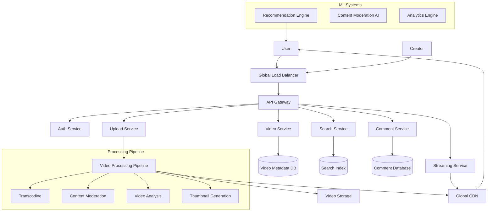

# YouTube System - Complete Solution

## System Overview

This document provides a comprehensive walkthrough of the YouTube system design, explaining how all components work together to deliver a seamless video sharing and streaming experience to 2+ billion users globally, handling 500+ hours of video uploads every minute and 5+ billion video views daily.

## Architecture Walkthrough

### High-Level System Flow

## Core System Flows

### 1. Video Upload Flow

The video

1. **Upload Validation*
2. **Temporary Storage**: Store raw video filcation
3. **Initial Scanning**: Quick virus scan and basic content on
4. **Queue Processing**: Add video to processing pipeline ba
5. **Transcoding**: Convert video to multiple formats andlutions
6. *
7. **Thumbnail Generation**: Create multiple thumbnail options
8. **CDN Distribution**: Distribute processed files globally
9. **Seah
10. **Notification**: Inform creator of completion sus

### 2. Video Streaming Flow

The streaming system provides adaptive bitrate streaming wry:

1. **Acc
2. **CDN Selection**: Choose optimal 
3. **Manifest Generation**: Create HLS/DASH manifest for adaptive streaming
4. **Quak
5. **Session Creation**: Track viewing sessiotics
6. **Ad Integration**: Insert relevant advertisements
7. **Rec
8. **Analytics Tracking**: Log viewing

### 3. Search and Discovery

The search system combines Elasticsearch with machine learning for pers:

1. **Query Processing**: Parse and unders
2. **Personalization**: Apces
3. **Elasticsearch Query**: Execuors
4. **Result Ranking**: Apply ML-based perso
5. **Suggestion Generation**: Pro
6. **Analytics Logging**: Track search behavior for improvements

## Key Components Deep Dive

### Video Processing Pipeline

- **Priority Queues**: High-priority processing for popular creators and l
- **Parallel Transcoding**: Simultaneous encoding to multiple formats and resolutis
- **Content Moderation**: AI-powered analysis for policy violations
- **Thumbnail Generation**: Automated thumbnail creation with quality 
- **Metadata Extraction**: Video analysis for search indexing as

System

y:

ons
- atching
- **Deep Learning Models**: Neural networks for complex pattern recognition
- **Real-time Signals**: Immediattions
- **Diversity types

### Global CDN Architecture

The content delivery network ensures low-latency video streaming worldwide:

- **Intelligent Caching**: 
- **Adaptiv
- **Edge Computing**: Processing at edge locations for reduced latency
- **Load Balancing**: Optimal routing based on server capacity and user locatio

## Performance Optimins

### Adaptive Bitrang (ABR)

YouTube's ABR system dynamically adjusts video quality based on:
- Ation
- Buffer health monitoring
- Device ct
- User preference consideration
- Network condition analysis

### Intelligent Caching Strategy

The caching system categorizes content into tiers:
- **Hot Tier**: Viral and trending content cached globally
- **Warm Tier**: Populonally
- **Cold Tier**: Regular content cached on-demand

### Database Optimization

- **Read Replicas**: Multiple read replicas for high-traffic quees
- **Sharding**: Horizontal parti
- **Caching**: Multi-layer caching with Redis for frequently accesata
- **Polyglot Persistence**: Different databaes

## Security and Content Moderation

### Content Moderation Pipeline

YouTube employs a comprehensive moderation system:

1. **AI Analysis**: Automated content scanning for policy vions
2. **ases
3. **Policy Engine**: Rule-based violation detection
4. **Appeal System**: Creator appeal process for disputed decisions
5. **Continuous Learning**: Model impmes

### es

- **DRM Protection**: Digital right
- **Access Control**: Fine-grained ps
- **Data Encryption**: End-to-end encryptta
- **Fraud Detection**: Autnt
- **Privacy Compliance**: GDPR, CCPA, easures

## Scalability Achievements

The YouTube systes:

- **2+ billion monthly active users**
- *
- **5+ billion videos watched daily**
- **Exabytes of video storage**
- **Global availability in 100+ countries**
- **Support for 80+ languages**
- **99.95% uptime 

## 

This YouTube syse.

The system's success liscale.nted deunpreceity at iabilance and relh performining hige maintahilration - wnt modesive conte comprehenons andecommendati rsonalizedution to pertent distriblobal conssing and gceme video pro real-tifromements - ire requersdle div hanbility tots aes in i