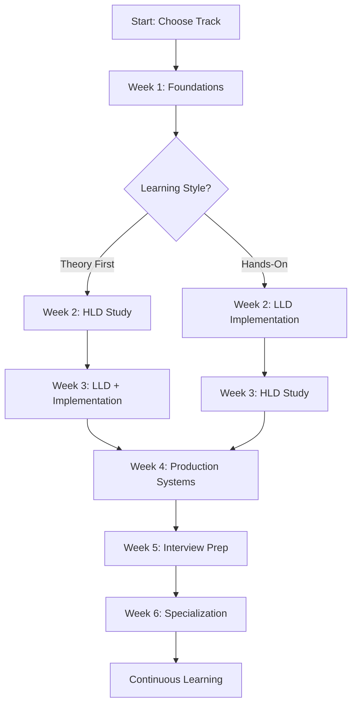

# Study Plan — Your Structured Learning Journey

> 🧭 **Navigation**: [← Interview Prep](../04-interview-prep/) | [📍 Full Navigation](../NAVIGATION.md) | [🎯 Start Learning!](../00-foundations/)

Transform from system design novice to expert with a structured 6-week curriculum, milestone tracking, and curated resources. Perfect for self-directed learners who want a clear path to mastery.

## 🗺️ Learning Roadmap

### Visual Learning Journey
See your complete path in **[roadmap.md](roadmap.md)** with interactive Mermaid diagrams showing:
- Multiple learning tracks (interview prep, general mastery, specialization)
- Time estimates and prerequisites
- Decision points for choosing your path
- Integration between different learning modules

## 📅 6-Week Structured Curriculum

### **[Complete Study Plan](study_plan.md)**
Comprehensive week-by-week breakdown with:
- **Daily Learning Objectives** — Clear goals for each study session
- **Time Allocation** — Realistic time commitments (1-2 hours/day)
- **Hands-On Exercises** — Practical coding and design exercises
- **Weekly Assessments** — Self-evaluation checkpoints
- **Progress Tracking** — Milestone completion tracking

### Weekly Overview
- **Week 1**: Foundations & Mental Models
- **Week 2**: Low-Level Design Components  
- **Week 3**: High-Level System Architecture
- **Week 4**: Production Systems & Implementation
- **Week 5**: Interview Preparation & Practice
- **Week 6**: Advanced Topics & Specialization

## 🎯 Milestone Tracking

### **[Learning Milestones](milestones.md)**
Measurable outcomes to track your progress:
- **Knowledge Checkpoints** — Self-assessment quizzes
- **Practical Exercises** — Hands-on implementation tasks
- **Design Challenges** — System design practice problems
- **Certification-Style Tests** — Comprehensive evaluations

### Progress Tracking System
- **Beginner** (Weeks 1-2): Foundation concepts and basic implementations
- **Intermediate** (Weeks 3-4): System design and production considerations
- **Advanced** (Weeks 5-6): Interview mastery and specialization

## 📚 Curated Resource Library

### **[References & Resources](references.md)**
Carefully selected materials organized by:
- **Books** — Essential reading with annotations and recommendations
- **Blogs & Articles** — Industry engineering blogs and technical papers
- **Videos & Courses** — Conference talks and online courses
- **Tools & Platforms** — Hands-on learning platforms and simulators

### Resource Categories
- **Foundational Reading** — Core system design principles
- **Company Engineering Blogs** — Real-world architecture insights
- **Academic Papers** — Distributed systems research
- **Interactive Learning** — Hands-on platforms and tools

## 🚀 Getting Started

### Choose Your Learning Track

#### 🎯 **Interview Preparation Track** (4-5 weeks)
Perfect for job seekers with tight timelines:
1. **Week 1**: [Foundations](../00-foundations/) + [Interview Framework](../04-interview-prep/frameworks.md)
2. **Week 2**: [Core Questions](../04-interview-prep/most_asked_questions.md) + [LLD Practice](../01-ll-designs/)
3. **Week 3**: [HLD Practice](../02-hl-designs/) + [Mock Interviews](../04-interview-prep/mock-interviews/)
4. **Week 4**: [Advanced Questions](../04-interview-prep/solutions/) + [Final Practice](../04-interview-prep/flashcards.json)

#### 📈 **Comprehensive Mastery Track** (6-8 weeks)
For thorough understanding and long-term growth:
1. **Weeks 1-2**: Complete [Foundations](../00-foundations/) with deep study
2. **Weeks 3-4**: Master [Low-Level](../01-ll-designs/) and [High-Level](../02-hl-designs/) designs
3. **Weeks 5-6**: Build [Implementations](../03-implementations/) and practice [Interviews](../04-interview-prep/)
4. **Weeks 7-8**: Specialization and advanced topics

#### 🛠️ **Hands-On Builder Track** (5-6 weeks)
For developers who learn by building:
1. **Week 1**: [Foundations](../00-foundations/) + first [LLD implementation](../01-ll-designs/lru_cache/)
2. **Week 2**: Complete [Low-Level Designs](../01-ll-designs/) in your preferred language
3. **Week 3**: Deploy [Production Implementations](../03-implementations/)
4. **Week 4**: Study [High-Level Designs](../02-hl-designs/) through implementation lens
5. **Week 5**: [Interview Prep](../04-interview-prep/) with focus on implementation details

### Daily Study Routine

#### **Weekday Sessions** (1-1.5 hours)
- **20 minutes**: Review previous day's concepts
- **40 minutes**: New content study (reading + note-taking)
- **20 minutes**: Hands-on practice or coding
- **10 minutes**: Update progress tracking

#### **Weekend Sessions** (2-3 hours)
- **30 minutes**: Week review and consolidation
- **90 minutes**: Major project or system design practice
- **30 minutes**: Mock interview or assessment
- **30 minutes**: Plan next week and update goals

## 📊 Progress Tracking Tools

### Self-Assessment Framework
Regular evaluation across key dimensions:

**Technical Knowledge (40%)**
- Core concepts understanding
- Design pattern recognition
- Trade-off analysis skills
- Implementation knowledge

**Practical Skills (35%)**
- System design ability
- Code implementation quality
- Problem-solving approach
- Tool and technology usage

**Communication (25%)**
- Explanation clarity
- Diagram drawing skills
- Interview performance
- Teaching others

### Weekly Reflection Template
```markdown
## Week X Reflection

### Completed This Week
- [ ] Learning objectives achieved
- [ ] Hands-on exercises completed
- [ ] Milestone assessments passed

### Key Insights
- What concepts clicked for you?
- Which areas need more practice?
- How will you apply this knowledge?

### Next Week Focus
- Priority topics to study
- Specific skills to practice
- Goals and success metrics
```

## 🎯 Learning Strategies

### Active Learning Techniques
- **Teach Back Method** — Explain concepts to others or record yourself
- **Implementation Practice** — Code every concept you learn
- **System Design Sketching** — Draw architectures from memory
- **Question Generation** — Create your own interview questions

### Retention Strategies
- **Spaced Repetition** — Review concepts at increasing intervals
- **Interleaving** — Mix different topics in study sessions
- **Elaborative Interrogation** — Ask "why" and "how" questions
- **Dual Coding** — Combine visual and verbal learning

### Motivation Maintenance
- **Progress Visualization** — Track completion and celebrate milestones
- **Community Engagement** — Join study groups or online communities
- **Real-World Application** — Apply concepts in current work projects
- **Goal Setting** — Set specific, measurable learning objectives

## 🔗 Integration with Repository

### Cross-References
- **Foundations** → Applied in all subsequent modules
- **Low-Level Designs** → Building blocks for high-level systems
- **High-Level Designs** → Context for interview questions
- **Implementations** → Practical validation of concepts
- **Interview Prep** → Application of all learned concepts

### Recommended Study Flow


## 🎯 Success Metrics

### Knowledge Milestones
- **Foundation Mastery**: Can explain core concepts with analogies
- **Design Competency**: Can design medium-complexity systems
- **Implementation Skills**: Can build and deploy microservices
- **Interview Readiness**: Can handle system design interviews confidently

### Practical Outcomes
- **Portfolio Projects**: 3-5 implemented system components
- **Design Portfolio**: 5-10 system design case studies
- **Interview Performance**: Confident in system design discussions
- **Continuous Learning**: Established habits for ongoing growth

## 🎯 Next Steps

### After Completing Study Plan
- **Advanced Specialization** — Deep dive into specific domains (ML systems, fintech, etc.)
- **Real-World Application** — Apply concepts in work projects
- **Community Contribution** — Share knowledge through blogs, talks, or open source
- **Mentoring Others** — Help other learners on their system design journey

### Continuous Learning Path
- **Stay Current** — Follow industry trends and new technologies
- **Hands-On Practice** — Build increasingly complex systems
- **Professional Growth** — Seek system design responsibilities at work
- **Knowledge Sharing** — Contribute to the learning community

---

*📈 **Success Formula**: Consistency + Practice + Application = System Design Mastery. Start today, stay committed, and you'll be amazed at your progress in just 6 weeks!*