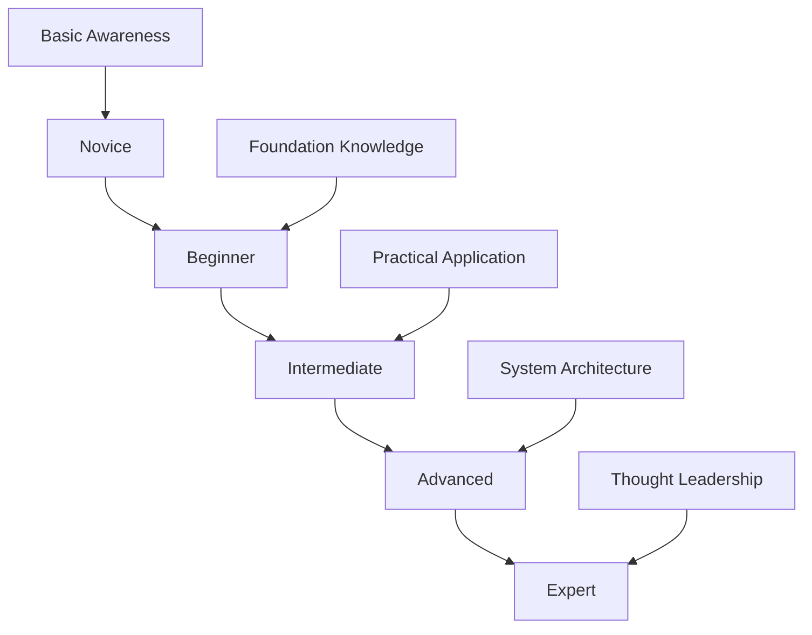

# System Design Learning Milestones

## Overview

This milestone tracking system provides measurable learning outcomes, self-assessment tools, and certification-style checkpoints to track your progress through the system design curriculum. Each milestone builds upon previous achievements and prepares you for the next level of complexity.

## Milestone Framework

### Competency Levels



### Assessment Dimensions

Each milestone is evaluated across four key dimensions:

1. **Knowledge**: Theoretical understanding of concepts
2. **Application**: Ability to apply concepts to solve problems
3. **Communication**: Skill in explaining and discussing designs
4. **Implementation**: Capability to build and validate solutions

---

## Milestone 1: Foundation Mastery
**Target**: End of Week 1
**Level**: Beginner
**Prerequisites**: Basic programming knowledge

### Learning Outcomes

By completing this milestone, you will be able to:

- **Explain** the fundamental principles of system scalability
- **Compare** different approaches to load balancing and caching
- **Apply** CAP theorem to analyze real-world systems
- **Identify** appropriate database choices for different use cases
- **Articulate** the trade-offs between consistency and availability

### Self-Assessment Checklist

#### Knowledge Assessment (25 points)
- [ ] Can define horizontal vs vertical scaling (5 points)
- [ ] Can explain at least 3 load balancing algorithms (5 points)
- [ ] Can describe 4 different caching patterns (5 points)
- [ ] Can compare SQL vs NoSQL databases (5 points)
- [ ] Can explain CAP theorem with examples (5 points)

#### Application Assessment (25 points)
- [ ] Can choose appropriate scaling strategy for given scenario (5 points)
- [ ] Can design load balancer configuration for specific requirements (5 points)
- [ ] Can select caching strategy based on access patterns (5 points)
- [ ] Can choose database type based on application needs (5 points)
- [ ] Can analyze system through CAP theorem lens (5 points)

#### Communication Assessment (25 points)
- [ ] Can explain concepts using analogies and examples (10 points)
- [ ] Can justify design decisions with clear reasoning (10 points)
- [ ] Can discuss trade-offs without technical jargon (5 points)

#### Implementation Assessment (25 points)
- [ ] Can draw system architecture diagrams (10 points)
- [ ] Can create basic system design documentation (10 points)
- [ ] Can estimate system capacity requirements (5 points)

**Total Score**: ___/100 points
**Passing Score**: 75 points

### Practical Exercises

#### Exercise 1: Scaling Analysis
**Time**: 30 minutes
**Scenario**: A social media startup is experiencing rapid growth

**Task**: Design the scaling evolution from 1,000 to 10 million users
**Deliverable**: Architecture diagram with scaling milestones
**Assessment Criteria**:
- Identifies appropriate scaling points
- Chooses correct scaling strategies
- Explains reasoning for each decision

#### Exercise 2: System Trade-off Analysis
**Time**: 45 minutes
**Scenario**: Design a global chat application

**Task**: Analyze consistency vs availability trade-offs
**Deliverable**: Written analysis with recommendations
**Assessment Criteria**:
- Applies CAP theorem correctly
- Identifies real-world implications
- Provides balanced recommendations

### Knowledge Check Quiz

#### Question 1: Scalability Concepts
Which scaling approach is most appropriate for a CPU-intensive application with predictable load patterns?
a) Horizontal scaling with auto-scaling
b) Vertical scaling with scheduled scaling
c) Hybrid approach with load balancing
d) Database sharding with read replicas

**Answer**: b) Vertical scaling with scheduled scaling
**Explanation**: Predictable CPU-intensive workloads benefit from vertical scaling as it's simpler to manage and doesn't require application changes.

#### Question 2: Caching Strategy
For a news website with articles that are frequently read but rarely updated, which caching pattern is most appropriate?
a) Write-through cache
b) Write-behind cache
c) Cache-aside pattern
d) Write-around cache

**Answer**: c) Cache-aside pattern
**Explanation**: Cache-aside works well for read-heavy workloads where data doesn't change frequently, allowing lazy loading of popular content.

#### Question 3: CAP Theorem Application
A financial trading system requires strong consistency and must continue operating during network partitions. According to CAP theorem, what must be sacrificed?
a) Consistency
b) Availability
c) Partition tolerance
d) None - all three can be maintained

**Answer**: b) Availability
**Explanation**: CAP theorem states you can only guarantee two of the three properties. Financial systems typically choose consistency and partition tolerance over availability.

### Milestone Completion Criteria

To complete Milestone 1, you must:
1. **Score 75+ points** on the self-assessment checklist
2. **Complete both practical exercises** with satisfactory results
3. **Pass the knowledge check quiz** with 80% or higher
4. **Demonstrate understanding** in a 15-minute self-explanation session

---

## Milestone 2: Implementation Proficiency
**Target**: End of Week 2
**Level**: Intermediate
**Prerequisites**: Milestone 1 completion

### Learning Outcomes

By completing this milestone, you will be able to:

- **Implement** core system components from scratch
- **Analyze** algorithmic trade-offs in system design
- **Design** efficient data structures for specific use cases
- **Optimize** implementations for performance and scalability
- **Test** and validate system component behavior

### Self-Assessment Checklist

#### Knowledge Assessment (25 points)
- [ ] Can explain time/space complexity of implemented algorithms (5 points)
- [ ] Can describe design patterns used in implementations (5 points)
- [ ] Can identify optimization opportunities (5 points)
- [ ] Can explain thread safety and concurrency considerations (5 points)
- [ ] Can describe testing strategies for system components (5 points)

#### Application Assessment (25 points)
- [ ] Can implement LRU cache with optimal complexity (5 points)
- [ ] Can implement rate limiter with multiple algorithms (5 points)
- [ ] Can implement consistent hashing with virtual nodes (5 points)
- [ ] Can implement message queue with proper semantics (5 points)
- [ ] Can implement bloom filter with configurable parameters (5 points)

#### Communication Assessment (25 points)
- [ ] Can explain implementation decisions and trade-offs (10 points)
- [ ] Can walk through code logic clearly (10 points)
- [ ] Can discuss alternative implementation approaches (5 points)

#### Implementation Assessment (25 points)
- [ ] Code is clean, readable, and well-documented (10 points)
- [ ] Implementation handles edge cases correctly (5 points)
- [ ] Tests cover critical functionality (5 points)
- [ ] Performance meets expected benchmarks (5 points)

**Total Score**: ___/100 points
**Passing Score**: 80 points

### Practical Exercises

#### Exercise 1: Multi-Language Implementation
**Time**: 2 hours
**Task**: Implement the same data structure in two different languages

**Requirements**:
- Choose one: LRU Cache, Rate Limiter, or Consistent Hashing
- Implement in two languages (e.g., Python and Java)
- Include comprehensive test cases
- Document performance characteristics

**Assessment Criteria**:
- Correctness of implementation
- Code quality and documentation
- Test coverage and edge cases
- Performance analysis

#### Exercise 2: Performance Optimization
**Time**: 1.5 hours
**Task**: Optimize an existing implementation for better performance

**Requirements**:
- Start with a basic implementation
- Identify performance bottlenecks
- Apply optimization techniques
- Measure and document improvements

**Assessment Criteria**:
- Identifies real bottlenecks
- Applies appropriate optimizations
- Measures performance improvements
- Maintains correctness

### Coding Challenges

#### Challenge 1: LRU Cache with TTL
**Difficulty**: Medium
**Time Limit**: 45 minutes

Implement an LRU cache that also supports time-to-live (TTL) for entries.

**Requirements**:
- Standard LRU eviction policy
- TTL-based expiration
- O(1) get and put operations
- Thread-safe implementation

**Test Cases**:
```python
cache = LRUCacheWithTTL(capacity=3, default_ttl=5)
cache.put("key1", "value1")  # expires in 5 seconds
cache.put("key2", "value2", ttl=10)  # expires in 10 seconds
assert cache.get("key1") == "value1"
# ... after 6 seconds
assert cache.get("key1") is None  # expired
assert cache.get("key2") == "value2"  # still valid
```

#### Challenge 2: Distributed Rate Limiter
**Difficulty**: Hard
**Time Limit**: 60 minutes

Implement a distributed rate limiter using Redis as the backend.

**Requirements**:
- Token bucket algorithm
- Distributed across multiple instances
- Configurable rate and burst size
- Handle Redis failures gracefully

**Test Cases**:
```python
limiter = DistributedRateLimiter(redis_client, rate=10, burst=20)
for i in range(15):
    assert limiter.allow_request("user123") == (i < 20)
# Wait for token refill
time.sleep(1)
assert limiter.allow_request("user123") == True
```

### Milestone Completion Criteria

To complete Milestone 2, you must:
1. **Score 80+ points** on the self-assessment checklist
2. **Complete both practical exercises** with good quality
3. **Solve at least one coding challenge** within time limit
4. **Code review session** with peer or mentor feedback

---

## Milestone 3: System Architecture Competency
**Target**: End of Week 3
**Level**: Intermediate-Advanced
**Prerequisites**: Milestone 2 completion

### Learning Outcomes

By completing this milestone, you will be able to:

- **Design** complete distributed systems with proper component interaction
- **Analyze** system requirements and translate them into architecture
- **Evaluate** trade-offs between different architectural approaches
- **Scale** systems to handle increasing load and complexity
- **Document** system designs with clear communication

### Self-Assessment Checklist

#### Knowledge Assessment (25 points)
- [ ] Can identify system requirements from problem descriptions (5 points)
- [ ] Can choose appropriate architectural patterns (5 points)
- [ ] Can design APIs and data models (5 points)
- [ ] Can plan system scaling strategies (5 points)
- [ ] Can analyze failure modes and design for reliability (5 points)

#### Application Assessment (25 points)
- [ ] Can design URL shortener with proper scaling (5 points)
- [ ] Can design social media feed system (5 points)
- [ ] Can design ride-sharing system with real-time components (5 points)
- [ ] Can design video streaming platform (5 points)
- [ ] Can design search system with indexing strategy (5 points)

#### Communication Assessment (25 points)
- [ ] Can present system design clearly and logically (10 points)
- [ ] Can justify architectural decisions with data (10 points)
- [ ] Can discuss alternative approaches and trade-offs (5 points)

#### Implementation Assessment (25 points)
- [ ] Creates comprehensive system documentation (10 points)
- [ ] Designs realistic APIs and data schemas (10 points)
- [ ] Estimates system capacity and performance (5 points)

**Total Score**: ___/100 points
**Passing Score**: 85 points

### Practical Exercises

#### Exercise 1: Complete System Design
**Time**: 3 hours
**Task**: Design a complete system from requirements to implementation plan

**Scenario**: Design a real-time collaborative document editing system (like Google Docs)

**Requirements**:
- Support 1M+ concurrent users
- Real-time collaboration with conflict resolution
- Document versioning and history
- Offline support with sync
- Global availability

**Deliverables**:
- Requirements analysis
- System architecture diagram
- API design specification
- Database schema design
- Scaling and deployment strategy

**Assessment Criteria**:
- Completeness of design
- Appropriate technology choices
- Realistic scaling approach
- Clear documentation

#### Exercise 2: System Evolution Planning
**Time**: 2 hours
**Task**: Plan the evolution of a system from MVP to scale

**Scenario**: A startup's messaging app is growing from 10K to 10M users

**Requirements**:
- Plan architecture evolution in phases
- Identify migration challenges
- Estimate costs and timelines
- Design backward compatibility strategy

**Deliverables**:
- Evolution roadmap with milestones
- Migration strategy document
- Risk assessment and mitigation
- Resource planning estimates

### System Design Challenges

#### Challenge 1: Design Instagram
**Time Limit**: 60 minutes
**Complexity**: High

Design a photo-sharing social media platform.

**Requirements**:
- Upload and share photos
- Follow users and view feeds
- Like and comment on photos
- Search and discovery features
- Handle 500M+ users globally

**Focus Areas**:
- Image storage and CDN strategy
- Feed generation algorithms
- Search and recommendation systems
- Global scaling and data consistency

#### Challenge 2: Design Uber
**Time Limit**: 60 minutes
**Complexity**: High

Design a ride-sharing platform.

**Requirements**:
- Match riders with drivers
- Real-time location tracking
- Dynamic pricing
- Payment processing
- Trip history and ratings

**Focus Areas**:
- Geospatial indexing and matching
- Real-time communication
- Pricing algorithms
- Payment system integration

### Architecture Review Rubric

#### System Completeness (25 points)
- [ ] All major components identified (5 points)
- [ ] Component interactions clearly defined (5 points)
- [ ] Data flow properly designed (5 points)
- [ ] External integrations considered (5 points)
- [ ] Monitoring and observability included (5 points)

#### Technical Soundness (25 points)
- [ ] Appropriate technology choices (5 points)
- [ ] Realistic performance estimates (5 points)
- [ ] Proper error handling strategy (5 points)
- [ ] Security considerations addressed (5 points)
- [ ] Scalability plan is feasible (5 points)

#### Communication Quality (25 points)
- [ ] Clear and logical presentation (10 points)
- [ ] Appropriate level of detail (5 points)
- [ ] Good use of diagrams and visuals (5 points)
- [ ] Addresses audience questions effectively (5 points)

#### Trade-off Analysis (25 points)
- [ ] Identifies key trade-offs (10 points)
- [ ] Provides reasoning for decisions (10 points)
- [ ] Considers alternative approaches (5 points)

### Milestone Completion Criteria

To complete Milestone 3, you must:
1. **Score 85+ points** on the self-assessment checklist
2. **Complete both practical exercises** with high quality
3. **Successfully design one system** from the challenges
4. **Pass architecture review** with 80+ points on rubric

---

## Milestone 4: Advanced System Mastery
**Target**: End of Week 4
**Level**: Advanced
**Prerequisites**: Milestone 3 completion

### Learning Outcomes

By completing this milestone, you will be able to:

- **Architect** complex, specialized systems with advanced requirements
- **Optimize** systems for specific performance and cost constraints
- **Design** for advanced scenarios like multi-tenancy and global scale
- **Integrate** multiple specialized systems into cohesive platforms
- **Lead** technical discussions and architectural decision-making

### Self-Assessment Checklist

#### Knowledge Assessment (25 points)
- [ ] Can design multi-tenant architectures (5 points)
- [ ] Can architect for global scale and compliance (5 points)
- [ ] Can design advanced data processing systems (5 points)
- [ ] Can integrate ML/AI systems into architectures (5 points)
- [ ] Can design for advanced security and privacy requirements (5 points)

#### Application Assessment (25 points)
- [ ] Can design financial/payment systems with compliance (5 points)
- [ ] Can design ML serving platforms with model management (5 points)
- [ ] Can design real-time analytics and monitoring systems (5 points)
- [ ] Can design multi-region disaster recovery systems (5 points)
- [ ] Can design complex workflow and orchestration systems (5 points)

#### Communication Assessment (25 points)
- [ ] Can lead architectural discussions and reviews (10 points)
- [ ] Can communicate with both technical and business stakeholders (10 points)
- [ ] Can mentor others in system design principles (5 points)

#### Implementation Assessment (25 points)
- [ ] Can create detailed implementation roadmaps (10 points)
- [ ] Can estimate complex project timelines and resources (10 points)
- [ ] Can design comprehensive testing and validation strategies (5 points)

**Total Score**: ___/100 points
**Passing Score**: 90 points

### Advanced Challenges

#### Challenge 1: Multi-Tenant SaaS Platform
**Time Limit**: 90 minutes
**Complexity**: Expert

Design a multi-tenant SaaS platform for project management.

**Requirements**:
- Support 10K+ organizations with 100K+ users each
- Tenant isolation for data and performance
- Configurable features per tenant
- Global deployment with data residency requirements
- Advanced analytics and reporting

**Advanced Considerations**:
- Tenant onboarding and provisioning
- Resource allocation and billing
- Compliance with GDPR, SOC2, etc.
- Advanced security and audit logging

#### Challenge 2: Real-Time ML Serving Platform
**Time Limit**: 90 minutes
**Complexity**: Expert

Design a platform for serving machine learning models at scale.

**Requirements**:
- Support multiple ML frameworks
- A/B testing for model versions
- Real-time and batch inference
- Model monitoring and drift detection
- Auto-scaling based on demand

**Advanced Considerations**:
- Model versioning and rollback
- Feature store integration
- GPU resource management
- Cost optimization strategies

### Capstone Project

#### Project: Design Your Own Complex System
**Time**: 4-6 hours over multiple sessions
**Task**: Choose and design a complex system relevant to your interests

**Options**:
- Healthcare data platform with privacy requirements
- Financial trading system with low-latency requirements
- IoT platform with edge computing
- Gaming platform with real-time multiplayer
- Supply chain management system

**Requirements**:
- Complete system design from requirements to deployment
- Address advanced technical challenges
- Include business and operational considerations
- Present to peers for feedback

**Deliverables**:
- Comprehensive design document (20+ pages)
- Architecture diagrams and data models
- Implementation roadmap with milestones
- Risk assessment and mitigation strategies
- Presentation to technical audience

### Expert-Level Assessment

#### Technical Leadership Scenarios

**Scenario 1: Architecture Migration**
You're leading the migration of a monolithic e-commerce platform to microservices for a company with 50M+ users.

**Questions**:
- How do you plan the migration strategy?
- How do you maintain system availability during migration?
- How do you handle data consistency during the transition?
- How do you measure migration success?

**Assessment Criteria**:
- Demonstrates understanding of migration complexity
- Provides realistic timeline and approach
- Addresses business continuity concerns
- Shows leadership and communication skills

**Scenario 2: Performance Crisis**
A critical system is experiencing performance degradation affecting millions of users.

**Questions**:
- How do you approach the investigation?
- How do you prioritize immediate vs long-term fixes?
- How do you communicate with stakeholders during the crisis?
- How do you prevent similar issues in the future?

**Assessment Criteria**:
- Shows systematic problem-solving approach
- Balances immediate and strategic concerns
- Demonstrates crisis management skills
- Includes preventive measures

### Milestone Completion Criteria

To complete Milestone 4, you must:
1. **Score 90+ points** on the self-assessment checklist
2. **Complete one advanced challenge** with expert-level quality
3. **Successfully complete capstone project** with peer review
4. **Demonstrate leadership** in technical scenarios

---

## Milestone 5: Implementation Excellence
**Target**: End of Week 5
**Level**: Advanced-Expert
**Prerequisites**: Milestone 4 completion

### Learning Outcomes

By completing this milestone, you will be able to:

- **Build** production-quality system components
- **Validate** system designs through implementation
- **Optimize** implementations for performance and reliability
- **Test** systems comprehensively including failure scenarios
- **Deploy** and monitor systems in production-like environments

### Self-Assessment Checklist

#### Knowledge Assessment (25 points)
- [ ] Can translate designs into implementable components (5 points)
- [ ] Can choose appropriate technologies and frameworks (5 points)
- [ ] Can design comprehensive testing strategies (5 points)
- [ ] Can implement monitoring and observability (5 points)
- [ ] Can handle deployment and operational concerns (5 points)

#### Application Assessment (25 points)
- [ ] Can build scalable web services with proper APIs (5 points)
- [ ] Can implement data persistence with consistency guarantees (5 points)
- [ ] Can build distributed communication mechanisms (5 points)
- [ ] Can implement caching and performance optimizations (5 points)
- [ ] Can build monitoring and alerting systems (5 points)

#### Communication Assessment (25 points)
- [ ] Can document implementation decisions clearly (10 points)
- [ ] Can explain code architecture and design patterns (10 points)
- [ ] Can provide constructive code review feedback (5 points)

#### Implementation Assessment (25 points)
- [ ] Code follows best practices and is production-ready (10 points)
- [ ] Implementation handles edge cases and failures gracefully (5 points)
- [ ] Comprehensive test coverage including integration tests (5 points)
- [ ] Performance meets design specifications (5 points)

**Total Score**: ___/100 points
**Passing Score**: 85 points

### Implementation Projects

#### Project 1: Distributed Cache Service
**Time**: 8-12 hours
**Complexity**: High

Build a production-ready distributed cache service.

**Requirements**:
- REST API for cache operations
- Multiple eviction policies (LRU, LFU, TTL)
- Distributed consistency with multiple nodes
- Monitoring and metrics collection
- Docker deployment with orchestration

**Technical Specifications**:
- Sub-millisecond response times
- 99.9% availability
- Horizontal scaling support
- Comprehensive logging and metrics

#### Project 2: Message Queue System
**Time**: 10-15 hours
**Complexity**: High

Build a reliable message queue system.

**Requirements**:
- Topic-based pub/sub messaging
- Message persistence and durability
- Consumer groups and load balancing
- Dead letter queues for failed messages
- Management API and monitoring dashboard

**Technical Specifications**:
- At-least-once delivery guarantees
- Support for 10K+ messages/second
- Message ordering within partitions
- Configurable retention policies

### Code Quality Standards

#### Architecture Quality (25 points)
- [ ] Clear separation of concerns (5 points)
- [ ] Appropriate design patterns usage (5 points)
- [ ] Modular and extensible design (5 points)
- [ ] Proper error handling and logging (5 points)
- [ ] Configuration management (5 points)

#### Code Quality (25 points)
- [ ] Clean, readable, and well-documented code (10 points)
- [ ] Consistent coding style and conventions (5 points)
- [ ] Appropriate comments and documentation (5 points)
- [ ] No code smells or anti-patterns (5 points)

#### Testing Quality (25 points)
- [ ] Comprehensive unit test coverage (10 points)
- [ ] Integration tests for key workflows (5 points)
- [ ] Performance and load testing (5 points)
- [ ] Failure scenario testing (5 points)

#### Operational Quality (25 points)
- [ ] Proper logging and monitoring (10 points)
- [ ] Health checks and metrics endpoints (5 points)
- [ ] Docker containerization (5 points)
- [ ] Documentation for deployment and operations (5 points)

### Performance Benchmarks

#### Latency Requirements
- **P50 latency**: < 10ms for cache operations
- **P95 latency**: < 50ms for cache operations
- **P99 latency**: < 100ms for cache operations

#### Throughput Requirements
- **Cache service**: 10K+ operations/second
- **Message queue**: 5K+ messages/second
- **API endpoints**: 1K+ requests/second

#### Reliability Requirements
- **Uptime**: 99.9% availability
- **Error rate**: < 0.1% for normal operations
- **Recovery time**: < 30 seconds for failover

### Milestone Completion Criteria

To complete Milestone 5, you must:
1. **Score 85+ points** on the self-assessment checklist
2. **Complete one implementation project** meeting all requirements
3. **Achieve performance benchmarks** in testing
4. **Pass code review** with 80+ points on quality standards

---

## Milestone 6: Interview and Communication Mastery
**Target**: End of Week 6
**Level**: Expert
**Prerequisites**: Milestone 5 completion

### Learning Outcomes

By completing this milestone, you will be able to:

- **Excel** in system design interviews under time pressure
- **Communicate** complex technical concepts clearly to diverse audiences
- **Lead** system design discussions and architectural reviews
- **Mentor** others in system design principles and practices
- **Contribute** to technical communities and knowledge sharing

### Self-Assessment Checklist

#### Knowledge Assessment (25 points)
- [ ] Can solve any common system design problem (5 points)
- [ ] Can handle advanced follow-up questions confidently (5 points)
- [ ] Can adapt solutions based on changing requirements (5 points)
- [ ] Can discuss industry trends and emerging technologies (5 points)
- [ ] Can provide multiple solution approaches with trade-offs (5 points)

#### Application Assessment (25 points)
- [ ] Can complete system design in 45-minute interview format (5 points)
- [ ] Can handle unexpected requirements changes mid-interview (5 points)
- [ ] Can optimize designs for specific constraints (5 points)
- [ ] Can discuss implementation details when asked (5 points)
- [ ] Can estimate costs and operational complexity (5 points)

#### Communication Assessment (25 points)
- [ ] Can explain designs clearly to technical and non-technical audiences (10 points)
- [ ] Can facilitate productive technical discussions (10 points)
- [ ] Can provide constructive feedback on others' designs (5 points)

#### Leadership Assessment (25 points)
- [ ] Can mentor junior engineers in system design (10 points)
- [ ] Can lead architectural decision-making processes (10 points)
- [ ] Can contribute to technical communities and knowledge sharing (5 points)

**Total Score**: ___/100 points
**Passing Score**: 90 points

### Interview Simulation Battery

#### Mock Interview 1: Standard System Design
**Time Limit**: 45 minutes
**Format**: Traditional system design interview

**Problem**: Design a URL shortening service like bit.ly
**Interviewer Focus**:
- Requirements gathering
- High-level architecture
- Database design
- Scaling considerations

**Success Criteria**:
- Completes design within time limit
- Addresses all major components
- Handles follow-up questions well
- Communicates clearly throughout

#### Mock Interview 2: Advanced System Design
**Time Limit**: 60 minutes
**Format**: Senior-level system design interview

**Problem**: Design a global content delivery network (CDN)
**Interviewer Focus**:
- Global scaling challenges
- Performance optimization
- Cost considerations
- Advanced technical details

**Success Criteria**:
- Demonstrates deep technical knowledge
- Handles complex trade-off discussions
- Shows leadership in problem-solving
- Adapts to changing requirements

#### Mock Interview 3: Architecture Review
**Time Limit**: 30 minutes
**Format**: Architectural review and critique

**Scenario**: Review and improve an existing system design
**Interviewer Focus**:
- Identifying design flaws
- Proposing improvements
- Discussing migration strategies
- Cost-benefit analysis

**Success Criteria**:
- Identifies key issues quickly
- Proposes practical solutions
- Considers implementation complexity
- Communicates recommendations clearly

### Communication Challenges

#### Challenge 1: Executive Presentation
**Time Limit**: 15 minutes
**Audience**: Non-technical executives

**Task**: Present a technical architecture decision requiring significant investment
**Requirements**:
- Explain technical concepts in business terms
- Justify costs and timeline
- Address risk and mitigation strategies
- Handle executive-level questions

**Assessment Criteria**:
- Clarity for non-technical audience
- Business value articulation
- Risk communication
- Executive presence

#### Challenge 2: Technical Deep Dive
**Time Limit**: 30 minutes
**Audience**: Senior engineering team

**Task**: Present detailed technical design for peer review
**Requirements**:
- Cover all technical aspects thoroughly
- Facilitate productive technical discussion
- Address detailed implementation questions
- Incorporate feedback constructively

**Assessment Criteria**:
- Technical depth and accuracy
- Facilitation skills
- Openness to feedback
- Technical leadership

### Mentoring and Leadership

#### Mentoring Exercise
**Time**: 2 hours
**Task**: Mentor a junior engineer through a system design problem

**Requirements**:
- Guide without providing direct answers
- Help develop problem-solving skills
- Provide constructive feedback
- Build confidence and understanding

**Assessment Criteria**:
- Teaching effectiveness
- Patience and encouragement
- Skill development focus
- Positive mentoring relationship

#### Technical Leadership Scenario
**Time**: 1 hour
**Scenario**: Lead architectural decision-making for a critical system

**Requirements**:
- Facilitate team discussion
- Evaluate multiple proposals
- Build consensus around decision
- Document decision rationale

**Assessment Criteria**:
- Leadership effectiveness
- Decision-making process
- Team collaboration
- Documentation quality

### Final Mastery Assessment

#### Comprehensive System Design Challenge
**Time Limit**: 2 hours
**Complexity**: Expert level

**Problem**: Design a complete platform of your choice that demonstrates mastery across all areas

**Requirements**:
- Choose a complex, real-world system
- Address all aspects from requirements to deployment
- Include advanced considerations (security, compliance, cost)
- Present to panel of experts for evaluation

**Evaluation Criteria**:
- Technical excellence and innovation
- Comprehensive coverage of all aspects
- Clear communication and presentation
- Ability to handle expert-level questions

#### Portfolio Review
**Components**:
- All milestone deliverables
- Implementation projects
- Interview performance records
- Peer feedback and recommendations

**Assessment**:
- Demonstrates consistent growth and learning
- Shows mastery across all competency areas
- Includes evidence of leadership and mentoring
- Reflects readiness for senior technical roles

### Milestone Completion Criteria

To complete Milestone 6, you must:
1. **Score 90+ points** on the self-assessment checklist
2. **Pass all three mock interviews** with strong performance
3. **Successfully complete communication challenges** for different audiences
4. **Demonstrate mentoring and leadership capabilities**
5. **Pass comprehensive final assessment** with expert evaluation

---

## Progress Tracking Templates

### Weekly Progress Tracker

#### Week ___: ________________

**Learning Goals for This Week**:
- [ ] Goal 1: ________________________________
- [ ] Goal 2: ________________________________
- [ ] Goal 3: ________________________________

**Daily Study Log**:
- **Monday**: _____ hours - Topics: ________________
- **Tuesday**: _____ hours - Topics: ________________
- **Wednesday**: _____ hours - Topics: ________________
- **Thursday**: _____ hours - Topics: ________________
- **Friday**: _____ hours - Topics: ________________
- **Saturday**: _____ hours - Topics: ________________
- **Sunday**: _____ hours - Topics: ________________

**Key Concepts Learned**:
1. ________________________________________________
2. ________________________________________________
3. ________________________________________________

**Challenges Encountered**:
1. ________________________________________________
2. ________________________________________________

**Solutions and Breakthroughs**:
1. ________________________________________________
2. ________________________________________________

**Next Week's Focus Areas**:
1. ________________________________________________
2. ________________________________________________

### Milestone Progress Dashboard

```
Milestone 1: Foundation Mastery          [████████░░] 80%
Milestone 2: Implementation Proficiency  [██████░░░░] 60%
Milestone 3: System Architecture         [████░░░░░░] 40%
Milestone 4: Advanced System Mastery     [██░░░░░░░░] 20%
Milestone 5: Implementation Excellence   [░░░░░░░░░░]  0%
Milestone 6: Interview Mastery           [░░░░░░░░░░]  0%

Overall Progress: [████░░░░░░] 40%
```

### Skill Development Matrix

| Skill Area | Novice | Beginner | Intermediate | Advanced | Expert |
|------------|--------|----------|--------------|----------|--------|
| Scalability Concepts | ✓ | ✓ | ✓ | ○ | ○ |
| Database Design | ✓ | ✓ | ○ | ○ | ○ |
| Caching Strategies | ✓ | ✓ | ✓ | ○ | ○ |
| Load Balancing | ✓ | ✓ | ✓ | ○ | ○ |
| System Implementation | ✓ | ○ | ○ | ○ | ○ |
| Architecture Design | ○ | ○ | ○ | ○ | ○ |
| Interview Skills | ○ | ○ | ○ | ○ | ○ |

**Legend**: ✓ = Achieved, ○ = Not Yet Achieved

### Personal Learning Plan

#### Current Status
- **Starting Level**: ________________
- **Target Level**: ________________
- **Timeline**: ________________
- **Weekly Time Commitment**: ________________

#### Strengths and Interests
1. ________________________________________________
2. ________________________________________________
3. ________________________________________________

#### Areas for Improvement
1. ________________________________________________
2. ________________________________________________
3. ________________________________________________

#### Learning Preferences
- [ ] Visual learning (diagrams, videos)
- [ ] Hands-on coding and implementation
- [ ] Reading and research
- [ ] Discussion and collaboration
- [ ] Teaching and explaining to others

#### Success Metrics
- **Short-term (1 month)**: ________________________________
- **Medium-term (3 months)**: ________________________________
- **Long-term (6 months)**: ________________________________

## Certification and Recognition

### Digital Badges
Upon completing each milestone, you earn a digital badge that can be shared on professional profiles:

- 🏆 **Foundation Master**: Completed Milestone 1
- 💻 **Implementation Expert**: Completed Milestone 2
- 🏗️ **System Architect**: Completed Milestone 3
- 🚀 **Advanced Designer**: Completed Milestone 4
- ⚙️ **Implementation Leader**: Completed Milestone 5
- 🎯 **Interview Master**: Completed Milestone 6

### Portfolio Development
Each milestone contributes to a comprehensive portfolio:

- **Design Documents**: System architecture designs
- **Code Repositories**: Implementation projects
- **Case Studies**: Problem-solving approaches
- **Presentations**: Communication examples
- **Peer Reviews**: Collaboration evidence

### Community Recognition
- **Contributor Status**: For helping others in the community
- **Mentor Badge**: For successfully mentoring junior learners
- **Expert Recognition**: For advanced contributions and thought leadership

This milestone system provides a structured path to system design mastery with clear checkpoints, measurable outcomes, and recognition for achievements. Each milestone builds upon previous learning while introducing new challenges and opportunities for growth.