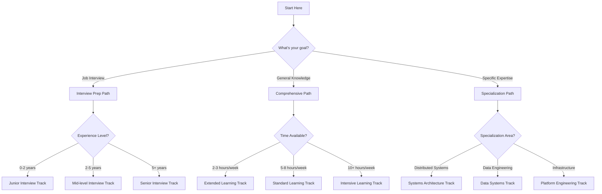
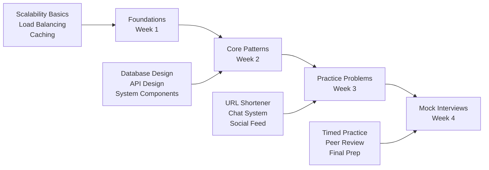
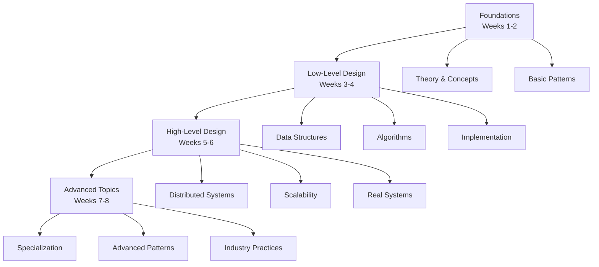
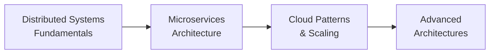
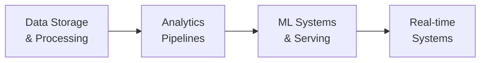
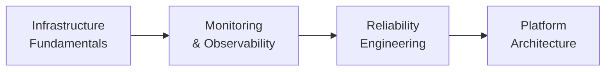

# System Design Learning Roadmap

## Overview

This roadmap provides multiple learning paths tailored to different goals and experience levels. Choose the path that best matches your objectives and current knowledge level.

## Learning Path Decision Tree

## Learning Paths Overview

### 1. Interview Preparation Path (2-4 weeks)

**Goal**: Prepare for system design interviews at tech companies
**Time Commitment**: 10-15 hours/week
**Prerequisites**: Basic programming knowledge

**Weekly Breakdown**:

- **Week 1**: System design fundamentals (8-10 hours)
- **Week 2**: Core architectural patterns (10-12 hours)
- **Week 3**: Practice with real problems (12-15 hours)
- **Week 4**: Mock interviews and refinement (8-10 hours)

### 2. Comprehensive Learning Path (6-8 weeks)

**Goal**: Build deep understanding of system design principles
**Time Commitment**: 8-12 hours/week
**Prerequisites**: Some software development experience

**Weekly Breakdown**:

- **Weeks 1-2**: Foundations and core concepts (16-20 hours total)
- **Weeks 3-4**: Hands-on low-level implementations (20-24 hours total)
- **Weeks 5-6**: Large-scale system architectures (20-24 hours total)
- **Weeks 7-8**: Advanced topics and specialization (16-20 hours total)

### 3. Specialization Paths (4-6 weeks each)

#### Systems Architecture Track

**Focus**: Distributed systems, microservices, cloud architecture
**Time Commitment**: 6-10 hours/week

#### Data Systems Track

**Focus**: Data engineering, analytics, ML systems
**Time Commitment**: 6-10 hours/week

#### Platform Engineering Track

**Focus**: Infrastructure, DevOps, reliability engineering
**Time Commitment**: 6-10 hours/week

## Detailed Learning Tracks

### Junior Interview Track (3 weeks)

**Prerequisites**: Basic programming, understanding of web applications
**Time Commitment**: 8-12 hours/week

**Week 1: Foundations**

- Day 1-2: Scalability concepts (horizontal vs vertical)
- Day 3-4: Load balancing and caching basics
- Day 5-6: Database fundamentals (SQL vs NoSQL)
- Day 7: Review and practice problems

**Week 2: Core Systems**

- Day 1-2: URL shortener design
- Day 3-4: Chat application basics
- Day 5-6: Simple social feed
- Day 7: Pattern recognition and templates

**Week 3: Interview Practice**

- Day 1-2: Timed practice sessions
- Day 3-4: Common follow-up questions
- Day 5-6: Mock interviews
- Day 7: Final review and confidence building

### Mid-Level Interview Track (4 weeks)

**Prerequisites**: 2+ years development experience, basic system design knowledge
**Time Commitment**: 10-15 hours/week

**Week 1: Advanced Foundations**

- Consistency models and CAP theorem
- Distributed system challenges
- Performance and reliability patterns

**Week 2: Complex Systems**

- E-commerce platform design
- Video streaming system
- Real-time messaging at scale

**Week 3: Specialized Topics**

- Search systems and indexing
- Recommendation engines
- Payment and financial systems

**Week 4: Advanced Practice**

- System optimization problems
- Failure scenario handling
- Architecture evolution discussions

### Senior Interview Track (4 weeks)

**Prerequisites**: 5+ years experience, previous system design exposure
**Time Commitment**: 12-18 hours/week

**Week 1: Architecture Leadership**

- System design principles and trade-offs
- Technology selection frameworks
- Cross-functional system integration

**Week 2: Scale and Complexity**

- Global-scale system design
- Multi-region architectures
- Complex data consistency challenges

**Week 3: Business and Technical Balance**

- Cost optimization strategies
- Technical debt management
- Migration and evolution planning

**Week 4: Leadership Scenarios**

- Architecture review processes
- Team technical decision making
- System design mentoring approaches

## Time Commitment Guidelines

### Intensive Track (10+ hours/week)

- **Duration**: 4-6 weeks
- **Best for**: Job seekers, career transitions
- **Daily commitment**: 1.5-2 hours weekdays, 3-4 hours weekends
- **Outcome**: Interview-ready or comprehensive understanding

### Standard Track (5-8 hours/week)

- **Duration**: 6-8 weeks
- **Best for**: Working professionals, skill development
- **Daily commitment**: 45-60 minutes weekdays, 2-3 hours weekends
- **Outcome**: Solid foundation with practical skills

### Extended Track (2-3 hours/week)

- **Duration**: 12-16 weeks
- **Best for**: Students, casual learners
- **Daily commitment**: 20-30 minutes daily
- **Outcome**: Gradual skill building with deep understanding

## Prerequisites by Track

### Beginner Level

- **Required**: Basic programming in any language
- **Recommended**: Understanding of web applications, databases
- **Time to start**: Immediately

### Intermediate Level

- **Required**: 1+ years software development, basic system design exposure
- **Recommended**: Experience with databases, APIs, cloud services
- **Time to start**: After completing foundations or with equivalent experience

### Advanced Level

- **Required**: 3+ years development, previous system design experience
- **Recommended**: Distributed systems knowledge, production system experience
- **Time to start**: After intermediate level or with significant industry experience

## Success Metrics and Checkpoints

### Weekly Checkpoints

- **Knowledge Check**: Can explain key concepts in your own words
- **Application Check**: Can apply concepts to new problems
- **Communication Check**: Can clearly articulate design decisions

### Milestone Assessments

- **Foundation Milestone**: Complete system design vocabulary and basic patterns
- **Implementation Milestone**: Successfully implement and explain low-level designs
- **Architecture Milestone**: Design complete systems with proper trade-off analysis
- **Mastery Milestone**: Mentor others and contribute to system design discussions

## Choosing Your Path

### For Job Interviews

1. **Timeline**: How much time until interviews?
   - 2-3 weeks: Junior/Mid-level Interview Track
   - 4+ weeks: Comprehensive + Interview Prep
2. **Experience Level**: Match track to your background
3. **Company Target**: Adjust depth based on company expectations

### For Skill Development

1. **Current Role**: Choose specialization matching your work
2. **Career Goals**: Align with desired future positions
3. **Learning Style**: Consider your preferred pace and depth

### For Academic Learning

1. **Course Integration**: Complement formal education
2. **Project Application**: Apply to current or planned projects
3. **Research Interest**: Deep dive into specific areas

## Next Steps

1. **Assess Your Starting Point**: Take the initial assessment quiz
2. **Choose Your Path**: Use the decision tree above
3. **Set Your Schedule**: Block time in your calendar
4. **Join the Community**: Connect with other learners
5. **Start Learning**: Begin with your chosen track

## Path Switching and Flexibility

You can switch between paths or combine elements:

- **Accelerate**: Move from Extended to Standard track
- **Specialize**: Add specialization modules to any track
- **Customize**: Mix and match based on your needs
- **Repeat**: Revisit sections for deeper understanding

Remember: The goal is learning, not just completion. Adjust the pace and depth to match your understanding and retention.
