# Contributing to System Design Learning Guide

Thank you for your interest in contributing! This guide helps developers learn system design through practical examples and clear explanations. Your contributions make this resource better for everyone.

## 🎯 Contribution Philosophy

We believe in:
- **Learning by doing** - Include runnable examples
- **Clear explanations** - Write for developers learning the concepts
- **Visual learning** - Use diagrams to illustrate complex ideas
- **Practical focus** - Connect theory to real-world applications
- **Quality over quantity** - Better to have fewer, excellent examples

## 🚀 Getting Started

### Prerequisites
- Git and GitHub account
- Basic understanding of system design concepts
- Familiarity with at least one programming language (Python, Java, C++, Go)
- Optional: PlantUML or Mermaid for diagrams

### Development Setup
1. Fork the repository
2. Clone your fork: `git clone https://github.com/shay-ff/systemdesign-docs.git`
3. Create a feature branch: `git checkout -b feature/your-contribution`
4. Make your changes
5. Test your examples (ensure code compiles and runs)
6. Submit a pull request

## 📝 Content Guidelines

### Writing Style
- **Conversational but technical** - Write like you're explaining to a colleague
- **Active voice** - "The load balancer distributes requests" not "Requests are distributed"
- **Clear structure** - Use headings, bullet points, and code blocks effectively
- **Practical examples** - Include real-world analogies and use cases
- **Avoid jargon** - Explain technical terms when first introduced

### Code Standards

#### Multi-Language Support
When adding implementations, provide solutions in multiple languages:
- **Python**: Clean, readable, well-commented
- **Java**: Object-oriented, follows Java conventions
- **C++**: Modern C++17+, efficient implementations
- **Go**: Idiomatic Go, concurrent where appropriate

#### Code Quality
```python
# Good: Clear, documented, testable
class LRUCache:
    """
    Least Recently Used cache implementation using HashMap + Doubly Linked List.
    
    Time Complexity: O(1) for get and put operations
    Space Complexity: O(capacity)
    """
    
    def __init__(self, capacity: int):
        self.capacity = capacity
        self.cache = {}  # key -> node mapping
        # ... rest of implementation
```

```python
# Avoid: Unclear, undocumented
class Cache:
    def __init__(self, c):
        self.c = c
        self.d = {}
```

### Documentation Structure

#### Low-Level Design Template
```
design_name/
├── README.md              # Problem definition and overview
├── design.puml           # Architecture diagram
├── explanation.md        # Design discussion and trade-offs
└── solutions/
    ├── python/           # Python implementation + README
    ├── java/             # Java implementation + README
    ├── cpp/              # C++ implementation + README
    └── go/               # Go implementation + README
```

#### High-Level Design Template
```
system_name/
├── README.md             # System overview
├── requirements.md       # Functional & non-functional requirements
├── architecture.puml     # System architecture diagram
├── api-design.md        # API specifications
├── database-schema.md   # Data model design
├── scaling-strategy.md  # Horizontal scaling approach
├── tradeoffs.md         # Design decisions and alternatives
└── solution.md          # Complete solution walkthrough
```

## 🎨 Visual Guidelines

### Diagram Standards
- Use consistent color scheme (see `assets/diagrams/style-guide.md`)
- Include clear labels and legends
- Follow established icon conventions
- Ensure diagrams are readable at different sizes

### Mermaid Example

```mermaid
graph LR
    U[👤 User] --> LB[⚖️ Load Balancer]
    LB --> WS1[🌐 Web Server 1]
    LB --> WS2[🌐 Web Server 2]
    WS1 --> DB[(🗄️ Database)]
    WS2 --> DB
    
    style U fill:#e2e8f0
    style LB fill:#7c3aed,color:#fff
    style WS1 fill:#2563eb,color:#fff
    style WS2 fill:#2563eb,color:#fff
    style DB fill:#059669,color:#fff
```


## 🔍 Types of Contributions

### 1. New Low-Level Design Examples
**What we need:**
- Core data structures and algorithms (Trie, Skip List, etc.)
- System components (Circuit Breaker, Distributed Lock, etc.)
- Performance-critical implementations

**Requirements:**
- Multi-language implementations
- Clear problem statement
- Architecture diagram
- Trade-offs analysis
- Runnable examples with test cases

### 2. High-Level System Designs
**What we need:**
- Popular systems (Instagram, WhatsApp, Slack, etc.)
- Emerging architectures (Serverless, Edge Computing, etc.)
- Domain-specific systems (Gaming, IoT, ML platforms, etc.)

**Requirements:**
- Complete requirements analysis
- Detailed architecture with diagrams
- API design specifications
- Database schema design
- Scaling strategies
- Trade-offs discussion

### 3. Runnable Implementations
**What we need:**
- Microservice examples
- Distributed system prototypes
- Performance benchmarks
- Monitoring and observability examples

**Requirements:**
- Docker containerization
- API documentation
- Performance benchmarks
- Connection to design concepts
- Deployment instructions

### 4. Interview Preparation Content
**What we need:**
- Real interview questions with detailed solutions
- Framework improvements
- Mock interview scenarios
- Industry-specific questions

**Requirements:**
- Step-by-step solution approach
- Multiple solution alternatives
- Time complexity analysis
- Common mistakes to avoid

### 5. Learning Resources
**What we need:**
- Study guides and checklists
- Visual learning aids
- Progress tracking tools
- Reference materials

**Requirements:**
- Clear learning objectives
- Measurable outcomes
- Visual elements where helpful
- Integration with existing content

## 📋 Pull Request Process

### Before Submitting
- [ ] Code compiles and runs without errors
- [ ] All examples include clear documentation
- [ ] Diagrams render correctly
- [ ] Content follows style guidelines
- [ ] Links and references are valid
- [ ] Spell check completed

### PR Template
```markdown
## Description
Brief description of your contribution and its learning value.

## Type of Change
- [ ] New low-level design example
- [ ] New high-level system design
- [ ] Runnable implementation
- [ ] Interview preparation content
- [ ] Documentation improvement
- [ ] Bug fix

## Testing
- [ ] Code examples compile and run
- [ ] Diagrams render correctly
- [ ] Links work properly
- [ ] Content reviewed for accuracy

## Learning Value
Explain how this contribution helps developers learn system design.

## Related Issues
Link any related issues or discussions.
```

### Review Process
1. **Automated checks** - Code compilation, link validation, formatting
2. **Technical review** - Accuracy, completeness, best practices
3. **Educational review** - Learning value, clarity, progression
4. **Community feedback** - Input from other contributors and learners

## 🏆 Recognition

### Contributor Levels
- **First-time contributor**: Welcome badge and mention in README
- **Regular contributor**: Listed in contributors section
- **Core contributor**: Maintainer privileges and special recognition
- **Expert contributor**: Technical advisory role and featured content

### Hall of Fame
Outstanding contributions are featured in our Hall of Fame with:
- Contributor profile and expertise
- Featured contributions
- Impact on the learning community
- Social media recognition

## 📞 Getting Help

### Discussion Channels
- **GitHub Discussions**: General questions and ideas
- **Issues**: Bug reports and specific improvement requests
- **Pull Request Comments**: Code-specific discussions

### Mentorship Program
New contributors can request mentorship for:
- Understanding contribution guidelines
- Technical review of draft content
- Learning effective teaching techniques
- Building system design expertise

## 🚫 What We Don't Accept

- **AI-generated content** without human review and customization
- **Copied content** without proper attribution
- **Overly complex examples** that don't aid learning
- **Incomplete implementations** without documentation
- **Promotional content** for specific tools or services
- **Content that doesn't align** with our learning-focused mission

## 📚 Resources for Contributors

### Learning Resources
- [System Design Primer](https://github.com/donnemartin/system-design-primer)
- [High Scalability Blog](http://highscalability.com/)
- [AWS Architecture Center](https://aws.amazon.com/architecture/)
- [Google Cloud Architecture Framework](https://cloud.google.com/architecture/framework)

### Tools
- **Diagrams**: PlantUML, Mermaid, Draw.io
- **Code Formatting**: Language-specific linters and formatters
- **Documentation**: Markdown, GitHub Pages
- **Testing**: Language-specific testing frameworks

### Style Guides
- [Google Style Guides](https://google.github.io/styleguide/)
- [Markdown Style Guide](https://www.markdownguide.org/basic-syntax/)
- [PlantUML Documentation](https://plantuml.com/)
- [Mermaid Documentation](https://mermaid-js.github.io/mermaid/)

## 🤝 Code of Conduct

We are committed to providing a welcoming and inclusive environment. Please read our [Code of Conduct](CODE_OF_CONDUCT.md) before contributing.

## 📄 License

By contributing, you agree that your contributions will be licensed under the MIT License.

---

**Thank you for helping make system design more accessible to developers worldwide!** 🌟