# System Design Learning Guide

A comprehensive, hands-on learning platform that guides you through system design concepts with real implementations, visual diagrams, and interview preparation. Built for developers who learn by doing.

## 🎯 Why This Guide?

System design can feel overwhelming. This guide breaks it down into digestible, practical steps:

- **Learn by Building**: Every concept includes runnable code examples
- **Visual Learning**: Rich diagrams and architecture patterns  
- **Interview Ready**: Structured preparation with real questions
- **Progressive Path**: Clear roadmap from beginner to expert
- **Multi-Language**: Implementations in Python, Java, C++, and Go

## 📚 Learning Journey

```mermaid
graph LR
    A[🏗️ Foundations] --> B[⚙️ Low-Level Design]
    B --> C[🏛️ High-Level Design]
    C --> D[💻 Implementations]
    D --> E[🎯 Interview Prep]
    E --> F[📈 Mastery]
    
    style A fill:#e2e8f0
    style B fill:#dbeafe
    style C fill:#dcfce7
    style D fill:#fef3c7
    style E fill:#fce7f3
    style F fill:#f3e8ff
```



### 🏗️ **00-foundations/** — Build Your Mental Model
Core concepts, scalability patterns, and system design fundamentals with clear analogies and visual explanations.

### ⚙️ **01-ll-designs/** — Hands-On Components  
Implementable systems (LRU cache, rate limiter, consistent hashing, message queues) with multi-language solutions and architectural diagrams.

### 🏛️ **02-hl-designs/** — Real-World Architectures
Complete system designs (Twitter, Uber, Netflix, YouTube) with requirements, trade-offs, and scaling strategies.

### 💻 **03-implementations/** — Production-Ready Prototypes
Runnable microservices demonstrating key concepts with Docker, APIs, and performance benchmarks.

### 🎯 **04-interview-prep/** — Ace Your Interviews
Structured frameworks, common questions, sample answers, and mock interview scenarios.

### 📈 **05-study-plan/** — Your Learning Roadmap
6-week curriculum, milestones, progress tracking, and curated resources.

## 🚀 Quick Start

> 📍 **New here?** Check out the [Complete Navigation Guide](NAVIGATION.md) for detailed learning paths and content organization.

### For Beginners
1. **Foundations First**: Start with [`00-foundations/concepts.md`](00-foundations/concepts.md) to build your mental model
2. **Hands-On Practice**: Try the [LRU cache](01-ll-designs/lru_cache/) in your preferred language
3. **See the Big Picture**: Explore [Twitter design](02-hl-designs/twitter_clone/) to understand real-world architecture

### For Interview Prep
1. **Framework**: Read [`04-interview-prep/frameworks.md`](04-interview-prep/frameworks.md) for structured approach
2. **Practice**: Work through questions in [`04-interview-prep/most_asked_questions.md`](04-interview-prep/most_asked_questions.md)
3. **Mock Interviews**: Use scenarios in [`04-interview-prep/mock-interviews/`](04-interview-prep/mock-interviews/)

### For Hands-On Learners
1. **Run Examples**: Try implementations in [`03-implementations/`](03-implementations/)
2. **Build Components**: Code along with [`01-ll-designs/`](01-ll-designs/) examples
3. **Deploy**: Use Docker setups in implementation directories

### For Structured Learning
1. **Follow Roadmap**: See the [visual learning journey](05-study-plan/roadmap.md)
2. **6-Week Plan**: Use the [structured curriculum](05-study-plan/study_plan.md)
3. **Track Progress**: Monitor your growth with [milestones](05-study-plan/milestones.md)

## 💻 Running Examples

### Low-Level Design Examples
```bash
# LRU Cache (Python)
cd 01-ll-designs/lru_cache/solutions/python
python lru_cache.py

# Rate Limiter (Go)
cd 01-ll-designs/rate_limiter/solutions/go
go run token_bucket.go

# Consistent Hashing (Java)
cd 01-ll-designs/consistent_hashing/solutions/java
javac ConsistentHash.java && java ConsistentHashDemo
```

### Microservice Implementations
```bash
# Cache Server
cd 03-implementations/cache-server
docker-compose up

# Rate Limiter Service  
cd 03-implementations/rate-limiter-service
docker-compose up

# Message Broker
cd 03-implementations/simple-message-broker
docker-compose up
```

## 📊 Visual Learning

All diagrams use consistent styling and are available in multiple formats:
- **Mermaid**: For GitHub rendering and simple flows
- **PlantUML**: For detailed architecture diagrams
- **Templates**: Reusable patterns in `assets/diagrams/templates/`

## 🤝 Contributing

We welcome contributions! See [CONTRIBUTING.md](CONTRIBUTING.md) for how to:
- Fix typos and improve explanations
- Add code examples in your favorite language
- Share real-world experiences
- Report bugs and suggest improvements

## 📄 License

MIT License - see [LICENSE](LICENSE) for details.

## 🎯 What You'll Learn

- **Core Concepts**: Scalability, caching, databases, load balancing
- **Hands-On Skills**: Build LRU caches, rate limiters, message queues
- **Real Systems**: Understand how Netflix, Uber, and Twitter work
- **Interview Success**: Proven frameworks and practice questions
- **Production Ready**: Deploy actual microservices with Docker

## 🤝 Community

- **Questions?** Open an [issue](../../issues) - we're here to help!
- **Found something useful?** ⭐ Star the repo to help others find it
- **Want to contribute?** Check out [how to help](CONTRIBUTING.md)

## 🙏 Acknowledgments

Built with insights from:
- Industry engineering blogs (Netflix, Uber, Meta)
- Classic distributed systems papers
- Real-world production experiences
- Community feedback and contributions

---

## 🧭 Navigation

- **[📍 Learning Guide](NAVIGATION.md)** — Find the right content for your goals
- **[🏗️ Foundations](00-foundations/)** — Core concepts and mental models
- **[⚙️ Hands-On Coding](01-ll-designs/)** — Build system components yourself
- **[🏛️ System Designs](02-hl-designs/)** — Real-world architectures (Netflix, Uber, Twitter)
- **[💻 Runnable Examples](03-implementations/)** — Deploy services with Docker
- **[🎯 Interview Prep](04-interview-prep/)** — Ace your system design interviews
- **[📈 Study Plan](05-study-plan/)** — 6-week structured curriculum

**⭐ Star this repo if it helped you learn system design!**

**🔗 Share with fellow developers who want to level up their architecture skills**
