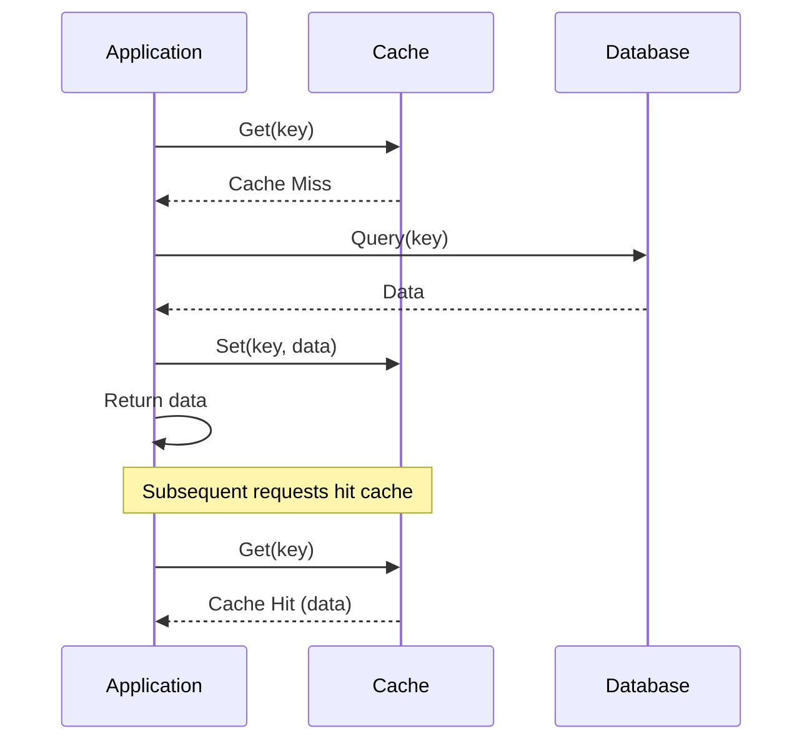
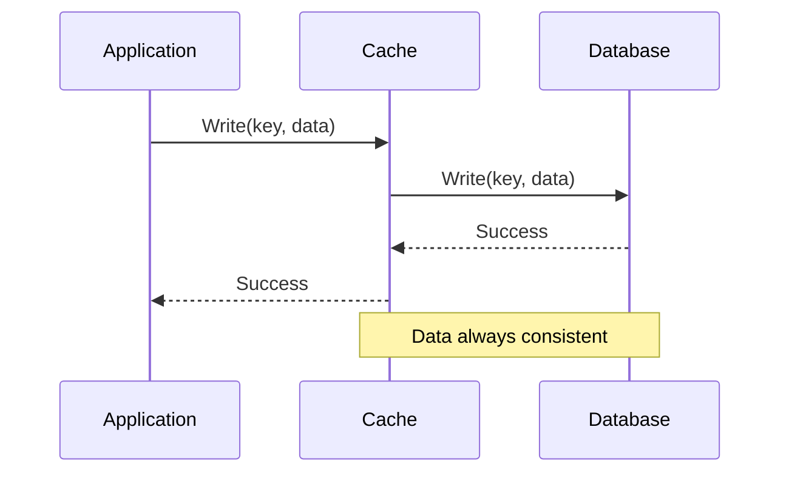
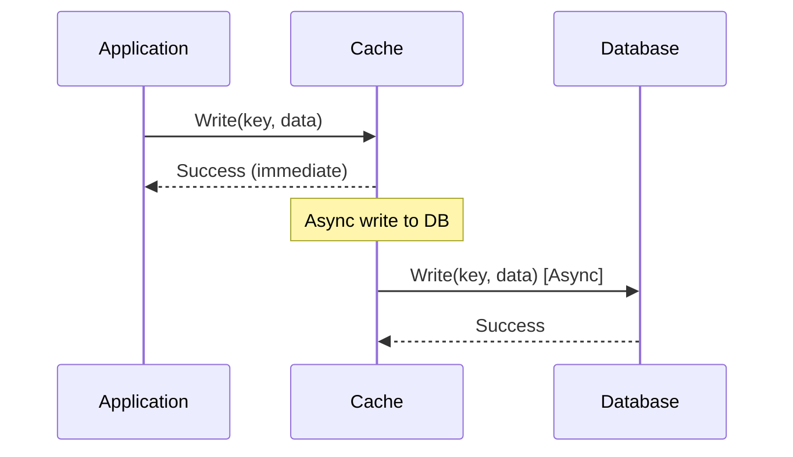
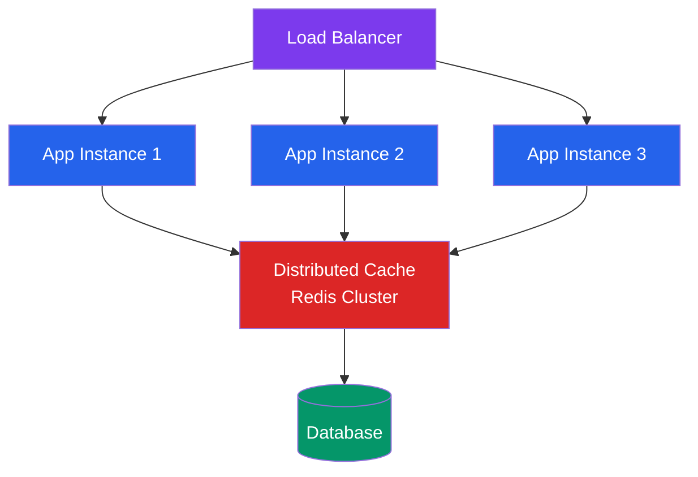
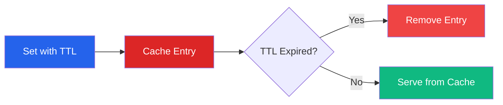
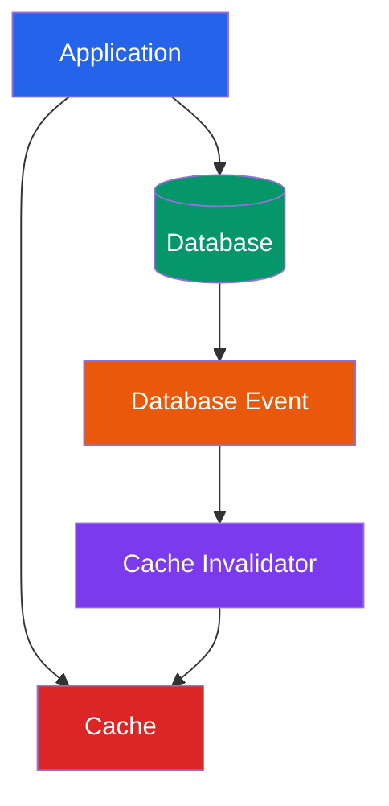

# Caching Patterns

## Cache-Aside (Lazy Loading)

## Write-Through

## Write-Behind (Write-Back)

## Cache Architecture Patterns

### Single Cache Layer

### Multi-Level Cache

### Distributed Cache

## Cache Invalidation Strategies

### TTL (Time To Live)

### Event-Based Invalidation

## Cache Consistency Models

### Strong Consistency
- Write-through pattern
- Synchronous updates
- Higher latency, guaranteed consistency

### Eventual Consistency
- Write-behind pattern
- Asynchronous updates
- Lower latency, temporary inconsistency

### Weak Consistency
- Cache-aside pattern
- Manual invalidation
- Best performance, manual consistency management

## Common Cache Problems

### Cache Stampede
**Problem**: Multiple requests for same expired key hit database simultaneously

**Solution**: Use locks or probabilistic early expiration

### Hot Keys
**Problem**: Few keys get most of the traffic

**Solution**: Distribute hot keys across multiple cache instances

### Cache Penetration
**Problem**: Requests for non-existent data bypass cache

**Solution**: Cache null values with short TTL