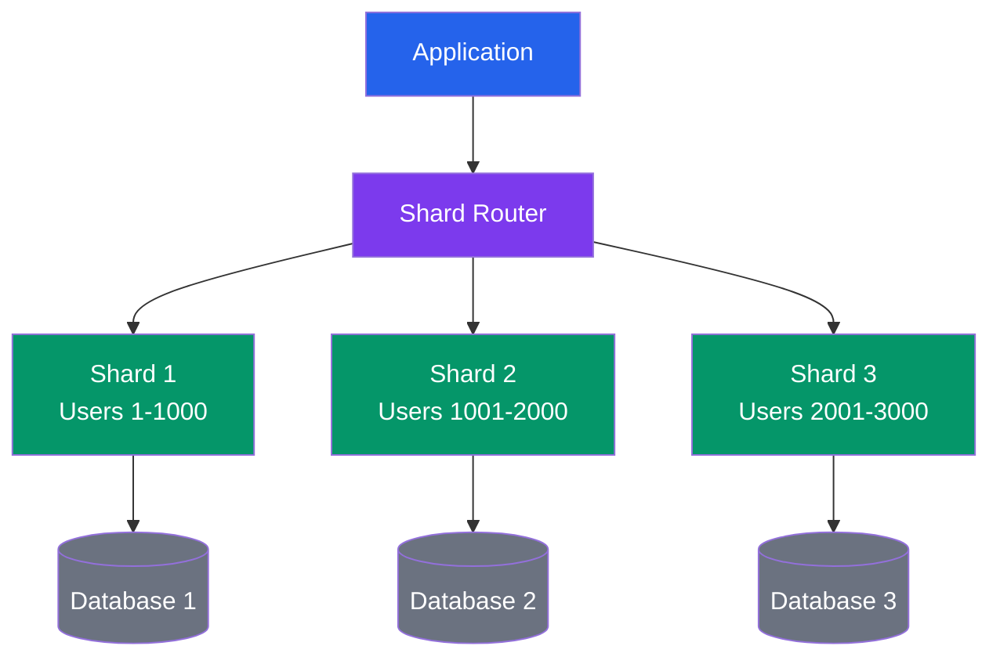
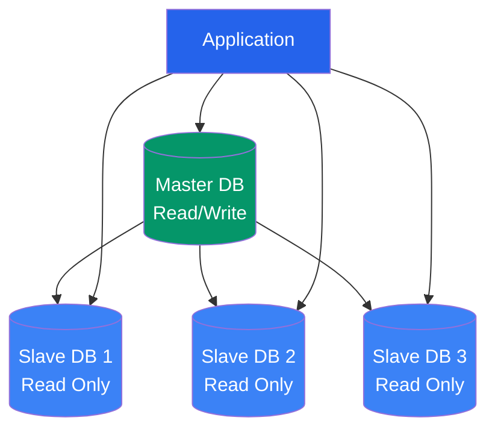
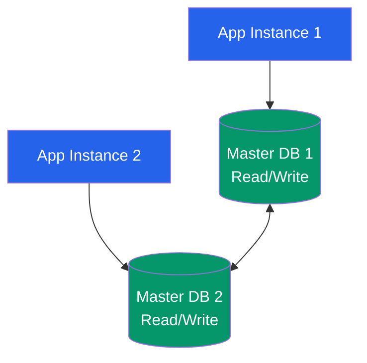
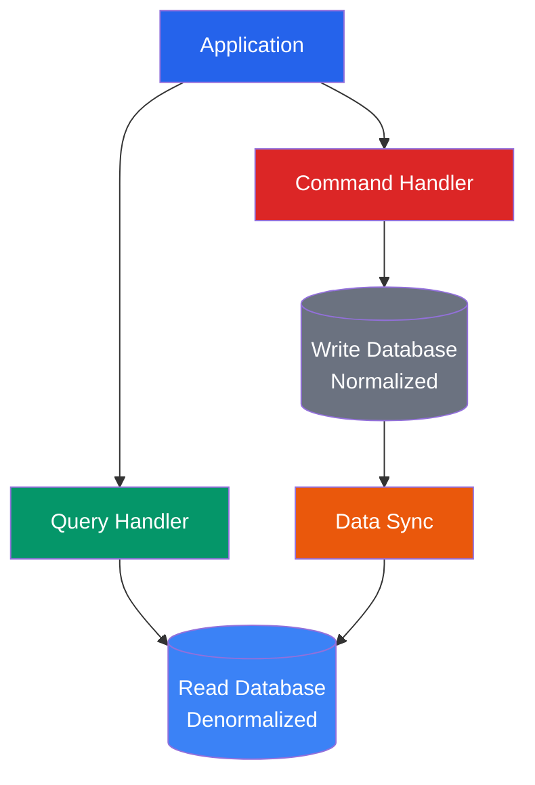
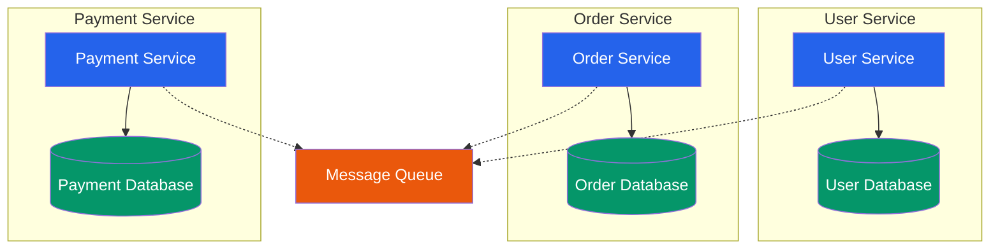
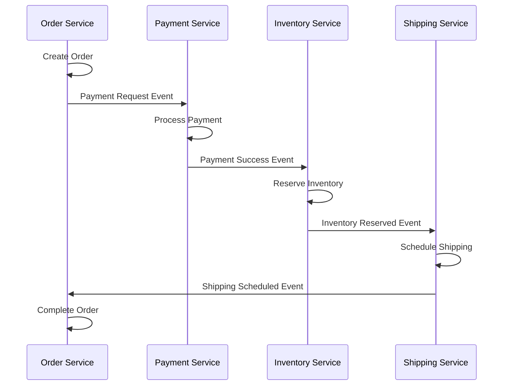
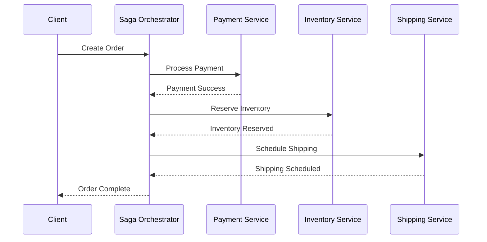
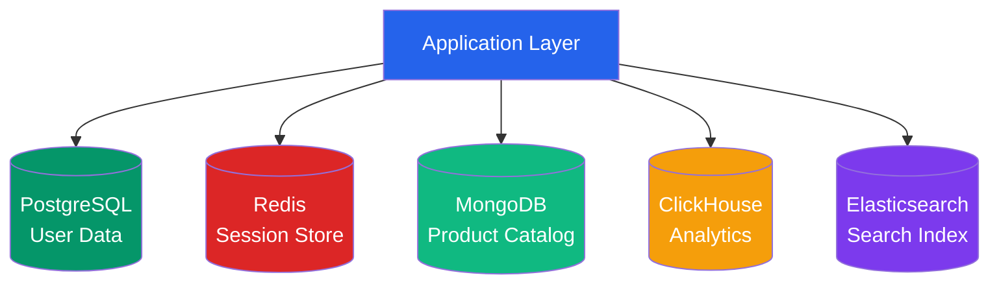
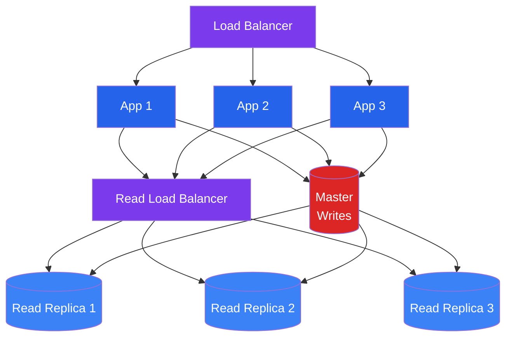

# Database Patterns

## Database Sharding Patterns

### Horizontal Sharding (Range-Based)



### Hash-Based Sharding

```mermaid
graph TB
    App[Application] --> Hash[Hash Function<br/>hash(user_id) % 3]
    
    Hash --> S1[Shard 1<br/>Hash = 0]
    Hash --> S2[Shard 2<br/>Hash = 1]
    Hash --> S3[Shard 3<br/>Hash = 2]
    
    S1 --> DB1[(Database 1)]
    S2 --> DB2[(Database 2)]
    S3 --> DB3[(Database 3)]
    
    style App fill:#2563eb,color:#fff
    style Hash fill:#7c3aed,color:#fff
    style S1 fill:#059669,color:#fff
    style S2 fill:#059669,color:#fff
    style S3 fill:#059669,color:#fff
    style DB1 fill:#6b7280,color:#fff
    style DB2 fill:#6b7280,color:#fff
    style DB3 fill:#6b7280,color:#fff
```

## Replication Patterns

### Master-Slave Replication



### Master-Master Replication



## CQRS (Command Query Responsibility Segregation)



## Database Per Service Pattern



## Saga Pattern (Distributed Transactions)

### Choreography-Based Saga



### Orchestration-Based Saga



## Polyglot Persistence



## Database Scaling Strategies

### Read Replicas

