# Basic Web Application Template

## Mermaid Template

```mermaid
graph LR
    U[👤 User] --> LB[⚖️ Load Balancer]
    LB --> WS1[🌐 Web Server 1]
    LB --> WS2[🌐 Web Server 2]
    WS1 --> C[⚡ Cache]
    WS2 --> C
    WS1 --> DB[(🗄️ Database)]
    WS2 --> DB
    
    style U fill:#e2e8f0
    style LB fill:#7c3aed,color:#fff
    style WS1 fill:#2563eb,color:#fff
    style WS2 fill:#2563eb,color:#fff
    style C fill:#dc2626,color:#fff
    style DB fill:#059669,color:#fff
```

## PlantUML Template

## Usage

This template represents a basic scalable web application with:
- Load balancer for traffic distribution
- Multiple web servers for horizontal scaling
- Cache layer for performance
- Database for persistent storage

## Customization

Replace components as needed:
- Add API Gateway before Load Balancer
- Add CDN before Load Balancer
- Add message queue between services
- Add monitoring and logging components