# Event-Driven Architecture Template

## Mermaid Template

```mermaid
graph TB
    P1[⚙️ Producer 1] --> ES[📢 Event Stream]
    P2[⚙️ Producer 2] --> ES
    P3[⚙️ Producer 3] --> ES
    
    ES --> C1[⚙️ Consumer 1]
    ES --> C2[⚙️ Consumer 2]
    ES --> C3[⚙️ Consumer 3]
    
    C1 --> D1[(🗄️ Database 1)]
    C2 --> D2[(🗄️ Database 2)]
    C3 --> D3[(🗄️ Database 3)]
    
    ES --> DLQ[❌ Dead Letter Queue]
    
    style P1 fill:#2563eb,color:#fff
    style P2 fill:#2563eb,color:#fff
    style P3 fill:#2563eb,color:#fff
    style ES fill:#ea580c,color:#fff
    style C1 fill:#059669,color:#fff
    style C2 fill:#059669,color:#fff
    style C3 fill:#059669,color:#fff
    style D1 fill:#6b7280,color:#fff
    style D2 fill:#6b7280,color:#fff
    style D3 fill:#6b7280,color:#fff
    style DLQ fill:#ef4444,color:#fff
```

## PlantUML Template

## Event Flow Sequence

## Key Components

### Event Stream (Kafka/Kinesis)
- **Durability**: Events persisted for replay
- **Scalability**: Horizontal partitioning
- **Ordering**: Per-partition ordering guarantees

### Producers
- **Async Publishing**: Non-blocking event emission
- **Batching**: Efficient throughput
- **Schema Evolution**: Backward/forward compatibility

### Consumers
- **At-least-once**: Delivery guarantees
- **Idempotency**: Handle duplicate events
- **Error Handling**: Dead letter queue for failures

## Benefits

- **Loose Coupling**: Producers and consumers are independent
- **Scalability**: Add consumers without affecting producers
- **Resilience**: Failed consumers don't block others
- **Audit Trail**: Complete event history

## Considerations

- **Eventual Consistency**: Data may be temporarily inconsistent
- **Complexity**: More complex than synchronous systems
- **Debugging**: Harder to trace event flows
- **Schema Management**: Event schema evolution challenges