# Microservices Architecture Template

## Mermaid Template

```mermaid
graph TB
    U[👤 User] --> AG[🚪 API Gateway]
    AG --> US[⚙️ User Service]
    AG --> OS[⚙️ Order Service]
    AG --> PS[⚙️ Payment Service]
    
    US --> UC[⚡ User Cache]
    US --> UD[(🗄️ User DB)]
    
    OS --> OC[⚡ Order Cache]
    OS --> OD[(🗄️ Order DB)]
    OS --> MQ[📢 Message Queue]
    
    PS --> PC[⚡ Payment Cache]
    PS --> PD[(🗄️ Payment DB)]
    PS --> MQ
    
    MQ --> NS[⚙️ Notification Service]
    NS --> ND[(🗄️ Notification DB)]
    
    style U fill:#e2e8f0
    style AG fill:#0891b2,color:#fff
    style US fill:#2563eb,color:#fff
    style OS fill:#2563eb,color:#fff
    style PS fill:#2563eb,color:#fff
    style NS fill:#2563eb,color:#fff
    style UC fill:#dc2626,color:#fff
    style OC fill:#dc2626,color:#fff
    style PC fill:#dc2626,color:#fff
    style UD fill:#059669,color:#fff
    style OD fill:#059669,color:#fff
    style PD fill:#059669,color:#fff
    style ND fill:#059669,color:#fff
    style MQ fill:#ea580c,color:#fff
```

## PlantUML Template

## Key Patterns

1. **API Gateway**: Single entry point for all client requests
2. **Service Isolation**: Each service has its own database and cache
3. **Asynchronous Communication**: Message queue for loose coupling
4. **Data Consistency**: Event-driven architecture for eventual consistency

## Benefits

- **Scalability**: Each service can scale independently
- **Fault Isolation**: Failure in one service doesn't affect others
- **Technology Diversity**: Different services can use different tech stacks
- **Team Autonomy**: Teams can develop and deploy independently

## Considerations

- **Complexity**: More moving parts to manage
- **Network Latency**: Inter-service communication overhead
- **Data Consistency**: Eventual consistency challenges
- **Monitoring**: Need comprehensive observability