# CAP Theorem Visual Guide

## The CAP Triangle

## Real-World Trade-offs

### CP Systems (Consistency + Partition Tolerance)
**Choose Consistency over Availability**

**Examples**: Banking systems, financial transactions, inventory management

**Why**: Money can't be in two places at once!

### AP Systems (Availability + Partition Tolerance)
**Choose Availability over Consistency**

**Examples**: Social media feeds, content delivery, shopping recommendations

**Why**: Users expect the app to work, even with slightly stale data

### CA Systems (Consistency + Availability)
**No Partition Tolerance**

```mermaid
graph LR
    subgraph "Single Data Center"
        U[User Request] --> S[System]
        S --> D[(Single Database)]
        
        S --> R[✅ Always Consistent<br/>& Available]
    end
    
    style S fill:#7c3aed,color:#fff
    style R fill:#10b981,color:#fff
```

**Examples**: Traditional RDBMS in single data center

**Why**: No network partitions = no trade-offs needed

## Decision Framework

## Common Misconceptions

### ❌ "You can only pick 2 out of 3"
**Reality**: You get partition tolerance OR you don't. If you have partitions, you choose between C and A.

### ❌ "It's a binary choice"
**Reality**: You can tune the trade-offs. Some inconsistency might be acceptable.

### ❌ "It applies to the whole system"
**Reality**: Different parts of your system can make different choices.

## Practical Examples

### E-commerce Platform

**User Account**: Must be consistent (can't have duplicate accounts)
**Product Catalog**: Should be available (okay if prices are slightly stale)
**Shopping Cart**: Single session (no partitions expected)

## Key Takeaways

1. **Partitions happen** - Network failures are inevitable in distributed systems
2. **Context matters** - Different data has different consistency requirements
3. **It's about trade-offs** - Not absolute choices
4. **Design per component** - Different parts of your system can make different choices
5. **Eventual consistency** - Many AP systems achieve consistency over time