# Consistency Models Comparison Chart

## Consistency Spectrum

```mermaid
graph LR
    Strong[Strong Consistency<br/>🔒<br/>Immediate] --> Sequential[Sequential Consistency<br/>📋<br/>Ordered]
    Sequential --> Causal[Causal Consistency<br/>🔗<br/>Cause-Effect]
    Causal --> Eventual[Eventual Consistency<br/>⏰<br/>Eventually]
    Eventual --> Weak[Weak Consistency<br/>🤷<br/>No Guarantees]
    
    style Strong fill:#dc2626,color:#fff
    style Sequential fill:#ea580c,color:#fff
    style Causal fill:#f59e0b,color:#fff
    style Eventual fill:#10b981,color:#fff
    style Weak fill:#6b7280,color:#fff
```



## Detailed Comparison

### Strong Consistency
**"All nodes see the same data at the same time"**


**Examples**: Banking systems, inventory management
**Trade-offs**: High latency, lower availability
**Use when**: Data accuracy is critical

### Sequential Consistency
**"All operations appear in some sequential order"**

```mermaid
sequenceDiagram
    participant C1 as Client 1
    participant C2 as Client 2
    participant S as System
    
    C1->>S: Write(x=1)
    C2->>S: Write(x=2)
    S->>S: Order: x=1, then x=2
    
    Note over S: All clients see same order: x=1 → x=2
```



**Examples**: Distributed databases with ordering
**Trade-offs**: Better performance than strong, still some coordination
**Use when**: Order matters more than immediate consistency

### Causal Consistency
**"Causally related operations are seen in order"**

```mermaid
graph TB
    A[Alice posts: "Going to lunch"] --> B[Bob replies: "Save me a seat"]
    B --> C[Charlie sees both in order]
    
    D[Dave posts: "Nice weather"] 
    
    style A fill:#2563eb,color:#fff
    style B fill:#059669,color:#fff
    style C fill:#7c3aed,color:#fff
    style D fill:#f59e0b,color:#fff
    
    Note1[Causally related:<br/>Must see in order]
    Note2[Independent:<br/>Can see in any order]
```

**Examples**: Social media feeds, collaborative editing
**Trade-offs**: Good performance, maintains logical order
**Use when**: Cause-effect relationships matter

### Eventual Consistency
**"All nodes will eventually converge to the same value"**


**Examples**: DNS, CDN, social media likes
**Trade-offs**: High availability, temporary inconsistency
**Use when**: Availability is more important than immediate consistency

## Technology Mapping

| Technology | Consistency Model | Use Case |
|------------|------------------|----------|
| **PostgreSQL** | Strong | Financial transactions |
| **MongoDB** | Strong (default) | User profiles |
| **Cassandra** | Eventual (tunable) | Time-series data |
| **Redis** | Strong (single node) | Session storage |
| **DynamoDB** | Eventual (tunable) | Product catalog |
| **Kafka** | Sequential | Event streaming |
| **DNS** | Eventual | Domain resolution |
| **CDN** | Eventual | Static content |

## Choosing the Right Model

```mermaid
flowchart TD
    Start[Choose Consistency Model] --> Q1{Is data correctness<br/>absolutely critical?}
    
    Q1 -->|Yes| Strong[Strong Consistency<br/>💰 Banking, Inventory]
    
    Q1 -->|No| Q2{Do operations have<br/>cause-effect relationships?}
    
    Q2 -->|Yes| Q3{Is ordering<br/>important globally?}
    
    Q3 -->|Yes| Sequential[Sequential Consistency<br/>📋 Distributed DB]
    Q3 -->|No| Causal[Causal Consistency<br/>💬 Social Media]
    
    Q2 -->|No| Q4{Can you tolerate<br/>temporary inconsistency?}
    
    Q4 -->|Yes| Eventual[Eventual Consistency<br/>🌐 CDN, DNS]
    Q4 -->|No| Strong
    
    style Strong fill:#dc2626,color:#fff
    style Sequential fill:#ea580c,color:#fff
    style Causal fill:#f59e0b,color:#fff
    style Eventual fill:#10b981,color:#fff
```



## Real-World Examples

### Social Media Platform


### E-commerce System


## Performance vs Consistency Trade-off


## Key Takeaways

1. **No one-size-fits-all** - Different parts of your system may need different consistency models
2. **Understand your data** - Critical data needs stronger consistency
3. **Consider user expectations** - Users may tolerate some inconsistency for better performance
4. **Network partitions matter** - Stronger consistency becomes harder with network issues
5. **Tunable consistency** - Many systems let you configure consistency per operation