# Progress Tracking Visualizations

## Learning Journey Map

### Complete Learning Path


### Skill Progression Levels

```mermaid
graph TB
    subgraph "Beginner (Weeks 1-2)"
        B1[📚 Core Concepts]
        B2[🏗️ Basic Patterns]
        B3[📖 Terminology]
        style B1 fill:#e2e8f0
        style B2 fill:#e2e8f0
        style B3 fill:#e2e8f0
    end
    
    subgraph "Intermediate (Weeks 3-4)"
        I1[⚙️ Component Design]
        I2[🔧 Implementation]
        I3[📊 Trade-offs]
        style I1 fill:#dbeafe
        style I2 fill:#dbeafe
        style I3 fill:#dbeafe
    end
    
    subgraph "Advanced (Weeks 5-6)"
        A1[🏛️ System Architecture]
        A2[📈 Scaling Strategies]
        A3[🔍 Performance Analysis]
        style A1 fill:#dcfce7
        style A2 fill:#dcfce7
        style A3 fill:#dcfce7
    end
    
    subgraph "Expert (Ongoing)"
        E1[🎯 Interview Mastery]
        E2[🚀 Production Systems]
        E3[👥 Teaching Others]
        style E1 fill:#fef3c7
        style E2 fill:#fef3c7
        style E3 fill:#fef3c7
    end
    
    B1 --> I1
    B2 --> I2
    B3 --> I3
    I1 --> A1
    I2 --> A2
    I3 --> A3
    A1 --> E1
    A2 --> E2
    A3 --> E3
```



## Weekly Progress Tracker

### Week-by-Week Milestones


### Daily Learning Checklist

#### Week 1: Foundations
- [ ] **Day 1**: Read system design concepts and glossary
- [ ] **Day 2**: Understand scalability (horizontal vs vertical)
- [ ] **Day 3**: Learn load balancing strategies
- [ ] **Day 4**: Study caching patterns and strategies
- [ ] **Day 5**: Master CAP theorem with examples
- [ ] **Day 6**: Review database basics (SQL vs NoSQL)
- [ ] **Day 7**: Complete foundation assessment quiz

#### Week 2: Low-Level Design
- [ ] **Day 1**: Implement LRU Cache in preferred language
- [ ] **Day 2**: Build Token Bucket Rate Limiter
- [ ] **Day 3**: Create Consistent Hashing implementation
- [ ] **Day 4**: Design Message Queue system
- [ ] **Day 5**: Implement Bloom Filter
- [ ] **Day 6**: Compare implementations across languages
- [ ] **Day 7**: Review trade-offs and optimizations

## Skill Assessment Matrix

### Knowledge Areas Checklist

```mermaid
graph TB
    subgraph "System Design Fundamentals"
        F1[✅ Scalability Concepts]
        F2[✅ Load Balancing]
        F3[✅ Caching Strategies]
        F4[⏳ Database Design]
        F5[❌ Consistency Models]
        style F1 fill:#10b981,color:#fff
        style F2 fill:#10b981,color:#fff
        style F3 fill:#10b981,color:#fff
        style F4 fill:#f59e0b,color:#fff
        style F5 fill:#ef4444,color:#fff
    end
    
    subgraph "Implementation Skills"
        I1[✅ Data Structures]
        I2[⏳ Algorithm Design]
        I3[❌ Performance Optimization]
        I4[❌ Testing Strategies]
        style I1 fill:#10b981,color:#fff
        style I2 fill:#f59e0b,color:#fff
        style I3 fill:#ef4444,color:#fff
        style I4 fill:#ef4444,color:#fff
    end
    
    subgraph "Architecture Design"
        A1[⏳ Component Design]
        A2[❌ System Integration]
        A3[❌ Scaling Strategies]
        A4[❌ Failure Handling]
        style A1 fill:#f59e0b,color:#fff
        style A2 fill:#ef4444,color:#fff
        style A3 fill:#ef4444,color:#fff
        style A4 fill:#ef4444,color:#fff
    end
```



**Legend**: ✅ Mastered | ⏳ In Progress | ❌ Not Started

### Competency Levels

| Skill Area | Beginner | Intermediate | Advanced | Expert |
|------------|----------|--------------|----------|---------|
| **Concepts** | Knows terminology | Understands trade-offs | Applies patterns | Teaches others |
| **Implementation** | Follows tutorials | Modifies examples | Creates from scratch | Optimizes performance |
| **Architecture** | Reads diagrams | Designs components | Designs systems | Handles complexity |
| **Interview** | Answers basics | Explains solutions | Handles follow-ups | Guides discussion |

## Learning Velocity Tracker

### Study Time Distribution


### Progress Metrics Dashboard


## Achievement Badges

### Learning Milestones

```mermaid
graph TB
    subgraph "Foundation Badges"
        FB1[🏗️ Concept Master<br/>Completed all foundation topics]
        FB2[📊 CAP Theorem Expert<br/>Aced CAP theorem quiz]
        FB3[⚖️ Trade-off Analyst<br/>Explained 5 design trade-offs]
        style FB1 fill:#10b981,color:#fff
        style FB2 fill:#10b981,color:#fff
        style FB3 fill:#f59e0b,color:#fff
    end
    
    subgraph "Implementation Badges"
        IB1[⚙️ Code Craftsman<br/>Implemented 3 LLD systems]
        IB2[🌐 Multi-Language Master<br/>Coded in 3+ languages]
        IB3[🔧 Performance Optimizer<br/>Benchmarked implementations]
        style IB1 fill:#10b981,color:#fff
        style IB2 fill:#f59e0b,color:#fff
        style IB3 fill:#ef4444,color:#fff
    end
    
    subgraph "Architecture Badges"
        AB1[🏛️ System Architect<br/>Designed 2 complete systems]
        AB2[📈 Scaling Strategist<br/>Planned scaling approaches]
        AB3[🔍 Problem Solver<br/>Handled complex requirements]
        style AB1 fill:#f59e0b,color:#fff
        style AB2 fill:#ef4444,color:#fff
        style AB3 fill:#ef4444,color:#fff
    end
    
    subgraph "Interview Badges"
        IntB1[🎯 Interview Ready<br/>Passed mock interviews]
        IntB2[💬 Communication Pro<br/>Explained solutions clearly]
        IntB3[🏆 System Design Expert<br/>Mastered all areas]
        style IntB1 fill:#ef4444,color:#fff
        style IntB2 fill:#ef4444,color:#fff
        style IntB3 fill:#ef4444,color:#fff
    end
```



## Self-Assessment Tools

### Quick Knowledge Check

#### Foundations Quiz (5 minutes)
1. **What is the CAP theorem?**
   - [ ] I can explain it with examples
   - [ ] I understand the concept
   - [ ] I've heard of it
   - [ ] I don't know

2. **How do you scale a database?**
   - [ ] I know multiple strategies with trade-offs
   - [ ] I know vertical and horizontal scaling
   - [ ] I know one approach
   - [ ] I'm not sure

3. **What's the difference between consistency models?**
   - [ ] I can compare strong, eventual, and causal
   - [ ] I know strong vs eventual
   - [ ] I've heard the terms
   - [ ] I don't know

### Implementation Skills Check

#### Coding Confidence (10 minutes)
1. **Can you implement an LRU Cache?**
   - [ ] From memory in multiple languages
   - [ ] With minimal reference
   - [ ] Following a tutorial
   - [ ] Not yet

2. **Can you design a rate limiter?**
   - [ ] Multiple algorithms with trade-offs
   - [ ] Token bucket or sliding window
   - [ ] Basic concept only
   - [ ] Not yet

### Next Steps Recommendations


## Reflection Prompts

### Weekly Reflection Questions
1. **What was the most challenging concept this week?**
2. **Which implementation taught you the most?**
3. **How would you explain this week's topics to a friend?**
4. **What connections did you make between different concepts?**
5. **What would you do differently if you started over?**

### Learning Journal Template
```markdown
## Week X Learning Journal

### Key Concepts Learned
- 
- 
- 

### Implementations Completed
- [ ] System 1: [Language] - [Difficulty: Easy/Medium/Hard]
- [ ] System 2: [Language] - [Difficulty: Easy/Medium/Hard]

### Challenges Faced
- 
- 

### Insights Gained
- 
- 

### Next Week Goals
- 
- 
```