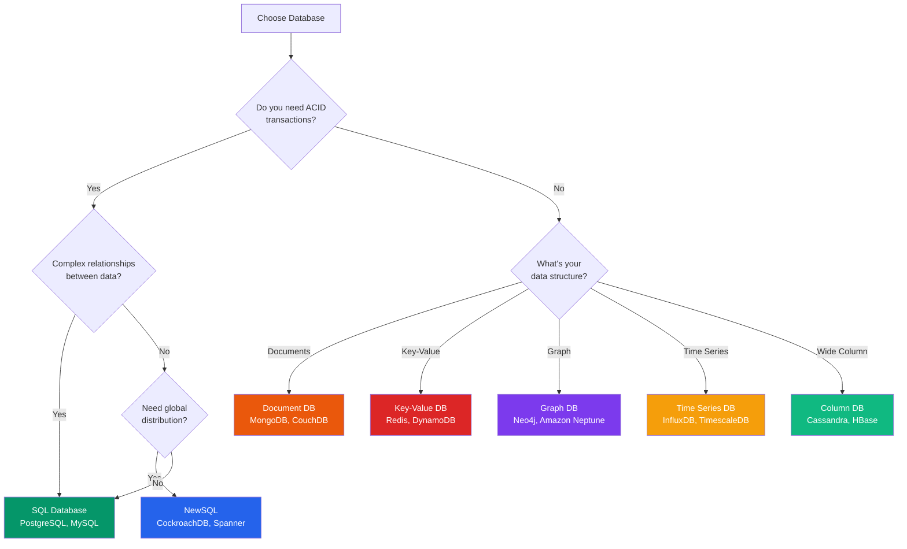
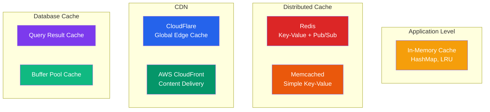
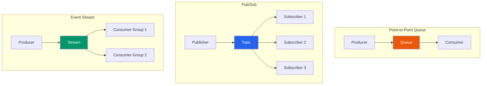
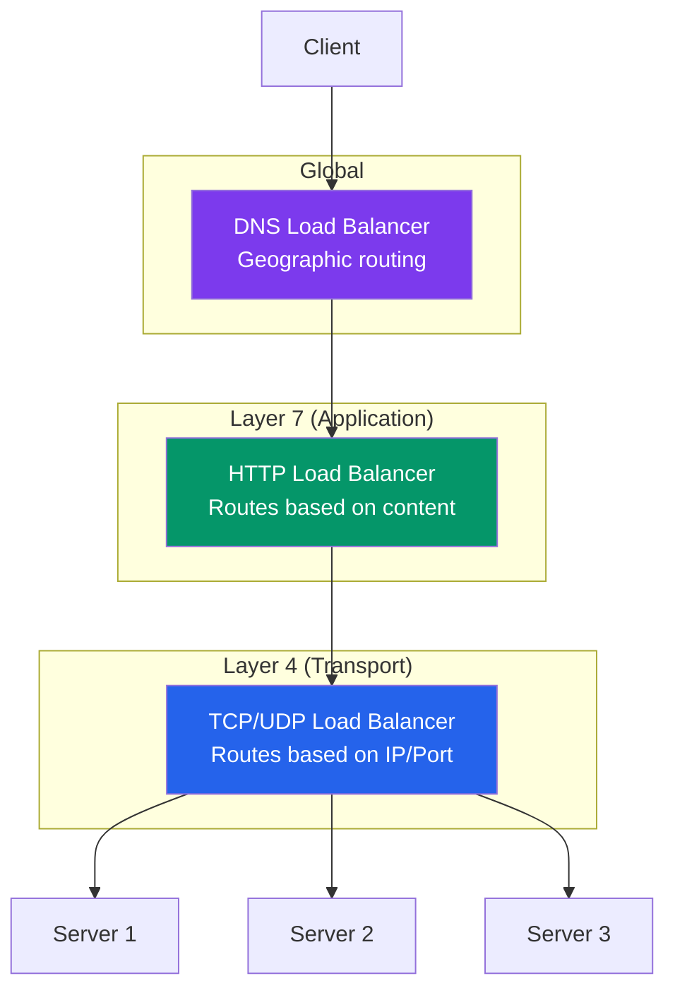
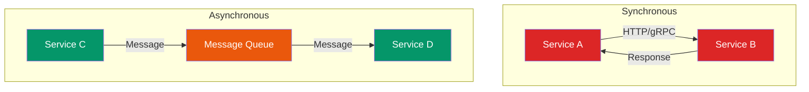
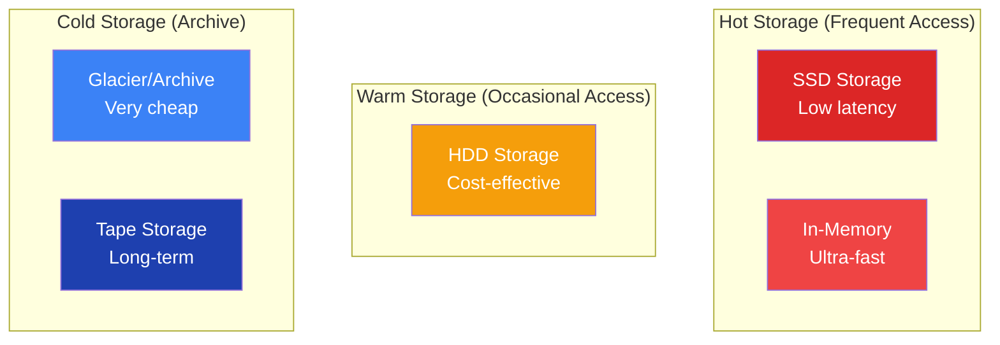
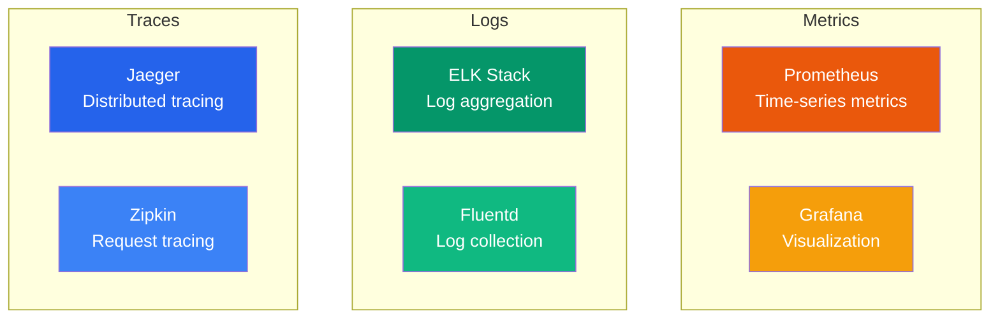
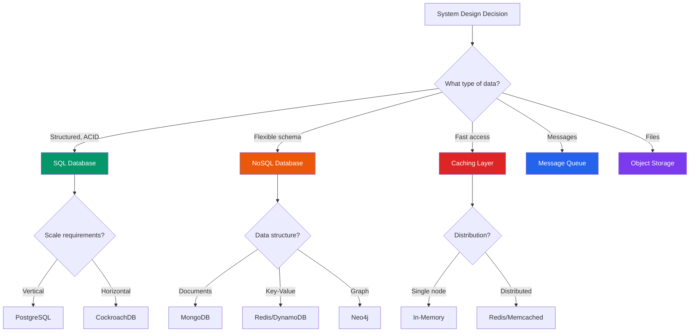

# Technology Comparison Charts

## Database Selection Guide

### SQL vs NoSQL Decision Tree

### Database Comparison Matrix

| Database | Type | Consistency | Scalability | Use Case | Complexity |
|----------|------|-------------|-------------|----------|------------|
| **PostgreSQL** | SQL | Strong | Vertical | Complex queries, ACID | Medium |
| **MySQL** | SQL | Strong | Vertical | Web applications | Low |
| **MongoDB** | Document | Tunable | Horizontal | Flexible schema | Medium |
| **Cassandra** | Wide Column | Eventual | Horizontal | Time-series, IoT | High |
| **Redis** | Key-Value | Strong | Vertical | Caching, sessions | Low |
| **DynamoDB** | Key-Value | Tunable | Horizontal | Serverless, gaming | Medium |
| **Neo4j** | Graph | Strong | Vertical | Social networks | High |
| **InfluxDB** | Time Series | Strong | Horizontal | Metrics, monitoring | Medium |

## Caching Solutions Comparison

### Cache Types and Use Cases

### Cache Selection Matrix

| Solution | Latency | Throughput | Persistence | Complexity | Best For |
|----------|---------|------------|-------------|------------|----------|
| **In-Memory** | Ultra Low | High | No | Low | Hot data, single instance |
| **Redis** | Very Low | Very High | Optional | Medium | Sessions, real-time |
| **Memcached** | Very Low | Very High | No | Low | Simple key-value |
| **CDN** | Low | Ultra High | Yes | Low | Static content |
| **Database Cache** | Medium | High | Yes | Medium | Query optimization |

## Message Queue Comparison

### Queue vs Pub/Sub vs Stream

### Messaging Technology Matrix

| Technology | Pattern | Ordering | Persistence | Throughput | Use Case |
|------------|---------|----------|-------------|------------|----------|
| **RabbitMQ** | Queue/Pub-Sub | Yes | Yes | Medium | Task queues, RPC |
| **Apache Kafka** | Stream | Yes | Yes | Very High | Event streaming, logs |
| **Amazon SQS** | Queue | No | Yes | High | Decoupling services |
| **Redis Pub/Sub** | Pub-Sub | No | No | High | Real-time notifications |
| **Apache Pulsar** | Stream/Pub-Sub | Yes | Yes | Very High | Multi-tenant streaming |
| **Google Pub/Sub** | Pub-Sub | No | Yes | High | Serverless messaging |

## Load Balancer Comparison

### Load Balancer Types

### Load Balancing Algorithms

| Algorithm | Description | Use Case | Pros | Cons |
|-----------|-------------|----------|------|------|
| **Round Robin** | Requests distributed evenly | Uniform servers | Simple, fair | Ignores server load |
| **Weighted Round Robin** | Based on server capacity | Mixed server sizes | Accounts for capacity | Static weights |
| **Least Connections** | Route to server with fewest connections | Long-lived connections | Dynamic load balancing | More complex |
| **IP Hash** | Hash client IP to server | Session affinity | Sticky sessions | Uneven distribution |
| **Geographic** | Route based on location | Global applications | Reduced latency | Complex setup |

## Microservices Communication Patterns

### Synchronous vs Asynchronous

### Communication Technology Matrix

| Technology | Type | Latency | Reliability | Complexity | Use Case |
|------------|------|---------|-------------|------------|----------|
| **HTTP REST** | Sync | Medium | Medium | Low | CRUD operations |
| **gRPC** | Sync | Low | Medium | Medium | High-performance APIs |
| **GraphQL** | Sync | Medium | Medium | Medium | Flexible queries |
| **Message Queue** | Async | High | High | Medium | Decoupled processing |
| **Event Streaming** | Async | Low | High | High | Real-time data |
| **WebSockets** | Sync/Async | Low | Medium | Medium | Real-time communication |

## Storage Solutions Comparison

### Storage Types by Use Case

### Cloud Storage Comparison

| Service | Type | Durability | Availability | Cost | Use Case |
|---------|------|------------|--------------|------|----------|
| **S3 Standard** | Object | 99.999999999% | 99.99% | Medium | Active data |
| **S3 IA** | Object | 99.999999999% | 99.9% | Low | Infrequent access |
| **S3 Glacier** | Object | 99.999999999% | 99.99% | Very Low | Archive |
| **EBS** | Block | 99.999% | 99.999% | High | Database storage |
| **EFS** | File | 99.999999999% | 99.99% | High | Shared file system |

## Monitoring and Observability Stack

### The Three Pillars

## Decision Framework Summary

### Quick Selection Guide

## Key Selection Criteria

1. **Consistency Requirements** - How important is data accuracy?
2. **Scale Requirements** - How much data and traffic?
3. **Latency Requirements** - How fast must responses be?
4. **Availability Requirements** - How much downtime is acceptable?
5. **Complexity Tolerance** - How much operational complexity can you handle?
6. **Cost Constraints** - What's your budget for infrastructure?
7. **Team Expertise** - What technologies does your team know?