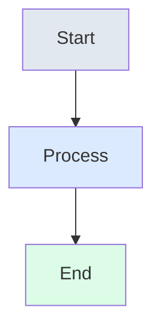
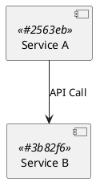

# System Design Learning Guide - Style Guide

This document defines the formatting standards and style conventions used throughout the System Design Learning Guide to ensure consistency and readability.

## 📝 Markdown Formatting Standards

### Heading Hierarchy

Use consistent heading levels throughout all documents:

```markdown
# Main Title (H1) - Used only once per document
## Major Section (H2) - Primary content divisions
### Subsection (H3) - Secondary divisions
#### Detail Section (H4) - Specific topics
##### Minor Detail (H5) - Rarely used
###### Micro Detail (H6) - Avoid if possible
```

**Guidelines:**
- Always use space after `#` symbols
- Use sentence case for headings (capitalize first word and proper nouns)
- Keep headings concise and descriptive
- Don't skip heading levels (don't go from H2 to H4)

### Text Formatting

#### Emphasis
- **Bold text** for important concepts and key terms
- *Italic text* for emphasis and foreign terms
- `Inline code` for technical terms, file names, and short code snippets
- ~~Strikethrough~~ for deprecated or incorrect information

#### Lists

**Unordered Lists:**
```markdown
- Use hyphens for unordered lists
- Maintain consistent indentation (2 spaces)
  - Nested items use 2-space indentation
  - Keep nesting to maximum 3 levels
- End list items without periods unless they're complete sentences
```

**Ordered Lists:**
```markdown
1. Use numbers for sequential steps
2. Start with 1 and let Markdown auto-increment
3. Use periods after numbers
   1. Nested numbered lists use 3-space indentation
   2. Maintain consistent numbering style
```

**Task Lists:**
```markdown
- [ ] Incomplete task
- [x] Completed task
- [ ] Another incomplete task
```

### Links and References

#### Internal Links
```markdown
[Link text](relative/path/to/file.md)
[Section link](#section-heading)
[Link with title](path/to/file.md "Tooltip text")
```

#### External Links
```markdown
[External link](https://example.com)
[Link with description](https://example.com "External site description")
```

#### Reference Links
```markdown
[Link text][reference-id]

[reference-id]: https://example.com "Optional title"
```

### Code Formatting

#### Inline Code
Use backticks for inline code, file names, and technical terms:
```markdown
The `LRUCache` class implements the `get()` and `put()` methods.
```

#### Code Blocks
Always specify the language for syntax highlighting:

````markdown
```python
def fibonacci(n):
    if n <= 1:
        return n
    return fibonacci(n-1) + fibonacci(n-2)
```
````

**Supported Languages:**
- `python`, `java`, `cpp`, `go`
- `javascript`, `typescript`, `sql`
- `bash`, `shell`, `yaml`, `json`
- `mermaid`, `plantuml`

#### Code Block Guidelines
- Include language identifier for all code blocks
- Use 4-space indentation within code blocks
- Add comments to explain complex logic
- Keep lines under 80 characters when possible
- Include complete, runnable examples

### Tables

Use consistent table formatting:

```markdown
| Column 1 | Column 2 | Column 3 |
|----------|----------|----------|
| Data 1   | Data 2   | Data 3   |
| Data 4   | Data 5   | Data 6   |
```

**Table Guidelines:**
- Always include header row
- Use pipes (`|`) to separate columns
- Align content using spaces for readability
- Keep table width reasonable for mobile viewing
- Use `---` for header separator row

### Blockquotes

Use blockquotes for important notes, warnings, and tips:

```markdown
> **💡 Tip:** This is a helpful tip for learners.

> **⚠️ Warning:** This highlights potential pitfalls.

> **📝 Note:** Additional context or clarification.

> **🔍 Deep Dive:** Links to more detailed information.
```

## 🎨 Visual Elements

### Callout Boxes

Use consistent emoji and formatting for different types of callouts:

#### Information Types
```markdown
> **💡 Tip:** Helpful suggestions and best practices
> **⚠️ Warning:** Important cautions and potential issues  
> **📝 Note:** Additional context and clarifications
> **🔍 Deep Dive:** Links to detailed explanations
> **🚀 Quick Start:** Fast-track instructions
> **🎯 Key Takeaway:** Essential points to remember
> **🤔 Think About It:** Questions for reflection
> **💻 Try It:** Hands-on exercises
> **📊 Example:** Concrete illustrations
> **🔗 Reference:** External resources and links
```

#### Code-Related Callouts
```markdown
> **✅ Good Practice:** Recommended approaches
> **❌ Avoid:** Anti-patterns and common mistakes
> **🔧 Implementation:** Technical details
> **⚡ Performance:** Optimization tips
> **🧪 Testing:** Testing strategies and examples
```

### Diagrams

#### Mermaid Diagrams
Always include the diagram type and use consistent styling:

````markdown

````

#### PlantUML Diagrams
Use consistent styling and include proper annotations:

````markdown

````

### Images and Assets

#### Image References
```markdown

```

#### Image Guidelines
- Always include descriptive alt text
- Use relative paths from document location
- Optimize images for web (PNG for diagrams, JPG for photos)
- Keep file sizes reasonable (<500KB)
- Use consistent naming: `kebab-case-description.png`

## 📁 File Organization

### File Naming Conventions

#### Markdown Files
- Use `kebab-case` for file names: `rate-limiter-design.md`
- Use descriptive names that indicate content
- Avoid spaces and special characters
- Use `.md` extension for all Markdown files

#### Code Files
- Follow language conventions:
  - Python: `snake_case.py`
  - Java: `PascalCase.java`
  - C++: `snake_case.cpp`
  - Go: `snake_case.go`

#### Directory Structure
```
topic-name/
├── README.md              # Overview and navigation
├── explanation.md         # Detailed explanation
├── design.puml           # Architecture diagram
└── solutions/
    ├── python/
    │   ├── README.md
    │   └── implementation.py
    ├── java/
    │   ├── README.md
    │   └── Implementation.java
    └── cpp/
        ├── README.md
        └── implementation.cpp
```

### Document Structure

#### Standard Document Template
```markdown
# Document Title

Brief introduction paragraph explaining the purpose and scope.

## Overview

High-level summary of the content.

## Main Content Sections

### Subsection 1
Content with examples and explanations.

### Subsection 2
More detailed content.

## Key Takeaways

- Important point 1
- Important point 2
- Important point 3

## Further Reading

- [Related topic 1](link)
- [Related topic 2](link)
- [External resource](link)
```

#### README Template
```markdown
# Topic Name

One-sentence description of what this covers.

## What You'll Learn

- Learning objective 1
- Learning objective 2
- Learning objective 3

## Prerequisites

- Required knowledge 1
- Required knowledge 2

## Contents

- [Subtopic 1](file1.md)
- [Subtopic 2](file2.md)
- [Implementation](solutions/)

## Quick Start

Brief instructions to get started immediately.

## Next Steps

Where to go after completing this topic.
```

## 🎯 Content Guidelines

### Writing Style

#### Tone and Voice
- **Conversational but professional** - Write like explaining to a colleague
- **Clear and concise** - Avoid unnecessary jargon and complexity
- **Encouraging and supportive** - Remember readers are learning
- **Practical and actionable** - Focus on applicable knowledge

#### Technical Writing Best Practices
- Use active voice: "The system processes requests" not "Requests are processed"
- Write in present tense for descriptions
- Use second person for instructions: "You can implement..."
- Define technical terms when first introduced
- Include concrete examples for abstract concepts

#### Code Comments
```python
# Good: Explains the why, not just the what
def calculate_hash(key: str) -> int:
    """
    Calculate hash value for consistent hashing.
    
    Uses FNV-1a hash algorithm for good distribution
    and minimal collisions in hash ring.
    """
    hash_value = 2166136261  # FNV offset basis
    for byte in key.encode('utf-8'):
        hash_value ^= byte
        hash_value *= 16777619  # FNV prime
    return hash_value & 0xFFFFFFFF
```

```python
# Avoid: States the obvious
def calculate_hash(key: str) -> int:
    # Calculate hash
    hash_value = 2166136261
    # Loop through bytes
    for byte in key.encode('utf-8'):
        # XOR with byte
        hash_value ^= byte
        # Multiply by prime
        hash_value *= 16777619
    return hash_value & 0xFFFFFFFF
```

### Learning-Focused Content

#### Explanations
- Start with the big picture, then dive into details
- Use analogies to relate complex concepts to familiar ideas
- Provide multiple perspectives on the same concept
- Include common misconceptions and clarifications

#### Examples
- Use realistic, relatable scenarios
- Progress from simple to complex examples
- Show both correct and incorrect approaches
- Include performance implications

#### Exercises
- Provide hands-on activities for each major concept
- Include solutions with explanations
- Offer extensions for advanced learners
- Connect exercises to real-world applications

## 🔧 Technical Standards

### Code Quality

#### General Principles
- **Readability over cleverness** - Code should be easy to understand
- **Consistency** - Follow established patterns within each language
- **Documentation** - Include docstrings and meaningful comments
- **Error handling** - Show proper error handling techniques
- **Testing** - Include test cases where appropriate

#### Language-Specific Standards

**Python:**
```python
# Follow PEP 8 style guide
# Use type hints
# Include docstrings

def lru_cache_get(self, key: str) -> Optional[int]:
    """
    Retrieve value from cache.
    
    Args:
        key: The cache key to look up
        
    Returns:
        The cached value if found, None otherwise
        
    Time Complexity: O(1)
    Space Complexity: O(1)
    """
    if key not in self.cache:
        return None
    
    # Move to front (most recently used)
    node = self.cache[key]
    self._move_to_front(node)
    return node.value
```

**Java:**
```java
// Follow Google Java Style Guide
// Use meaningful variable names
// Include Javadoc comments

/**
 * Retrieves value from LRU cache.
 * 
 * @param key the cache key to look up
 * @return the cached value if found, null otherwise
 * 
 * Time Complexity: O(1)
 * Space Complexity: O(1)
 */
public Integer get(String key) {
    if (!cache.containsKey(key)) {
        return null;
    }
    
    // Move to front (most recently used)
    Node node = cache.get(key);
    moveToFront(node);
    return node.value;
}
```

### Performance Documentation

Always include complexity analysis:

```markdown
## Complexity Analysis

### Time Complexity
- **Get operation**: O(1) - Hash table lookup
- **Put operation**: O(1) - Hash table insertion
- **Delete operation**: O(1) - Hash table removal

### Space Complexity
- **Overall**: O(capacity) - Storage for cache entries
- **Per operation**: O(1) - No additional space needed
```

## 📋 Quality Checklist

### Before Publishing Content

#### Content Review
- [ ] Spelling and grammar checked
- [ ] Technical accuracy verified
- [ ] Code examples tested and working
- [ ] Links validated (internal and external)
- [ ] Consistent formatting applied
- [ ] Learning objectives clearly stated
- [ ] Prerequisites identified
- [ ] Key takeaways summarized

#### Technical Review
- [ ] Code follows language conventions
- [ ] Complexity analysis included
- [ ] Error handling demonstrated
- [ ] Performance implications discussed
- [ ] Alternative approaches mentioned
- [ ] Trade-offs explained

#### Accessibility Review
- [ ] Alt text provided for images
- [ ] Headings used properly for navigation
- [ ] Color not used as only means of conveying information
- [ ] Code blocks have language identifiers
- [ ] Tables have proper headers
- [ ] Content readable without images

## 🔄 Maintenance Guidelines

### Regular Updates
- Review content quarterly for accuracy
- Update external links and references
- Refresh examples with current best practices
- Incorporate community feedback
- Update complexity analysis if needed

### Version Control
- Use meaningful commit messages
- Create branches for major changes
- Tag releases for stable versions
- Document breaking changes
- Maintain changelog for significant updates

---

**Remember**: Consistency in formatting helps learners focus on content rather than being distracted by varying styles. When in doubt, prioritize clarity and readability over strict adherence to rules.